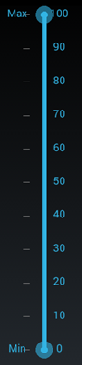
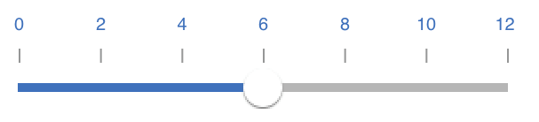

# Customizing labels

SfRangeSlider provides option to show or hide the label and position customization.

## Show Value Label

This property allows us to display labels for the ticks. When it sets to true, it displays the label for all the ticks based on the `ValuePlacement` property.

N> The default value of the `ShowValueLabel` property is false.





	<range:SfRangeSlider x:Name="rangeslider" ShowValueLabel="true"/>
	




	rangeSlider.ShowValueLabel= true;





## Set Custom Label

To display custom labels, `ShowCustomLabel` property should be set to true and need to populate the `CustomLabels` property with observable collection of items by specifying the custom labels for corresponding values.





	<range:SfRangeSlider x:Name="rangeslider" HeightRequest="400" ShowCustomLabel="true" CustomLabels="customCollection"/>
	



	
SfRangeSlider rangeSlider; 
ObservableCollection<Items>  customCollection;
public RangeSliderPage ()
{
     customCollection = new ObservableCollection<Items> ();
     customCollection.Add(new Items(){Label = "Min", Value= 0});
     customCollection.Add(new Items() { Label = "Max", Value = 100 });
     rangeSlider = new SfRangeSlider ();
     rangeSlider.HeightRequest = 400;
     rangeSlider.ShowCustomLabel = true;
     rangeSlider.CustomLabels = customCollection
}





## Value Placement

The `ValuePlacement` property describes the position of the Value respective to ticks. 

Available options for this property are:

* BottomRight

* TopLeft





	<range:SfRangeSlider x:Name="rangeslider" ValuePlacement="TopLeft"/>
	




	rangeSlider.ValuePlacement=ValuePlacement.TopLeft;









	<range:SfRangeSlider x:Name="rangeslider" ValuePlacement="BottomRight"/>
	




	rangeSlider.ValuePlacement=ValuePlacement.BottomRight;





## Label Placement

The `LabelPlacement` property describes the position of the custom labels respective to ticks. 

Available options for this property are:

* BottomRight

* TopLeft





	<range:SfRangeSlider x:Name="rangeslider" LabelPlacement="TopLeft"/>
	




	rangeSlider.LabelPlacement=LabelPlacement.TopLeft;





## Customizing label font

The range slider control provides the `FontFamily`, `FontSize`, and `FontAttribute` properties to customize the value text and custom label text.





<ContentPage xmlns="http://xamarin.com/schemas/2014/forms"
xmlns:x="http://schemas.microsoft.com/winfx/2009/xaml" 
xmlns:Range="clr-namespace:Syncfusion.SfRangeSlider.XForms;assembly=Syncfusion.SfRangeSlider.XForms"
xmlns:Local="clr-namespace:GettingStarted;assembly=GettingStarted"
x:Class="GettingStarted.RangeSliderSample">
	<ContentPage.Content>
		<Range:SfRangeSlider FontFamily="Times New Roman" ShowCustomLabel="true" FontAttribute="Italic" FontSize="12"  Orientation="Horizontal">
			<Range:SfRangeSlider.CustomLabels>
				<Local:ObservableCollectionList>
					<Range:Items Label="Min" Value="0"/>
					<Range:Items Label="Mid" Value="50"/>
					<Range:Items Label="Max" Value="100"/>
				</Local:ObservableCollectionList>
			</Range:SfRangeSlider.CustomLabels>
		</Range:SfRangeSlider>
	</ContentPage.Content>
</ContentPage>




using System.Collections.ObjectModel;
using Syncfusion.XForms.SfRangeSlider;
using Xamarin.Forms;
namespace GettingStarted
{
	/// 

    /// Range slider sample.
    /// 

    public partial class RangeSliderSample : ContentPage
    {
        public RangeSliderSample()
        {
            InitializeComponent();
			SfRangeSlider rangeSlider = new SfRangeSlider(){ FontFamily="Times New Roman",ShowCustomLabel=true, FontAttribute=FontAttributes.Italic, FontSize=12,  Orientation=Orientation.Horizontal};
			rangeSlider.CustomLabels = new ObservableCollection<Items>()
			{
                new Items(){Value=0,Label="Min"},
				new Items(){Value=50,Label="Mid"},
				new Items(){Value=100,Label="Max"}
			};
			this.Content = rangeSlider;
        }
    }

}







using System.Collections.ObjectModel;
using Syncfusion.XForms.SfRangeSlider;
using Xamarin.Forms;
namespace GettingStarted
{
	/// 

	/// Observable collection of Items list.
	/// 

	public class ObservableCollectionList : ObservableCollection<Items>
	{

	}

	/// 

    /// Range slider sample.
    /// 

    public partial class RangeSliderSample : ContentPage
    {
        public RangeSliderSample()
        {
            InitializeComponent();
        }
    }
}
	



## LabelColor

The `LabelColor` property used to change the color of the label.





<range:SfRangeSlider x:Name="rangeslider" LabelColor="Red" Minimum="0" Maximum="100"/>





 rangeslider.LabelColor = Color.Red;





