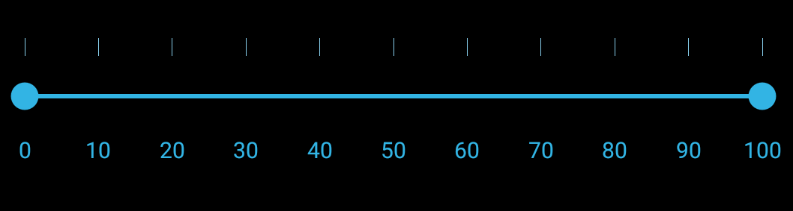

# Customizing ticks

Tick marks can be placed along the track in a uniform manner or it's position can also be customized.

## TickPlacement

The `TickPlacement` property determines where to draw tick marks in relation to the track. Available options for this property are,

* BottomRight

* Inline

* None

* Outside

* TopLeft

N> The default option is Inline.

### BottomRight

Tick marks can be placed either below the track in horizontal orientation or right of the track in vertical orientation.





	<range:SfRangeSlider x:Name="rangeslider" TickPlacement="BottomRight"/>
	




	rangeSlider.TickPlacement=TickPlacement.BottomRight;





### TopLeft

Tick marks are placed either above the track in horizontal orientation or left of the track in vertical orientation.





	<range:SfRangeSlider x:Name="rangeslider" TickPlacement="TopLeft"/>
	




	rangeSlider.TickPlacement=TickPlacement.TopLeft;





### Inline

Ticks are placed along the track.





	<range:SfRangeSlider x:Name="rangeslider" TickPlacement="Inline"/>
	




	rangeSlider.TickPlacement=TickPlacement.Inline;





### Outside

Tick marks are placed on both sides of the track either in horizontal or vertical orientation.





	<range:SfRangeSlider x:Name="rangeslider" TickPlacement="Outside"/>
	




	rangeSlider.TickPlacement=TickPlacement.Outside;





## Customizing tick color

The range slider control provides the `TickColor` property to customize the color of ticks in tick bar.





<ContentPage xmlns="http://xamarin.com/schemas/2014/forms"
xmlns:x="http://schemas.microsoft.com/winfx/2009/xaml" 
xmlns:range="clr-namespace:Syncfusion.SfRangeSlider.XForms;assembly=Syncfusion.SfRangeSlider.XForms"
x:Class="GettingStarted.RangeSliderSample">
	<ContentPage.Content>
		<range:SfRangeSlider x:Name="rangeslider" Orientation="Horizontal"  TickColor="#FFFFFF"/>
	</ContentPage.Content>
</ContentPage>
	




using Syncfusion.XForms.SfRangeSlider;
using Xamarin.Forms;
namespace GettingStarted
{
	/// 

    /// Range slider sample.
    /// 

    public partial class RangeSliderSample : ContentPage
    {
        public RangeSliderSample()
        {
            InitializeComponent();
			SfRangeSlider rangeSlider = new SfRangeSlider(){ TickColor = Color.FromHex("#FFFFFF"),Orientation=Orientation.Horizontal};
			this.Content = rangeSlider;
        }
    }
}





