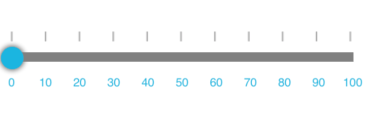
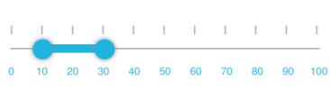
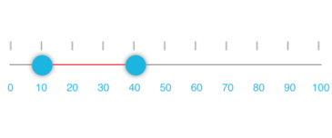

# TrackBar Customization 

### Customizing track height

The thickness of track bar can be customized by setting the TrackThickness property of SfRangeSlider. 




<ContentPage xmlns="http://xamarin.com/schemas/2014/forms" 
             xmlns:x="http://schemas.microsoft.com/winfx/2009/xaml"
             xmlns:local="clr-namespace:TrackCustomization" 
             xmlns:slider="clr-namespace:Syncfusion.SfRangeSlider.XForms;assembly=Syncfusion.SfRangeSlider.XForms"
             x:Class="TrackCustomization.MainPage">
               <slider:SfRangeSlider Orientation="Horizontal"
                                    TrackThickness="10"
                                    RangeStart="0"
                                    RangeEnd="2"/>
</ContentPage>
	




using Syncfusion.SfRangeSlider.XForms; 
using Xamarin.Forms;

namespace TrackCustomization
{
    public partial class MainPage : ContentPage
    {
        public MainPage()
        {
            InitializeComponent();
            SfRangeSlider slider = new SfRangeSlider();
            slider.Orientation = Orientation.Horizontal;
            slider.RangeStart = 0;
            slider.RangeEnd = 2;
            slider.TrackThickness = 10;
            Content = slider;
        }
    }
}





### Customizing dragged area height

The thickness for the selected range or selected portion of track bar can be customized by setting the TrackSelectionThickness property of SfRangeSlider.





<ContentPage xmlns="http://xamarin.com/schemas/2014/forms" 
             xmlns:x="http://schemas.microsoft.com/winfx/2009/xaml"
             xmlns:local="clr-namespace:TrackCustomization" 
             xmlns:slider="clr-namespace:Syncfusion.SfRangeSlider.XForms;assembly=Syncfusion.SfRangeSlider.XForms"
             x:Class="TrackCustomization.MainPage">
      <slider:SfRangeSlider Orientation="Horizontal"
                            TrackSelectionThickness="10"
                            RangeStart="10"
                            RangeEnd="30"/>
</ContentPage>





using Syncfusion.SfRangeSlider.XForms;
using Xamarin.Forms;

namespace TrackCustomization
{
    public partial class MainPage : ContentPage
    {
        public MainPage()
        {
            InitializeComponent();
            SfRangeSlider slider = new SfRangeSlider();
            slider.Orientation = Orientation.Horizontal;
            slider.TrackSelectionThickness = 10;
            slider.RangeStart = 10;
            slider.RangeEnd = 30;
            Content = slider;
        }
    }
}





### Customizing track color

The color of track bar can be customized by setting the TrackColor property of SfRangeSlider.





<ContentPage xmlns="http://xamarin.com/schemas/2014/forms" 
             xmlns:x="http://schemas.microsoft.com/winfx/2009/xaml"
             xmlns:local="clr-namespace:TrackCustomization" 
             xmlns:slider="clr-namespace:Syncfusion.SfRangeSlider.XForms;assembly=Syncfusion.SfRangeSlider.XForms"
             x:Class="TrackCustomization.MainPage">
       <slider:SfRangeSlider Orientation="Horizontal"
                             TrackColor="Maroon"
                             RangeStart="10"
                             RangeEnd="40"/>
</ContentPage>





using Syncfusion.SfRangeSlider.XForms;
using Xamarin.Forms;

namespace TrackCustomization
{
    public partial class MainPage : ContentPage
    {
        public MainPage()
        {
            InitializeComponent();
            SfRangeSlider slider = new SfRangeSlider();
            slider.Orientation = Orientation.Horizontal;
            slider.TrackColor = Color.Maroon;
            slider.RangeStart = 10;
            slider.RangeEnd = 40;
            Content = slider;
        }
    }
}





### Customizing dragged area color

The color for the selected range or selected portion of track bar can be customized by setting the TrackSelectionColor property of SfRangeSlider.





<ContentPage xmlns="http://xamarin.com/schemas/2014/forms" 
             xmlns:x="http://schemas.microsoft.com/winfx/2009/xaml"
             xmlns:local="clr-namespace:TrackCustomization" 
             xmlns:slider="clr-namespace:Syncfusion.SfRangeSlider.XForms;assembly=Syncfusion.SfRangeSlider.XForms"
             x:Class="TrackCustomization.MainPage">
      <slider:SfRangeSlider Orientation="Horizontal"
                          TrackSelectionColor="Red"
                          RangeStart="10"
                          RangeEnd="40"/>
</ContentPage>
	 




using Syncfusion.SfRangeSlider.XForms;
using Xamarin.Forms;

namespace TrackCustomization
{
    public partial class MainPage : ContentPage
    {
        public MainPage()
        {
            InitializeComponent();
            SfRangeSlider slider = new SfRangeSlider();
            slider.Orientation = Orientation.Horizontal;
            slider.TrackSelectionColor = Color.Red;
            slider.RangeStart = 10;
            slider.RangeEnd = 40;
            Content = slider;
        }
    }
}





### Customizing knob color

The `KnobColor` property is used to change the knob color of SfRangeSlider.





    <range:SfRangeSlider x:Name="rangeslider" KnobColor="Red"  Minimum="0" Maximum="100"/>





 rangeslider.KnobColor = Color.Red;

 



### Customizing thumb size

The `ThumbSize` property is used to change the thumb size of SfRangeSlider.





    <range:SfRangeSlider x:Name="rangeslider" ThumbSize="3" Minimum="0" Maximum="100"/>





 rangeslider.ThumbSize = 3;

 


