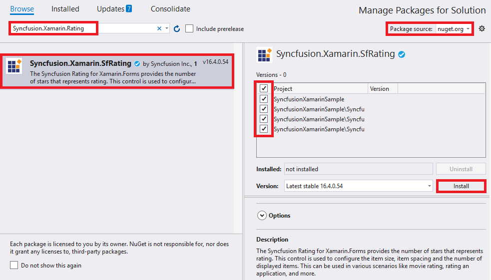

---

layout: post
title: Getting Started with Syncfusion Rating control for Xamarin.Forms
description: A quick tour to initial users on Syncfusion Rating control for Xamarin.Forms platform.
platform: Xamarin
control: Rating
documentation: ug

---

# Getting Started

This section explains you the steps to configure a SfRating control in a real-time scenario and also provides a walk-through on some of the customization features available in SfRating control.

## Adding SfRating reference

You can add SfRating reference using one of the following methods:

**Method 1: Adding SfRating reference from nuget.org**

Syncfusion Xamarin components are available in [nuget.org](https://www.nuget.org/). To add SfRating to your project, open the NuGet package manager in Visual Studio, search for [Syncfusion.Xamarin.SfRating](https://www.nuget.org/packages/Syncfusion.Xamarin.SfRating), and then install it.

N> Install the same version of SfRating NuGet in all the projects.

**Method 2: Adding SfRating reference from toolbox**

Syncfusion also provides Xamarin Toolbox. Using this toolbox, you can drag the SfRating control to the XAML page. It will automatically install the required NuGet packages and add the namespace to the page. To install Syncfusion Xamarin Toolbox, refer to [Toolbox](https://help.syncfusion.com/xamarin/utility#toolbox).

**Method 3: Adding SfRating assemblies manually from the installed location**

If you prefer to manually reference the assemblies instead referencing from NuGet, add the following assemblies in respective projects.

Location: {Installed location}/{version}/Xamarin/lib

<table>
<tr>
<td>PCL</td>
<td>Syncfusion.SfRating.XForms.dll Syncfusion.Core.XForms.dll Syncfusion.Licensing.dll </td>
</tr>
<tr>
<td>Android</td>
<td>Syncfusion.SfRating.Android.dll Syncfusion.SfRating.XForms.Android.dll Syncfusion.SfRating.XForms.dll Syncfusion.Core.XForms.dll Syncfusion.Core.XForms.Android.dll Syncfusion.Licensing.dll </td>
</tr>
<tr>
<td>iOS</td>
<td>Syncfusion.SfRating.iOS.dll Syncfusion.SfRating.XForms.iOS.dll Syncfusion.SfRating.XForms.dll Syncfusion.Core.XForms.dll Syncfusion.Core.XForms.iOS.dll Syncfusion.Licensing.dll </td>
</tr>
<tr>
<td>UWP</td>
<td>Syncfusion.SfInput.UWP.dll Syncfusion.SfShared.UWP.dll Syncfusion.SfRating.XForms.UWP.dll Syncfusion.SfRating.XForms.dll Syncfusion.Core.XForms.dll Syncfusion.Core.XForms.UWP.dll Syncfusion.Licensing.dll </td>
</tr>
</table>

N> To know more about obtaining our components, refer to these links for [Mac](https://help.syncfusion.com/xamarin/introduction/download-and-installation/mac/) and [Windows](https://help.syncfusion.com/xamarin/introduction/download-and-installation/windows/).

I> Starting with v16.2.0.x, if you reference Syncfusion assemblies from the trial setup or from the NuGet feed, you also have to include a license key in your projects. Please refer to [Syncfusion license key](https://help.syncfusion.com/common/essential-studio/licensing/license-key/) to know about registering Syncfusion license key in your Xamarin application to use our components.

N> Currently an additional step is required for iOS project. You need to create an instance of the rating custom renderer. If you are adding the references from toolbox, this step is not needed.

Create an instance of SfRatingRenderer in FinishedLaunching overridden method of AppDelegate class in iOS Project as shown below





public override bool FinishedLaunching(UIApplication app, NSDictionary options)
{
	...
    new SfRatingRenderer ();
	...
}	





### ReleaseMode issue in UWP platform

There is a known Framework issue in UWP platform. The custom controls will not render when deployed the application in `Release Mode`.

The above problem can be resolved by initializing the SfRating assemblies in `App.xaml.cs` in UWP project as like in below code snippet.



// In App.xaml.cs

protected override void OnLaunched(LaunchActivatedEventArgs e)
{
…

	rootFrame.NavigationFailed += OnNavigationFailed;
		
	// you'll need to add `using System.Reflection;`
	List<Assembly> assembliesToInclude = new List<Assembly>();

	//Now, add all the assemblies your app uses
	assembliesToInclude.Add(typeof(SfRatingRenderer).GetTypeInfo().Assembly);

	// replaces Xamarin.Forms.Forms.Init(e);        
	Xamarin.Forms.Forms.Init(e, assembliesToInclude);
		
…     
}


The SfRating control is configured entirely in C# code or by using XAML markup. The following steps explains how to create a SfRating and configure its elements.

* Adding namespace for the added assemblies. 





	<xmlns:rating="clr-namespace:Syncfusion.SfRating.XForms;assembly=Syncfusion.SfRating.XForms"/>





	using Syncfusion.SfRating.XForms;





* Now add the SfRating control with a required optimal name by using the included namespace.





	<rating:SfRating x:Name="rating" />
	




	SfRating rating = new SfRating();
	this.Content = rating; 





## Set Number of Rating Items

Number of rating items which are to be displayed can be customized in SfRatingControl. User may wants to create the rating application with 5 items as follows.  

N> The default property value is 5.





	<rating:SfRating x:Name="rating" ItemCount="5" />
	




	rating.ItemCount=5;





## Set Value

Display value can be set in SfRating control which is selected among the items. The following example shows the display value of 3 with 5 rating items. 

N> By default, property value is 0.





	<rating:SfRating x:Name="rating" Value="3" />
	




    rating.Value=3;





## Precision

SfRating control provides option to rate the items in full, half and exact value. This can be set through `Precision` property.





	<rating:SfRating x:Name="rating" Precision="Standard" />
	




    rating.Precision = Precision.Standard;





The complete Getting Started sample is available in [this](http://www.syncfusion.com/downloads/support/directtrac/general/ze/RatingSample15508632281303717040.zip) link.

