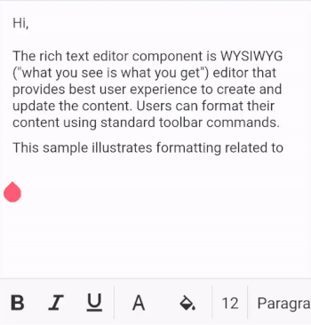

# Overview

The Xamarin RichTextEditor control is a WYSIWYG editor that provides a great user experience for composing or editing rich text content from your Xamarin.Forms applications. Users can format their content using standard toolbar commands.

## Key features

* Applies formatting such as bold, italics, and underline.
* Applies font color and background color to content.
* Customizes the text size and selection.
* Creates bulleted and numbered lists.

