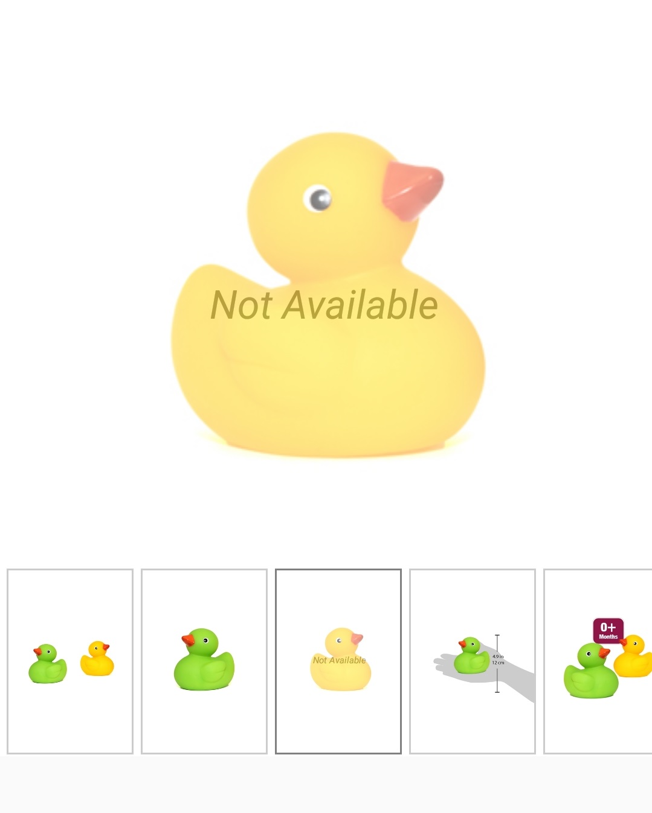

## DataTemplateSelector

SfRotator supports DataTemplateSelector which you can choose a DataTemplate based on the data object.





    <ContentPage.Resources>
        <ResourceDictionary>
            <DataTemplate x:Key="DefaultTemplate">
                <Grid>
                <Image Source="{Binding Image}" HorizontalOptions="Center" VerticalOptions="Center"/>
                </Grid>
            </DataTemplate>
            <DataTemplate x:Key="SpecificTemplate">
                <Grid>
                <Label Text="Not Available" FontSize="Large" HorizontalOptions="Center" VerticalOptions="Center" FontAttributes="Italic" FontFamily="Calbiri"/>
                <Image Source="{Binding Image}" Opacity="0.5" HorizontalOptions="Center" VerticalOptions="Center"/>
                </Grid>
            </DataTemplate>
        </ResourceDictionary>
    </ContentPage.Resources>

    <ContentPage.Content>      
        <Grid >
         <syncfusion:SfRotator x:Name="sfRotator" 
                    ItemsSource="{Binding ImageCollection}" >
              <syncfusion:SfRotator.ItemTemplate>
                <local:DataTemplateViewModel DefaultTemplate="{StaticResource DefaultTemplate}" SpecificTemplate="{StaticResource SpecificTemplate}"/>
              </syncfusion:SfRotator.ItemTemplate>
         </syncfusion:SfRotator>
        </Grid>
     </ContentPage.Content>
    </ContentPage>





    public partial class MainPage : ContentPage
      {
        DataTemplate defaultTemplate;
        DataTemplate specifictempalte;

        public MainPage()
        {
            InitializeComponent();
            this.BindingContext = new ViewModel();
            SfRotator rotator = new SfRotator();

            defaultTemplate = new DataTemplate(() =>
            { 
            Grid grid = new Grid();
            Image image = new Image();
            image.SetBinding(Image.SourceProperty, "Image");
            grid.Children.Add(image);
            return grid;
        });

            specifictempalte = new DataTemplate(() =>
            {
                Grid grid = new Grid();
                Image image = new Image();
                Label label = new Label();
                image.SetBinding(Image.SourceProperty, "Image");
                image.Opacity = 0.5;
                label.Text = "Not Available";
                label.FontSize = 50;
                label.HorizontalOptions = LayoutOptions.Center;
                label.VerticalOptions = LayoutOptions.Center;
                grid.Children.Add(image);
                grid.Children.Add(label);
                return grid;
            });
            
            var ImageCollection = new List<Model> {
            new Model ("movie1.png"),
            new Model ("movie2.png"),
            new Model ("movie3.png"),
            new Model ("movie4.png"),
            new Model ("movie5.png")
            };
            rotator.NavigationDirection = NavigationDirection.Horizontal;
            rotator.NavigationStripMode = NavigationStripMode.Thumbnail;
            rotator.BackgroundColor = Color.White;
            rotator.ItemsSource = ImageCollection;
            rotator.ItemTemplate = new DataTemplateViewModel { DefaultTemplate = defaultTemplate, SpecificTemplate = specifictempalte};
            this.Content = rotator;
        }
    }





### OnSelectTemplate

 The OnSelectTemplate is a overridden method  to return a particular DataTemplate, which shown in the following code:




	

     public class DataTemplateViewModel : DataTemplateSelector
    {
        private DataTemplate defaulttemplate;

        public DataTemplate DefaultTemplate
        {
            get { return defaulttemplate; }
            set { defaulttemplate = value; }
        }

        private DataTemplate specifictemplate;

        public DataTemplate SpecificTemplate
        {
            get { return specifictemplate; }
            set { specifictemplate = value; }
        }

        protected override DataTemplate OnSelectTemplate(object item, BindableObject container)
        {
            var message = item as Model;
            if (message == null)
                return null;
                        return message.Image.ToString() == "movie2.png" ? SpecificTemplate : DefaultTemplate;

        }
    }





The following screenshot illustrates the output of above code.

We have attached sample for reference. You can download the sample from the following link.

Sample link: [DataTemplateSelectorSample](http://www.syncfusion.com/downloads/support/directtrac/general/ze/DataTemplateSelectorSample111610837)

