---

layout: post
title: Customize the Schedule DayView at SfSchedule control for Xamarin.Forms
description: Learn how to Customize the schedule DayView in SfSchedule control
platform: xamarin
control: SfSchedule
documentation: ug

---

# DayView

DayView is used to display a single day, current day will be visible by default. Appointments on a specific day will be arranged in respective timeslots based on its duration.

## ViewHeader Appearance
You can customize the default appearance of view header in [DayView](https://help.syncfusion.com/cr/cref_files/xamarin/sfschedule/Syncfusion.SfSchedule.XForms~Syncfusion.SfSchedule.XForms.ScheduleView.html) by using [ViewHeaderStyle](https://help.syncfusion.com/cr/cref_files/xamarin/sfschedule/Syncfusion.SfSchedule.XForms~Syncfusion.SfSchedule.XForms.ViewHeaderStyle.html) property of [SfSchedule](https://help.syncfusion.com/cr/cref_files/xamarin/sfschedule/Syncfusion.SfSchedule.XForms~Syncfusion.SfSchedule.XForms.SfSchedule.html).



<schedule:SfSchedule x:Name="schedule" ScheduleView = "DayView">
  <schedule:SfSchedule.ViewHeaderStyle>
	<schedule:ViewHeaderStyle
		BackgroundColor="#009688"
		DayTextColor="#FFFFFF"
		DateTextColor="#FFFFFF"
		DayFontFamily="Arial"
		DateFontFamily="Arial">
	</schedule:ViewHeaderStyle>
  </schedule:SfSchedule.ViewHeaderStyle>
</schedule:SfSchedule>


//Create new instance of Schedule
SfSchedule schedule = new SfSchedule();
schedule.ScheduleView = ScheduleView.DayView;
//Customize the schedule view header
ViewHeaderStyle viewHeaderStyle = new ViewHeaderStyle();
viewHeaderStyle.BackgroundColor = Color.FromHex("#009688");
viewHeaderStyle.DayTextColor = Color.FromHex("#FFFFFF");
viewHeaderStyle.DateTextColor = Color.FromHex("#FFFFFF");
viewHeaderStyle.DayFontFamily = "Arial";
viewHeaderStyle.DateFontFamily = "Arial";
schedule.ViewHeaderStyle = viewHeaderStyle;



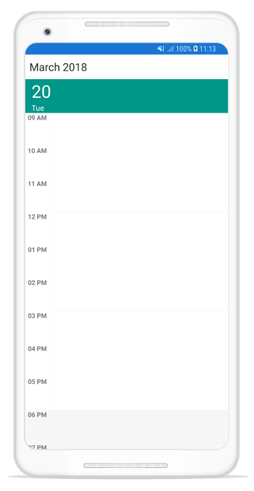

>**NOTE**
FontAttributes and FontFamily are native to the platform. Custom font and the font which are not available in the specified platform will not be applied.

You can customize the height of the ViewHeader in `DayView` by setting [ViewHeaderHeight](https://help.syncfusion.com/cr/cref_files/xamarin/sfschedule/Syncfusion.SfSchedule.XForms~Syncfusion.SfSchedule.XForms.SfSchedule~ViewHeaderHeight.html) property of `SfSchedule`.



<schedule:SfSchedule x:Name="schedule" ScheduleView = "DayView"      ViewHeaderHeight="50" >          


schedule.ScheduleView = ScheduleView.DayView;
schedule.ViewHeaderHeight = 50;



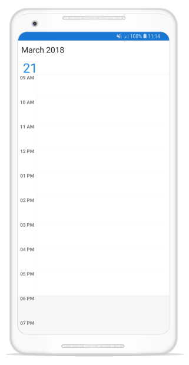

### Customize Font Appearance

you can change the appearance of Font by setting the  [DayFontFamily](http://help.syncfusion.com/cr/cref_files/xamarin/sfschedule/Syncfusion.SfSchedule.XForms~Syncfusion.SfSchedule.XForms.ViewHeaderStyle~DayFontFamilyProperty.html) and [DateFontFamily](http://help.syncfusion.com/cr/cref_files/xamarin/sfschedule/Syncfusion.SfSchedule.XForms~Syncfusion.SfSchedule.XForms.ViewHeaderStyle~DateFontFamilyProperty.html) property of [ViewHeaderStyle](https://help.syncfusion.com/xamarin/sfschedule/dayview#viewheader-appearance) property in Schedule.



<schedule:ViewHeaderStyle.DayFontFamily>
  <OnPlatform x:TypeArguments="x:String" iOS="Lobster-Regular" Android="Lobster-Regular.ttf" WinPhone="Assets/Lobster-Regular.ttf#Lobster" />
</schedule:ViewHeaderStyle.DayFontFamily>
<schedule:ViewHeaderStyle.DateFontFamily>
  <OnPlatform x:TypeArguments="x:String" iOS="Lobster-Regular" Android="Lobster-Regular.ttf" WinPhone="Assets/Lobster-Regular.ttf#Lobster" />
</schedule:ViewHeaderStyle.DateFontFamily>


viewHeaderStyle.DayFontFamily = Device.OnPlatform("Lobster-Regular", "Lobster-Regular.ttf", "Assets/Lobster-Regular.ttf#Lobster");
viewHeaderStyle.DateFontFamily = Device.OnPlatform("Lobster-Regular", "Lobster-Regular.ttf", "Assets/Lobster-Regular.ttf#Lobster");



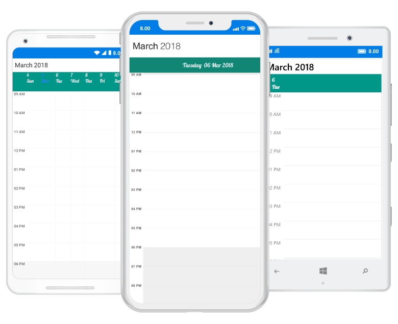

Refer [this](https://help.syncfusion.com/xamarin/sfschedule/monthview#custom-font-setting-in-xamarinforms-android) to configure the custom fonts in Xamarin.Forms.

### ViewHeader Date Format
You can customize the date and day format of `SfSchedule` ViewHeader by using [DateFormat](http://help.syncfusion.com/cr/cref_files/xamarin/sfschedule/Syncfusion.SfSchedule.XForms~Syncfusion.SfSchedule.XForms.DayLabelSettings~DateFormat.html) and [DayFormat](http://help.syncfusion.com/cr/cref_files/xamarin/sfschedule/Syncfusion.SfSchedule.XForms~Syncfusion.SfSchedule.XForms.DayLabelSettings~DayFormat.html) properties of `DayLabelSettings`.



<schedule:SfSchedule>
	<schedule:SfSchedule.DayViewSettings>
		<schedule:DayViewSettings>
			<schedule:DayViewSettings.DayLabelSettings>
				<schedule:DayLabelSettings DateFormat=“dd”>
					<schedule:DayLabelSettings.DayFormat>
						<OnPlatform x:TypeArguments="x:String" iOS="EEE d MMMM YY" Android="EEEE" WinPhone="dddd" />
						</schedule:DayLabelSettings.DayFormat>
				</schedule:DayLabelSettings>
			</schedule:DayViewSettings.DayLabelSettings>
		</schedule:DayViewSettings>
	</schedule:SfSchedule.DayViewSettings>
</schedule:SfSchedule>


schedule.ScheduleView = ScheduleView.DayView;
//Creating new instance of DayViewSettings
DayViewSettings dayViewSettings = new DayViewSettings();
//Creating new instance of DayLabelSettings
DayLabelSettings dayLabelSettings = new DayLabelSettings();
//Customizing date format
dayLabelSettings.DateFormat = "dd";
dayLabelSettings.DayFormat = Device.OnPlatform("EEE d MMMM YY", "EEEE", "dddd");
dayViewSettings.DayLabelSettings = dayLabelSettings;
schedule.DayViewSettings = dayViewSettings;



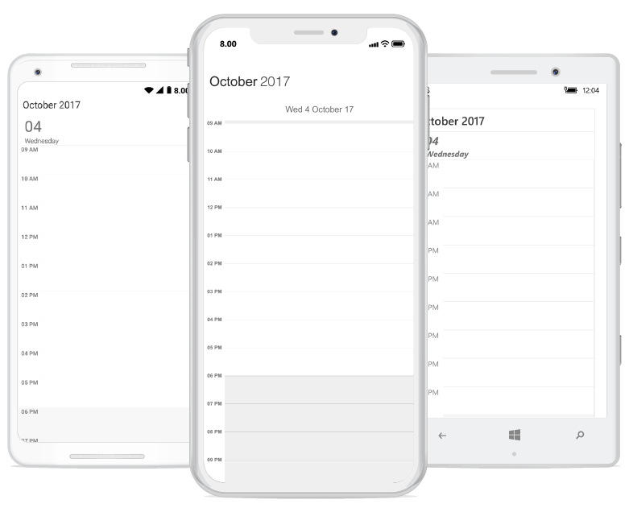

### ViewHeader Tapped Event
You can handle single tap action of ViewHeader by using [ViewHeaderTapped](http://help.syncfusion.com/cr/cref_files/xamarin/sfschedule/Syncfusion.SfSchedule.XForms~Syncfusion.SfSchedule.XForms.SfSchedule~ViewHeaderTapped_EV.html) event of `SfSchedule`. This event will be triggered when the ViewHeader is Tapped. This event contains [ViewHeaderTappedEventArgs](http://help.syncfusion.com/cr/cref_files/xamarin/sfschedule/Syncfusion.SfSchedule.XForms~Syncfusion.SfSchedule.XForms.ViewHeaderTappedEventArgs.html) argument which holds [DateTime](https://help.syncfusion.com/cr/cref_files/xamarin/sfschedule/Syncfusion.SfSchedule.XForms~Syncfusion.SfSchedule.XForms.CellTappedEventArgs~Datetime.html) details in it.



<schedule:SfSchedule x:Name="schedule"
                     ScheduleView="DayView"
                     ViewHeaderTapped="Handle_ViewHeaderTapped" >
</schedule:SfSchedule>


//Creating  new instance of Schedule
SfSchedule schedule = new SfSchedule();
schedule.ScheduleView = ScheduleView.DayView;
schedule.ViewHeaderTapped += Handle_ViewHeaderTapped;





private void Handle_ViewHeaderTapped(object sender, ViewHeaderTappedEventArgs e)
{
    var dateTime = e.DateTime;
}



## Change Time Interval
You can customize the interval of timeslots in `DayView` by setting [TimeInterval](https://help.syncfusion.com/cr/cref_files/xamarin/sfschedule/Syncfusion.SfSchedule.XForms~Syncfusion.SfSchedule.XForms.SfSchedule~TimeInterval.html)  property of `SfSchedule`.



<schedule:SfSchedule  x:Name="schedule"  ScheduleView="DayView" TimeInterval="180"/>


schedule.ScheduleView = ScheduleView.DayView;
schedule.TimeInterval = 180;



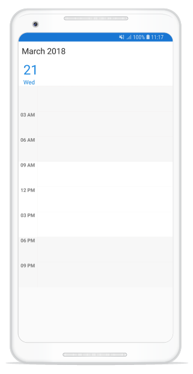

>**NOTE**
If you modify the `TimeInterval` value (in minutes), you need to change the time labels format by setting the `TimeFormat` value as "hh:mm". By default, TimeFormat value is `"hh a"`. You can refer [here](https://help.syncfusion.com/xamarin/sfschedule/dayview#time-label-formatting) for changing TimeFormat value.

## Change Time Interval Height
You can customize the interval height of timeslots in `DayView` by setting [TimeIntervalHeight](https://help.syncfusion.com/cr/cref_files/xamarin/sfschedule/Syncfusion.SfSchedule.XForms~Syncfusion.SfSchedule.XForms.SfSchedule~TimeIntervalHeight.html)  property of `SfSchedule`.



<schedule:SfSchedule  x:Name="schedule"  ScheduleView="DayView" TimeIntervalHeight="180"/>


schedule.ScheduleView = ScheduleView.DayView;
schedule.TimeIntervalHeight = 180;



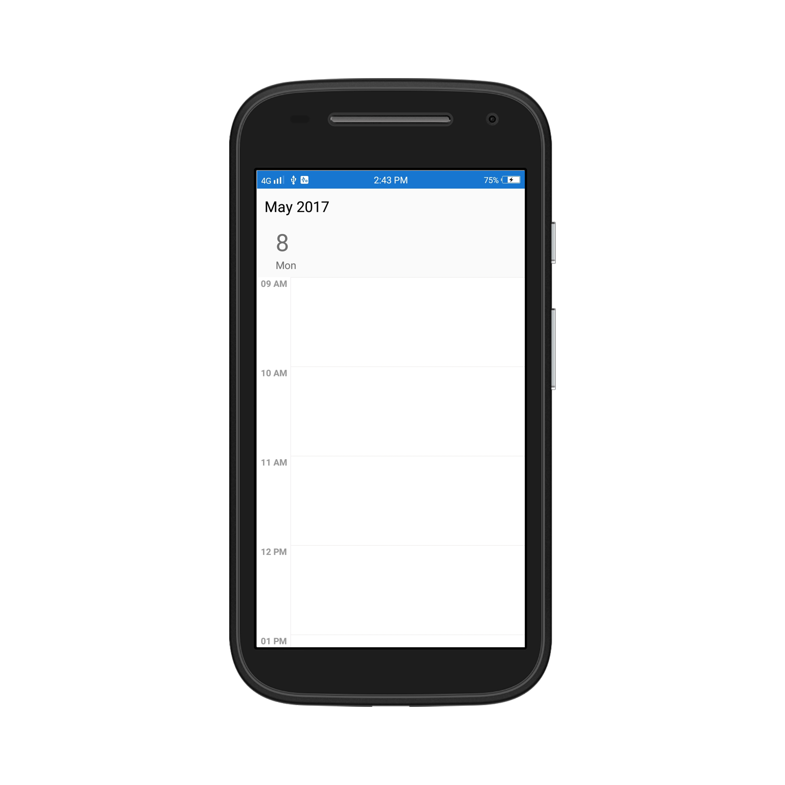

## Change Working hours

Working hours in `DayView` of Schedule control will be differentiated with non-working hours by separate color. By default, working hours will be between 09 to 18. You can customize the working hours by setting [WorkStartHour](https://help.syncfusion.com/cr/cref_files/xamarin/sfschedule/Syncfusion.SfSchedule.XForms~Syncfusion.SfSchedule.XForms.DayViewSettings~WorkStartHour.html) and [WorkEndHour](https://help.syncfusion.com/cr/cref_files/xamarin/sfschedule/Syncfusion.SfSchedule.XForms~Syncfusion.SfSchedule.XForms.DayViewSettings~WorkEndHour.html) properties of  [DayViewSettings](https://help.syncfusion.com/cr/cref_files/xamarin/sfschedule/Syncfusion.SfSchedule.XForms~Syncfusion.SfSchedule.XForms.DayViewSettings.html).



<schedule:SfSchedule x:Name="schedule" ScheduleView="DayView">
   <schedule:SfSchedule.DayViewSettings>
	<!--setting working hours properties -->
	   <schedule:DayViewSettings 
			WorkStartHour="10" 
			WorkEndHour="18">
	   </schedule:DayViewSettings>
   </schedule:SfSchedule.DayViewSettings>
</schedule:SfSchedule> 


schedule.ScheduleView = ScheduleView.DayView;
//Create new instance of DayViewSettings
DayViewSettings dayViewSettings = new DayViewSettings();
dayViewSettings.WorkStartHour = 10;
dayViewSettings.WorkEndHour = 18;
schedule.DayViewSettings = dayViewSettings;



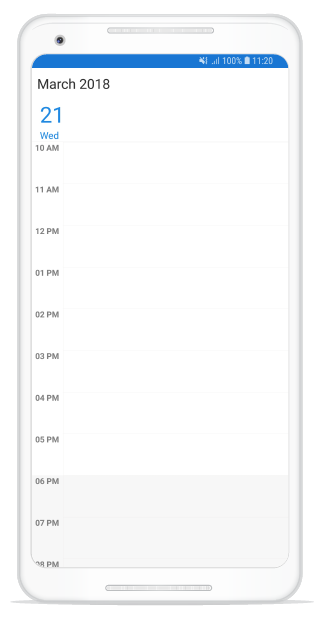

>**NOTE**
`WorkStartHour` and `WorkEndHour` should be in integer value to represent hours.

## Changing StartHour and EndHour

Default value for [StartHour](https://help.syncfusion.com/cr/cref_files/xamarin/sfschedule/Syncfusion.SfSchedule.XForms~Syncfusion.SfSchedule.XForms.DayViewSettings~StartHour.html) and [EndHour](https://help.syncfusion.com/cr/cref_files/xamarin/sfschedule/Syncfusion.SfSchedule.XForms~Syncfusion.SfSchedule.XForms.DayViewSettings~EndHour.html) value is 0 to 24 to show all the time slots in `DayView`. You need to set [StartHour](https://help.syncfusion.com/cr/cref_files/xamarin/sfschedule/Syncfusion.SfSchedule.XForms~Syncfusion.SfSchedule.XForms.DayViewSettings~StartHour.html) and [EndHour](https://help.syncfusion.com/cr/cref_files/xamarin/sfschedule/Syncfusion.SfSchedule.XForms~Syncfusion.SfSchedule.XForms.DayViewSettings~EndHour.html) property of `DayView`, to show only the required time duration for end users.



<schedule:SfSchedule x:Name="schedule" ScheduleView="DayView">
   <schedule:SfSchedule.DayViewSettings>
   <!--setting working hours properties -->
	   <schedule:DayViewSettings 
	   StartHour="08"
	   EndHour="15">
	   </schedule:DayViewSettings>
   </schedule:SfSchedule.DayViewSettings>
</schedule:SfSchedule> 


schedule.ScheduleView = ScheduleView.DayView;
//Create new instance of DayViewSettings
DayViewSettings dayViewSettings = new DayViewSettings();
dayViewSettings.StartHour = 08;
dayViewSettings.EndHour = 15;
schedule.DayViewSettings = dayViewSettings;



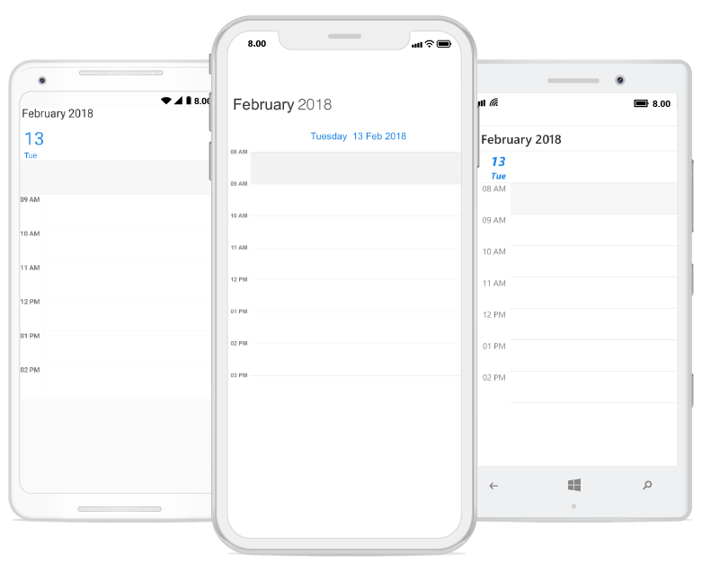

>**NOTE**
* `StartHour` and `EndHour` should be in integer value to represent hours.
* `StartHour` must be greater than or equal to 0 and `EndHour` must be lesser than or equal to 24, otherwise `InvalidDataException` will be thrown.
* `EndHour` value must be greater than `StartHour`, otherwise `InvalidDataException` will be thrown.
* Schedule UI such as Appointments and NonAccessibleBlocks which does not fall within the `StartHour` and `EndHour` will not be visible and if it falls partially, it will be clipped.

## Timeslot Appearance
You can customize the appearance of timeslots in `DayView`.

 * [Timeslot customization in Work hours](#timeslot-customization-in-work-hours)
* [Timeslot customization in Non Working hours](#timeslot-customization-in-non-working-hours)

### Timeslot customization in Work hours

You can customize the appearance of the WorkingHourTimeslot by its color using [TimeSlotColor](https://help.syncfusion.com/cr/cref_files/xamarin/sfschedule/Syncfusion.SfSchedule.XForms~Syncfusion.SfSchedule.XForms.DayViewSettings~TimeSlotColor.html),[TimeSlotBorderColor](https://help.syncfusion.com/cr/cref_files/xamarin/sfschedule/Syncfusion.SfSchedule.XForms~Syncfusion.SfSchedule.XForms.DayViewSettings~TimeSlotBorderColor.html) and [TimeSlotBorderStrokeWidth](https://help.syncfusion.com/cr/cref_files/xamarin/sfschedule/Syncfusion.SfSchedule.XForms~Syncfusion.SfSchedule.XForms.DayViewSettings~TimeSlotBorderStrokeWidth.html) properties of `DayViewSettings`.



<schedule:SfSchedule x:Name="schedule" ScheduleView="DayView">
	<schedule:SfSchedule.DayViewSettings>
	 <!--setting DayView settings properties -->
	   <schedule:DayViewSettings
		  TimeSlotColor="#fcf3c9"
		  TimeSlotBorderColor="#fceb9f"
		  TimeSlotBorderStrokeWidth="5">
		</schedule:DayViewSettings>
	 </schedule:SfSchedule.DayViewSettings>
 </schedule:SfSchedule> 


schedule.ScheduleView = ScheduleView.DayView;
//Create new instance of DayViewSettings
DayViewSettings dayViewSettings = new DayViewSettings();
dayViewSettings.TimeSlotBorderColor = Color.FromHex("#fceb9f");
dayViewSettings.TimeSlotColor = Color.FromHex("#fcf3c9");
dayViewSettings.TimeSlotBorderStrokeWidth = 5;
schedule.DayViewSettings = dayViewSettings;


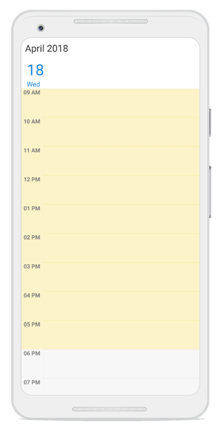

### Timeslot customization in Non Working hours

You can customize the appearance of the Non-workingHourTimeslots by its color using [NonWorkingHoursTimeSlotBorderColor](https://help.syncfusion.com/cr/cref_files/xamarin/sfschedule/Syncfusion.SfSchedule.XForms~Syncfusion.SfSchedule.XForms.DayViewSettings~NonWorkingHoursTimeSlotBorderColor.html), [NonWorkingHoursTimeSlotColor](https://help.syncfusion.com/cr/cref_files/xamarin/sfschedule/Syncfusion.SfSchedule.XForms~Syncfusion.SfSchedule.XForms.DayViewSettings~NonWorkingHoursTimeSlotColor.html) properties of `DayViewSettings`.



<schedule:SfSchedule x:Name="schedule" ScheduleView="DayView">
 <schedule:SfSchedule.DayViewSettings>
   <!--setting Day view settings properties -->
	 <schedule:DayViewSettings
		NonWorkingHoursTimeSlotColor="#fcf3c9"
		NonWorkingHoursTimeSlotBorderColor="#fceb9f"
		TimeSlotBorderStrokeWidth="5">
	 </schedule:DayViewSettings>
 </schedule:SfSchedule.DayViewSettings>
</schedule:SfSchedule> 


schedule.ScheduleView = ScheduleView.DayView;
//Create new instance of DayViewSettings
DayViewSettings dayViewSettings = new DayViewSettings();
dayViewSettings.NonWorkingHoursTimeSlotBorderColor = Color.FromHex("#fceb9f");
dayViewSettings.NonWorkingHoursTimeSlotColor = Color.FromHex("#fcf3c9");
schedule.DayViewSettings = dayViewSettings;


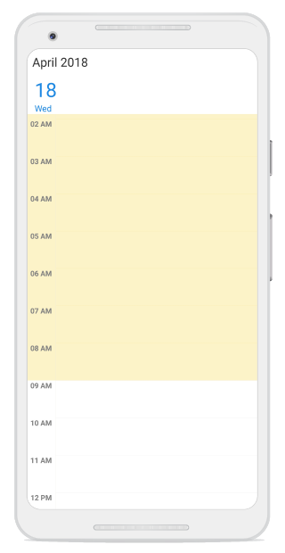

>**NOTE**
`TimeSlotBorderStrokeWidth` property common for both Working hours and Non-Working hour time slot customization.

## Non-Accessible timeslots

You can restrict or allocate certain timeslot as non-accessible blocks by using [NonAccessibleBlocks](https://help.syncfusion.com/cr/cref_files/xamarin/sfschedule/Syncfusion.SfSchedule.XForms~Syncfusion.SfSchedule.XForms.DayViewSettings~NonAccessibleBlocks.html) of `DayViewSettings`, so that you can allocate those timeslots for predefined events/activities like Lunch hour.



<schedule:SfSchedule x:Name="schedule" ScheduleView="DayView">
	<!--setting non-accessing blocks-->
	<schedule:SfSchedule.DayViewSettings>
		<schedule:DayViewSettings>
			<schedule:DayViewSettings.NonAccessibleBlocks>
				<schedule:NonAccessibleBlock 
					 StartTime="13"
					 EndTime="14" 
					 Text="LUNCH" 
					 Color="Black" />
			</schedule:DayViewSettings.NonAccessibleBlocks>
		</schedule:DayViewSettings>
	</schedule:SfSchedule.DayViewSettings>
</schedule:SfSchedule> 



schedule.ScheduleView = ScheduleView.DayView;
//Create new instance of NonAccessibleBlock
NonAccessibleBlock nonAccessibleBlock = new NonAccessibleBlock();
//Create new instance of NonAccessibleBlocksCollection
NonAccessibleBlocksCollection nonAccessibleBlocksCollection = new NonAccessibleBlocksCollection();
DayViewSettings dayViewSettings = new DayViewSettings();
nonAccessibleBlock.StartTime = 13;
nonAccessibleBlock.EndTime = 14;
nonAccessibleBlock.Text = "LUNCH";
nonAccessibleBlock.Color = Color.Black;
nonAccessibleBlocksCollection.Add(nonAccessibleBlock);
dayViewSettings.NonAccessibleBlocks = nonAccessibleBlocksCollection;
schedule.DayViewSettings = dayViewSettings;


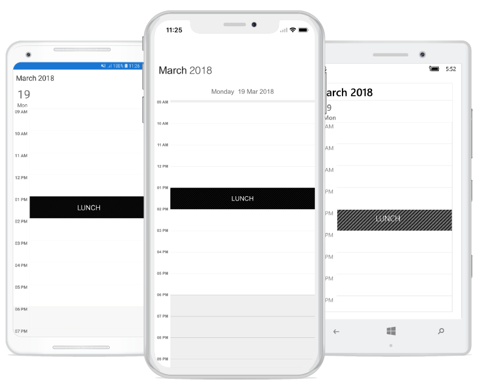

>**NOTE**
Selection and related events will not be working in this blocks.

## Change first day of week
[FirstDayOfWeek](https://help.syncfusion.com/cr/cref_files/xamarin/sfschedule/Syncfusion.SfSchedule.XForms~Syncfusion.SfSchedule.XForms.SfSchedule~FirstDayOfWeek.html) of `SfSchedule` is not applicable for `DayView` as it displays only one day.

## Time Label Formatting

You can customize the format for the labels which are mentioning the time, by setting [TimeFormat](https://help.syncfusion.com/cr/cref_files/xamarin/sfschedule/Syncfusion.SfSchedule.XForms~Syncfusion.SfSchedule.XForms.DayLabelSettings~TimeFormat.html) property of [DayLabelSettings](https://help.syncfusion.com/cr/cref_files/xamarin/sfschedule/Syncfusion.SfSchedule.XForms~Syncfusion.SfSchedule.XForms.DayViewSettings~DayLabelSettings.html) in `DayViewSettings`.



schedule.ScheduleView = ScheduleView.DayView;
DayViewSettings dayViewSettings = new DayViewSettings();
DayLabelSettings dayLabelSettings = new DayLabelSettings();
dayLabelSettings.TimeFormat = "hh mm";
dayViewSettings.DayLabelSettings = dayLabelSettings;
schedule.DayViewSettings = dayViewSettings;



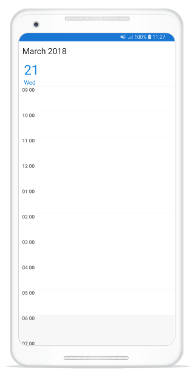

## Time Label Appearance

You can customize the color for the labels which are mentioning the time, by setting [TimeLabelColor](https://help.syncfusion.com/cr/cref_files/xamarin/sfschedule/Syncfusion.SfSchedule.XForms~Syncfusion.SfSchedule.XForms.DayLabelSettings~TimeLabelColor.html) property of `DayLabelSettings` in `DayViewSettings`.



schedule.ScheduleView = ScheduleView.DayView;
//Create new instance of DayViewSettings
DayViewSettings dayViewSettings = new DayViewSettings();
//Create new instance of DayLabelSettings
DayLabelSettings dayLabelSettings = new DayLabelSettings();
dayLabelSettings.TimeLabelColor = Color.FromHex("#8282ff");
dayViewSettings.DayLabelSettings = dayLabelSettings;
schedule.DayViewSettings = dayViewSettings;



## Time Label Size

You can customize the size of the labels which are mentioning the time, by setting [TimeLabelSize](https://help.syncfusion.com/cr/cref_files/xamarin-android/sfschedule/Syncfusion.SfSchedule.Android~Com.Syncfusion.Schedule.DayLabelSettings~TimeLabelSize.html) property of `DayLabelSettings` in `DayViewSettings`.



schedule.ScheduleView = ScheduleView.DayView;
//Create new instance of DayViewSettings
DayViewSettings dayViewSettings = new DayViewSettings();
//Create new instance of DayLabelSettings
DayLabelSettings dayLabelSettings = new DayLabelSettings();
//Customizing the size of the time label
dayLabelSettings.TimeLabelSize = 15;
dayViewSettings.DayLabelSettings = dayLabelSettings;
schedule.DayViewSettings = dayViewSettings;



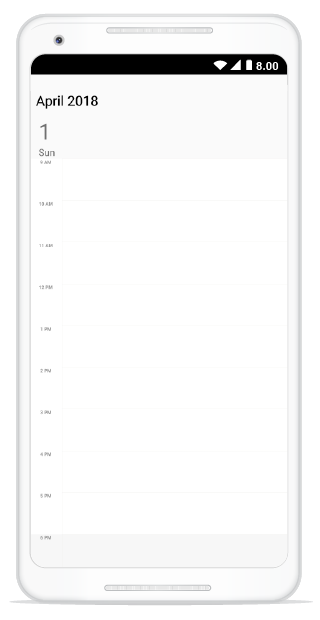

## Selection
You can customize the default appearance of selection UI in the timeslots.

* [Selection customization using style](#selection-customization-using-style)
* [Selection customization using custom View](#selection-customization-using-custom-view)
* [Programmatic selection](#programmatic-selection)

### Selection customization using style
You can customize the timeslot selection by by setting the [BackgroundColor](https://help.syncfusion.com/cr/cref_files/xamarin/sfschedule/Syncfusion.SfSchedule.XForms~Syncfusion.SfSchedule.XForms.SelectionStyle~BackgroundColor.html), [BorderColor](https://help.syncfusion.com/cr/cref_files/xamarin/sfschedule/Syncfusion.SfSchedule.XForms~Syncfusion.SfSchedule.XForms.SelectionStyle~BorderColor.html), [BorderThickness](https://help.syncfusion.com/cr/cref_files/xamarin/sfschedule/Syncfusion.SfSchedule.XForms~Syncfusion.SfSchedule.XForms.SelectionStyle~BorderThickness.html), [BorderCornerRadius](https://help.syncfusion.com/cr/cref_files/xamarin/sfschedule/Syncfusion.SfSchedule.XForms~Syncfusion.SfSchedule.XForms.SelectionStyle~BorderCornerRadius.html) properties to the [SelectionStyle](https://help.syncfusion.com/cr/cref_files/xamarin/sfschedule/Syncfusion.SfSchedule.XForms~Syncfusion.SfSchedule.XForms.SfSchedule~SelectionStyle.html) property of `SfSchedule`.



<schedule:SfSchedule x:Name="schedule" ScheduleView="DayView">
		<schedule:SfSchedule.SelectionStyle>
			<schedule:SelectionStyle 
				BackgroundColor="Blue" 
				BorderColor="Black"
				BorderThickness="5"
				BorderCornerRadius="5">
			</schedule:SelectionStyle>
		</schedule:SfSchedule.SelectionStyle>
</schedule:SfSchedule> 


schedule.ScheduleView = ScheduleView.DayView;
//Create new instance of SelectionStyle
SelectionStyle selectionStyle = new SelectionStyle();
selectionStyle.BackgroundColor = Color.Blue;
selectionStyle.BorderColor = Color.Black;
selectionStyle.BorderThickness = 5;
selectionStyle.BorderCornerRadius = 5;
schedule.SelectionStyle = selectionStyle;



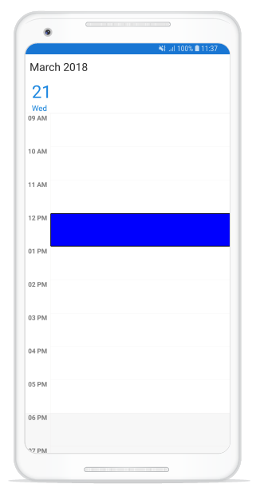

### Selection customization using custom View
You can replace the default selection UI with your custom view by setting [SelectionView](https://help.syncfusion.com/cr/cref_files/xamarin/sfschedule/Syncfusion.SfSchedule.XForms~Syncfusion.SfSchedule.XForms.SfSchedule~SelectionView.html) property of `SfSchedule`.



<schedule:SfSchedule x:Name="schedule" ScheduleView="DayView">
	<schedule:SfSchedule.SelectionView>
		<Button 
		   BackgroundColor="#FF9800"
		   Text="+NewEvent" 
		   TextColor="White"/>
	</schedule:SfSchedule.SelectionView>
</schedule:SfSchedule> 


schedule.ScheduleView = ScheduleView.DayView;
//Add the CustomView
Button customView = new Button();
customView.Text = "+NewEvent";
customView.BackgroundColor = Color.FromHex("#FF9800");
customView.TextColor = Color.White;
schedule.SelectionView = customView;



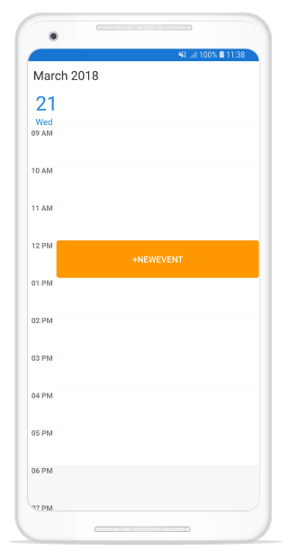

### Programmatic selection
You can programmatically select the specific timeslot by setting corresponding date and time value to [SelectedDate](https://help.syncfusion.com/cr/cref_files/xamarin/sfschedule/Syncfusion.SfSchedule.XForms~Syncfusion.SfSchedule.XForms.SfSchedule~SelectedDate.html) property of `SfSchedule`. By default, it is null.



// Setting a date and time to select
schedule.SelectedDate = new DateTime(2017, 10, 04, 10, 0, 0);



You can clear the selection by setting [SelectedDate](https://help.syncfusion.com/cr/cref_files/xamarin/sfschedule/Syncfusion.SfSchedule.XForms~Syncfusion.SfSchedule.XForms.SfSchedule~SelectedDate.html) as null.



// Setting null value to deselect
schedule.SelectedDate = null;



You can download the entire source code of this demo for Xamarin.Forms from here [Date_Selection](http://www.syncfusion.com/downloads/support/directtrac/general/ze/Date_Selection1072247797.zip)

>**NOTE**
* `SfSchedule` does not support multiple selection.
* `SfSchedule` supports two-way binding of `SelectedDate` property.

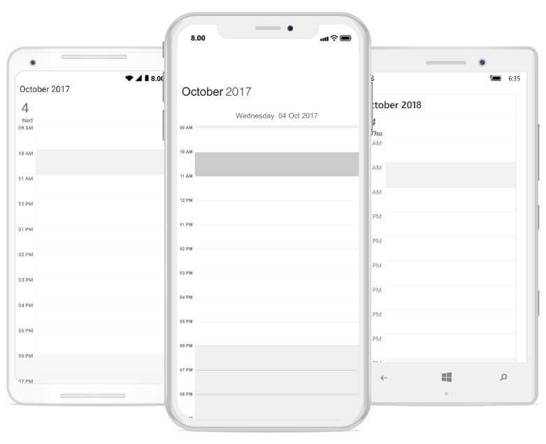

