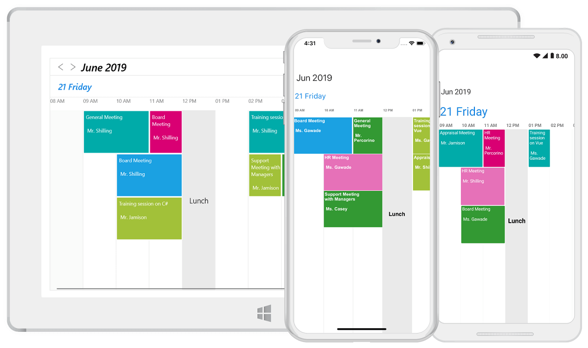
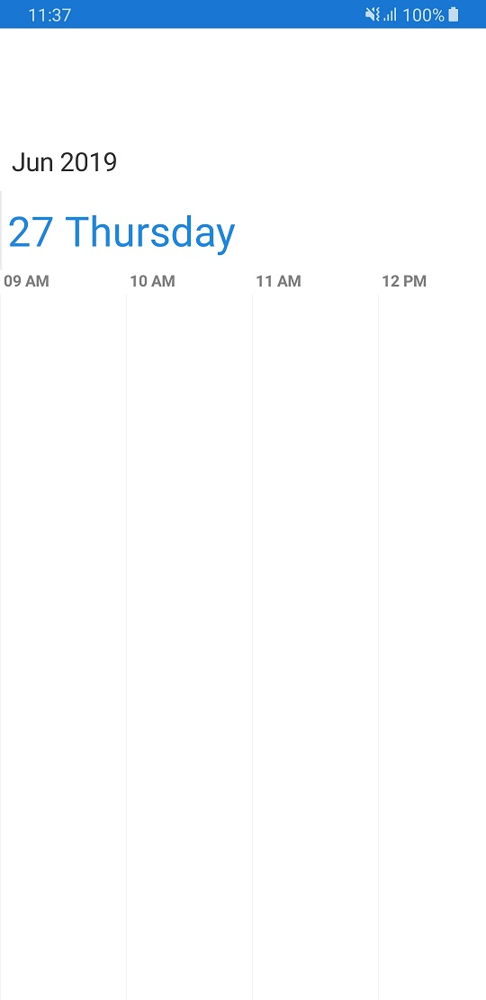
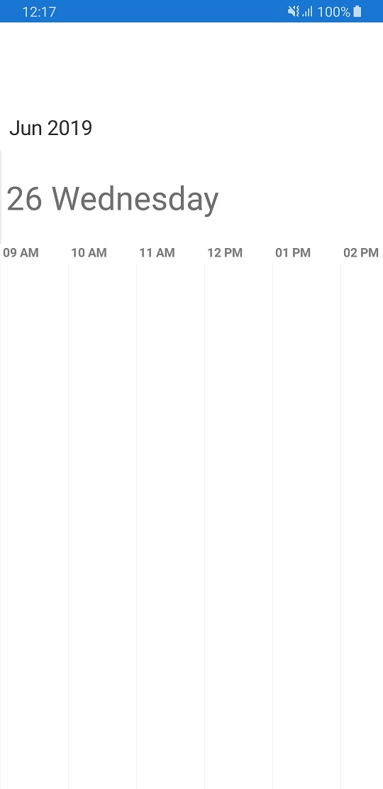
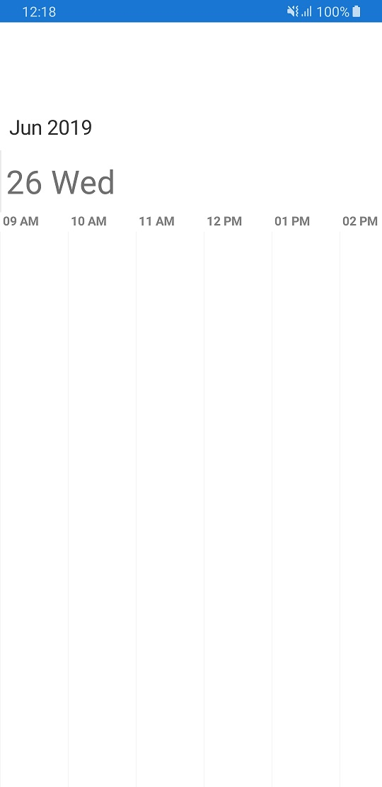
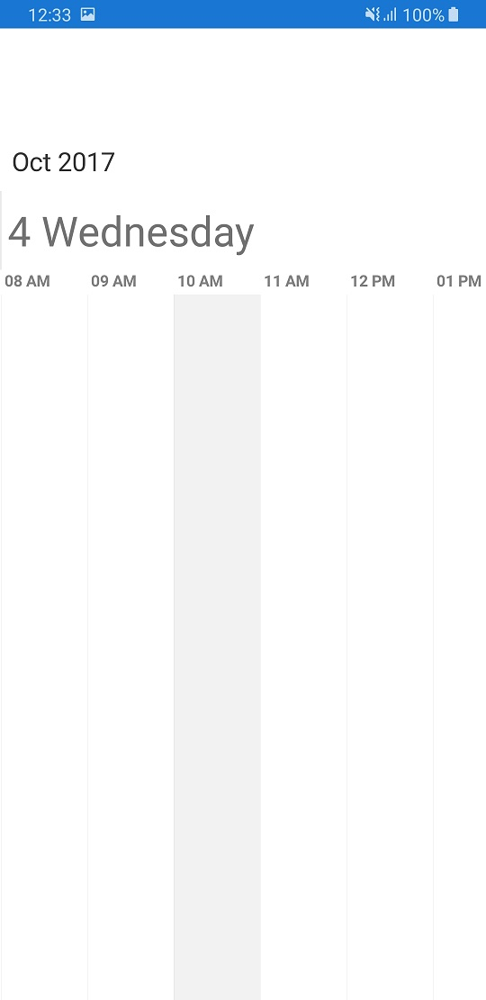

# Timeline view

`TimelineView` Xamarin.Forms scheduler displays the dates in horizontal time axis with the desired day`s count. You can see the past or future dates by scrolling right or left. Each view displays events accurately across the time slots with an intuitive drag-and-drop feature. Provides support to highlight selected region of time slots and handle interaction.



<schedule:SfSchedule x:Name="schedule" ScheduleView="TimelineView"/> 


schedule.ScheduleView = ScheduleView.TimelineView;



## Timeline view days count

You can customize the number of days in timeline view by using [DaysCount](https://help.syncfusion.com/cr/cref_files/xamarin/Syncfusion.SfSchedule.XForms~Syncfusion.SfSchedule.XForms.TimelineViewSettings~DaysCount.html) property of [TimelineViewSettings](https://help.syncfusion.com/cr/cref_files/xamarin/Syncfusion.SfSchedule.XForms~Syncfusion.SfSchedule.XForms.TimelineViewSettings.html). By default, timeline days count value is -1 and single day will be visible.



<schedule:SfSchedule x:Name="schedule" ScheduleView="TimelineView">
    <syncfusion:SfSchedule.TimelineViewSettings>
        <!--setting days count property-->
        <syncfusion:TimelineViewSettings 
            DaysCount="10" />
    </syncfusion:SfSchedule.TimelineViewSettings> 
</schedule:SfSchedule>


schedule.ScheduleView = ScheduleView.TimelineView;
//Creating new instance of TimelineSettings
TimelineSettings timelineViewSettings = new TimelineSettings();
//Customizing days count
timelineViewSettings.DaysCount = 10;
schedule.TimelineSettings = timelineViewSettings;



## Timeline view based on day, week, work week and month.

You can achieve timeline day, timeline week, timeline work week and timeline month views with default value of `DaysCount`, by dynamically switching between day, week, work week and month views to timeline view with respective visible dates. 

>**NOTE**
For other value of `DaysCount`, only timeline view visible dates will be displayed as mentioned days count on dynamic view switching.

## Customized working hours

You can customize [StartHour](https://help.syncfusion.com/cr/cref_files/xamarin/Syncfusion.SfSchedule.XForms~Syncfusion.SfSchedule.XForms.TimelineViewSettings~StartHour.html) and [EndHour](https://help.syncfusion.com/cr/cref_files/xamarin/Syncfusion.SfSchedule.XForms~Syncfusion.SfSchedule.XForms.TimelineViewSettings~EndHour.html) properties of Timeline view, to show only the required time duration for end users. You can also set `StartHour` and `EndHour` in double value which will be converted to time to show required time duration in minutes. Default value for `StartHour` and `EndHour` value is 0 to 24 to show all the time slots in Timeline View. 



<schedule:SfSchedule x:Name="schedule" ScheduleView="TimelineView">
    <schedule:SfSchedule.TimelineViewSettings>
        <!--setting visible hours properties-->
        <schedule:TimelineViewSettings
            StartHour="07.5"
            EndHour="18.5">
            <schedule:TimelineViewSettings.LabelSettings>
                <schedule:TimelineLabelSettings TimeFormat="hh:mm" />
            </schedule:TimelineViewSettings.LabelSettings>
        </schedule:TimelineViewSettings>
    </schedule:SfSchedule.TimelineViewSettings>
</schedule:SfSchedule>    


schedule.ScheduleView = ScheduleView.TimelineView;
//Creating new instance of TimelineViewSettings
TimelineViewSettings timelineViewSettings = new TimelineViewSettings();
TimelineLabelSettings labelSettings = new TimelineLabelSettings();
labelSettings.TimeFormat = "hh:mm";
timelineViewSettings.StartHour = 07.5;
timelineViewSettings.EndHour = 18.5;
timelineViewSettings.LabelSettings = labelSettings;
schedule.TimelineViewSettings = timelineViewSettings;



>**NOTE**
* `StartHour` must be greater than or equal to 0 and `EndHour` must be lesser than or equal to 24, otherwise `InvalidDataException` will be thrown.
* `EndHour` value must be greater than `StartHour`, otherwise `InvalidDataException` will be thrown.
* Schedule UI such as Appointments and NonAccessibleBlocks which does not fall within the `StartHour` and `EndHour` will not be visible and if it falls partially, it will be clipped.
* No need to specify the decimal point values for `StartHour` and `EndHour`, if you don’t want to set the minutes.
* The number of time slots will be calculated based on total minutes of a day and time interval (total minutes of a day ((start hour - end hour) * 60) / time interval).
* If the custom time interval is given, then the number of time slots calculated based on given time interval should result in integer value, otherwise given time interval will be neglected and default time interval (60 minutes) will be considered.
* If the custom start hour and end hour is given, then the number of time slots calculated based on given start hour, end hour should result in integer value, otherwise given end hour will be rounded off. For example, if StartHour is 7.2 (07:12AM), EndHour is 18.6 (06:36AM) and TimeInterval is 60 minutes, then EndHour will be rounded off to 18.2 (06:12PM).

## Special time regions

You can restrict user interaction like selection and highlight specific region of time in Timeline view by adding special time region in the [SpecialTimeRegions](https://help.syncfusion.com/cr/cref_files/xamarin/Syncfusion.SfSchedule.XForms~Syncfusion.SfSchedule.XForms.SfSchedule~SpecialTimeRegions.html) property of `SfSchedule`. You need to set [StartHour](https://help.syncfusion.com/cr/cref_files/xamarin/Syncfusion.SfSchedule.XForms~Syncfusion.SfSchedule.XForms.TimeRegionSettings~StartHour.html) and [EndHour](https://help.syncfusion.com/cr/cref_files/xamarin/Syncfusion.SfSchedule.XForms~Syncfusion.SfSchedule.XForms.TimeRegionSettings~EndHour.html) properties of [TimeRegionSettings](https://help.syncfusion.com/cr/cref_files/xamarin/Syncfusion.SfSchedule.XForms~Syncfusion.SfSchedule.XForms.TimeRegionSettings.html) to create a special time region. You can also set `StartHour` and `EndHour` in double value which will be converted to time to show required time duration in minutes. By default, `StatHour` and `EndHour` values are 0.

### Special time region appearance

You can customize the appearance of SpecialTimeRegion by using [Color](https://help.syncfusion.com/cr/cref_files/xamarin/Syncfusion.SfSchedule.XForms~Syncfusion.SfSchedule.XForms.TimeRegionSettings~Color.html) and [TextColor](https://help.syncfusion.com/cr/cref_files/xamarin/Syncfusion.SfSchedule.XForms~Syncfusion.SfSchedule.XForms.TimeRegionSettings~TextColor.html) properties of `TimeRegionSettings`.

### Selection restriction in time slots

You can enable/disable the touch interaction of a special time region by using [CanEdit](https://help.syncfusion.com/cr/cref_files/xamarin/Syncfusion.SfSchedule.XForms~Syncfusion.SfSchedule.XForms.TimeRegionSettings~CanEdit.html) property of `TimeRegionSettings`. By default, it is true.



<schedule:SfSchedule x:Name="schedule" ScheduleView="TimelineView">
    <!--setting Special time regions property-->
    <schedule:SfSchedule.SpecialTimeRegions>
        <schedule:TimeRegionSettings 
            StartHour="13" 
            EndHour="14" 
            Text="Lunch"
            CanEdit="False"
            Color="Black"
            TextColor="White"/>
    </schedule:SfSchedule.SpecialTimeRegions>
</schedule:SfSchedule>     


schedule.ScheduleView = ScheduleView.TimelineView;
ObservableCollection<TimeRegionSettings> specialTimeRegions = new ObservableCollection<TimeRegionSettings>();
//Setting Special time regions property
TimeRegionSettings timeRegionSettings = new TimeRegionSettings();
timeRegionSettings.StartHour = 13;
timeRegionSettings.EndHour = 14;
timeRegionSettings.Text = "Lunch";
timeRegionSettings.Color = Color.Black;
timeRegionSettings.TextColor = Color.White;
timeRegionSettings.CanEdit = false;
specialTimeRegions.Add(timeRegionSettings);
schedule.SpecialTimeRegions = specialTimeRegions;



## Time interval

You can customize the interval of time slots in Timeline view by setting [TimeInterval](https://help.syncfusion.com/cr/cref_files/xamarin/Syncfusion.SfSchedule.XForms~Syncfusion.SfSchedule.XForms.SfSchedule~TimeInterval.html) property of `SfSchedule`.



<schedule:SfSchedule x:Name="schedule" ScheduleView="TimelineView" TimeInterval="180"/>     


schedule.ScheduleView = ScheduleView.TimelineView; 
schedule.TimeInterval = 180



## Time interval height

You can customize the interval height of time slots in Timeline view by setting [TimeIntervalHeight](https://help.syncfusion.com/cr/cref_files/xamarin/Syncfusion.SfSchedule.XForms~Syncfusion.SfSchedule.XForms.SfSchedule~TimeIntervalHeight.html


<schedule:SfSchedule x:Name="schedule" ScheduleView="TimelineView" TimeIntervalHeight="180"/>     


schedule.ScheduleView = ScheduleView.TimelineView; 
schedule.TimeIntervalHeight = 180;



## Nonworking days

You can customize the non-working days in Timeline view by using [NonWorkingsDays](https://help.syncfusion.com/cr/cref_files/xamarin/Syncfusion.SfSchedule.XForms~Syncfusion.SfSchedule.XForms.TimelineViewSettings~NonWorkingsDays.html) property of `TimelineViewSettings`. By default, it is null.



var nonWorkingDays = new ObservableCollection<DayOfWeek>();
nonWorkingDays.Add(DayOfWeek.Monday);
nonWorkingDays.Add(DayOfWeek.Friday);
var timelineViewSettings = new TimelineViewSettings();
timelineViewSettings.NonWorkingsDays = nonWorkingDays;
schedule.TimelineViewSettings = timelineViewSettings;



## First day of week

By default, schedule control will be rendered with Sunday as the first day of the week, it can be customized to any day of the week by using `FirstDayOfWeek` property of `SfSchedule`.



<schedule:SfSchedule x:Name="schedule" ScheduleView="TimelineView" FirstDayOfWeek="3"/>   


schedule.ScheduleView = ScheduleView.TimelineView; 
schedule.FirstDayOfWeek = 3;



>**NOTE**
In Timeline view, `FirstDayOfWeek` will be applied only when `DayCounts` property of `TimelineViewSettings` is 7.

## Appointment height

You can customize the height of the appointment in Timeline view by using [AppointmentHeight](https://help.syncfusion.com/cr/cref_files/xamarin/Syncfusion.SfSchedule.XForms~Syncfusion.SfSchedule.XForms.TimelineViewSettings~AppointmentHeight.html) property of `TimelineViewSettings`. By default, its value is 50.



<schedule:SfSchedule x:Name="schedule" ScheduleView="TimelineView">
    <schedule:SfSchedule.TimelineViewSettings>
        <!--setting appointment height property-->
        <schedule:TimelineViewSettings
            AppointmentHeight="100" />
    </schedule:SfSchedule.TimelineViewSettings>
</schedule:SfSchedule>


schedule.ScheduleView = ScheduleView.TimelineView;
//Create new instance of TimelineViewSettings
TimelineViewSettings timelineViewSettings = new TimelineViewSettings();
timelineViewSettings.AppointmentHeight = 100;
schedule.TimelineViewSettings = timelineViewSettings;



>**NOTE**
When a greater number of appointments are added in same time slot, appointment height will be calculated automatically without considering the `AppointmentHeight` property to display all the appointment in the view. 

## View header tapped event

You can handle single tap action of view header by using `ViewHeaderTapped` event of `SfSchedule`. This event will be triggered when the view header is tapped. This event contains `ViewHeaderTappedEventArgs` argument which holds `DateTime` details in it.



<schedule:SfSchedule x:Name="schedule" 
    ScheduleView="TimelineView "   
    ViewHeaderTapped="Handle_ViewHeaderTapped"> 
</schedule:SfSchedule>


//Creating new instance of Schedule 
SfSchedule schedule = new SfSchedule(); 
schedule.ScheduleView = ScheduleView.TimelineView; 
schedule.ViewHeaderTapped += Handle_ViewHeaderTapped;





private void Handle_ViewHeaderTapped(object sender, ViewHeaderTappedEventArgs e) 
{ 
     var dateTime = e.DateTime; 
}



## View header customization

You can customize the default appearance of view header in Timeline view by using [ViewHeaderStyle](https://help.syncfusion.com/xamarin/sfschedule/dayview#viewheader-appearance) property of `SfSchedule`.



<schedule:SfSchedule x:Name="schedule" ScheduleView =" TimelineView">
    <schedule:SfSchedule.ViewHeaderStyle>
        <schedule:ViewHeaderStyle
                BackgroundColor="#009688" 
                DateTextColor="#FFFFFF" 
                DateFontFamily="Arial">
        </schedule:ViewHeaderStyle>
    </schedule:SfSchedule.ViewHeaderStyle>
</schedule:SfSchedule>


//Create new instance of Schedule
SfSchedule schedule = new SfSchedule();
schedule.ScheduleView = ScheduleView.TimelineView;
//Customize the schedule view header
ViewHeaderStyle viewHeaderStyle = new ViewHeaderStyle();
viewHeaderStyle.BackgroundColor = Color.FromHex("#009688");
viewHeaderStyle.DateTextColor = Color.FromHex("#FFFFFF");
viewHeaderStyle.DateFontFamily = "Arial";
schedule.ViewHeaderStyle = viewHeaderStyle;



>**NOTE**
`FontAttributes` and `FontFamily` are native to the platform. Custom font and the font which are not available in the specified platform will not be applied.

You can customize the height of the view header in Timeline view by setting [ViewHeaderHeight](https://help.syncfusion.com/cr/cref_files/xamarin/Syncfusion.SfSchedule.XForms~Syncfusion.SfSchedule.XForms.SfSchedule~ViewHeaderHeight.html) property of `SfSchedule`.



<schedule:SfSchedule x:Name="schedule" ScheduleView ="TimelineView " ViewHeaderHeight="50" />


schedule.ScheduleView = ScheduleView.TimelineView; 
schedule.ViewHeaderHeight = 50;



### View header date format

You can customize the date format of view header in Timeline view by using `DateFormat` property of `TimelineViewSettings`.



<schedule:SfSchedule>
    <schedule:SfSchedule.TimelineViewSettings>
        <schedule:TimelineViewSettings>
            <schedule:TimelineViewSettings.LabelSettings>
                <schedule:TimelineLabelSettings>
                    <schedule:TimelineLabelSettings.DateFormat>
                        <OnPlatform x:TypeArguments="x:String" iOS="d EEE" Android="d EEE" WinPhone="%d ddd" />
                    </schedule:TimelineLabelSettings.DateFormat>
                </schedule:TimelineLabelSettings>
            </schedule:TimelineViewSettings.LabelSettings>
        </schedule:TimelineViewSettings>
    </schedule:SfSchedule.TimelineViewSettings>
</schedule:SfSchedule>


schedule.ScheduleView = ScheduleView.TimelineView;
//Creating new instance of TimelineViewSettings
TimelineViewSettings timelineViewSettings = new TimelineViewSettings();
//Creating new instance of TimelineLabelSettings
TimelineLabelSettings labelSettings = new TimelineLabelSettings();
//Customizing date format
labelSettings.DateFormat = Device.OnPlatform("d EEE", "d EEE", "%d ddd");
timelineViewSettings.LabelSettings = labelSettings;
schedule.TimelineViewSettings = timelineViewSettings;



## Timeslot customization

You can customize the appearance of time slots using [Color](https://help.syncfusion.com/cr/cref_files/xamarin/Syncfusion.SfSchedule.XForms~Syncfusion.SfSchedule.XForms.TimelineViewSettings~Color.html), [BorderColor](https://help.syncfusion.com/cr/cref_files/xamarin/Syncfusion.SfSchedule.XForms~Syncfusion.SfSchedule.XForms.TimelineViewSettings~BorderColor.html) and [BorderWidth](https://help.syncfusion.com/cr/cref_files/xamarin/Syncfusion.SfSchedule.XForms~Syncfusion.SfSchedule.XForms.TimelineViewSettings~BorderWidth.html) properties of `TimelineViewSettings`.



<schedule:SfSchedule x:Name="schedule" ScheduleView="TimelineView">
    <schedule:SfSchedule.TimelineViewSettings>
        <!--setting timeline view settings properties -->
        <schedule:TimelineViewSettings
            Color="#fcf3c9"
            BorderColor="#fceb9f"
            BorderWidth="5" />
    </schedule:SfSchedule.TimelineViewSettings>
</schedule:SfSchedule>


schedule.ScheduleView = ScheduleView.TimelineView;
//Create new instance of TimelineViewSettings
TimelineViewSettings timelineViewSettings = new TimelineViewSettings();
timelineViewSettings.BorderColor = Color.FromHex("#fceb9f");
timelineViewSettings.Color = Color.FromHex("#fcf3c9");
timelineViewSettings.BorderWidth = 5;
schedule.TimelineViewSettings = timelineViewSettings;



## Time label customization

You can customize the format for the labels which are mentioning the time, by setting [TimeFormat](https://help.syncfusion.com/cr/cref_files/xamarin/Syncfusion.SfSchedule.XForms~Syncfusion.SfSchedule.XForms.TimelineLabelSettings~TimeFormat.html) property of [LabelSettings](https://help.syncfusion.com/cr/cref_files/xamarin/Syncfusion.SfSchedule.XForms~Syncfusion.SfSchedule.XForms.TimelineViewSettings~LabelSettings.html) in `TimelineViewSettings`.



<schedule:SfSchedule x:Name="schedule" ScheduleView="TimelineView">
    <schedule:SfSchedule.TimelineViewSettings>
        <!--setting time format property--> 
        <schedule:TimelineViewSettings>
            <schedule:TimelineViewSettings.LabelSettings>
                <schedule:TimelineLabelSettings TimeFormat="hh:mm" />
            </schedule:TimelineViewSettings.LabelSettings>
        </schedule:TimelineViewSettings>
    </schedule:SfSchedule.TimelineViewSettings>
</schedule:SfSchedule>


schedule.ScheduleView = ScheduleView.TimelineView;
//Creating new instance of TimelineViewSettings
TimelineViewSettings timelineViewSettings = new TimelineViewSettings();
TimelineLabelSettings labelSettings = new TimelineLabelSettings();
labelSettings.TimeFormat = "hh:mm";
timelineViewSettings.LabelSettings = labelSettings;
schedule.TimelineViewSettings = timelineViewSettings;



### Time label appearance

You can customize the color for the labels which are mentioning the time, by setting [TimeLabelColor](https://help.syncfusion.com/cr/cref_files/xamarin/Syncfusion.SfSchedule.XForms~Syncfusion.SfSchedule.XForms.TimelineLabelSettings~TimeLabelColor.html) property of `LabelSettings` in `TimelineViewSettings`.



<schedule:SfSchedule x:Name="schedule" ScheduleView="TimelineView">
    <schedule:SfSchedule.TimelineViewSettings>
        <!--setting time format property-->
        <schedule:TimelineViewSettings>
            <schedule:TimelineViewSettings.LabelSettings>
                <schedule:TimelineLabelSettings TimeLabelColor="#8282ff" />
            </schedule:TimelineViewSettings.LabelSettings>
        </schedule:TimelineViewSettings>
    </schedule:SfSchedule.TimelineViewSettings>
</schedule:SfSchedule>


schedule.ScheduleView = ScheduleView.TimelineView;
//Creating new instance of TimelineViewSettings
TimelineViewSettings timelineViewSettings = new TimelineViewSettings();
TimelineLabelSettings labelSettings = new TimelineLabelSettings();
labelSettings.TimeLabelColor = Color.FromHex("#8282ff");
timelineViewSettings.LabelSettings = labelSettings;
schedule.TimelineViewSettings = timelineViewSettings;



### Time Label size

You can customize the size of the labels which are mentioning the time, by setting [TimeLabelSize](https://help.syncfusion.com/cr/cref_files/xamarin/Syncfusion.SfSchedule.XForms~Syncfusion.SfSchedule.XForms.TimelineLabelSettings~TimeLabelSize.html) property of `LabelSettings` in `TimelineViewSettings`.



<schedule:SfSchedule x:Name="schedule" ScheduleView="TimelineView">
    <schedule:SfSchedule.TimelineViewSettings>
        <!--setting time format property-->
        <schedule:TimelineViewSettings>
            <schedule:TimelineViewSettings.LabelSettings>
                <schedule:TimelineLabelSettings TimeLabelSize="15" />
            </schedule:TimelineViewSettings.LabelSettings>
        </schedule:TimelineViewSettings>
    </schedule:SfSchedule.TimelineViewSettings>
</schedule:SfSchedule>


schedule.ScheduleView = ScheduleView.TimelineView;
//Creating new instance of TimelineViewSettings
TimelineViewSettings timelineViewSettings = new TimelineViewSettings();
TimelineLabelSettings labelSettings = new TimelineLabelSettings();
labelSettings.TimeLabelSize = 15;	
timelineViewSettings.LabelSettings = labelSettings;
schedule.TimelineViewSettings = timelineViewSettings;



## Selection
You can customize the default appearance of selection UI in the timeslots.

* [Selection customization using style](#selection-customization-using-style)
* [Selection customization using custom View](#selection-customization-using-custom-view)
* [Programmatic selection](#programmatic-selection)

### Selection customization using style
You can customize the timeslot selection by using [SelectionStyle](https://help.syncfusion.com/cr/cref_files/xamarin/Syncfusion.SfSchedule.XForms~Syncfusion.SfSchedule.XForms.SfSchedule~SelectionStyle.html) property of `SfSchedule`.



<schedule:SfSchedule x:Name="schedule" ScheduleView="TimelineView">
	<schedule:SfSchedule.SelectionStyle>
		  <schedule:SelectionStyle 
			  BackgroundColor="Blue"
			  BorderColor="Black"
			  BorderThickness="5" 
			  BorderCornerRadius="5">
		  </schedule:SelectionStyle>
	</schedule:SfSchedule.SelectionStyle>
</schedule:SfSchedule> 


schedule.ScheduleView = ScheduleView.TimelineView;
//Create new instance of SelectionStyle
SelectionStyle selectionStyle = new SelectionStyle();
selectionStyle.BackgroundColor = Color.Blue;
selectionStyle.BorderColor = Color.Black;
selectionStyle.BorderThickness = 5;
selectionStyle.BorderCornerRadius = 5;
schedule.SelectionStyle = selectionStyle;



### Selection customization using custom View
You can replace the default selection UI with your custom view by setting [SelectionView](https://help.syncfusion.com/cr/cref_files/xamarin/Syncfusion.SfSchedule.XForms~Syncfusion.SfSchedule.XForms.SfSchedule~SelectionView.html) property of `SfSchedule`.



<schedule:SfSchedule x:Name="schedule" ScheduleView="TimelineView">
  <schedule:SfSchedule.SelectionView>
	   <Button 
		   BackgroundColor="#FF9800" 
		   Text="+NewEvent" 
		   TextColor="White"/>
  </schedule:SfSchedule.SelectionView>
</schedule:SfSchedule>


schedule.ScheduleView = ScheduleView.TimelineView;
//Add the CustomView
Button customView = new Button();
customView.Text = "+NewEvent";
customView.BackgroundColor = Color.FromHex("#FF9800");
customView.TextColor = Color.White;
schedule.SelectionView = customView;



### Programmatic selection
You can programmatically select the specific timeslot by setting corresponding date and time value to [SelectedDate](https://help.syncfusion.com/cr/cref_files/xamarin/Syncfusion.SfSchedule.XForms~Syncfusion.SfSchedule.XForms.SfSchedule~SelectedDate.html) property of `SfSchedule`. By default, it is null.



// Setting a date and time to select
schedule.SelectedDate = new DateTime(2017, 10, 04, 10, 0, 0);



You can clear the selection by setting [SelectedDate](https://help.syncfusion.com/cr/cref_files/xamarin/Syncfusion.SfSchedule.XForms~Syncfusion.SfSchedule.XForms.SfSchedule~SelectedDate.html) as null.



// Setting null value to deselect
schedule.SelectedDate = null;



You can download the entire source code of this demo for Xamarin.Forms from here [Date_Selection](http://www.syncfusion.com/downloads/support/directtrac/general/ze/Date_Selection1072247797.zip)

>**NOTE**
* `SfSchedule` does not support multiple selection.
* `SfSchedule` supports two-way binding of `SelectedDate` property.
