---

layout: post
title: Populating Appointments in Syncfusion SfSchedule control for Xamarin.Forms
description: Learn how to Populate Appointments in SfSchedule control
platform: xamarin
control: SfSchedule
documentation: ug

---

# Appointments

[SfSchedule](https://help.syncfusion.com/cr/xamarin/sfschedule) control has a built-in capability to handle the appointment arrangement internally based on the [ScheduleAppointmentCollection](https://help.syncfusion.com/cr/cref_files/xamarin/Syncfusion.SfSchedule.XForms~Syncfusion.SfSchedule.XForms.ScheduleAppointmentCollection.html). [ScheduleAppointment](https://help.syncfusion.com/cr/cref_files/xamarin/Syncfusion.SfSchedule.XForms~Syncfusion.SfSchedule.XForms.ScheduleAppointment.html) is a class, which holds the details about the appointment to be rendered in schedule.



// Creating an instance for schedule appointment collection
ScheduleAppointmentCollection scheduleAppointmentCollection = new ScheduleAppointmentCollection();
//Adding schedule appointment in schedule appointment collection 
scheduleAppointmentCollection.Add(new ScheduleAppointment()
{ 
	StartTime = new DateTime(2017, 05, 08, 10, 0, 0), 
	EndTime = new DateTime(2017, 05, 08, 12, 0, 0), 
	Subject = "Meeting", 
	Location = "Hutchison road", 
}); 

//Adding schedule appointment collection to DataSource of SfSchedule
schedule.DataSource=scheduleAppointmentCollection;



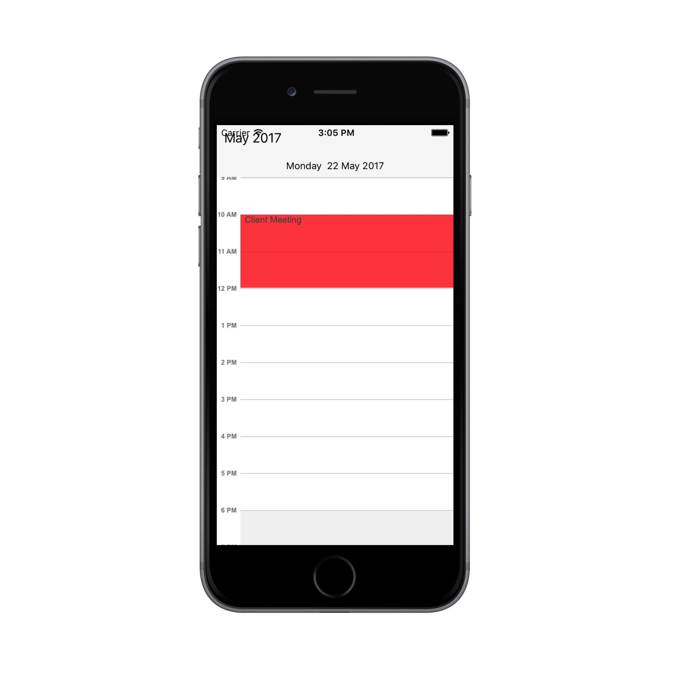

## Minimum Appointment Height

[MinHeight](https://help.syncfusion.com/cr/cref_files/xamarin/Syncfusion.SfSchedule.XForms~Syncfusion.SfSchedule.XForms.ScheduleAppointment~MinHeight.html) of an appointment is to set an arbitrary height to appointments when it has minimum duration, so that the subject can be readable.



schedule.ScheduleView = ScheduleView.DayView;
ScheduleAppointmentCollection scheduleAppointmentCollection = new ScheduleAppointmentCollection();
scheduleAppointmentCollection.Add(new ScheduleAppointment()
{
    StartTime = new DateTime(2018, 2, 13, 09, 0, 0),
    EndTime = new DateTime(2018, 2, 13, 09, 0, 0),
    Subject = "Client Meeting",
    MinHeight = 30,
    Color = Color.FromHex("#FFD80073")
});
scheduleAppointmentCollection.Add(new ScheduleAppointment()
{
    StartTime = new DateTime(2018, 2, 13, 11, 0, 0),
    EndTime = new DateTime(2018, 2, 13, 12, 0, 0),
    Subject = "Anniversary",
    Color = Color.FromHex("#FFA2C139")
});
schedule.DataSource = scheduleAppointmentCollection;

this.Content = schedule;



 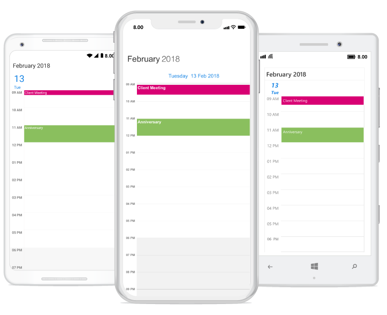

>**NOTE**
* `MinHeight` value will be set, when the an appointment height (duration) value lesser than MinHeight. 
* Appointment height (duration) value will be set, when the appointment height (duration) value greater than `MinHeight`.
* TimeInterval value will be set, when Minimum Height greater than TimeInterval with lesser appointment height (duration).
* `MinHeight` has ScheduleAppointmentMapping Support.
* All day Appointment does not support `MinHeight`.

## Mapping
Schedule supports full data binding to any type of IEnumerable source. Specify the [ScheduleAppointmentMapping](https://help.syncfusion.com/cr/cref_files/xamarin/Syncfusion.SfSchedule.XForms~Syncfusion.SfSchedule.XForms.ScheduleAppointmentMapping.html) attributes to map the properties in the underlying data source to the schedule appointments.

| Property Name | Description |
|-------------------------------------------------------------------------------------------------------------------------------------------------------------------------------------------------------|--------------------------------------------------------------------------------------------------------------------------|
| [StartTimeMapping](https://help.syncfusion.com/cr/cref_files/xamarin/sfschedule/Syncfusion.SfSchedule.XForms~Syncfusion.SfSchedule.XForms.ScheduleAppointmentMapping~StartTimeMapping.html) | This property is to map the property name of custom class which is equivalent for StartTime of ScheduleAppointment. |
| [StartTimeZoneMapping] (https://help.syncfusion.com/cr/cref_files/xamarin/sfschedule/Syncfusion.SfSchedule.XForms~Syncfusion.SfSchedule.XForms.ScheduleAppointmentMapping~StartTimeZoneMapping.html) | This property is to map the property name of custom class which is equivalent for Start time zone of ScheduleAppointment. |
| [EndTimeMapping](https://help.syncfusion.com/cr/cref_files/xamarin/sfschedule/Syncfusion.SfSchedule.XForms~Syncfusion.SfSchedule.XForms.ScheduleAppointmentMapping~EndTimeMapping.html) | This property is to map the property name of custom class which is equivalent for EndTime of ScheduleAppointment. |
| [EndTimeZoneMapping] (https://help.syncfusion.com/cr/cref_files/xamarin/sfschedule/Syncfusion.SfSchedule.XForms~Syncfusion.SfSchedule.XForms.ScheduleAppointmentMapping~EndTimeZoneMapping.html) | This property is to map the property name of custom class which is equivalent for End time zone of ScheduleAppointment. |
| [SubjectMapping](https://help.syncfusion.com/cr/cref_files/xamarin/sfschedule/Syncfusion.SfSchedule.XForms~Syncfusion.SfSchedule.XForms.ScheduleAppointmentMapping~SubjectMapping.html) | This property is to map the property name of custom class which is equivalent for Subject of ScheduleAppointment. |
| [ColorMapping](https://help.syncfusion.com/cr/cref_files/xamarin/sfschedule/Syncfusion.SfSchedule.XForms~Syncfusion.SfSchedule.XForms.ScheduleAppointmentMapping~ColorMapping.html) | This property is to map the property name of custom class which is equivalent for Color of ScheduleAppointment. |
| [IsAllDayMapping](https://help.syncfusion.com/cr/cref_files/xamarin/sfschedule/Syncfusion.SfSchedule.XForms~Syncfusion.SfSchedule.XForms.ScheduleAppointmentMapping~IsAllDayMapping.html) | This property is to map the property name of custom class which is equivalent for IsAllDay of ScheduleAppointment. |
| [RecurrenceRuleMapping](https://help.syncfusion.com/cr/cref_files/xamarin/sfschedule/Syncfusion.SfSchedule.XForms~Syncfusion.SfSchedule.XForms.ScheduleAppointmentMapping~RecurrenceRuleMapping.html) | This property is to map the property name of custom class which is equivalent for RecurrenceRule of ScheduleAppointment. |
| [NotesMapping](https://help.syncfusion.com/cr/cref_files/xamarin/sfschedule/Syncfusion.SfSchedule.XForms~Syncfusion.SfSchedule.XForms.ScheduleAppointmentMapping~NotesMapping.html) | This property is to map the property name of custom class which is equivalent for Notes of ScheduleAppointment. |
| [LocationMapping](https://help.syncfusion.com/cr/cref_files/xamarin/sfschedule/Syncfusion.SfSchedule.XForms~Syncfusion.SfSchedule.XForms.ScheduleAppointmentMapping~LocationMapping.html) | This property is to map the property name of custom class which is equivalent for Location of ScheduleAppointment. |
| [IsRecursiveMapping](https://help.syncfusion.com/cr/cref_files/xamarin/sfschedule/Syncfusion.SfSchedule.XForms~Syncfusion.SfSchedule.XForms.ScheduleAppointmentMapping~IsRecursiveMapping.html) | This property is to map the property name of custom class which is equivalent for IsRecursive of ScheduleAppointment. |
| [MinHeightMapping](https://help.syncfusion.com/cr/cref_files/xamarin/sfschedule/Syncfusion.SfSchedule.XForms~Syncfusion.SfSchedule.XForms.ScheduleAppointmentMapping~MinHeightMapping.html) | This property is to map the property name of custom class which is equivalent for MinHeight of ScheduleAppointment. |

N> CustomAppointment class should contain two DateTime fields and a string field as mandatory.

### Creating custom Appointments
You can create a custom class `Meeting` with mandatory fields `From`, `To` and `EventName`.



/// 
   
/// Represents custom data properties.   
/// 
 
public class Meeting
{
	public string EventName { get; set; }
	public DateTime From { get; set; }
	public DateTime To { get; set; }
	public Color Color { get; set; }
} 



N> You can inherit this class from `INotifyPropertyChanged` for dynamic changes in custom data.

You can map those properties of `Meeting` class with our SfSchedule control by using [AppointmentMapping](https://help.syncfusion.com/cr/cref_files/xamarin/Syncfusion.SfSchedule.XForms~Syncfusion.SfSchedule.XForms.SfSchedule~AppointmentMapping.html).

 
<syncfusion:SfSchedule x:Name="schedule" ScheduleView="DayView" DataSource="{Binding Meetings}">
	<syncfusion:SfSchedule.AppointmentMapping>
		<syncfusion:ScheduleAppointmentMapping
			SubjectMapping="EventName" 
			ColorMapping="Color"
			StartTimeMapping="From"
			EndTimeMapping="To">
		</syncfusion:ScheduleAppointmentMapping>
	</syncfusion:SfSchedule.AppointmentMapping>
</syncfusion:SfSchedule> 


//Schedule data mapping for custom appointments
ScheduleAppointmentMapping dataMapping = new ScheduleAppointmentMapping();
dataMapping.SubjectMapping = "EventName";
dataMapping.StartTimeMapping = "From";
dataMapping.EndTimeMapping = "To";
dataMapping.ColorMapping = "Color";
schedule.AppointmentMapping = dataMapping;

 

You can schedule meetings for a day by setting `From` and `To` of `Meeting` class. Create meetings of type `ObservableCollection <Meeting>` and assign those appointments collection `Meetings` to the `DataSource` property which is of `IEnumerable` type.



// Creating instance for custom appointment class
Meeting meeting = new Meeting();
// Setting start time of an event
meeting.From = new DateTime(2017,05,08, 10, 0, 0);
// Setting end time of an event
meeting.To = meeting.From.AddHours(1);
// Setting start time for an event
meeting.EventName = "Anniversary";
// Setting color for an event
meeting.Color = Color.Green; 
// Creating instance for collection of custom appointments
var Meetings = new ObservableCollection<Meeting>();
// Adding a custom appointment in CustomAppointmentCollection
Meetings.Add(meeting);
// Adding custom appointments in DataSource of SfSchedule
schedule.DataSource = Meetings;
 


## Spanned Appointments
Spanned Appointment is an appointment which lasts more than 24 hours. It doesn’t block out time slots in `SfSchedule`, it will render in [All-Day appointment](https://help.syncfusion.com/xamarin/sfschedule/data-bindings#all-day-appointment-panel) panel exclusively.



public ObservableCollection<Meeting> Meetings { get; set; } 
// Creating instance for collection of custom appointments
Meetings = new ObservableCollection<Meeting>();
// Creating instance for custom appointment class
Meeting meeting = new Meeting();
// Setting start time of an event
meeting.From = new DateTime(2017,05,08, 10, 0, 0);
// Setting end time of an event
meeting.To = meeting.From.AddDays(2).AddHours(1);
// Setting start time for an event
meeting.EventName = "Anniversary";
// Setting color for an event
meeting.Color = Color.Green;
// Adding a custom appointment in CustomAppointmentCollection
Meetings.Add(meeting);

//Adding schedule appointment collection to DataSource of SfSchedule
schedule.DataSource= Meetings ; 
 


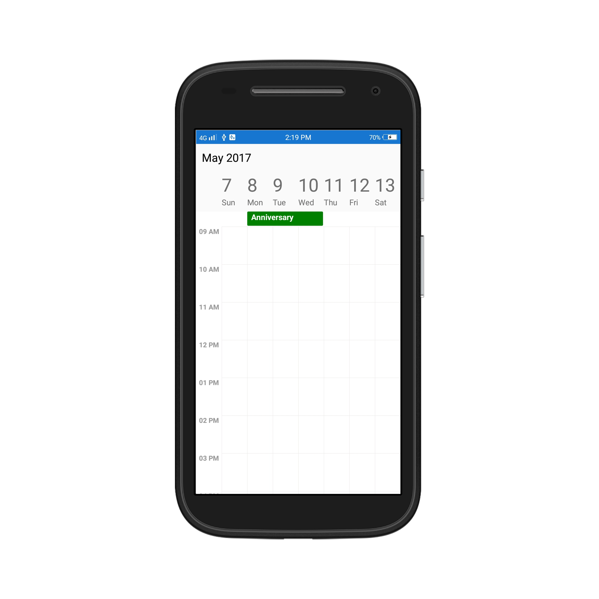

## All Day Appointments
All-Day appointment is an appointment which is scheduled for a whole day. It can be set by using `IsAllDay` property in the `ScheduleAppointment`.



// Creating an instance for schedule appointment collection
ScheduleAppointmentCollection scheduleAppointmentCollection = new ScheduleAppointmentCollection();
//Adding schedule appointment in schedule appointment collection 
scheduleAppointmentCollection.Add(new ScheduleAppointment()
{
	StartTime = new DateTime(2017, 05, 08, 10, 0, 0),
	EndTime = new DateTime(2017, 05, 10, 12, 0, 0),
	Subject = "Meeting",
	Location = "Hutchison road",
	IsAllDay = true
}); 
//Adding schedule appointment collection to DataSource of SfSchedule
schedule.DataSource=scheduleAppointmentCollection;
 


>**NOTE**
Appointment which lasts through an entire day (exact 24 hours) will be considered as all day appointment without setting `IsAllDay` property. For example  06/09/2018 12:00AM to 06/10/2018 12:00AM.

### All-Day Appointment Panel
All-day appointment and Spanned appointment doesn't block out entire time slot in SfSchedule, rather it will render in separate layout exclusively for all-day appointment. It can be enabled by setting [ShowAllDay](https://help.syncfusion.com/cr/cref_files/xamarin/Syncfusion.SfSchedule.XForms~Syncfusion.SfSchedule.XForms.DayViewSettings~ShowAllDay.html) property of `DayViewSettings`, `WeekViewSettings` and `WorkWeekViewSettings` of `DayView`, `WeekView` and `WorkWeekView` respectively.



schedule.ScheduleView = ScheduleView.WeekView;
WeekViewSettings weekViewSeetings = new WeekViewSettings();
weekViewSeetings.ShowAllDay = true;
schedule.WeekViewSettings = weekViewSeetings;
 


>**NOTE**
Appointments which lasts less than 24 hours with different start date and end date will be rendered in time slot.

All-Day panel background can be customized by setting [AllDayAppointmentLayoutColor](https://help.syncfusion.com/cr/cref_files/xamarin/Syncfusion.SfSchedule.XForms~Syncfusion.SfSchedule.XForms.WeekViewSettings~AllDayAppointmentLayoutColor.html) of the respective view settings.



weekViewSeetings.AllDayAppointmentLayoutColor = Color.Silver; 
 


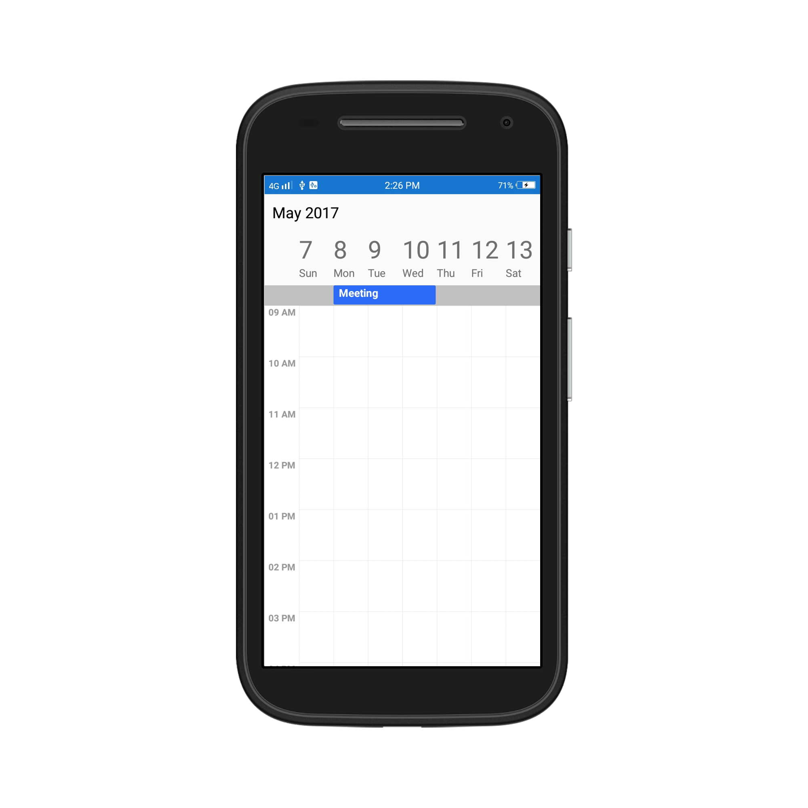

## Recurrence Appointment
Recurring appointment on a daily, weekly, monthly, or yearly interval. Recurring appointments can be created by setting `RecurrenceRule` property in Schedule appointments.

### Recurrence Rule
The `RecurrenceRule` is a string value, that contains the details of the recurrence appointments like repeat type - daily/weekly/monthly/yearly, how many times it needs to be repeated, the interval duration and also the time period to render the appointment, etc.
[RecurrenceRule](https://help.syncfusion.com/cr/cref_files/xamarin/Syncfusion.SfSchedule.XForms~Syncfusion.SfSchedule.XForms.RecurrenceProperties~RecurrenceRule.html) has the following properties and based on this property value, the recurrence appointments are rendered in the SfSchedule control with its respective time period.

| PropertyName | Purpose |
|--------------|----------------------------------------------------------------------------------------------------------------------------------------------------------------------------------------------------------------------------------------------------------------------------------------------------------------------------------------------------------------------------------------------------------------------------------------------------|
| FREQ | Maintains the Repeat type value of the appointment. (Example: Daily, Weekly, Monthly, Yearly, Every week day) Example: FREQ=DAILY;INTERVAL=1 |
| INTERVAL | Maintains the interval value of the appointments. For example, when you create the daily appointment at an interval of 2, the appointments are rendered on the days Monday, Wednesday and Friday. (creates the appointment on all days by leaving the interval of one day gap) Example: FREQ=DAILY;INTERVAL=1 |
| COUNT | It holds the appointment’s count value. For example, when the recurrence appointment count value is 10, it means 10 appointments are created in the recurrence series. Example: FREQ=DAILY;INTERVAL=1;COUNT=10 |
| UNTIL | This property is used to store the recurrence end date value. For example, when you set the end date of appointment as 6/30/2014, the UNTIL property holds the end date value when the recurrence actually ends. Example: FREQ=DAILY;INTERVAL=1;UNTIL=8/25/2014 |
| BYDAY | It holds the “DAY” values of an appointment to render.For example, when you create the weekly appointment, select the day(s) from the day options (Monday/Tuesday/Wednesday/Thursday/Friday/Saturday/Sunday).  When Monday is selected, the first two letters of the selected day “MO” is stored in the “BYDAY” property.  When you select multiple days, the values are separated by commas. Example: FREQ=WEEKLY;INTERVAL=1;BYDAY=MO,WE;COUNT=10 |
| BYMONTHDAY | This property is used to store the date value of the Month while creating the Month recurrence appointment. For example, when you create a Monthly recurrence appointment in the date 3, it means the BYMONTHDAY holds the value 3 and creates the appointment on 3rd day of every month. Example: FREQ=MONTHLY;BYMONTHDAY=3;INTERVAL=1;COUNT=10 |
| BYMONTH | This property is used to store the index value of the selected Month while creating the yearly appointments. For example, when you create the yearly appointment in the Month June, it means the index value for June month is 6 and it is stored in the BYMONTH field.  The appointment is created on every 6th month of a year. Example: FREQ=YEARLY;BYMONTHDAY=16;BYMONTH=6;INTERVAL=1;COUNT=10 |
| BYSETPOS | This property is used to store the index value of the week. For example, when you create the monthly appointment in second week of the month, the index value of the second week (2) is stored in BYSETPOS. Example: FREQ=MONTHLY;BYDAY=MO;BYSETPOS=2;UNTIL=8/11/2014 |

### Recurrence Pattern
Recurrence pattern used in the control are in iCal standard. Schedule control supports all four types of [recurrence patterns](https://help.syncfusion.com/cr/cref_files/xamarin/Syncfusion.SfSchedule.XForms~Syncfusion.SfSchedule.XForms.RecurrenceType.html).

| RecurrenceType | RecurrenceProperties | Description                                                                                 |
|----------------|----------------------|---------------------------------------------------------------------------------------------|
| Daily          | [Interval](https://help.syncfusion.com/cr/cref_files/xamarin/Syncfusion.SfSchedule.XForms~Syncfusion.SfSchedule.XForms.RecurrenceProperties~Interval.html) | Gets or sets the day interval on which recurrence has to be set.                            |
| 				 | [IsDailyEveryNDays](https://help.syncfusion.com/cr/cref_files/xamarin/Syncfusion.SfSchedule.XForms~Syncfusion.SfSchedule.XForms.RecurrenceProperties~IsDailyEveryNDays.html) | Checks whether the event occurs Daily Every N days.                                         |
| Weekly         | [Interval](https://help.syncfusion.com/cr/cref_files/xamarin/Syncfusion.SfSchedule.XForms~Syncfusion.SfSchedule.XForms.RecurrenceProperties~Interval.html) | Gets or sets the day interval on which recurrence has to be set.                            |
|                | [DayOfWeek](https://help.syncfusion.com/cr/cref_files/xamarin/Syncfusion.SfSchedule.XForms~Syncfusion.SfSchedule.XForms.RecurrenceProperties~DayOfWeek.html)  | Gets or sets the day of week on which recurrence has to be set.                             |
|                | [WeekDays](https://help.syncfusion.com/cr/cref_files/xamarin/Syncfusion.SfSchedule.XForms~Syncfusion.SfSchedule.XForms.RecurrenceProperties~WeekDays.html)   | Gets or sets the day/days in a week on which recurrence has to be set.                      |
|				 | [Week](https://help.syncfusion.com/cr/cref_files/xamarin/Syncfusion.SfSchedule.XForms~Syncfusion.SfSchedule.XForms.RecurrenceProperties~Week.html)					| Gets or sets the week of month on which recurrence has to be set.							  |
| Monthly        | [Interval](https://help.syncfusion.com/cr/cref_files/xamarin/Syncfusion.SfSchedule.XForms~Syncfusion.SfSchedule.XForms.RecurrenceProperties~Interval.html) | Gets or sets the day interval on which  recurrence has to be set.                           |
|                | [DayOfWeek](https://help.syncfusion.com/cr/cref_files/xamarin/Syncfusion.SfSchedule.XForms~Syncfusion.SfSchedule.XForms.RecurrenceProperties~DayOfWeek.html) | Gets or sets the day of week on which  recurrence has to be set.                            |
|				 | [Week](https://help.syncfusion.com/cr/cref_files/xamarin/Syncfusion.SfSchedule.XForms~Syncfusion.SfSchedule.XForms.RecurrenceProperties~Week.html)					| Gets or sets the week of month on which recurrence has to be set.							  |
|                | [DayOfMonth](https://help.syncfusion.com/cr/cref_files/xamarin/Syncfusion.SfSchedule.XForms~Syncfusion.SfSchedule.XForms.RecurrenceProperties~DayOfMonth.html) | Gets or sets the day on which recurrence has to be set for every month.                     |
|				 | [IsMonthlySpecific](https://help.syncfusion.com/cr/cref_files/xamarin/Syncfusion.SfSchedule.XForms~Syncfusion.SfSchedule.XForms.RecurrenceProperties~IsMonthlySpecific.html)  | Checks whether the event is Monthly specific event.										  |
| Yearly         | [Interval](https://help.syncfusion.com/cr/cref_files/xamarin/Syncfusion.SfSchedule.XForms~Syncfusion.SfSchedule.XForms.RecurrenceProperties~Interval.html)  | Gets or sets the day interval on which recurrence has to be set.                            |
|                | [DayOffMonth](https://help.syncfusion.com/cr/cref_files/xamarin/Syncfusion.SfSchedule.XForms~Syncfusion.SfSchedule.XForms.RecurrenceProperties~DayOfMonth.html)  | Gets or sets the day on which recurrence has to be set for every month.                     |
|                | [DayOfWeek](https://help.syncfusion.com/cr/cref_files/xamarin/Syncfusion.SfSchedule.XForms~Syncfusion.SfSchedule.XForms.RecurrenceProperties~DayOfWeek.html) | Gets or sets the day of week on which  recurrence has to be set.                            |
|				 | [Month](https://help.syncfusion.com/cr/cref_files/xamarin/Syncfusion.SfSchedule.XForms~Syncfusion.SfSchedule.XForms.RecurrenceProperties~Month.html)				| Gets or sets the specific month of year on which recurrence has to be set.				  |
|				 | [Week](https://help.syncfusion.com/cr/cref_files/xamarin/Syncfusion.SfSchedule.XForms~Syncfusion.SfSchedule.XForms.RecurrenceProperties~Week.html)					| Gets or sets the week of month on which recurrence has to be set.							  |
|				 | [IsYearlySpecific](https://help.syncfusion.com/cr/cref_files/xamarin/Syncfusion.SfSchedule.XForms~Syncfusion.SfSchedule.XForms.RecurrenceProperties~IsYearlySpecific.html) | Checks whether the event is Yearly Specific.												  |
| Common         | [RecurrenceRange](https://help.syncfusion.com/cr/cref_files/xamarin/Syncfusion.SfSchedule.XForms~Syncfusion.SfSchedule.XForms.RecurrenceProperties~RecurrenceRange.html) | Gets or sets the type of the recurrence range for the time limit of recurrence appointment. |
|                | [RecurrenceCount](https://help.syncfusion.com/cr/cref_files/xamarin/Syncfusion.SfSchedule.XForms~Syncfusion.SfSchedule.XForms.RecurrenceProperties~RecurrenceCount.html) | Gets or sets the count for recurring appointment.                                           |
|                | [StartDate](https://help.syncfusion.com/cr/cref_files/xamarin/Syncfusion.SfSchedule.XForms~Syncfusion.SfSchedule.XForms.RecurrenceProperties~StartDate.html) | Gets or sets the date to start the recurrence appointment.                                  |
|                | [EndDate](https://help.syncfusion.com/cr/cref_files/xamarin/Syncfusion.SfSchedule.XForms~Syncfusion.SfSchedule.XForms.RecurrenceProperties~EndDate.html)  | Gets or sets the date to end the recurrence appointment.                                    |
| 				 | [IsSpecific](https://help.syncfusion.com/cr/cref_files/xamarin/Syncfusion.SfSchedule.XForms~Syncfusion.SfSchedule.XForms.RecurrenceProperties~IsSpecific.html) | Checks whether the event occurs in specific recurrence type.								  |

Find the following `RecurrenceRule` possibilities available in the Schedule control while creating the recurrence appointment.

| PossibilityType | Description | RecurrenceProperties | Examples |
|-----------------|----------------------------------------------------------------|----------------------------------------------------------------------------------------------------------------------------------------------------------------------------------------------------------------------------------------------------------|-----------------------------------------------------------------------|
| Daily | Appointment is created with Ends Never | RecurrenceType = RecurrenceType.Daily, Interval = 1, IsDailyEveryNDays = true, RecurrenceRange = RecurrenceRange.NoEndDate | FREQ=DAILY; INTERVAL=1 |
|  | Appointment is created with Ends After | RecurrenceType = RecurrenceType.Daily, Interval = 1, IsDailyEveryNDays = true, RecurrenceRange = RecurrenceRange.Count, RecurrenceCount = 15 | FREQ=DAILY; INTERVAL=1; COUNT=5 |
|  | Appointment is created with Ends On | RecurrenceType = RecurrenceType.Daily, Interval = 1, IsDailyEveryNDays = true, RecurrenceRange = RecurrenceRange.EndDate, EndDate = new DateTime(2017, 06, 20) | FREQ=DAILY; INTERVAL=1; UNTIL=06/20/2017 |
|  | Appointment is created with Every (Interval) | RecurrenceType = RecurrenceType.Daily, Interval = 2, IsDailyEveryNDays = true, RecurrenceRange = RecurrenceRange.Count, RecurrenceCount = 10 | FREQ=DAILY; INTERVAL=2; COUNT=10 |
| Weekly | Appointment is created with Ends Never | RecurrenceType = RecurrenceType.Weekly, Interval = 1, WeekDays = WeekDays.Monday `|`WeekDays.Wednesday`|`WeekDays.Friday,RecurrenceRange  = RecurrenceRange.NoEndDate | FREQ=WEEKLY; INTERVAL=1; BYDAY=MO, WE, FR |
|  | Appointment is created with Ends After | RecurrenceType = RecurrenceType.Weekly, Interval = 1, WeekDays = WeekDays.Thursday, RecurrenceRange = RecurrenceRange.Count, RecurrenceCount = 10 | FREQ=WEEKLY; INTERVAL=1; BYDAY=TH; COUNT=10 |
|  | Appointment is created with Ends On | RecurrenceType = RecurrenceType.Weekly, Interval = 1, WeekDays = WeekDays.Monday, RecurrenceRange = RecurrenceRange.EndDate, EndDate = new DateTime(2017, 07, 20) | FREQ=WEEKLY; INTERVAL=1; BYDAY=MO; UNTIL=07/20/2017 |
|  | Appointment is created with selecting multiple day | RecurrenceType = RecurrenceType.Weekly, Interval = 2, WeekDays = WeekDays.Monday`|`WeekDays.Wednesday`|`WeekDays.Friday, RecurrenceRange = RecurrenceRange.Count, RecurrenceCount = 10 | FREQ=WEEKLY; INTERVAL=2; BYDAY=MO, WE, FR; COUNT=10 |
| Every Day | Appointment is created with Ends Never | RecurrenceType = RecurrenceType.Weekly, Interval = 1, WeekDays = WeekDays.Monday`|`WeekDays.Tuesday`|`WeekDays.Wednesday`|`WeekDays.Thursday`|`WeekDays.Friday, RecurrenceRange = RecurrenceRange.NoEndDate | FREQ=WEEKLY; BYDAY=MO, TU, WE, TH, FR |
|  | Appointment is created with Ends After | RecurrenceType = RecurrenceType.Weekly, Interval = 1, WeekDays = WeekDays.Monday`|`WeekDays.Tuesday`|`WeekDays.Wednesday`|`WeekDays.Thursday`|`WeekDays.Friday, RecurrenceRange = RecurrenceRange.Count, RecurrenceCount = 10 | FREQ=WEEKLY; BYDAY=MO, TU, WE, TH, FR; COUNT=10 |
|  | Appointment is created with Ends On | RecurrenceType = RecurrenceType.Weekly, Interval = 1, WeekDays = WeekDays.Monday`|`WeekDays.Tuesday`|`WeekDays.Wednesday`|`WeekDays.Thursday`|`WeekDays.Friday, RecurrenceRange = RecurrenceRange.EndDate, EndDate = new DateTime(2017, 07, 15) | FREQ=WEEKLY; BYDAY=MO, TU, WE, TH, FR; UNTIL=07/15/2017 |
| Monthly | Appointment is created with selected date Ends Never | RecurrenceType = RecurrenceType.Monthly, Interval = 1, IsMonthlySpecific = true, DayOfMonth = 15, RecurrenceRange = RecurrenceRange.NoEndDate | FREQ=MONTHLY; BYMONTHDAY=15; INTERVAL=1 |
|  | Appointment is created with selected date and Ends After | RecurrenceType = RecurrenceType.Monthly, Interval = 1, IsMonthlySpecific = true, DayOfMonth = 16, RecurrenceRange = RecurrenceRange.Count, RecurrenceCount = 10 | FREQ=MONTHLY; BYMONTHDAY=16; INTERVAL=1; COUNT=10 |
|  | Appointment is created with selected date and Ends On | RecurrenceType = RecurrenceType.Monthly, Interval = 1, IsMonthlySpecific = true, DayOfMonth = 16, RecurrenceRange = RecurrenceRange.EndDate, EndDate = new DateTime(2018, 06, 11) | FREQ=MONTHLY; BYMONTHDAY=17; INTERVAL=1; UNTIL=06/11/2018 |
|  | Appointment is created with selected day Ends Never | RecurrenceType = RecurrenceType.Monthly, Interval = 1, Week = 2, DayOfWeek = 6, RecurrenceRange = RecurrenceRange.NoEndDate | FREQ=MONTHLY; BYDAY=FR; BYSETPOS=2; INTERVAL=1 |
|  | Appointment is created with selected day and Ends After | RecurrenceType = RecurrenceType.Monthly, Interval = 1, Week = 4, DayOfWeek = 4, RecurrenceRange = RecurrenceRange.Count, RecurrenceCount = 10 | FREQ=MONTHLY; BYDAY=WE; BYSETPOS=4; INTERVAL=1; COUNT=10 |
|  | Appointment is created with selected day and Ends On | RecurrenceType = RecurrenceType.Monthly, Interval = 1, Week = 4, DayOfWeek = 6, RecurrenceRange = RecurrenceRange.EndDate, EndDate = new DateTime(2018, 06, 11) | FREQ=MONTHLY; BYDAY=FR; BYSETPOS=4; INTERVAL=1; UNTIL=06/11/2018 |
| Yearly | Appointment is created with selected date and month Ends Never | RecurrenceType = RecurrenceType.Yearly, IsYearlySpecific = true, Interval = 1, Month = 12, DayOfMonth = 15, RecurrenceRange = RecurrenceRange.NoEndDate | FREQ=YEARLY; BYMONTHDAY=15; BYMONTH=12; INTERVAL=1 |
|  | Appointment is created with selected date and month Ends After | RecurrenceType = RecurrenceType.Yearly, IsYearlySpecific = true, Interval = 1, Month = 12, DayOfMonth = 10, RecurrenceRange = RecurrenceRange.Count, RecurrenceCount = 10 | FREQ=YEARLY; BYMONTHDAY=10; BYMONTH=12; INTERVAL=1; COUNT=10 |
|  | Appointment is created with selected date and month Ends On | RecurrenceType = RecurrenceType.Yearly, IsYearlySpecific = true, Interval = 1, Month = 12, DayOfMonth = 12, RecurrenceRange = RecurrenceRange.EndDate, EndDate = new DateTime(2018, 06, 11) | FREQ=YEARLY; BYMONTHDAY=12; BYMONTH=12; INTERVAL=1; UNTIL=06/11//2018 |

N> `SfSchedule` does not support Editing and Deleting of Recurring appointment's occurrences.

### Adding Recurrence Appointment using Recurrence Builder
Schedule appointment [RecurrenceRule](https://help.syncfusion.com/cr/cref_files/xamarin/Syncfusion.SfSchedule.XForms~Syncfusion.SfSchedule.XForms.ScheduleAppointment~RecurrenceRule.html) is used to populate the required recurring appointment collection in a specific pattern. `RRULE` can be easily created through `RecurrenceBuilder` engine by simple APIs available in Schedule control.



// Creating an instance for schedule appointment collection
ScheduleAppointmentCollection scheduleAppointmentCollection = new ScheduleAppointmentCollection();
//Adding schedule appointment in schedule appointment collection 
var scheduleAppointment = new ScheduleAppointment()
{
	StartTime = new DateTime(2017, 05, 08, 10, 0, 0),
	EndTime = new DateTime(2017, 05, 08, 12, 0, 0),
	Subject = "Occurs every alternate day",
};

//Adding schedule appointment in schedule appointment collection
scheduleAppointmentCollection.Add(scheduleAppointment);

//Adding schedule appointment collection to DataSource of SfSchedule
schedule.DataSource=scheduleAppointmentCollection; 

// Creating recurrence rule
RecurrenceProperties recurrenceProperties = new RecurrenceProperties();
recurrenceProperties.RecurrenceType = RecurrenceType.Daily;
recurrenceProperties.RecurrenceRange = RecurrenceRange.Count;
recurrenceProperties.Interval = 2;
recurrenceProperties.IsDailyEveryNDays = true;
recurrenceProperties.RecurrenceCount = 10;
recurrenceProperties.RecurrenceRule = DependencyService.Get<IRecurrenceBuilder>().RRuleGenerator(recurrenceProperties, scheduleAppointment.StartTime, scheduleAppointment.EndTime);

// Setting recurrence rule to schedule appointment
scheduleAppointment.RecurrenceRule = recurrenceProperties.RecurrenceRule; 



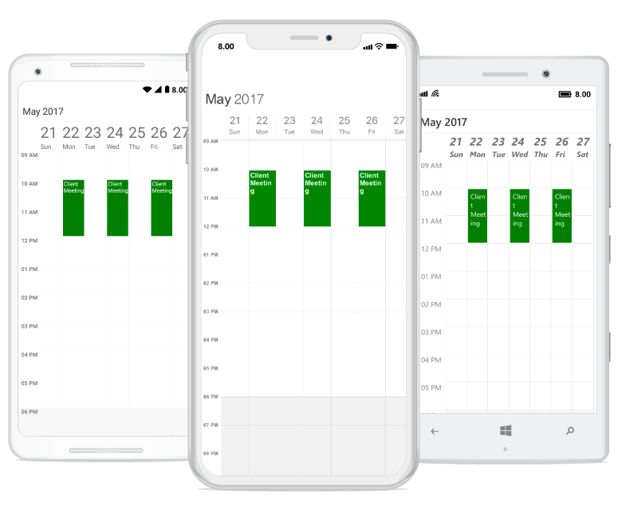

### Creating Custom Recurrence Appointment using Recurrence Builder
For creating custom recurrence appointment you need to create a custom class `Meeting` with mandatory fields `From`, `To`, `EventName` and `RecurrenceRule`.



/// 

/// Represents custom data properties.
/// 

public class Meeting
{
	public string EventName { get; set; }
	public DateTime From { get; set; }
	public DateTime To { get; set; }
	public Color Color { get; set; }
	public string RecurrenceRule { get; set; }
}



N> You can inherit this class from `INotifyPropertyChanged` for dynamic changes in custom data.

You can map those properties of `Meeting` class with our SfSchedule control by using `ScheduleAppointmentMapping`.



<syncfusion:SfSchedule x:Name="schedule" ScheduleView="DayView" DataSource="{Binding Meetings}">
	<syncfusion:SfSchedule.AppointmentMapping>
		<syncfusion:ScheduleAppointmentMapping
			SubjectMapping="EventName"
			ColorMapping="Color"
			StartTimeMapping="From"
			EndTimeMapping="To"
			RecurrenceRuleMapping="RecurrenceRule">
		</syncfusion:ScheduleAppointmentMapping>
	</syncfusion:SfSchedule.AppointmentMapping>
</syncfusion:SfSchedule>


// Schedule data mapping for custom appointments
ScheduleAppointmentMapping dataMapping = new ScheduleAppointmentMapping();
dataMapping.SubjectMapping = "EventName";
dataMapping.StartTimeMapping = "From";
dataMapping.EndTimeMapping = "To";
dataMapping.ColorMapping = "Color";
dataMapping.RecurrenceRuleMapping = "RecurrenceRule";
schedule.AppointmentMapping = dataMapping;



You can schedule recurring meetings for daily, weekly, monthly, or yearly interval by setting  `RecurrenceRule` of `Meeting` class. Create meetings of type `ObservableCollection <Meeting>` and assign those appointments collection `Meetings` to the `DataSource` property which is of `IEnumerable` type.



// Creating instance for custom appointment class
Meeting meeting = new Meeting();
// Setting start time of an event
meeting.From = new DateTime(2017, 06, 11, 10, 0, 0);
// Setting end time of an event
meeting.To = meeting.From.AddHours(2);
// Setting start time for an event
meeting.EventName = "Client Meeting";
// Setting color for an event
meeting.Color = Color.Green;

// Creating recurrence rule
RecurrenceProperties recurrenceProperties = new RecurrenceProperties();
recurrenceProperties.RecurrenceType = RecurrenceType.Weekly;
recurrenceProperties.RecurrenceRange = RecurrenceRange.Count;
recurrenceProperties.Interval = 1;
recurrenceProperties.WeekDays = WeekDays.Monday|WeekDays.Wednesday|WeekDays.Friday;
recurrenceProperties.RecurrenceCount = 10;
recurrenceProperties.RecurrenceRule = DependencyService.Get<IRecurrenceBuilder>().RRuleGenerator(recurrenceProperties, meeting.From, Meeting.To);

// Setting recursive rule for an event
meeting.RecurrenceRule = recurrenceProperties.RecurrenceRule;

// Creating instance for collection of custom appointments
var Meetings = new ObservableCollection<Meeting>();
// Adding a custom appointment in CustomAppointmentCollection
Meetings.Add(meeting);

// Adding custom appointments in DataSource of SfSchedule
schedule.DataSource = Meetings;



You can download the entire source code of this demo for Xamarin.Forms from
here [Recurrence_Appointment](http://www.syncfusion.com/downloads/support/directtrac/general/ze/Recurrence_Appointment-1708142299.zip).

>**NOTE**
In Schedule "Xamarin.Forms UWP", there is no need to set IsRecursive property for recurrence appointments. When a RecurrenceRule is set to schedule appointment, value of IsRecursive property will be set as true automatically for these appointments. So even if IsRecursive is set as false, there will be no effect on recurring appointments.

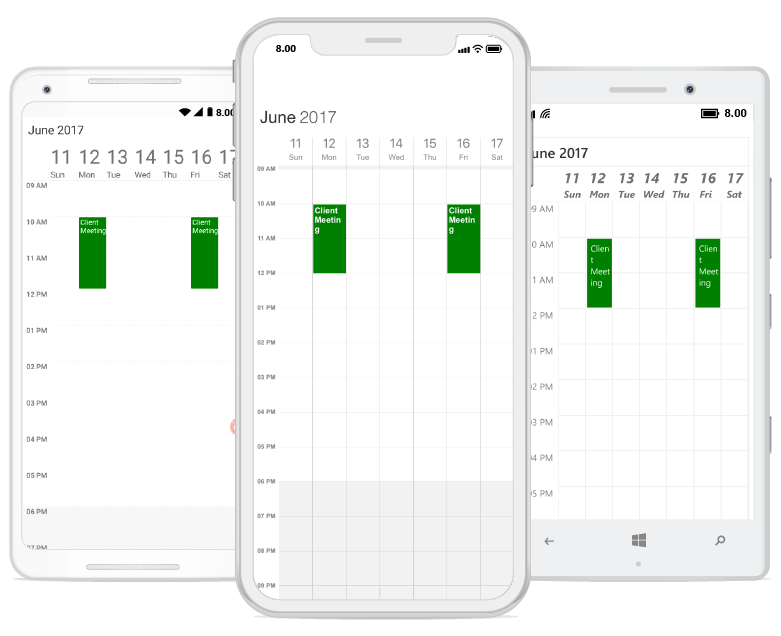

## Drag and Drop Appointments
Appointments can be rescheduled using the drag and drop operation. To perform drag-and-drop operations within the schedule, enable the [AllowAppointmentDrag](https://help.syncfusion.com/cr/cref_files/xamarin/Syncfusion.SfSchedule.XForms~Syncfusion.SfSchedule.XForms.AllowAppointmentDrag.html) property of `SfSchedule`.



<schedule:SfSchedule x:Name=“schedule” ScheduleView="WeekView" AllowAppointmentDrag="true">
</schedule:SfSchedule>


schedule.AllowAppointmentDrag = true;



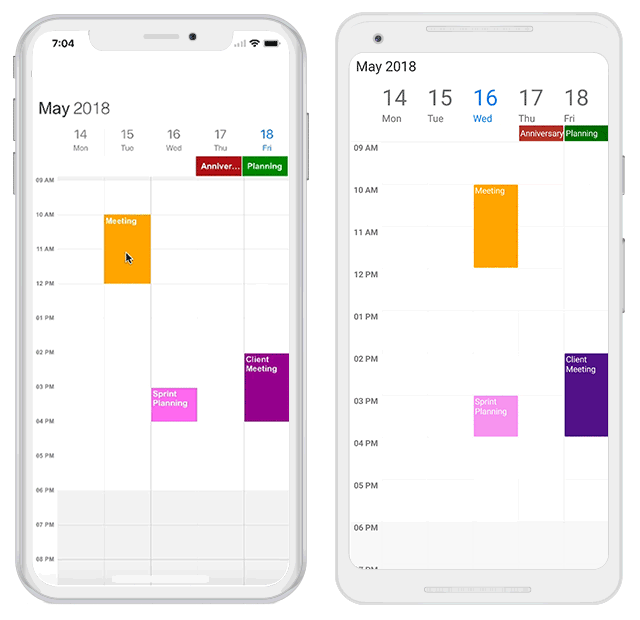

### Handle dragging based on the appointment
Using [AppointmentDragStarting](https://help.syncfusion.com/cr/cref_files/xamarin/Syncfusion.SfSchedule.XForms~Syncfusion.SfSchedule.XForms.SfSchedule~AppointmentDragStarting_EV.html) event, you can get the appointment details and handle whether the appointment can be draggable or not. This event will be triggered when the appointment is started dragging. The [AppointmentDragStartingEventArgs](https://help.syncfusion.com/cr/cref_files/xamarin/Syncfusion.SfSchedule.XForms~Syncfusion.SfSchedule.XForms.AppointmentDragStartingEventArgs.html) argument contains the following properties.

[Appointment](https://help.syncfusion.com/cr/cref_files/xamarin/Syncfusion.SfSchedule.XForms~Syncfusion.SfSchedule.XForms.AppointmentDragStartingEventArgs~Appointment.html) - Gets the dragged appointment details.
[Cancel](https://help.syncfusion.com/cr/cref_files/xamarin/Syncfusion.SfSchedule.XForms~Syncfusion.SfSchedule.XForms.AppointmentDragStartingEventArgs~Cancel.html)- Appointment dragging can be handled (enable/disable) using this boolean property.



schedule.AppointmentDragStarting += Schedule_AppointmentDragStarting;

...

private void Schedule_AppointmentDragStarting(object sender, AppointmentDragStartingEventArgs e)
{
        var appointment = e.Appointment;
        e.Cancel = false;
}



#### Disabling dragging when the appointment is AllDay appointment
Using `Cancel` property in the `AppointmentDragStartingEventArgs` argument of Schedule `AppointmentDragStarting` event, you can enable/disable the appointment dragging based on the requirement. In the below, we have disabled the appointment dragging when the appointment is AllDay appointment.



schedule.AppointmentDragStarting += Schedule_AppointmentDragStarting;

...

private void Schedule_AppointmentDragStarting(object sender, AppointmentDragStartingEventArgs e)
{
        var appointment = e.Appointment as ScheduleAppointment;

      if (appointment.IsAllDay)
      {
            e.Cancel = true;
      }
}



### Get the dragging appointment position
Using [AppointmentDragOver](https://help.syncfusion.com/cr/cref_files/xamarin/Syncfusion.SfSchedule.XForms~Syncfusion.SfSchedule.XForms.SfSchedule~AppointmentDragOver_EV.html) event, you can get the dragging appointment details, position and time of the particular location. The event will be continuously triggered when the appointment is being dragged. The [AppointmentDragEventArgs](https://help.syncfusion.com/cr/cref_files/xamarin/Syncfusion.SfSchedule.XForms~Syncfusion.SfSchedule.XForms.AppointmentDragEventArgs.html) argument contains the following properties.

[Appointment](https://help.syncfusion.com/cr/cref_files/xamarin/Syncfusion.SfSchedule.XForms~Syncfusion.SfSchedule.XForms.AppointmentDragEventArgs~Appointment.html) - Gets the details of the appointment to be dropped.
[DraggingPoint](https://help.syncfusion.com/cr/cref_files/xamarin/Syncfusion.SfSchedule.XForms~Syncfusion.SfSchedule.XForms.AppointmentDragEventArgs~DraggingPoint.html)- Gets the dragging point (X, Y) of the appointment in Schedule.
[DraggingTime](https://help.syncfusion.com/cr/cref_files/xamarin/Syncfusion.SfSchedule.XForms~Syncfusion.SfSchedule.XForms.AppointmentDragEventArgs~DraggingTime.html)- Gets the dragging time of the appointment in Schedule



schedule.AppointmentDragOver += Schedule_AppointmentDragOver;

...

private void Schedule_AppointmentDragOver(object sender, AppointmentDragEventArgs e)
{
        var appointment = e.Appointment;
        var draggingPoint = e.DraggingPoint;
        var draggingTime = e.DraggingTime;
}



#### Displaying alert while dragging appointment over the blocked time slots
Using `draggingPoint` and `draggingTime` properties in the `AppointmentDragEventArgs` of Schedule `AppointmentDragOver` event you can get the current position and time of dragging appointment. In the below, we have indicated the message while dragging over the Schedule `NonAccessibleBlock`.



schedule.AppointmentDragOver += Schedule_AppointmentDragOver;

...

private void Schedule_AppointmentDragOver(object sender, AppointmentDragEventArgs e)
{
        //// checking whether dragging appointment time within NonAccessibleBlock
        if (schedule.WorkWeekViewSettings.NonAccessibleBlocks[0].StartTime == e.DraggingTime.Hour ||
        (schedule.WorkWeekViewSettings.NonAccessibleBlocks[0].StartTime - 1 == e.DraggingTime.Hour && e.DraggingTime.Minute > 0))
        {
                label.Text = "Cannot be moved to blocked time slots";
        }
}



### Handle appointment dropping
Using [AppointmentDrop](https://help.syncfusion.com/cr/cref_files/xamarin/Syncfusion.SfSchedule.XForms~Syncfusion.SfSchedule.XForms.SfSchedule~AppointmentDrop_EV.html) event you can get the dropping appointment details, position, time and you can handle whether the appointment can be dropped to the specific position or not. This event will trigger after dropping the appointment. The [AppointmentDropEventArgs](https://help.syncfusion.com/cr/cref_files/xamarin/Syncfusion.SfSchedule.XForms~Syncfusion.SfSchedule.XForms.AppointmentDropEventArgs.html) argument contains the following properties.

[Appointment](https://help.syncfusion.com/cr/cref_files/xamarin/Syncfusion.SfSchedule.XForms~Syncfusion.SfSchedule.XForms.AppointmentDropEventArgs~Appointment.html) - Gets the details of the appointment to be dropped.
[Cancel](https://help.syncfusion.com/cr/cref_files/xamarin/Syncfusion.SfSchedule.XForms~Syncfusion.SfSchedule.XForms.AppointmentDropEventArgs~Cancel.html)- Appointment dropping can be handled (enable / disable) using this Boolean property.
[DropTime](https://help.syncfusion.com/cr/cref_files/xamarin/Syncfusion.SfSchedule.XForms~Syncfusion.SfSchedule.XForms.AppointmentDropEventArgs~DropTime.html)- Gets the dropped time of the appointment in Schedule



schedule.AppointmentDrop += Schedule_AppointmentDrop;

...

private void Schedule_AppointmentDrop(object sender, AppointmentDropEventArgs e)
{
        var appointment = e.Appointment;
        e.Cancel = false;
        var dropTime = e.DropTime;
}



#### Disabling dropping when dropping appointment within the Non-Accessible region
Using `Cancel` property in the `AppointmentDropEventArgs` argument of Schedule `AppointmentDrop` event, you can enable/disable the appointment dropping based on the requirement. In the below, we have disabled the appointment dropping while dropping in the Non-Accessible block region.



schedule.AppointmentDrop += Schedule_AppointmentDrop;

...

private void Schedule_AppointmentDrop(object sender, AppointmentDropEventArgs e)
{
//// checking whether dropping appointment time within NonAccessibleBlock
if (schedule.WorkWeekViewSettings.NonAccessibleBlocks[0].StartTime == e.DropTime.Hour ||
(schedule.WorkWeekViewSettings.NonAccessibleBlocks[0].StartTime - 1 == e.DropTime.Hour && e.DropTime.Minute > 0))
{
        e.Cancel = true;
}
}



### Customizing the Drag and Drop environment
Using [DragDropSettings](http://help.syncfusion.com/cr/cref_files/xamarin/Syncfusion.SfSchedule.XForms~Syncfusion.SfSchedule.XForms.SfSchedule~DragDropSettings.html) property of schedule, you can handle the behavior of drag and drop in Schedule.



DragDropSettings dragDropSettings = new DragDropSettings();
dragDropSettings.AllowNavigate = true;
dragDropSettings.AllowScroll = true;
var timeSpan = new TimeSpan(0, 0, 0, 1, 0);
dragDropSettings.AutoNavigationDelay = timeSpan;
dragDropSettings.ShowTimeIndicator = true;
dragDropSettings.TimeIndicatorStyle = timeIndicatorStyle;
schedule.DragDropSettings = dragDropSettings;



#### Disabling navigation when dragging appointment
Using [AllowNavigate](https://help.syncfusion.com/cr/cref_files/xamarin/Syncfusion.SfSchedule.XForms~Syncfusion.SfSchedule.XForms.DragDropSettings~AllowNavigate.html) boolean property can handle the Appointment dragging, whether navigate to next/previous view or not while dragging the appointment to the endpoint of the current view in Schedule. Default value of the `AllowNavigate` property is true and  Schedule will navigate to next/previous view when dragging the appointment the endpoint of the current view.



dragDropSettings.AllowNavigate = false;



#### Handling navigation delay while holding dragged appointment
Using [AutoNavigationDelay](https://help.syncfusion.com/cr/cref_files/xamarin/Syncfusion.SfSchedule.XForms~Syncfusion.SfSchedule.XForms.DragDropSettings~AutoNavigationDelay.html)  `TimeSpan` property can handle the navigation time when navigating to next/previous view while holding the dragged appointment.



var timeSpan = new TimeSpan(0, 0, 0, 1, 0);
dragDropSettings.AutoNavigationDelay = timeSpan;



#### Disabling scroll when dragging appointment
Using [AllowScroll](https://help.syncfusion.com/cr/cref_files/xamarin/Syncfusion.SfSchedule.XForms~Syncfusion.SfSchedule.XForms.DragDropSettings~AllowScroll.html) boolean property can handle the Appointment dragging, whether scroll (below/above) the Schedule or not while dragging the appointment to the endpoint of the current view in Schedule. Default value of the `AllowScroll` property is true.



dragDropSettings.AllowScroll = false;



#### Disabling dragging time indicator
[ShowTimeIndicator](https://help.syncfusion.com/cr/cref_files/xamarin/Syncfusion.SfSchedule.XForms~Syncfusion.SfSchedule.XForms.DragDropSettings~ShowTimeIndicator.html) - Using this boolean property can handle the time indicator whether it should visible or not, which shows the dragged appointment current position time in time text slots. Default value of the `ShowTimeIndicator` property is true.



dragDropSettings.ShowTimeIndicator = false;



### Customize appearance of dragging Time Indicator
Using [TimeIndicatorStyle](https://help.syncfusion.com/cr/cref_files/xamarin/Syncfusion.SfSchedule.XForms~Syncfusion.SfSchedule.XForms.DragDropSettings~TimeIndicatorStyle.html) property can handle the time indicator style which contains [TextColor](https://help.syncfusion.com/cr/cref_files/xamarin/Syncfusion.SfSchedule.XForms~Syncfusion.SfSchedule.XForms.TimeIndicatorStyle~TextColor.html), [TextSize](https://help.syncfusion.com/cr/cref_files/xamarin/Syncfusion.SfSchedule.XForms~Syncfusion.SfSchedule.XForms.TimeIndicatorStyle~TextSize.html) and [TextFormat](https://help.syncfusion.com/cr/cref_files/xamarin/Syncfusion.SfSchedule.XForms~Syncfusion.SfSchedule.XForms.TimeIndicatorStyle~TextFormat.html).



TimeIndicatorStyle timeIndicatorStyle = new TimeIndicatorStyle();
timeIndicatorStyle.TextColor = Color.Red;
timeIndicatorStyle.TextSize = 15;
timeIndicatorStyle.TextFormat = "hh : mm";
dragDropSettings.TimeIndicatorStyle = timeIndicatorStyle;



>**Notes**
* While dropping appointment to `AllDay` panel from time slots, appointment start and end time will change to 12.00 AM.
* While dropping appointment to time slots from `AllDay` panel, appointment duration will change as one (1) hour from the dropped time.
* Doesn't support control to control drag and drop.

## Appearance Customization
The default appearance of the appointment can be customized by using the [AppointmentStyle](https://help.syncfusion.com/cr/cref_files/xamarin/Syncfusion.SfSchedule.XForms~Syncfusion.SfSchedule.XForms.AppointmentStyle.html) property and [AppointmentLoadedEvent](https://help.syncfusion.com/cr/cref_files/xamarin/Syncfusion.SfSchedule.XForms~Syncfusion.SfSchedule.XForms.AppointmentLoadedEventArgs.html). The event and property is used to customize or override the default template of the Appointments.

* [Customize appearance using Style](https://help.syncfusion.com/xamarin/sfschedule/data-bindings#customize-appearance-using-style) 
* [Customize appearance using Event](https://help.syncfusion.com/xamarin/sfschedule/data-bindings#customize-appearance-using-event) 
* [Customize appearance using Custom View](https://help.syncfusion.com/xamarin/sfschedule/data-bindings#customize-appearance-using-custom-view)
* [Customize appearance using DataTemplate](https://help.syncfusion.com/xamarin/sfschedule/data-bindings#customize-appearance-using-datatemplate)
* [Customize appearance using DataTemplateSelector](https://help.syncfusion.com/xamarin/sfschedule/data-bindings#customize-appearance-using-datatemplateselector)

### Customize appearance using Style
Schedule appointment can be customized by setting appointment style properties such as [TextColor](https://help.syncfusion.com/cr/cref_files/xamarin/Syncfusion.SfSchedule.XForms~Syncfusion.SfSchedule.XForms.AppointmentStyle~TextColor.html), [FontFamily](https://help.syncfusion.com/cr/cref_files/xamarin/Syncfusion.SfSchedule.XForms~Syncfusion.SfSchedule.XForms.AppointmentStyle~FontFamily.html), [FontSize](https://help.syncfusion.com/cr/cref_files/xamarin/Syncfusion.SfSchedule.XForms~Syncfusion.SfSchedule.XForms.AppointmentStyle~FontSize.html), [FontAttributes](https://help.syncfusion.com/cr/cref_files/xamarin/Syncfusion.SfSchedule.XForms~Syncfusion.SfSchedule.XForms.AppointmentStyle~FontAttributes.html), [BorderColor](https://help.syncfusion.com/cr/cref_files/xamarin/Syncfusion.SfSchedule.XForms~Syncfusion.SfSchedule.XForms.AppointmentStyle~BorderColor.html), [BorderCornerRadius](https://help.syncfusion.com/cr/cref_files/xamarin/Syncfusion.SfSchedule.XForms~Syncfusion.SfSchedule.XForms.AppointmentStyle~BorderCornerRadius.html), [BorderWidth](https://help.syncfusion.com/cr/cref_files/xamarin/Syncfusion.SfSchedule.XForms~Syncfusion.SfSchedule.XForms.AppointmentStyle~BorderWidth.html) to the [AppointmentStyle](https://help.syncfusion.com/cr/cref_files/xamarin/Syncfusion.SfSchedule.XForms~Syncfusion.SfSchedule.XForms.AppointmentStyle.html) property of `SfSchedule`.



<syncfusion:SfSchedule x:Name="schedule" ScheduleView="DayView" DataSource="{Binding Meetings}">
    <syncfusion:SfSchedule.AppointmentStyle>
         <syncfusion:AppointmentStyle
                       BorderWidth="10"
                       TextColor="Red"
                       BorderCornerRadius="10"
                       FontSize = "25"
                       FontAttributes = "Bold"
                       FontFamily = "Arial"
                       BorderColor="Blue">
    </syncfusion:AppointmentStyle>
</syncfusion:SfSchedule.AppointmentStyle>
</syncfusion:SfSchedule>


//Creating Appointment style
AppointmentStyle appointmentStyle = new AppointmentStyle();
appointmentStyle.TextColor = Color.Red;
appointmentStyle.FontSize = 25;
appointmentStyle.FontAttributes = FontAttributes.Bold;
appointmentStyle.FontFamily = "Arial";
appointmentStyle.BorderColor = Color.Blue;
appointmentStyle.BorderCornerRadius = 12;
appointmentStyle.BorderWidth = 10;

//Setting Appointment Style
schedule.AppointmentStyle = appointmentStyle;

 

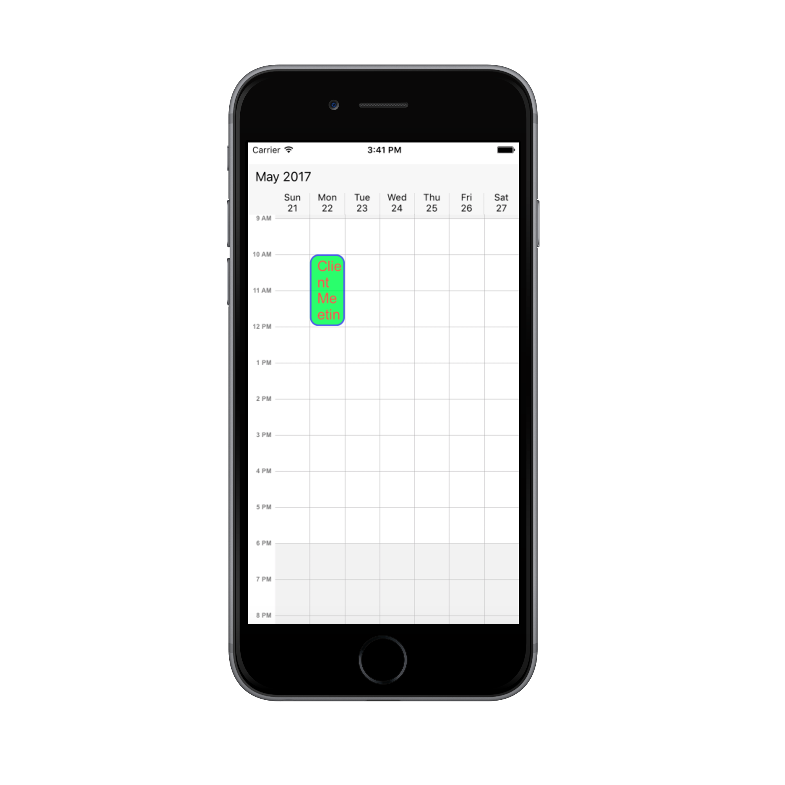

### Customize appearance using Event
Schedule appointment can be customized during runtime using [OnAppointmentLoadedEvent](https://help.syncfusion.com/cr/cref_files/xamarin/Syncfusion.SfSchedule.XForms~Syncfusion.SfSchedule.XForms.SfSchedule~OnAppointmentLoadedEvent_EV.html). `ScheduleAppointment` style can be customized using the `appointmentStyle` property.

[AppointmentLoadedEventArgs](https://help.syncfusion.com/cr/cref_files/xamarin/Syncfusion.SfSchedule.XForms~Syncfusion.SfSchedule.XForms.AppointmentLoadedEventArgs.html) has below properties,

•	[appointment](https://help.syncfusion.com/cr/cref_files/xamarin/Syncfusion.SfSchedule.XForms~Syncfusion.SfSchedule.XForms.AppointmentLoadedEventArgs~appointment.html) – Contains the appointments values.
•	[appointmentStyle](https://help.syncfusion.com/cr/cref_files/xamarin/Syncfusion.SfSchedule.XForms~Syncfusion.SfSchedule.XForms.AppointmentLoadedEventArgs~appointmentStyle.html) – Gets and sets the appointments style.
•	[view](https://help.syncfusion.com/cr/cref_files/xamarin/Syncfusion.SfSchedule.XForms~Syncfusion.SfSchedule.XForms.AppointmentLoadedEventArgs~view.html) -  Sets the Custom UI for Appointments.
•	[Bounds](https://help.syncfusion.com/cr/cref_files/xamarin/Syncfusion.SfSchedule.XForms~Syncfusion.SfSchedule.XForms.AppointmentLoadedEventArgs~Bounds.html) – Contains the UI bounds of appointment.



schedule.OnAppointmentLoadedEvent += Schedule_OnAppointmentLoadedEvent;

...

private void Schedule_OnAppointmentLoadedEvent(object sender, AppointmentLoadedEventArgs args)
{
	if (args.appointment != null && (args.appointment as Meeting) != null && (args.appointment as Meeting).IsAllDay)
	{
		args.appointmentStyle.BorderColor = Color.Red;
		args.appointmentStyle.TextColor  = Color.White
		args.appointmentStyle.BorderCornerRadius = 12;
		args.appointmentStyle.BorderWidth = 10;
	}
	else 
	{
		args.appointmentStyle.BorderColor = Color.Blue;
		args.appointmentStyle.TextColor = Color.Red;
		args.appointmentStyle.BorderCornerRadius = 12;
		args.appointmentStyle.BorderWidth = 10;
	}
}



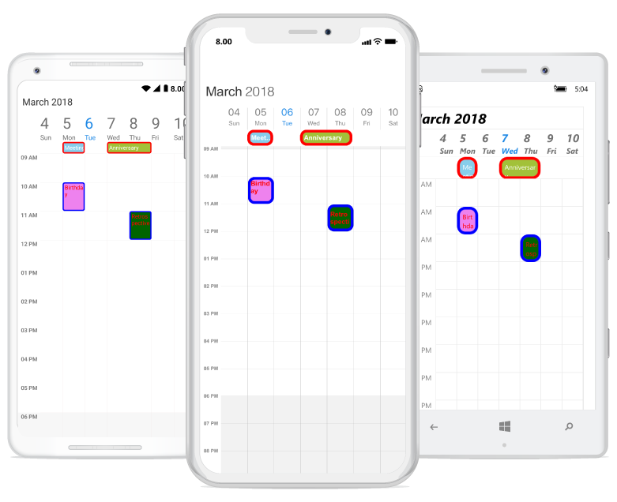

>**NOTE**
FontAttributes and FontFamily are native to the platform. Custom font and the font which are not available in the specified platform will not be applied.

## Customize appearance using Custom View
Default appointment UI can be changed using `view` property passed through `AppointmentLoadedEventArgs`.


 
schedule.OnAppointmentLoadedEvent += Schedule_OnAppointmentLoadedEvent;

private void Schedule_OnAppointmentLoadedEvent(object sender, AppointmentLoadedEventArgs args)
{
	if(args.appointment == null  || (args.appointment as Meeting) == null)
		return;
	if ((args.appointment as Meeting).IsAllDay)
	{
		Label label = new Label();
		label.BackgroundColor = (args.appointment as Meeting).Color;
		label.Text = (args.appointment as Meeting).EventName;
		args.view = label;
	}
	else if ((args.appointment as Meeting).EventName == "Retrospective" )
	{
		Button button = new Button();
		button.Image = "Meeting.png";
		button.BackgroundColor = (args.appointment as Meeting).EventName;
		args.view = button;
	}
	else 
	{
		Button button = new Button();
		button.Image = "Cake.png";
		button.BackgroundColor = (args.appointment as Meeting).EventName;
		args.view = button;
	}
}



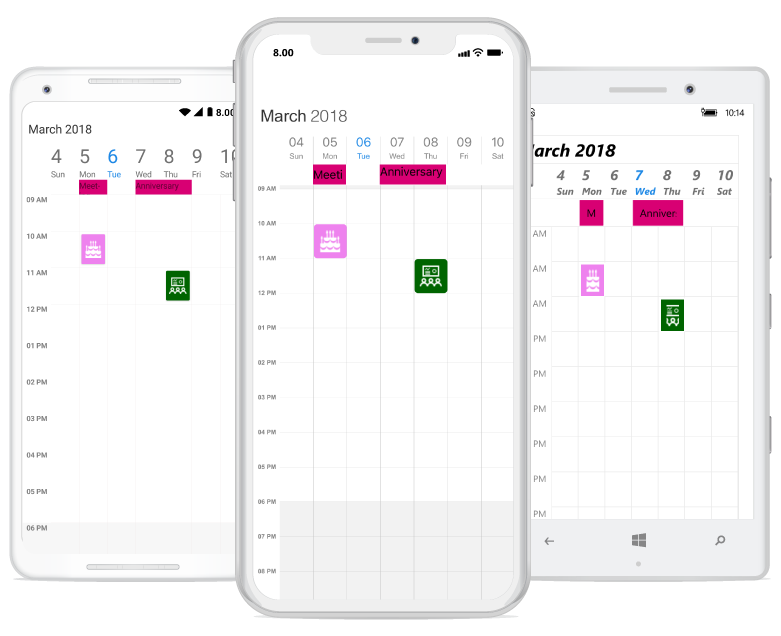

## Customize appearance using DataTemplate
The default appearance of the Appointment can be customized by using the [AppointmentTemplate](https://help.syncfusion.com/cr/cref_files/xamarin/Syncfusion.SfSchedule.XForms~Syncfusion.SfSchedule.XForms.SfSchedule~AppointmentTemplate.html) property of the Schedule.



<schedule:SfSchedule
        x:Name="schedule"
        AppointmentTemplate="{Binding AppointmentTemplate}">
        <schedule:SfSchedule.BindingContext>
            <samplelocal:DayAppointmentDataTemplate />
        </schedule:SfSchedule.BindingContext>
</schedule:SfSchedule>



### Creating a DataTemplate



public class DayAppointmentDataTemplate : DataTemplate
{
    public DataTemplate AppointmentTemplate { get; set; }

    public DayAppointmentDataTemplate()
    {
        AppointmentTemplate = new DataTemplate(() =>
        {
            return new Button
            {
                Text = "Template",
                TextColor = Color.White,
                BackgroundColor = Color.LightGreen
            };
        });
    }
}



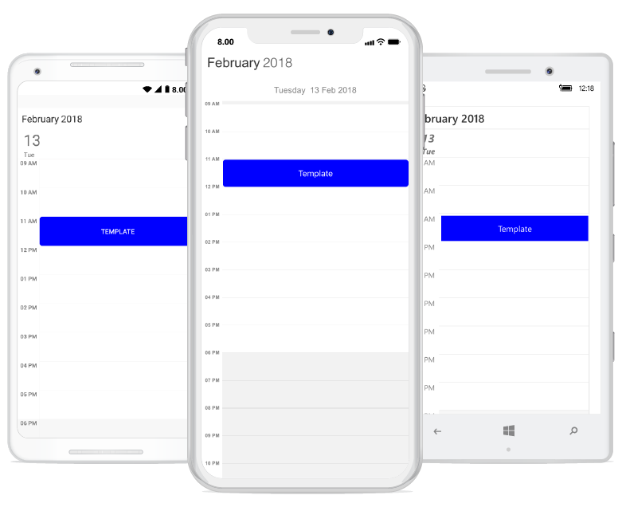

## Customize appearance using DataTemplateSelector
`DataTemplateSelector` can be used to choose a `DataTemplate` at runtime based on the value of a data-bound to Schedule appointment property through `AppointmentTemplate`. It provides multiple DataTemplates to be enabled for Schedule appointments, to customize the appearance of particular Appointment.



<ContentPage.Resources>
    <ResourceDictionary>
        <samplelocal:AppointmentDataTemplateSelector x:Key="appointmentDataTemplateSelector" />
    </ResourceDictionary>
</ContentPage.Resources>

<ContentPage.Content>
    <schedule:SfSchedule
            AppointmentTemplate="{StaticResource appointmentDataTemplateSelector}">
            <schedule:SfSchedule.BindingContext>
                <samplelocal:AppointmentDataTemplateSelector />
            </schedule:SfSchedule.BindingContext>
    </schedule:SfSchedule>
</ContentPage.Content>




### Creating a DataTemplateSelector




public class AppointmentDataTemplateSelector : DataTemplateSelector
{
    public DataTemplate DayAppointmentTemplate { get; set; }
    public DataTemplate AllDayAppointmentTemplate { get; set; }

    public AppointmentDataTemplateSelector()
    {
        DayAppointmentTemplate = new DataTemplate(typeof(DayAppointmentTemplate));
        AllDayAppointmentTemplate = new DataTemplate(typeof(AllDayAppointmentTemplate));
    }

    protected override DataTemplate OnSelectTemplate(object item, BindableObject container)
    {
        if ((item as ScheduleAppointment).IsAllDay)
            return AllDayAppointmentTemplate;
        else
            return DayAppointmentTemplate;
    }
}




Used button to display day appointment and Label to display all day appointment.




<?xml version="1.0" encoding="UTF-8"?>
<!--<Button as Template for day Appointment>-->
<Button xmlns="http://xamarin.com/schemas/2014/forms"
        xmlns:x="http://schemas.microsoft.com/winfx/2009/xaml"
        x:Class="ScheduleUG.DayAppointmentTemplate"
        BackgroundColor="{Binding Color}"
        HorizontalOptions="FillAndExpand"
        VerticalOptions="FillAndExpand"
        Text="{Binding Subject}"
        TextColor="White"
        Image="{Binding Subject}">
</Button>

    .......

<?xml version="1.0" encoding="UTF-8"?>
<!--<Label as Template for all day Appointment>-->
<Label xmlns="http://xamarin.com/schemas/2014/forms"
        xmlns:x="http://schemas.microsoft.com/winfx/2009/xaml"
        x:Class="ScheduleUG.AllDayAppointmentTemplate"
        BackgroundColor="{Binding Color}"
        Text="{Binding Subject}"
        HorizontalOptions="FillAndExpand"
        VerticalOptions="CenterAndExpand"
        TextColor="White" FontSize="15"
        HorizontalTextAlignment="Center"
        VerticalTextAlignment="Center">
</Label>




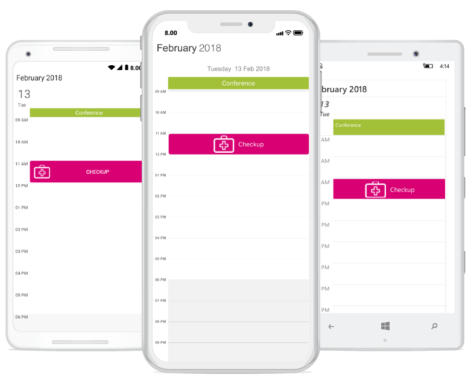

### Customize Font Appearance

you can change the appearance of Font by setting the  [FontFamily](https://help.syncfusion.com/cr/cref_files/xamarin/Syncfusion.SfSchedule.XForms~Syncfusion.SfSchedule.XForms.AppointmentStyle~FontFamily.html) property of [AppointmentStyle](https://help.syncfusion.com/cr/cref_files/xamarin/Syncfusion.SfSchedule.XForms~Syncfusion.SfSchedule.XForms.AppointmentStyle.html) property in Schedule.



<schedule:AppointmentStyle.FontFamily>
	 <OnPlatform x:TypeArguments="x:String" iOS="Lobster-Regular" Android="Lobster-Regular.ttf" WinPhone="Assets/Lobster-Regular.ttf#Lobster" />
</schedule:AppointmentStyle.FontFamily>


appointmentStyle.FontFamily = Device.OnPlatform("Lobster-Regular", "Lobster-Regular.ttf", "Assets/Lobster-Regular.ttf#Lobster");

 

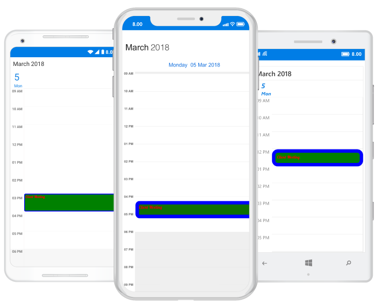

Refer [this](https://help.syncfusion.com/xamarin/sfschedule/monthview#custom-font-setting-in-xamarinforms-android) to configure the custom fonts in Xamarin.Forms.

## Selection
Schedule control has built-in events to handle tapped, double tapped and long pressed touch actions.

•	[CellTapped](https://help.syncfusion.com/cr/cref_files/xamarin/Syncfusion.SfSchedule.XForms~Syncfusion.SfSchedule.XForms.SfSchedule~CellTapped_EV.html)
•	[CellDoubleTapped](https://help.syncfusion.com/cr/cref_files/xamarin/Syncfusion.SfSchedule.XForms~Syncfusion.SfSchedule.XForms.SfSchedule~CellDoubleTapped_EV.html)
•	[CellLongPressed](https://help.syncfusion.com/cr/cref_files/xamarin/Syncfusion.SfSchedule.XForms~Syncfusion.SfSchedule.XForms.SfSchedule~CellLongPressed_EV.html)

These events will be triggered while perform respective touch actions in timeslots, month cells and in appointments. All the three events contain the same argument [CellTappedEventArgs](https://help.syncfusion.com/cr/cref_files/xamarin/Syncfusion.SfSchedule.XForms~Syncfusion.SfSchedule.XForms.CellTappedEventArgs.html) which holds selected appointment and date time details in it.

• [Appointment](https://help.syncfusion.com/cr/cref_files/xamarin/Syncfusion.SfSchedule.XForms~Syncfusion.SfSchedule.XForms.CellTappedEventArgs~Appointment.html) - Contains the selected appointment value when tapped on the appointment. It will be null when tapped on the timeslot. Selected occurrence of a recurring appointment's value will be same as the master appointment, except the date values. So selected occurrence's date can be obtained from the args.DateTime value.
• [Appointments](https://help.syncfusion.com/cr/cref_files/xamarin/Syncfusion.SfSchedule.XForms~Syncfusion.SfSchedule.XForms.CellTappedEventArgs~Appointments.html) - Contains appointments value of Tapped month cell.
• [DateTime](https://help.syncfusion.com/cr/cref_files/xamarin/Syncfusion.SfSchedule.XForms~Syncfusion.SfSchedule.XForms.CellTappedEventArgs~Datetime.html) - Contains selected time slot DateTime value.

>N Occurrences can be handled from tapped event when single occurrence remains unmodified.



schedule.CellTapped += Schedule_CellTapped;
schedule.CellDoubleTapped += Schedule_CellDoubleTapped;
schedule.CellLongPressed += Schedule_CellLongPressed;

...

private void Schedule_CellTapped(object sender, CellTappedEventArgs e)
{
}
private void Schedule_CellDoubleTapped(object sender, CellTappedEventArgs e)
{
}
private void Schedule_CellLongPressed(object sender, CellTappedEventArgs e)
{
}



### Commands
Schedule commands allow data bindings to make method calls directly to a ViewModel, which supports tapped, double tapped, long pressed touch actions and visible date changed action.

•    [CellTappedCommand](https://help.syncfusion.com/cr/cref_files/xamarin/Syncfusion.SfSchedule.XForms~Syncfusion.SfSchedule.XForms.SfSchedule~CellTappedCommand.html)
•    [CellDoubleTappedCommand](https://help.syncfusion.com/cr/cref_files/xamarin/Syncfusion.SfSchedule.XForms~Syncfusion.SfSchedule.XForms.SfSchedule~CellDoubleTappedCommand.html)
•    [CellLongPressedCommand](https://help.syncfusion.com/cr/cref_files/xamarin/Syncfusion.SfSchedule.XForms~Syncfusion.SfSchedule.XForms.SfSchedule~CellLongPressedCommand.html)
•    [VisibleDatesChangedCommand](https://help.syncfusion.com/cr/cref_files/xamarin/Syncfusion.SfSchedule.XForms~Syncfusion.SfSchedule.XForms.SfSchedule~VisibleDatesChangedCommand.html)



<schedule:SfSchedule
	CellTappedCommand="{Binding ScheduleCellTapped}"
	CellDoubleTappedCommand="{Binding ScheduleCellDoubleTapped}"
	CellLongPressedCommand="{Binding ScheduleCellLongPressed}"
	VisibleDatesChangedCommand="{Binding ScheduleVisibleDatesChanged}">
	<schedule:SfSchedule.BindingContext>
		<samplelocal:ScheduleViewModel />
	</schedule:SfSchedule.BindingContext>
</schedule:SfSchedule>






public class ScheduleViewModel
{
	public ICommand ScheduleCellTapped { get; set; }
	public ICommand ScheduleCellDoubleTapped { get; set; }
	public ICommand ScheduleCellLongPressed { get; set; }
	public ICommand ScheduleVisibleDatesChanged { get; set; }

	public ScheduleViewModel()
	{
		ScheduleCellTapped = new Command<CellTappedEventArgs>(CellTapped);
		ScheduleCellDoubleTapped = new Command<CellTappedEventArgs>(DoubleTapped);
		ScheduleCellLongPressed = new Command<CellTappedEventArgs>(LongPressed);
		ScheduleVisibleDatesChanged = new Command<VisibleDatesChangedEventArgs>(VisibleDatesChanged);
	}

	private void CellTapped(CellTappedEventArgs args)
	{
		var selectedDateTime = args.Datetime;
	}

	private void DoubleTapped(CellTappedEventArgs args)
	{
		var selectedDateTime = args.Datetime;
	}

	private void LongPressed(CellTappedEventArgs args)
	{
		var selectedDateTime = args.Datetime;
	}

	private void VisibleDatesChanged(VisibleDatesChangedEventArgs args)
	{
		var visibleDates = args.visibleDates;
	}
}




### Selection customization
The default selection of an appointment can be customized by using [SelectionBorderColor](https://help.syncfusion.com/cr/cref_files/xamarin/Syncfusion.SfSchedule.XForms~Syncfusion.SfSchedule.XForms.AppointmentStyle~SelectionBorderColor.html), [SelectionTextColor](https://help.syncfusion.com/cr/cref_files/xamarin/Syncfusion.SfSchedule.XForms~Syncfusion.SfSchedule.XForms.AppointmentStyle~SelectionTextColor.html) properties in `AppointmentStyle` property of `SfSchedule`. The property is used to customize or override the default selection of the appointments.

N> `BorderWidth` value must be set to highlight `SelectionBorderColor`.


 
<syncfusion:SfSchedule x:Name="schedule" ScheduleView="DayView" DataSource="{Binding Meetings}">
	<syncfusion:SfSchedule.AppointmentStyle>
		<syncfusion:AppointmentStyle 
			SelectionTextColor="Yellow" 
			SelectionBorderColor="Yellow">
		</syncfusion:AppointmentStyle>
	</syncfusion:SfSchedule.AppointmentStyle>    
</syncfusion:SfSchedule> 


//Creating an appointment style
AppointmentStyle appointmentStyle = new AppointmentStyle();
appointmentStyle.SelectionBorderColor = Color.Yellow;
appointmentStyle.SelectionTextColor = Color.Yellow;

//Setting an appointment style
schedule.AppointmentStyle = appointmentStyle;

 

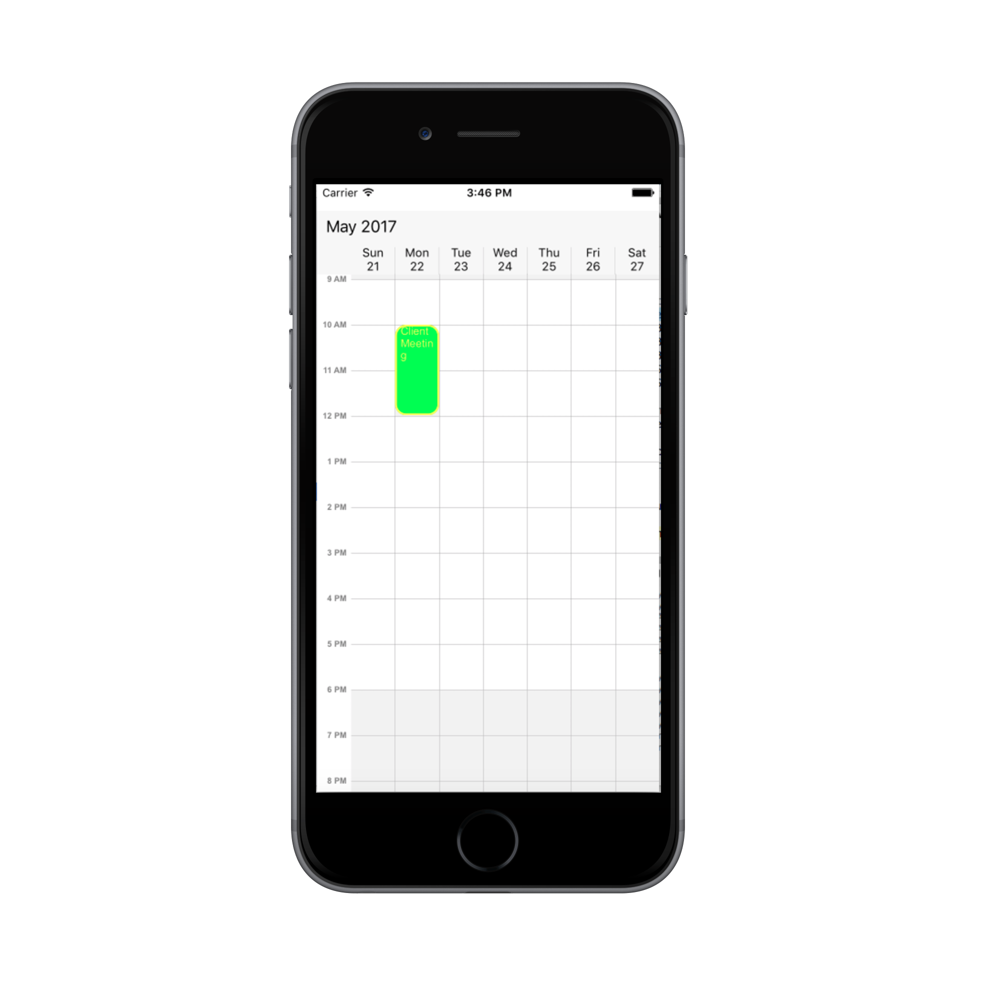

## TimeZone

Schedule allows you to create appointments in various time zones and display them in the user's time zone or any other time zone. Appointments are rendered by recalculating Start and End time based on given time zone.

Consider the following scenario you are in North Carolina and you want to set up a meeting at 10 AM on North Carolina time. You have colleagues in London and Chennai and they also need to participate. The time for this meeting will be 3 PM (15:00) in London and 5.30 AM in Chennai. When you each view your calendar, you need to see the appointment displayed relative to your local time zone 5.30 am, 10 am, 3 pm respectively and it can be achieved by setting schedule time zone to default and Appointments time zone to `Eastern Standard Time (North Carolina)` [as you are in North Carolina and its time zone is Eastern Standard Time)

You can set specific time zone to schedule by using [TimeZone](https://help.syncfusion.com/cr/cref_files/xamarin/sfschedule/Syncfusion.SfSchedule.XForms~Syncfusion.SfSchedule.XForms.TimeZone.html) Property of schedule. 


<syncfusion:SfSchedule x:Name="schedule"  TimeZone="GMT Standard Time"></schedule:SfSchedule>


schedule.TimeZone = "GMT Standard Time";



### Creating Appointment's in different TimeZone
You can create appointments at different time zone using [StartTimeZone](https://help.syncfusion.com/cr/cref_files/xamarin/sfschedule/Syncfusion.SfSchedule.XForms~Syncfusion.SfSchedule.XForms.ScheduleAppointment~StartTimeZone.html) and [EndTimeZone](https://help.syncfusion.com/cr/cref_files/xamarin/sfschedule/Syncfusion.SfSchedule.XForms~Syncfusion.SfSchedule.XForms.ScheduleAppointment~EndTimeZone.html) property of the `Appointment`. The appointment's start time and end time calculated based on the given time zone information for start time and end time. You can set different time zones for `StartTimeZone` and `EndTimeZone` property.
You can use `StartTime` and `EndTime` property to get the exact Start Time and End Time of the appointment. By using [ActualStartTime](https://help.syncfusion.com/cr/cref_files/xamarin/sfschedule/Syncfusion.SfSchedule.XForms~Syncfusion.SfSchedule.XForms.ScheduleAppointment~ActualStartTime.html) and [ActualEndTime](https://help.syncfusion.com/cr/cref_files/xamarin/sfschedule/Syncfusion.SfSchedule.XForms~Syncfusion.SfSchedule.XForms.ScheduleAppointment~ActualEndTime.html) properties, you can get the exact appointment rendering time.

	

appointment.StartTimeZone = "India Standard Time";
appointment.EndTimeZone = "India Standard Time";
		  
DateTime exactStartTime = appointment.StartTime;
DateTime exactEndTime = appointment.EndTime;



>**NOTE**
* If the recurring appointment is converted to another time zone then the whole sequence will be recalculated according to the new time zone information.
If you create all day appointment, then it's start time and end times are set default as 12 am to 12 am so time zone is not applicable for all day appointments.

### Updating StartTime and EndTime after drag and drop appointment based on Time Zone.
After rescheduling an appointment using `drag and drop`, appointment’s start and end time value will be updated based on schedule time zone and appointment’s time zone. 

For an example, consider, your local time zone is `India Standard Time`, if you drag an appointment from 9 AM and drop this on 1 PM and the schedule's `TimeZone` is not set and the appointment's `StartTimeZone` and `EndTimeZone` has set as `AUS Central Standard Time (Darwin)` then appointment's start time and end time value will be converted from Local time zone to appointment time zone and the appointment’s start time will be saved at 9 AM,

if you set schedule's `TimeZone` as `AUS Central Standard Time (Darwin)` and the appointment's `StartTimeZone` and `EndTimeZone` as `Central Standard Time (Mexico)` then the appointment's start time and end time value has converted from schedule's time zone to appointment time zone and the appointment's start time will be saved at 3.30 AM of next day, 
if you set schedule's `TimeZone` as `AUS Central Standard Time (Darwin)` and appointment's time zone was not set then the appointment's start time and end time value converted from schedule time zone to UTC time zone and the appointment's start time will be saved at 9.30 PM.
