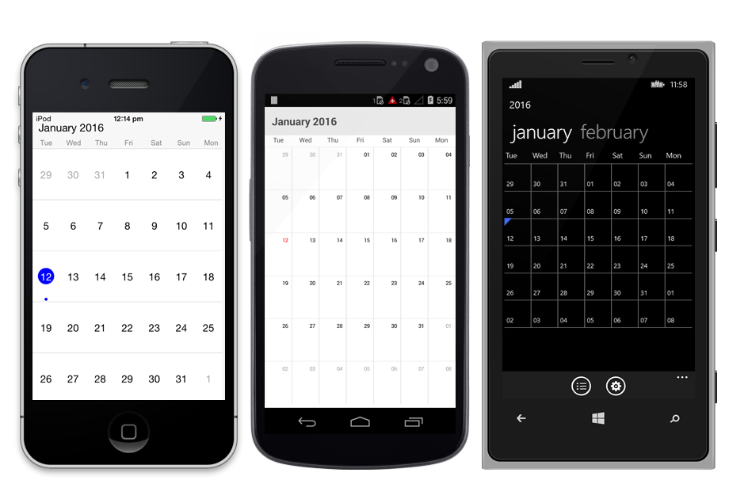

# DATE NAVIGATION AND GESTURE

## Move to Date 

Visible dates can be moved to specific date using “MoveToDate” method available in SfSchedule. It will move to any specific date if the [ScheduleView](/xamarin/sfschedule/views "Schedule Views") is Day View, similarly it will move to the specific week if it is week view and to specific month if it is month view.



    DateTime currentDate = DateTime.Now;
    
    DateTime SpecificDate= new DateTime (currentDate.Year- 5,currentDate.Month-3, currentDate.Day, 0, 0, 0);

    sfschedule.MoveToDate = (SpecificDate);



>**NOTE**:
The specified date should lies between`MinDisplayDate` and `MaxDisplayDate`, if the specified date is greater than “maxDisplayDate” then the view moved to maxDisplayDate similarly if the specified date is lesser than the “minDisplayDate” then the view moved to minDisplayDate.

## Enable/disable navigation

By default Schedule views can be moved backwards and forwards using touch swipe gesture. This navigation, using touch gesture can be enabled and disabled using `EnableNavigation` property available in Schedule control. By default this is enabled.



    //disabling navigation gesture
    sfschedule.EnableNavigation = false;



## Min Max dates.

Visible dates can be restricted between certain range of dates using`minDisplayDate`and`maxDisplayDate`properties available in Schedule control. It is applicable in all the schedule views.

So that beyond the min max date range, it will restrict date navigations features of moveToDate () and also can’t swipe the control using touch gesture beyond the min max date range. Also, beyond the min max date range, selection will also not works for month view. So that tapped listeners while tapped on the monthcell will not be listened. Thus Inline feature in month view will works only within the min max date range.



    int monthRange = 2;DateTime currentDate = DateTime.Now;

    //setting minimum display date
    
    DateTime minDate= new DateTime (currentDate.Year, currentDate.Month -     monthRange, currentDate.Day, 10, 0, 0);

    //setting maximum display date

  DateTime maxDate= new DateTime (currentDate.Year, currentDate.Month+     monthRange, currentDate.Day, 10, 0, 0);

    sfschedule.MinDisplayDate = minDate;
    sfschedule.MaxDisplayDate = maxDate;

    this.Content= sfschedule;



## Inline

By enabling Inline feature in month view, while touch the month view cell, appointments available in a particular day will be listed in inline view. 



    sfschedule.ScheduleView = ScheduleView.MonthView
    
    sfschedule.ShowAppointmentsInline = true;
    DateTime currentDate = DateTime.Now;

    DateTime startTime = new DateTime (currentDate.Year, currentDate.Month,currentDate.Day, 10, 0, 0);

    DateTime endTime = new DateTime (currentDate.Year, currentDate.Month,currentDate.Day, 12, 0, 0);

    clientMeeting.StartTime = startTime;            
    clientMeeting.EndTime = endTime;
    clientMeeting.Color = Color.Blue;
    clientMeeting.Subject = “ClientMeeting”;
    
    appointmentCollection.Add(clientMeeting);
    sfschedule.DataSource = appointmentCollection;
    this.Content= sfschedule;



## FirstDay of the Week

By default schedule control will be rendered with Sunday as the first day of the week, it can be customized to any day of the week by `FirstDayOfWeek` property of SfSchedule.



    //setting first day of the week 
    sfschedule.FirstDayOfWeek = 3;



> **NOTE**: Where 1-Sunday, 2-Monday, 3-Tuesday, 4-Wednesday, 5-Thursday, 6-Friday,7-Saturday.

