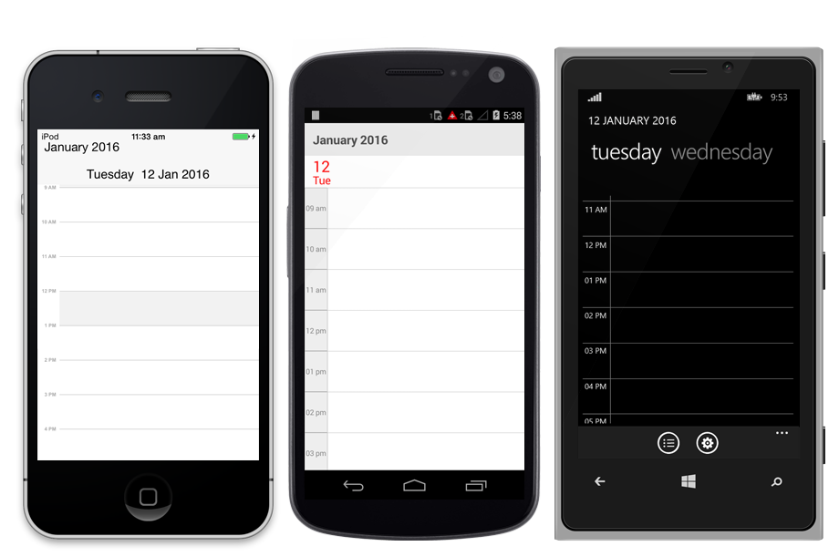

---

layout: post
title:  Syncfusion SfSchedule control Getting Started for Xamarin.Forms
description: A quick tour to initial users on Syncfusion SfSchedule control for Xamarin.Forms platform
platform: xamarin
control: SfSchedule
documentation: ug

---

# Getting Started 

This section explains you the steps required to render the Schedule control by populating  events(appointments), with inline support and min max dates support in the control. This section covers only the minimal features that you need to know to get started with the Schedule.

## Referencing Essential Studio components in your solution

If you had acquired Essential Studio components through the Xamarin component store interface from within your IDE, then after adding the components to your Xamarin.iOS and Xamarin.Android projects through the Component manager, you will still need to manually reference the PCL (Portable Class Library) assemblies in the Xamarin.Forms PCL project in your solution. You can do this by manually adding the relevant PCL assembly references to your PCL project contained in the following path inside of your solution folder.

Components/syncfusionessentialstudio-version/lib/pcl/

Alternatively if you had downloaded Essential Studio from Syncfusion.com or through the Xamarin store web interface then all assembly references need to be added manually.

After installing Essential Studio for Xamarin, all the required assemblies can be found in the installation folders, typically

{Syncfusion Installed location}\Essential Studio\{Version Number}\lib

E.g.: C:\Program Files (x86)\Syncfusion\Essential Studio\12.2.0.40\lib

Or after downloading through the Xamarin store web interface, all the required assemblies can be found in the below folder

{Download location}\syncfusionessentialstudio-version\lib

You can then add the assembly references to the respective projects as shown below

### PCL project

pcl\Syncfusion.SfSchedule.XForms.dll

### Android project

android\Syncfusion.SfSchedule.Android.dll

android\Syncfusion.SfSchedule.XForms.Android.dll

android\Syncfusion.SfSchedule.XForms.dll

### iOS (Classic) project

iOS\Syncfusion.SfSchedule.iOS.dll

iOS\Syncfusion.SfSchedule.XForms.iOS.dll

iOS\Syncfusion.SfSchedule.XForms.dll

### iOS(Unified) project

iOS-unified\Syncfusion.SfSchedule.iOS.dll

iOS-unified\Syncfusion.SfSchedule.XForms.iOS.dll

iOS-unified\Syncfusion.SfSchedule.XForms.dll

### Windows Phone project

wp81\Syncfusion.SfSchedule.WP.dll

wp81\Syncfusion.SfSchedule.XForms.WinPhone.dll

wp81\Syncfusion.SfSchedule.XForms.dll

Currently an additional step is required for Windows Phone and iOS projects. We need to create an instance of the chart custom renderer as shown below.

Create an instance of `SfScheduleRenderer` in MainPage constructor in of the Windows Phone project as shown



    public MainPage ()
    {
    ... 
    new SfScheduleRenderer();
    ...
    }


Create an instance of `SfScheduleRenderer` in Finished Launching overridden method of App Delegate class in iOS Project as shown below



    public override bool Finished Launching (UIApplication app, NSDictionary options)
    {
    ...
    new SfScheduleRenderer();
    ...
    }


## Initializing Schedule 

The SfSchedule control is configured entirely in C# code.



    SfSchedule sfschedule = new SfSchedule ();
    this.Content = sfschedule;


You can change the default UI of schedule using [ScheduleView](/xamarin/sfschedule/views "Schedule Views") to display the dates in different layouts available in the control.



    SfSchedule sfschedule=new SfSchedule ();
    sfschedule.ScheduleView = ScheduleView.WeekView;
    this.Content= sfschedule;



## Populating Events

You can add events to the schedule by creating collection of `ScheduleAppointment` using `ScheduleAppointmentCollection`.



    ScheduleAppointmentCollection appointmentCollection;

    appointmentCollection = new ScheduleAppointmentCollection();

    //Creating new event
    ScheduleAppointment clientMeeting = new ScheduleAppointment();

    DateTime currentDate = DateTime.Now;
    DateTime startTime = new DateTime (currentDate.Year, currentDate.Month, currentDate.Day, 10, 0, 0);
    DateTime endTime = new DateTime (currentDate.Year, currentDate.Month, currentDate.Day, 12, 0, 0);

    clientMeeting.StartTime = startTime;
    clientMeeting.EndTime = endTime;
    clientMeeting.Color = Color.Blue;
    clientMeeting.Subject = "ClientMeeting";

    appointmentCollection.Add(clientMeeting);
    sfschedule.DataSource = appointmentCollection;
    this.Content= sfschedule;



## Populating Recursive Events

You can also add recursive appointments to Schedule, refer [Recurrence](/xamarin/sfschedule/recurrence "Schedule Recursive Appointments") section to know more about creating the recursive appointments using `RRuleGenerator` in schedule.



    ScheduleAppointmentCollection appointmentCollection = new ScheduleAppointmentCollection();
    //Creating new events
    ScheduleAppointment clientMeeting = new ScheduleAppointment();
    DateTime currentDate = DateTime.Now;

    DateTime startTime = new DateTime (currentDate.Year, currentDate.Month, currentDate.Day, 10, 0, 0);

    DateTime endTime = new DateTime (currentDate.Year, currentDate.Month, currentDate.Day, 12, 0, 0);
    clientMeeting.StartTime = startTime;
    clientMeeting.EndTime = endTime;
    clientMeeting.Color = Color.Blue;
    clientMeeting.Subject = “ClientMeeting”;
    clientMeeting.IsRecursive = true;

    RecurrenceProperties recurrenceProperties = new RecurrenceProperties();
    recurrencePropertiesForAlternativeDay.RecurrenceType =RecurrenceType.Daily;
    recurrenceProperties.IsDailyEveryNDays = true;
    recurrenceProperties.DailyNDays = 2;
    recurrenceProperties.IsRangeRecurrenceCount = true;
    recurrenceProperties.IsRangeNoEndDate = false;
    recurrenceProperties.IsRangeEndDate = false;
    recurrenceProperties.RangeRecurrenceCount = 10; 
    recurrenceProperties.RecurrenceRule = DependencyService.Get<IRecurrenceBuilder>().RRuleGenerator(recurrenceProperties, clientMeeting.StartTime, clientMeeting.EndTime);
    clientMeeting.RecurrenceRule = recurrenceProperties.RecurrenceRule;
    appointmentCollection.Add(clientMeeting);
    sfschedule.DataSource = appointmentCollection;
    this.Content= sfschedule;



## Enabling Appointments Inline

When the schedule appointments are viewed in month view, it will not display much information about the appointments, you can view the appointments in inline by setting `ShowAppointmentsInline` property of `MonthViewSettings` as True.



    sfschedule.ScheduleView = ScheduleView.MonthView;
    sfschedule.ShowAppointmentsInline = true;
    this.Content= sfschedule;



