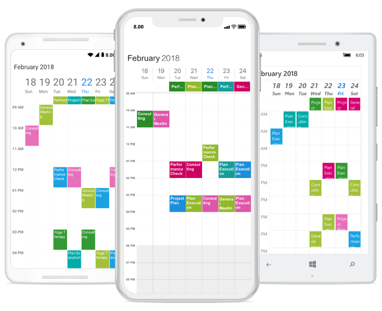

# Getting Started 

This section explains you the steps required to render the `Meeting Room Booking Scheduler` using Schedule control by populating events(appointments), with custom data support in the control. This section covers only the minimal features that you need to know to get started with the Schedule.

## Adding Schedule Reference

Refer this [article](https://help.syncfusion.com/xamarin/introduction/download-and-installation) to know how to obtain and reference Essential Studio components in your solution; then refer [this](https://help.syncfusion.com/xamarin/introduction/control-dependencies) link to know about the assemblies required for adding Schedule to your project.

>**NOTE**  After adding the reference, currently, an additional step is required for iOS and UWP projects. We need to create an instance of the SfScheduleRenderer as shown in this.[KB article.](https://www.syncfusion.com/kb/7202/how-to-resolve-sfschedule-not-rendering-issue-in-ios-and-uwp)

## Initializing Schedule 

The SfSchedule control is configured entirely in C# code.



	SfSchedule meetingRoomScheduler = new SfSchedule();
	this.Content = meetingRoomScheduler;



You can change the default UI of schedule using [ScheduleView](/xamarin/sfschedule/views "Schedule Views") to display the dates in different layouts available in the control.



	SfSchedule meetingRoomScheduler=new SfSchedule ();
	meetingRoomScheduler.ScheduleView = ScheduleView.WeekView;
	this.Content= meetingRoomScheduler;



## Custom Data 

You can map custom data appointments to schedule by creating class with custom properties.Here for `MeetingRoomScheduler` respective custom data properties are created in a class `Meeting`.



	public class Meeting
	{
	public string EventName { get; set; }
	public string Organizer { get; set; }
	public string ContactID { get; set; }
	public int Capacity { get; set; }
	public DateTime From { get; set; }
	public DateTime To { get; set; }
	public Color color { get; set; }
	}



## Custom Appointment Mapping

You can map those custom properties with schedule appointment properties using `ScheduleAppointmentMapping`. Create meetings of type `ObservableCollection <Meeting>` and assign those appointments collection `ListOfMeeting` to the `DataSource` property which is of `IEnumerable` type.



	ObservableCollection<Meeting> meetings = new ObservableCollection<Meeting>();

	ScheduleAppointmentMapping dataMapping = new ScheduleAppointmentMapping();
	dataMapping.SubjectMapping = "EventName";
	dataMapping.StartTimeMapping = "From";
	dataMapping.EndTimeMapping = "To";
	dataMapping.ColorMapping = "color";
	meetingRoomScheduler.AppointmentMapping = dataMapping;
	meetings = viewModel.ListOfMeeting;
	meetingRoomScheduler.DataSource = meetings;
	this.Content = meetingRoomScheduler;



## Creating Appointment Collection

You can schedule meetings for a particular day by setting `From` and `To` of `Meeting` class.Also you can change subject and color of appointment using `EventName` and `color` of Meeting class.



	ObservableCollection<Meeting> ListOfMeeting = new ObservableCollection<Meeting>();

	private void BookingAppointments()
	{
	Random randomTime = new Random();
	List<Point> randomTimeCollection = GettingTimeRanges();

	int appointmentIndex = 0;
	DateTime date;
	DateTime DateFrom = DateTime.Now.AddDays(-10);
	DateTime DateTo = DateTime.Now.AddDays(10);
	DateTime dataRangeStart = DateTime.Now.AddDays(-3);
	DateTime dataRangeEnd = DateTime.Now.AddDays(3);

	for (date = DateFrom; date < DateTo; date = date.AddDays(1))
	{
	if ((DateTime.Compare(date, dataRangeStart) > 0) && (DateTime.Compare(date, dataRangeEnd) < 0))
	{
	for (int AdditionalAppointmentIndex = 0; AdditionalAppointmentIndex < 3; AdditionalAppointmentIndex++)
	{
	Meeting meeting = new Meeting();
	int hour = (randomTime.Next((int)randomTimeCollection[AdditionalAppointmentIndex].X, (int)randomTimeCollection[AdditionalAppointmentIndex].Y));
	meeting.From = new DateTime(date.Year, date.Month, date.Day, hour, 0, 0);
	meeting.To = (meeting.From.AddHours(1));
	meeting.EventName = meeting_collection[randomTime.Next(9)];
	meeting.color = color_collection[randomTime.Next(9)];
	ListOfMeeting.Add(meeting);
	}
	}
	else {
	Meeting meeting = new Meeting();
	meeting.From = new DateTime(date.Year, date.Month, date.Day, randomTime.Next(9, 11), 0, 0);
	meeting.To = (meeting.From.AddHours(1));
	meeting.EventName = meeting_collection[randomTime.Next(9)];
	meeting.color = color_collection[randomTime.Next(9)];
	ListOfMeeting.Add(meeting);
	}
	}
	}



You can add `Subject` and `Color` to the appointments created by creating a collection for the same.



	List<string> meeting_collection;
	List<Color> color_collection;

	private void InitializeDataForBookings()
	{
	meeting_collection = new List<string>();
	meeting_collection.Add("General Meeting");
	meeting_collection.Add("Plan Execution");
	meeting_collection.Add("Project Plan");
	meeting_collection.Add("Consulting");
	meeting_collection.Add("Performance Check");
	meeting_collection.Add("Yoga Therapy");
	meeting_collection.Add("Plan Execution");
	meeting_collection.Add("Project Plan");
	meeting_collection.Add("Consulting");
	meeting_collection.Add("Performance Check");

	color_collection = new List<Color>();
	color_collection.Add(Color.FromHex("#117EB4"));
	color_collection.Add(Color.FromHex("#B4112E"));
	color_collection.Add(Color.FromHex("#C44343"));
	color_collection.Add(Color.FromHex("#11B45E"));
	color_collection.Add(Color.FromHex("#43BEC4"));
	color_collection.Add(Color.FromHex("#B4112E"));
	color_collection.Add(Color.FromHex("#C44343"));
	color_collection.Add(Color.FromHex("#117EB4"));
	color_collection.Add(Color.FromHex("#C4435A"));
	color_collection.Add(Color.FromHex("#DF5348"));
	color_collection.Add(Color.FromHex("#43c484"));
	}



