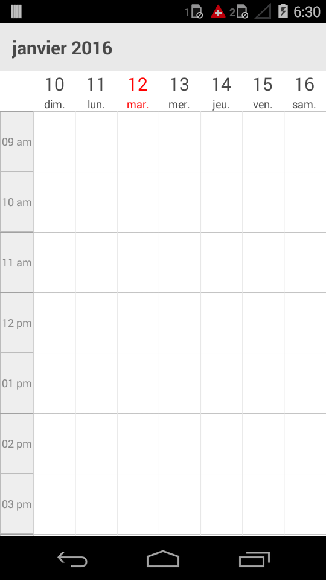

---

layout: post
title: Localization in Syncfusion SfSchedule control for Xamarin.Forms
description: Learn how to Localize the SfSchedule control
platform: Xamarin.Forms
control: SfSchedule
documentation: ug

---

# LOCALIZATION 

Schedule control is available with complete localisation support. To know more about localizing an application refer `How to localize an Xamarin application`

Localization can be specified by setting the Locale property of the control. In the format of <Language code> followed by -<Country code>.  Based on the locale specified the strings in the control such as Date, time, days are localised accordingly.

By default schedule control is available with **en**-**US** locale. 

As the subject of the appointments are given in the application level, it can be set as localised strings as per the requirement. To know more about settings the subject refer `ScheduleAppointment`


    
    //creating new instance for schedule
    SfSchedule sfschedule = new SfSchedule();
    //setting schedule view 
    sfschedule.ScheduleView=(ScheduleView.WeekView);
    //setting locale for the control 
    sfschedule.Locale=("fr","FR");
    this.Content= sfschedule;
    


<table>
<tr>
<td>
{{''| markdownify }}
</td><td>
{{''| markdownify }}
</td><td>
{{''| markdownify }}
</td></tr>
</table>