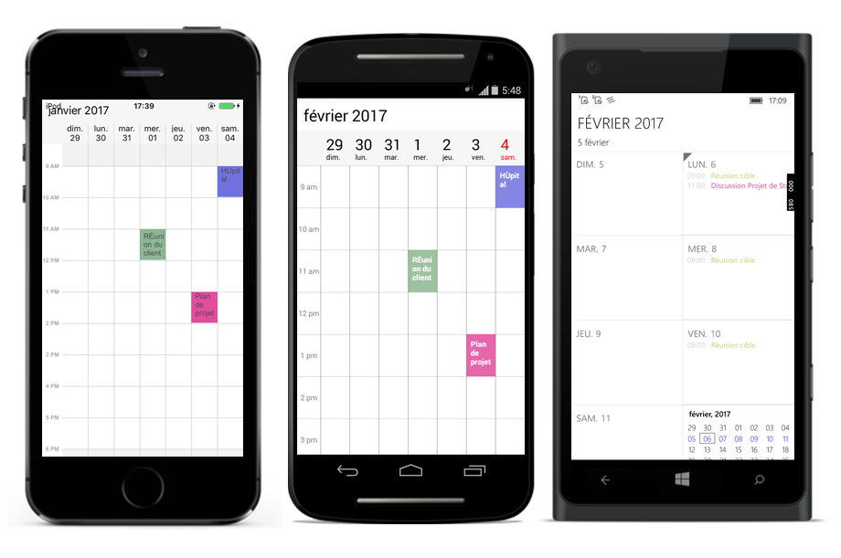

# Localization 

Schedule control is available with complete localization support. Localization can be specified by setting the [Locale](https://help.syncfusion.com/cr/cref_files/xamarin-android/sfschedule/Syncfusion.SfSchedule.Android~Com.Syncfusion.Schedule.SfSchedule~Locale.html) property of SfSchedule. In the format of `Language code`.

## Change default control language

Based on the `Locale` specified the strings in the control such as Date, time, days are localized accordingly.

By default, schedule control is available with en locale, which is English.

   
   
    
          //creating new instance for schedule
            SfSchedule schedule = new SfSchedule(this);
          //setting schedule view
            schedule.ScheduleView = ScheduleView.DayView;
          //setting locale for the control
            schedule.Locale = new Locale("fr");
 
   
   

>**Note ** AM/PM in the timeline will not be localized in the Schedule views

   

## Change custom texts in the control.

You can localize the custom strings used in the schedule control. You can localize custom text available in the control by adding equivalent localized string in the string.xml file.

   
 
       
     <resources>
    	<string name="No_Appointments">Aucun événement</string>
     	<string name="all_day">Toute la journée</string>
     </resources>
   
 
