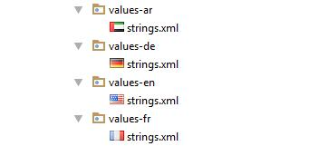
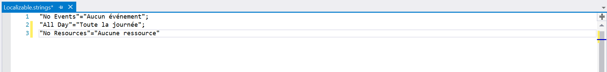
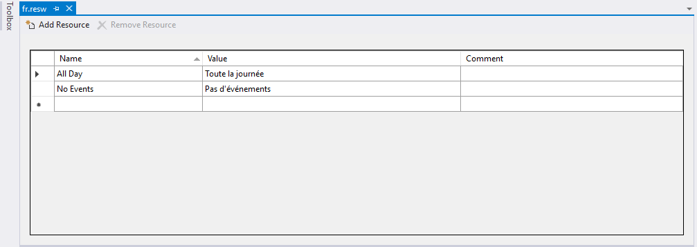

# Localization

Schedule control is available with complete localization support. Localization can be specified by setting the [Locale](https://help.syncfusion.com/cr/cref_files/xamarin/sfschedule/Syncfusion.SfSchedule.XForms~Syncfusion.SfSchedule.XForms.SfSchedule~Locale.html) property of SfSchedule. In the format of `Language code`.

## Change default control language

Based on the `Locale` specified the strings in the control such as Date, time, days are localized accordingly.

By default, schedule control is available with en locale, which is English.

   

<schedule:SfSchedule
	  x:Name="schedule" 
	  ScheduleView="WeekView"
	  Locale="ja">
</schedule:SfSchedule>
   

//creating new instance for schedule
SfSchedule schedule = new SfSchedule();
//setting schedule view 
schedule.ScheduleView = ScheduleView.WeekView;
//setting locale for the control 
schedule.Locale = "ja";
   
   

   

## Change custom texts in the control.

You can localize the custom strings used in the schedule control. For that you need to configure it for each platform separately.

*	Localizing custom text in Android renderer.
*	Localizing custom text in iOS renderer.
*	Localizing custom text in UWP renderer.

You can download the entire source code of this demo for Xamarin.Forms from
here [Localization](http://www.syncfusion.com/downloads/support/directtrac/general/ze/Localization_Forms-1564080177.zip).

### Localizing custom text in Android renderer.

You can localize custom text available in the control by adding equivalent localized string in the string.xml file.



<resources>
	<string name="No_Appointments">Aucun événement</string>
	<string name="all_day">Toute la journée</string>
</resources>
  
 

Android can select and load resources from different directories, based on the current device configuration and locale, refer [here](https://developer.xamarin.com/guides/android/advanced_topics/localization/). For an example, if an application requires multiple languages you can follow the below steps.

The procedure for creating strings.xml files is as follows:

*	Translate the strings.xml file to each language.
*	Create new folders under resource as values-`ar`, values-`de`, values-`en` and values-`fr` (The original values folder already exists).
*	Place the translated strings.xml files in the respective folders.
 
  

>**NOTE** 
The corresponding Locale values folder updates only when the device language changes.

### Localizing custom text in iOS renderer.

You can localize custom text available in the control by adding equivalent localized string in the Localizable.strings file, refer [here](https://developer.xamarin.com/guides/ios/advanced_topics/localization_and_internationalization/).

 

If an application requires multiple languages you can follow the below steps:

*	Translate the Localizable.Strings file to each language. 
*	Create new `<Language>.lproj` folders under resource as `en.lproj`, `fr.lproj`, `de.lproj`.
*	Place the `Localizable.Strings` file in the respective `<Language>.lproj` folders.

>**NOTE** 
The corresponding `<Language>.lproj` folder updates only when the device language changes.

### Localizing custom text in UWP renderer.

You can localize custom text available in the control by adding equivalent localized string in the Resources(.resw) file. 

>**NOTE** 
Here Resources(.resw) file name should be match with the given locale language code.

The procedure for creating Resources(.resw) file is as follows:

*	Create Resources(.resw) file in sample with C# culture standard name for example fr , de-DE and so.

*	Translate the custom string used in schedule to respective localized culture.

