---   
layout: post   
title: MonthView   
description: Overview of MonthView related features
platform: xamarin   
control: SfSchedule   
documentation: ug   
---   
    
# Month View
`MonthView` of `SfSchedule` used to display entire dates of the specific month, current month will be displayed by default initially. Current date color is differentiated with other dates of the current month, also the color differentiation for dates will be applicable for previous and next month dates.



<schedule:SfSchedule x:Name="schedule"
                     ScheduleView="MonthView">
</schedule:SfSchedule>


//setting schedule view
schedule.ScheduleView = ScheduleView.MonthView;



## Month Appointment indicator
In `MonthView`, appointments are not viewed in the month cell instead appointment indicators are drawn. You can customize the number of appointment indicators displayed in month cell using  [AppointmentIndicatorCount](https://help.syncfusion.com/cr/cref_files/xamarin/sfschedule/Syncfusion.SfSchedule.XForms~Syncfusion.SfSchedule.XForms.MonthViewSettings~AppointmentIndicatorCount.html) property of [MonthViewSettings](https://help.syncfusion.com/cr/cref_files/xamarin/sfschedule/Syncfusion.SfSchedule.XForms~Syncfusion.SfSchedule.XForms.MonthViewSettings.html) in `SfSchedule`, by default Appointment indicator count is 3.



<schedule:SfSchedule x:Name="schedule" ScheduleView="MonthView">
    <schedule:SfSchedule.MonthViewSettings>
        <schedule:MonthViewSettings
                AppointmentIndicatorCount = "2" >
        </schedule:MonthViewSettings>
    </schedule:SfSchedule.MonthViewSettings>
</schedule:SfSchedule>


//creating new instance for MonthViewSettings
MonthViewSettings monthViewSettings = new MonthViewSettings();
monthViewSettings.AppointmentIndicatorCount = 2;
schedule.MonthViewSettings = monthViewSettings;



>**NOTE**
If appointments count are lesser than the AppointmentIndicatorCount value in the particular day, then according to number of appointments available, indicator will be displayed in the month cell.Maximum number of appointment indicators drawn in the month cell is 6 in android and ios platforms.

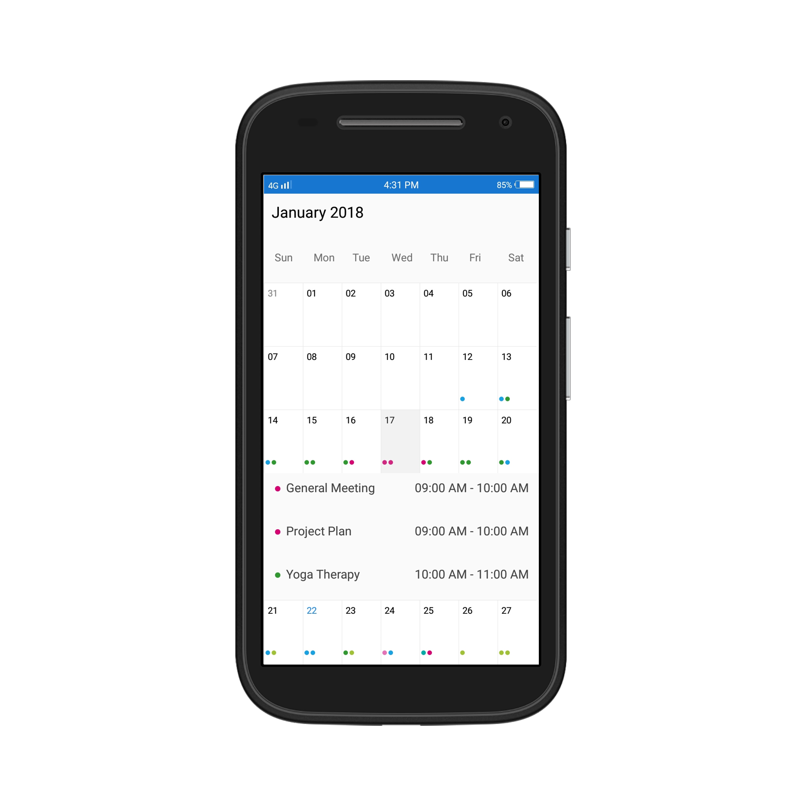

## Month InlineView
You can use [ShowAppointmentsInline](http://help.syncfusion.com/cr/cref_files/xamarin/sfschedule/Syncfusion.SfSchedule.XForms~Syncfusion.SfSchedule.XForms.SfSchedule~ShowAppointmentsInline.html) bool property in `SfSchedule` to enable / disable the month inline view, by setting `ShowAppointmentsInline` property as `true` you can view the Appointments in the specific date. 



<schedule:SfSchedule 
		x:Name="schedule" 
		ScheduleView="MonthView"
		ShowAppointmentsInline="true">
</schedule:SfSchedule>


schedule.ShowAppointmentsInline = true;



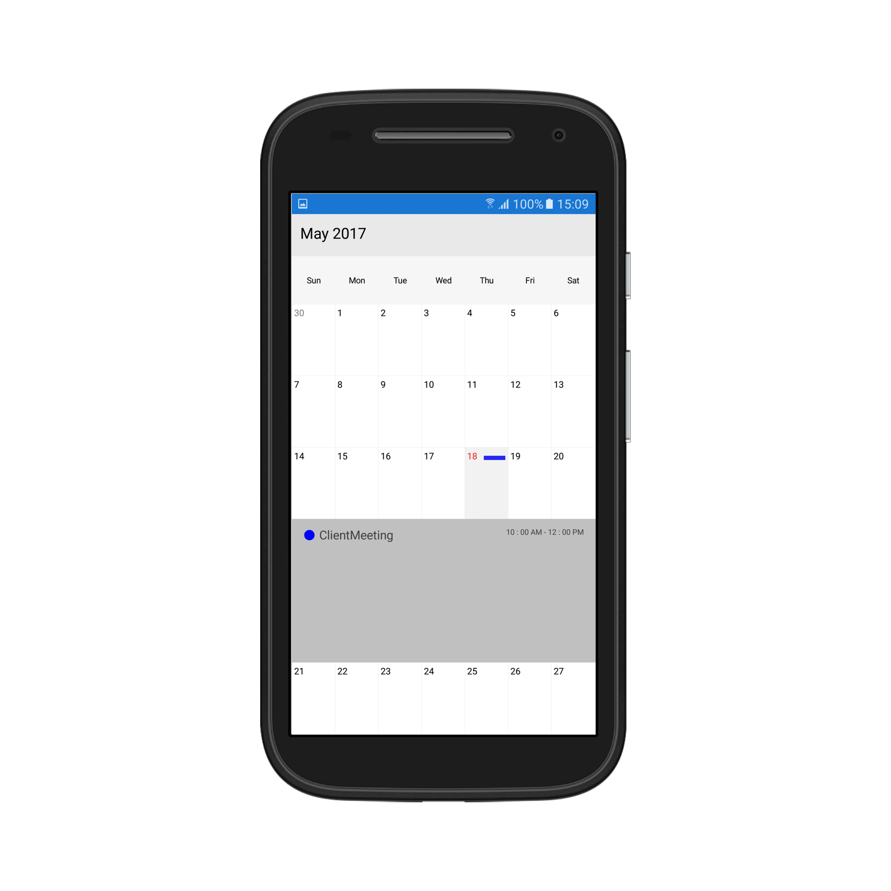

>**NOTE**
If appointments not there in the selected day, Inline view displays the text as "No Events"

## Month Navigation direction
MonthView of Schedule can be navigated in both horizontal and vertical direction. You can change the direction of navigation through [MonthNavigationDirection](https://help.syncfusion.com/cr/cref_files/xamarin/sfschedule/Syncfusion.SfSchedule.XForms~Syncfusion.SfSchedule.XForms.MonthViewSettings~MonthNavigationDirection.html) property of [MonthViewSettings](https://help.syncfusion.com/cr/cref_files/xamarin/sfschedule/Syncfusion.SfSchedule.XForms~Syncfusion.SfSchedule.XForms.MonthViewSettings.html) in `SfSchedule`, by default Month navigation direction is `Horizontal`.



<schedule:SfSchedule x:Name="schedule" ScheduleView="MonthView">
    <schedule:SfSchedule.MonthViewSettings>
        <schedule:MonthViewSettings
                MonthNavigationDirection="Vertical">
        </schedule:MonthViewSettings>
    </schedule:SfSchedule.MonthViewSettings>
</schedule:SfSchedule>


//creating new instance for MonthViewSettings
MonthViewSettings monthViewSettings = new MonthViewSettings();
//To navigate vertically
monthViewSettings.MonthNavigationDirection = MonthNavigationDirections.Vertical;
schedule.MonthViewSettings = monthViewSettings;



## Restricted days in Month
You can disable the interaction for certain date in Month view by using [BlackoutDates](https://help.syncfusion.com/cr/cref_files/xamarin/sfschedule/Syncfusion.SfSchedule.XForms~Syncfusion.SfSchedule.XForms.MonthViewSettings~BlackoutDates.html) of [MonthViewSettings](https://help.syncfusion.com/cr/cref_files/xamarin/sfschedule/Syncfusion.SfSchedule.XForms~Syncfusion.SfSchedule.XForms.MonthViewSettings.html), using this you can allocate / restrict the specific date for predefined events.



//creating new instance for MonthViewSettings
MonthViewSettings monthViewSettings = new MonthViewSettings();
ObservableCollection<DateTime> blackoutDateCollection = new ObservableCollection<DateTime>();

DateTime blockedDate1 = DateTime.Now.Date.AddDays(1);
DateTime blockedDate2 = DateTime.Now.Date.AddDays(2);
DateTime blockedDate3 = DateTime.Now.Date.AddDays(3);
DateTime blockedDate4 = DateTime.Now.Date.AddDays(4);
DateTime blockedDate5 = DateTime.Now.Date.AddDays(5);

blackoutDateCollection.Add(blockedDate1);
blackoutDateCollection.Add(blockedDate2);
blackoutDateCollection.Add(blockedDate3);
blackoutDateCollection.Add(blockedDate4);
blackoutDateCollection.Add(blockedDate5);
monthViewSettings.BlackoutDates = blackoutDateCollection;
schedule.MonthViewSettings = monthViewSettings;



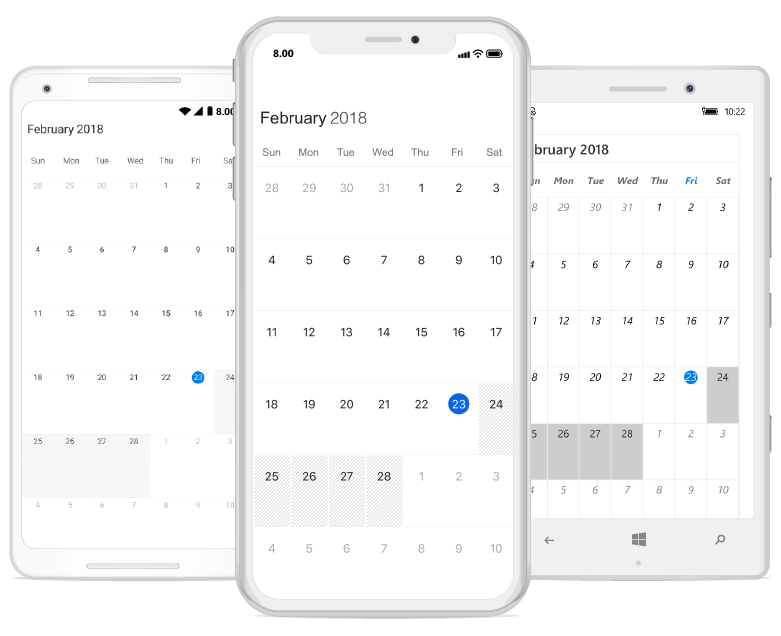

## First day of Week in Month
You can set First day of week using [FirstDayOfWeek](https://help.syncfusion.com/cr/cref_files/xamarin/sfschedule/Syncfusion.SfSchedule.XForms~Syncfusion.SfSchedule.XForms.SfSchedule~FirstDayOfWeek.html) property of `SfSchedule`, by default schedule control will rendered with `Sunday` as the first day of the week. 



<schedule:SfSchedule 
			x:Name="schedule" 
			FirstDayOfWeek="3"
			ScheduleView="MonthView">
</schedule:SfSchedule>


//setting FirstDayOfWeek
schedule.FirstDayOfWeek = 3; // Tuesday



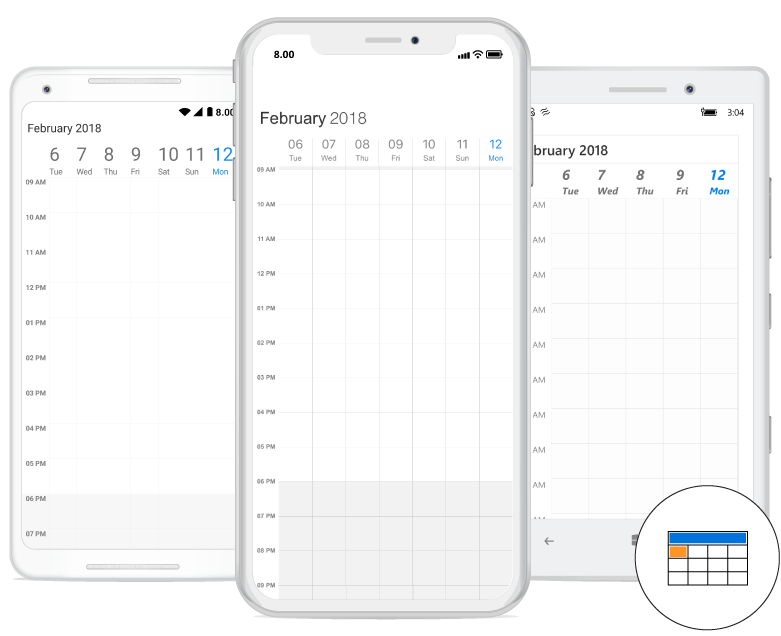

## Week Number of the Year in Month
You can display the Week Number of the year in `MonthView` by setting [ShowWeekNumber](https://help.syncfusion.com/cr/cref_files/xamarin/sfschedule/Syncfusion.SfSchedule.XForms~Syncfusion.SfSchedule.XForms.MonthViewSettings~ShowWeekNumber.html) property of `MonthViewSettings` as `true`, by default it is `false`.



<schedule:SfSchedule x:Name="schedule" ScheduleView="MonthView">
    <schedule:SfSchedule.MonthViewSettings>
        <schedule:MonthViewSettings
                    ShowWeekNumber="true">
        </schedule:MonthViewSettings>
    </schedule:SfSchedule.MonthViewSettings>
</schedule:SfSchedule>


monthViewSettings.ShowWeekNumber = true;



## Week Number Appearance
You can customize the Week Number appearance by using [WeekNumberStyle](https://help.syncfusion.com/cr/cref_files/xamarin/sfschedule/Syncfusion.SfSchedule.XForms~Syncfusion.SfSchedule.XForms.MonthViewSettings~WeekNumberStyle.html) property of `MonthViewSettings`. Week number [BackgroundColor](https://help.syncfusion.com/cr/cref_files/xamarin/sfschedule/Syncfusion.SfSchedule.XForms~Syncfusion.SfSchedule.XForms.WeekNumberStyle~BackgroundColor.html), [TextColor](https://help.syncfusion.com/cr/cref_files/xamarin/sfschedule/Syncfusion.SfSchedule.XForms~Syncfusion.SfSchedule.XForms.WeekNumberStyle~TextColor.html), [FontFamily](https://help.syncfusion.com/cr/cref_files/xamarin/sfschedule/Syncfusion.SfSchedule.XForms~Syncfusion.SfSchedule.XForms.WeekNumberStyle~FontFamily.html), [FontSize](https://help.syncfusion.com/cr/cref_files/xamarin/sfschedule/Syncfusion.SfSchedule.XForms~Syncfusion.SfSchedule.XForms.WeekNumberStyle~FontSize.html), [FontAttributes](https://help.syncfusion.com/cr/cref_files/xamarin/sfschedule/Syncfusion.SfSchedule.XForms~Syncfusion.SfSchedule.XForms.WeekNumberStyle~FontAttributes.html) can be customized using `WeekNumberStyle` properties.



//creating new instance for WeekNumberStyle
WeekNumberStyle weekNumberStyle = new WeekNumberStyle();
weekNumberStyle.FontFamily = "Arial";
weekNumberStyle.FontSize = 15;
weekNumberStyle.FontAttributes = FontAttributes.None;
weekNumberStyle.BackgroundColor = Color.Blue;
weekNumberStyle.TextColor = Color.White;
monthViewSettings.WeekNumberStyle = weekNumberStyle;



## View Header Appearance  
You can customize the View Header appearance by using [ViewHeaderStyle](http://help.syncfusion.com/cr/cref_files/xamarin/sfschedule/Syncfusion.SfSchedule.XForms~Syncfusion.SfSchedule.XForms.SfSchedule~ViewHeaderStyle.html) property in SfSchedule. View Header [BackgroundColor](https://help.syncfusion.com/cr/cref_files/xamarin/sfschedule/Syncfusion.SfSchedule.XForms~Syncfusion.SfSchedule.XForms.ViewHeaderStyle~BackgroundColor.html), [DayTextColor](https://help.syncfusion.com/cr/cref_files/xamarin/sfschedule/Syncfusion.SfSchedule.XForms~Syncfusion.SfSchedule.XForms.ViewHeaderStyle~DayTextColor.html) and [DayTextStyle](https://help.syncfusion.com/cr/cref_files/xamarin/sfschedule/Syncfusion.SfSchedule.XForms~Syncfusion.SfSchedule.XForms.ViewHeaderStyle~DayTextStyle.html) can be customized using `ViewHeaderStyle` properties.




<schedule:SfSchedule x:Name="schedule" ScheduleView="MonthView">
    <schedule:SfSchedule.ViewHeaderStyle>
        <schedule:ViewHeaderStyle
                    BackgroundColor="Blue"
                    DayTextColor="White"
                    DayFontFamily="Arial">
        </schedule:ViewHeaderStyle>
    </schedule:SfSchedule.ViewHeaderStyle>
</schedule:SfSchedule>


//creating new instance for viewHeaderStyle
ViewHeaderStyle viewHeaderStyle = new ViewHeaderStyle();
viewHeaderStyle.BackgroundColor = Color.Blue;
viewHeaderStyle.DayTextColor = Color.White;
viewHeaderStyle.DayFontFamily = "Arial";
schedule.ViewHeaderStyle = viewHeaderStyle;



>**NOTE**
FontAttributes and FontFamily are native to the platform. Custom font and the font which are not available in the specified platform will not be applied.

### ViewHeader Date Format
You can customize the date and day format of `SfSchedule` ViewHeader by using [DateFormat](http://help.syncfusion.com/cr/cref_files/xamarin/sfschedule/Syncfusion.SfSchedule.XForms~Syncfusion.SfSchedule.XForms.DayLabelSettings~DateFormat.html) and [DayFormat](http://help.syncfusion.com/cr/cref_files/xamarin/sfschedule/Syncfusion.SfSchedule.XForms~Syncfusion.SfSchedule.XForms.DayLabelSettings~DayFormat.html) properties of `MonthLabelSettings`.



<schedule:SfSchedule>
    <schedule:SfSchedule.MonthViewSettings>
        <schedule:MonthViewSettings>
            <schedule:MonthViewSettings.MonthLabelSettings>
                <schedule:MonthLabelSettings DateFormat=“dd”>
                    <schedule:MonthLabelSettings.DayFormat>
                        <OnPlatform x:TypeArguments="x:String"
                                    iOS="EEEE"
                                    Android="EEEE"
                                    WinPhone="dddd" />
                    </schedule:MonthLabelSettings.DayFormat>
                </schedule:MonthLabelSettings>
            </schedule:MonthViewSettings.MonthLabelSettings>
        </schedule:MonthViewSettings>
    </schedule:SfSchedule.MonthViewSettings>
</schedule:SfSchedule>


schedule.ScheduleView = ScheduleView.MonthView;
//Creating new instance of MonthViewSettings
MonthViewSettings monthViewSettings = new MonthViewSettings();
//Creating new instance of MonthLabelSettings
MonthLabelSettings monthLabelSettings = new MonthLabelSettings();
//Customizing date format
monthLabelSettings.DateFormat = "dd";
monthLabelSettings.DayFormat = Device.OnPlatform("EEEE", "EEEE", "dddd");
monthViewSettings.MonthLabelSettings = monthLabelSettings;
schedule.MonthViewSettings = monthViewSettings;



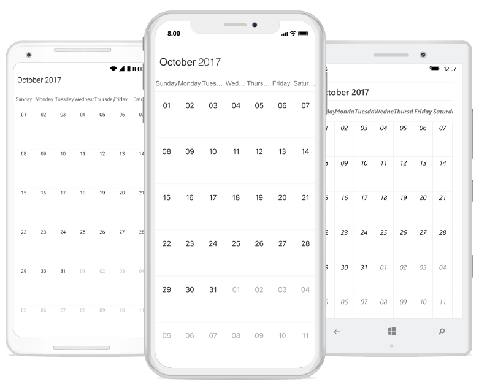

### ViewHeader Tapped Event
You can handle single tap action of ViewHeader by using [ViewHeaderTapped](http://help.syncfusion.com/cr/cref_files/xamarin/sfschedule/Syncfusion.SfSchedule.XForms~Syncfusion.SfSchedule.XForms.SfSchedule~ViewHeaderTapped_EV.html) event of `SfSchedule`. This event will be triggered when the ViewHeader is Tapped. This event contains [ViewHeaderTappedEventArgs](http://help.syncfusion.com/cr/cref_files/xamarin/sfschedule/Syncfusion.SfSchedule.XForms~Syncfusion.SfSchedule.XForms.ViewHeaderTappedEventArgs.html) argument which holds [DateTime](https://help.syncfusion.com/cr/cref_files/xamarin/sfschedule/Syncfusion.SfSchedule.XForms~Syncfusion.SfSchedule.XForms.CellTappedEventArgs~Datetime.html) details in it.



<schedule:SfSchedule x:Name="schedule"
				 ScheduleView="MonthView"
				 ViewHeaderTapped="Handle_ViewHeaderTapped" >
</schedule:SfSchedule>


//Creating  new instance of Schedule
SfSchedule schedule = new SfSchedule();
schedule.ScheduleView = ScheduleView.MonthView;
schedule.ViewHeaderTapped += Handle_ViewHeaderTapped;




private void Handle_ViewHeaderTapped(object sender, ViewHeaderTappedEventArgs e)
{
    var dateTime = e.DateTime;
}


## MonthCell Appearance 
You can customize the Month view cell in three ways,

* [Customize month cell using style](#customize-month-cell-using-style)
* [Customize month cell using event](#customize-month-cell-using-event)
* [Customize month cell with custom UI](#customize-month-cell-with-custom-ui)
* [Customize month cell using DataTemplate](#customize-month-cell-using-datatemplate)
* [Customize month cell using DataTemplateSelector](#customize-month-cell-using-datatemplateselector)

### Customize month cell using style
By using [MonthViewCellStyle](https://help.syncfusion.com/cr/cref_files/xamarin/sfschedule/Syncfusion.SfSchedule.XForms~Syncfusion.SfSchedule.XForms.MonthViewCellStyle.html) of `SfSchedule` you can customize the month cell properties such as [BackgroundColor](https://help.syncfusion.com/cr/cref_files/xamarin/sfschedule/Syncfusion.SfSchedule.XForms~Syncfusion.SfSchedule.XForms.MonthViewCellStyle~BackgroundColor.html), [NextMonthBackgroundColor](https://help.syncfusion.com/cr/cref_files/xamarin/sfschedule/Syncfusion.SfSchedule.XForms~Syncfusion.SfSchedule.XForms.MonthViewCellStyle~NextMonthBackgroundColor.html), [NextMonthTextColor](https://help.syncfusion.com/cr/cref_files/xamarin/sfschedule/Syncfusion.SfSchedule.XForms~Syncfusion.SfSchedule.XForms.MonthViewCellStyle~NextMonthTextColor.html), [PreviousMonthBackgroundColor](https://help.syncfusion.com/cr/cref_files/xamarin/sfschedule/Syncfusion.SfSchedule.XForms~Syncfusion.SfSchedule.XForms.MonthViewCellStyle~PreviousMonthBackgroundColor.html), [PreviousMonthTextColor](https://help.syncfusion.com/cr/cref_files/xamarin/sfschedule/Syncfusion.SfSchedule.XForms~Syncfusion.SfSchedule.XForms.MonthViewCellStyle~PreviousMonthTextColor.html), [TextColor](https://help.syncfusion.com/cr/cref_files/xamarin/sfschedule/Syncfusion.SfSchedule.XForms~Syncfusion.SfSchedule.XForms.MonthViewCellStyle~TextColor.html), [FontSize](https://help.syncfusion.com/cr/cref_files/xamarin/sfschedule/Syncfusion.SfSchedule.XForms~Syncfusion.SfSchedule.XForms.MonthViewCellStyle~FontSize.html), [FontAttributes](https://help.syncfusion.com/cr/cref_files/xamarin/sfschedule/Syncfusion.SfSchedule.XForms~Syncfusion.SfSchedule.XForms.MonthViewCellStyle~FontAttributes.html), [FontFamily](https://help.syncfusion.com/cr/cref_files/xamarin/sfschedule/Syncfusion.SfSchedule.XForms~Syncfusion.SfSchedule.XForms.MonthViewCellStyle~FontFamily.html), [TodayBackgroundColor](https://help.syncfusion.com/cr/cref_files/xamarin/sfschedule/Syncfusion.SfSchedule.XForms~Syncfusion.SfSchedule.XForms.MonthViewCellStyle~TodayBackgroundColor.html), [TodayTextColor](https://help.syncfusion.com/cr/cref_files/xamarin/sfschedule/Syncfusion.SfSchedule.XForms~Syncfusion.SfSchedule.XForms.MonthViewCellStyle~TodayTextColor.html).
   


<schedule:SfSchedule.MonthCellStyle>
    <schedule:MonthViewCellStyle
                BackgroundColor="#8282ff"
                TextColor="Orange"
                FontSize="20"
                FontFamily = "Arial"
                FontAttributes = "None"
                NextMonthBackgroundColor="Gray"
                NextMonthTextColor="Gray"
                PreviousMonthBackgroundColor="White"
                PreviousMonthTextColor="Gray"
                TodayBackgroundColor="#f97272"
                TodayTextColor="White">
    </schedule:MonthViewCellStyle>
</schedule:SfSchedule.MonthCellStyle>


//MonthCell Appearance
MonthViewCellStyle monthCellStyle = new MonthViewCellStyle();
monthCellStyle.BackgroundColor = Color.FromHex("#8282ff");
monthCellStyle.NextMonthBackgroundColor = Color.White;
monthCellStyle.NextMonthTextColor = Color.Gray;
monthCellStyle.PreviousMonthBackgroundColor = Color.White;
monthCellStyle.PreviousMonthTextColor = Color.Gray;
monthCellStyle.TextColor = Color.Orange;
monthCellStyle.FontFamily = "Arial";
monthCellStyle.FontSize = 20;
monthCellStyle.FontAttributes = FontAttributes.None;
monthCellStyle.TodayBackgroundColor = Color.FromHex("#f97272");
monthCellStyle.TodayTextColor = Color.White;
schedule.MonthCellStyle = monthCellStyle;



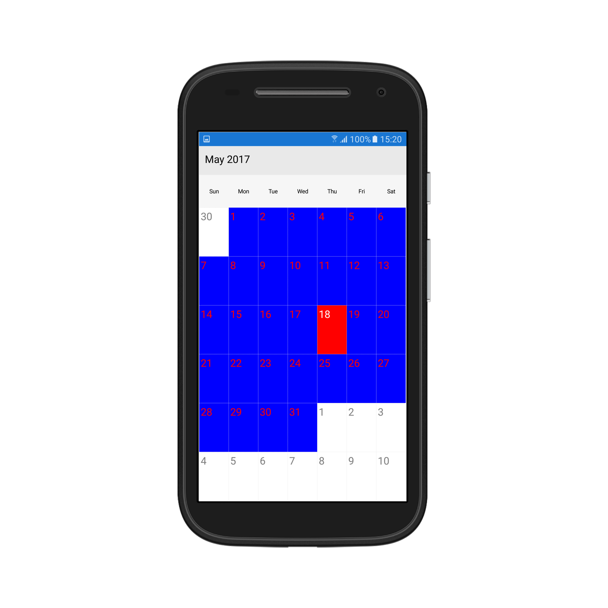
    
### Customize month cell using event
By using [OnMonthCellLoadedEvent](https://help.syncfusion.com/cr/cref_files/xamarin/sfschedule/Syncfusion.SfSchedule.XForms~Syncfusion.SfSchedule.XForms.SfSchedule~OnMonthCellLoadedEvent_EV.html) in `SfSchedule`, you can customize the month cell properties in the run time. In `OnMonthCellLoadedEvent`, arguments such as [cellStyle](https://help.syncfusion.com/cr/cref_files/xamarin/sfschedule/Syncfusion.SfSchedule.XForms~Syncfusion.SfSchedule.XForms.MonthCellLoadedEventArgs~cellStyle.html), [appointments](https://help.syncfusion.com/cr/cref_files/xamarin/sfschedule/Syncfusion.SfSchedule.XForms~Syncfusion.SfSchedule.XForms.MonthCellLoadedEventArgs~appointments.html), [date](https://help.syncfusion.com/cr/cref_files/xamarin/sfschedule/Syncfusion.SfSchedule.XForms~Syncfusion.SfSchedule.XForms.MonthCellLoadedEventArgs~date.html), [view](https://help.syncfusion.com/cr/cref_files/xamarin/sfschedule/Syncfusion.SfSchedule.XForms~Syncfusion.SfSchedule.XForms.MonthCellLoadedEventArgs~view.html) and boolean properties such as [isToday](https://help.syncfusion.com/cr/cref_files/xamarin/sfschedule/Syncfusion.SfSchedule.XForms~Syncfusion.SfSchedule.XForms.MonthCellLoadedEventArgs~isToday.html), [isNextMonthDate](https://help.syncfusion.com/cr/cref_files/xamarin/sfschedule/Syncfusion.SfSchedule.XForms~Syncfusion.SfSchedule.XForms.MonthCellLoadedEventArgs~isNextMonthDate.html), [isPreviousMonthDate](https://help.syncfusion.com/cr/cref_files/xamarin/sfschedule/Syncfusion.SfSchedule.XForms~Syncfusion.SfSchedule.XForms.MonthCellLoadedEventArgs~isPreviousMonthDate.html) and [isBlackOutDate](https://help.syncfusion.com/cr/cref_files/xamarin/sfschedule/Syncfusion.SfSchedule.XForms~Syncfusion.SfSchedule.XForms.MonthCellLoadedEventArgs~isBlackOutDate.html) are in the [MonthCellLoadedEventArgs](https://help.syncfusion.com/cr/cref_files/xamarin/sfschedule/Syncfusion.SfSchedule.XForms~Syncfusion.SfSchedule.XForms.MonthCellLoadedEventArgs.html). 



schedule.OnMonthCellLoadedEvent += Schedule_OnMonthCellLoadedEvent;

...
	
private void Schedule_OnMonthCellLoadedEvent(object sender, MonthCellLoadedEventArgs args)
{
	args.cellStyle = new CellStyle();
	if (args.isToday)
	{
		args.cellStyle.BackgroundColor = Color.FromHex("#f97272");
		args.cellStyle.TextColor = Color.White;
		args.cellStyle.TextStyle = Font.OfSize("Arial", 25);
	}
	else if (args.isNextMonthDate)
	{
		args.cellStyle.BackgroundColor = Color.White;
		args.cellStyle.TextColor = Color.Gray;
		args.cellStyle.TextStyle = Font.OfSize("Arial", 10);
	}
	else if (args.isPreviousMonthDate)
	{
		args.cellStyle.BackgroundColor = Color.White;
		args.cellStyle.TextColor = Color.Gray;
		args.cellStyle.TextStyle = Font.OfSize("Arial", 10);
	}
	else
	{
		args.cellStyle.BackgroundColor = Color.FromHex("#8282ff");
		args.cellStyle.TextColor = Color.White;
		args.cellStyle.TextStyle = Font.OfSize("Arial", 20);
	}
}



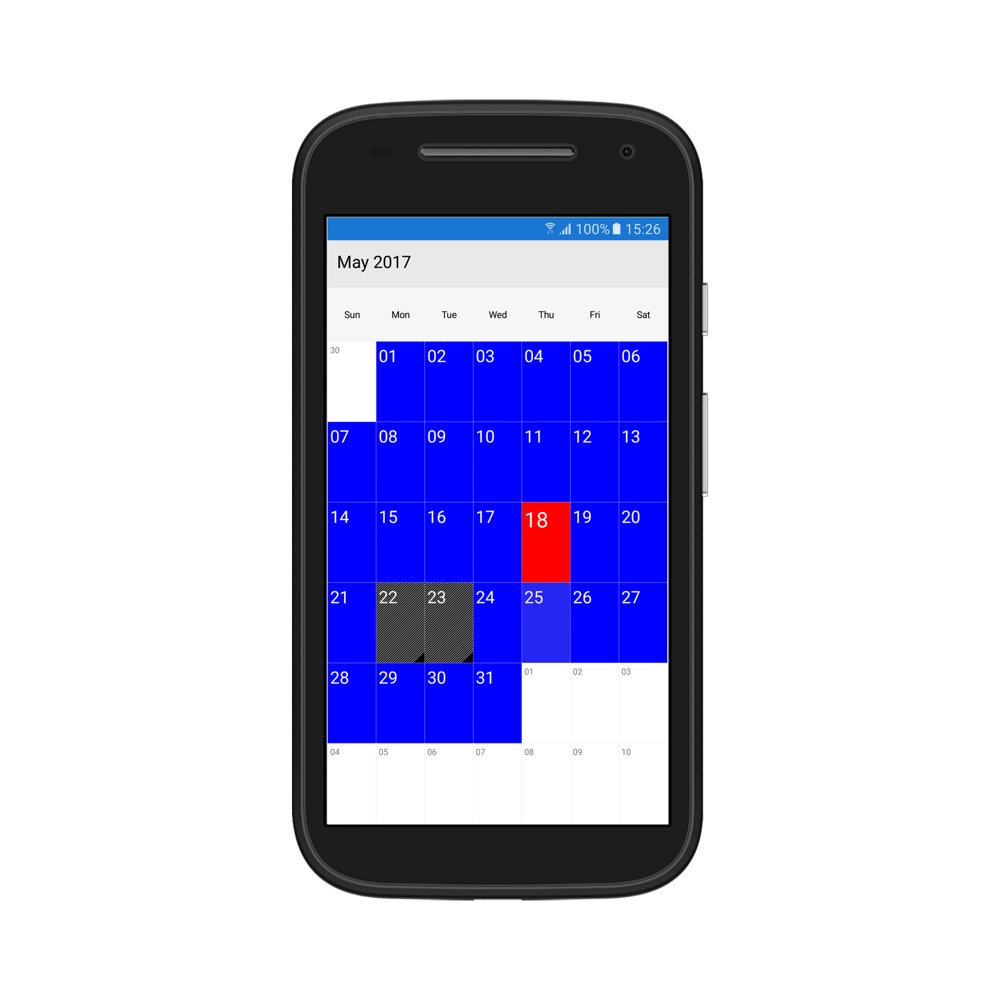

>**NOTE**
FontAttributes and FontFamily are native to the  platform. Custom font and the font which are not available in the specified platform will not be applied.

#### Customize month cell with custom UI 
You can set the Custom UI for the month cell using [view](https://help.syncfusion.com/cr/cref_files/xamarin/sfschedule/Syncfusion.SfSchedule.XForms~Syncfusion.SfSchedule.XForms.MonthCellLoadedEventArgs~view.html) property of `MonthCellLoadedEventArgs` in the `OnMonthCellLoadedEvent`.



schedule.OnMonthCellLoadedEvent += Schedule_OnMonthCellLoadedEvent;

...

private void Schedule_OnMonthCellLoadedEvent(object sender, MonthCellLoadedEventArgs args)
{
	Button button = new Button();
	button.Text = args.date.Day.ToString();
	button.BackgroundColor = Color.Blue;
	button.TextColor = Color.White;
	args.view = button;
	if (args.isToday)
	{
		button.BackgroundColor = Color.Red;
		button.TextColor = Color.White;
	}
}



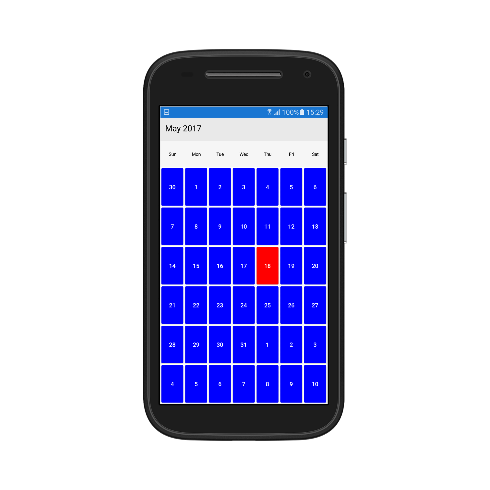

### Customize month cell using DataTemplate
You can customize the default appearance of the month cell by using the [MonthCellTemplate](https://help.syncfusion.com/cr/cref_files/xamarin/sfschedule/Syncfusion.SfSchedule.XForms~Syncfusion.SfSchedule.XForms.MonthViewSettings~MonthCellTemplate.html) property of `MonthViewSettings`.


	
	<schedule:SfSchedule
        x:Name="schedule" ScheduleView="MonthView">
		<schedule:SfSchedule.MonthViewSettings>
				<schedule:MonthViewSettings>
					<schedule:MonthViewSettings.MonthCellTemplate>
						<DataTemplate>
							<Label BackgroundColor = "Purple" TextColor="White" Text="{Binding Date, StringFormat='{0:dd}'}"/>
						</DataTemplate>
					</schedule:MonthViewSettings.MonthCellTemplate>
				</schedule:MonthViewSettings>
			</schedule:SfSchedule.MonthViewSettings>
	</schedule:SfSchedule>


### Customize month cell using DataTemplateSelector

You can use `DataTemplateSelector` to choose a `DataTemplate` at runtime based on the value of a data-bound to Schedule month cell through `MonthCellTemplate`. It provides multiple DataTemplates to be enabled for Schedule month cell, to customize the appearance of particular month cell. DataTemplateSelector for month cell includes [MonthCellItem](https://help.syncfusion.com/cr/cref_files/xamarin/sfschedule/Syncfusion.SfSchedule.XForms~Syncfusion.SfSchedule.XForms.MonthCellItem.html) as object item and `Schedule` as bindable object. `MonthCellItem` consists of following properties, [Date](https://help.syncfusion.com/cr/cref_files/xamarin/sfschedule/Syncfusion.SfSchedule.XForms~Syncfusion.SfSchedule.XForms.MonthCellItem~Date.html), [Appointments](https://help.syncfusion.com/cr/cref_files/xamarin/sfschedule/Syncfusion.SfSchedule.XForms~Syncfusion.SfSchedule.XForms.MonthCellItem~Appointments.html), [IsLeadingDay](https://help.syncfusion.com/cr/cref_files/xamarin/sfschedule/Syncfusion.SfSchedule.XForms~Syncfusion.SfSchedule.XForms.MonthCellItem~IsLeadingDay.html), [IsTrailingDay](https://help.syncfusion.com/cr/cref_files/xamarin/sfschedule/Syncfusion.SfSchedule.XForms~Syncfusion.SfSchedule.XForms.MonthCellItem~IsTrailingDay.html), [IsBlockOutDay](https://help.syncfusion.com/cr/cref_files/xamarin/sfschedule/Syncfusion.SfSchedule.XForms~Syncfusion.SfSchedule.XForms.MonthCellItem~IsBlockOutDay.html).


<ContentPage.Resources>
        <ResourceDictionary>
			 <samplelocal:MonthCellDataTemplateSelector x:Key="monthCellDataTemplateSelector" />
        </ResourceDictionary>
</ContentPage.Resources>

<ContentPage.Content>
    <schedule:SfSchedule
            AppointmentTemplate="{StaticResource appointmentDataTemplateSelector}">
            <schedule:SfSchedule.BindingContext>
                <samplelocal:AppointmentDataTemplateSelector />
            </schedule:SfSchedule.BindingContext>
    </schedule:SfSchedule>
</ContentPage.Content>



#### Creating a DataTemplateSelector



	public class MonthCellDataTemplateSelector : DataTemplateSelector
	{
		public DataTemplate MonthDatesTemplate { get; set; }
		public DataTemplate CurrentViewDatesTemplate { get; set; }
		public DataTemplate CheckUpDateTemplate { get; set; }
		public DataTemplate ConferenceDateTemplate { get; set; }

		public MonthCellDataTemplateSelector()
		{
			MonthDatesTemplate = new DataTemplate(typeof(MonthDatesTemplate));
			CurrentViewDatesTemplate = new DataTemplate(typeof(CurrentViewDatesTemplate));
			CheckUpDateTemplate = new DataTemplate(typeof(CheckUpDateTemplate));
			ConferenceDateTemplate = new DataTemplate(typeof(ConferenceDateTemplate));
		}
		protected override DataTemplate OnSelectTemplate(object item, BindableObject container)
		{
			var sfSchedule = (container as Syncfusion.SfSchedule.XForms.SfSchedule);
			if (sfSchedule == null) return null;
			if (sfSchedule != null)
			{
				var appointments = (IList)(item as MonthCellItem).Appointments;

				foreach (var appointment in appointments)
				{
					if ((appointment as ScheduleAppointment).Subject == "Conference")
						return ConferenceDateTemplate;
					else if ((appointment as ScheduleAppointment).Subject == "Checkup")
						return CheckUpDateTemplate;
				}

				if ((item as MonthCellItem).IsLeadingDay || (item as MonthCellItem).IsTrailingDay)
					return MonthDatesTemplate;
				else
					return CurrentViewDatesTemplate;
			}
			else
				return null;
		}
	}		

Used Label to display current ,next and previous month cell dates and StackLayout with label and image to denote the month cell with appointments.



	<?xml version="1.0" encoding="UTF-8"?>
	<!--Label as template to display current month view dates-->
	<Label xmlns="http://xamarin.com/schemas/2014/forms" 
		xmlns:x="http://schemas.microsoft.com/winfx/2009/xaml" 
		x:Class="MonthCellTemplate_Forms.CurrentViewDatesTemplate"
		BackgroundColor ="Transparent" FontSize="13" TextColor="Black"
		Text = "{Binding Date, StringFormat='{0:dd}'}">
	</Label>

	...

	<?xml version="1.0" encoding="UTF-8"?>
	<!--Label as Template to display next/previous month dates-->
	<Label xmlns="http://xamarin.com/schemas/2014/forms" 
		xmlns:x="http://schemas.microsoft.com/winfx/2009/xaml"
		x:Class="MonthCellTemplate_Forms.MonthDatesTemplate"
		BackgroundColor ="Transparent"
		Text="{Binding Date, StringFormat='{0:dd}'}" 
    	FontSize="13" TextColor="Gray">
	</Label>

	...

	<?xml version="1.0" encoding="UTF-8"?>
	<!--StackLayout with Label and Image as Template to display month cell with appointment-->
	<StackLayout xmlns="http://xamarin.com/schemas/2014/forms"
		xmlns:x="http://schemas.microsoft.com/winfx/2009/xaml"
		x:Class="MonthCellTemplate_Forms.CheckUpDateTemplate"
		BackgroundColor ="Transparent" Orientation="Vertical"
		HorizontalOptions="FillAndExpand" VerticalOptions="FillAndExpand" >
	<Label Text = "{Binding Date, StringFormat='{0:dd}'}"  FontSize="13" TextColor="Black" 
		VerticalOptions="FillAndExpand" HorizontalOptions="FillAndExpand"/>
	<Button  x:Name = "button" Image="stethoscope.png" TextColor="Transparent" BackgroundColor ="Transparent" 
		VerticalOptions="FillAndExpand" HorizontalOptions="FillAndExpand"/>
	</StackLayout>



## Getting Inline Appointment details
Using [Appointment](https://help.syncfusion.com/cr/cref_files/xamarin/sfschedule/Syncfusion.SfSchedule.XForms~Syncfusion.SfSchedule.XForms.MonthInlineAppointmentTappedEventArgs~Appointment.html) argument in the [MonthInlineAppointmentTappedEventArgs](https://help.syncfusion.com/cr/cref_files/xamarin/sfschedule/Syncfusion.SfSchedule.XForms~Syncfusion.SfSchedule.XForms.MonthInlineAppointmentTappedEventArgs.html) of [MonthInlineAppointmentTapped](https://help.syncfusion.com/cr/cref_files/xamarin/sfschedule/Syncfusion.SfSchedule.XForms~Syncfusion.SfSchedule.XForms.SfSchedule~MonthInlineAppointmentTapped_EV.html) event, you can get the details Month Inline Appointments details while tapping the specific appointment. You can do the required functions while tapping the inline appointment using this event. 



schedule.MonthInlineAppointmentTapped += Schedule_MonthInlineAppointmentTapped;

...

private void Schedule_MonthInlineAppointmentTapped(object sender, MonthInlineAppointmentTappedEventArgs args)
{
	var appointment = (args.Appointment as ScheduleAppointment);
	DisplayAlert(appointment.Subject, appointment.StartTime.ToString(), "ok");
}



## InlineView Appearance  
By using [OnMonthInlineLoadedEvent](https://help.syncfusion.com/cr/cref_files/xamarin/sfschedule/Syncfusion.SfSchedule.XForms~Syncfusion.SfSchedule.XForms.SfSchedule~OnMonthInlineLoadedEvent_EV.html) in `SfSchedule`, you can customize the month inline view by setting [MonthInlineViewStyle](https://help.syncfusion.com/cr/cref_files/xamarin/sfschedule/Syncfusion.SfSchedule.XForms~Syncfusion.SfSchedule.XForms.MonthInlineViewStyle.html) properties such as [Background](https://help.syncfusion.com/cr/cref_files/xamarin/sfschedule/Syncfusion.SfSchedule.XForms~Syncfusion.SfSchedule.XForms.MonthInlineViewStyle~BackgroundColor.html), [TextColor](https://help.syncfusion.com/cr/cref_files/xamarin/sfschedule/Syncfusion.SfSchedule.XForms~Syncfusion.SfSchedule.XForms.MonthInlineViewStyle~TextColor.html), [FontSize](https://help.syncfusion.com/cr/cref_files/xamarin/sfschedule/Syncfusion.SfSchedule.XForms~Syncfusion.SfSchedule.XForms.MonthInlineViewStyle~FontSize.html), [FontAttributes](https://help.syncfusion.com/cr/cref_files/xamarin/sfschedule/Syncfusion.SfSchedule.XForms~Syncfusion.SfSchedule.XForms.MonthInlineViewStyle~FontAttributes.html), [FontFamily](https://help.syncfusion.com/cr/cref_files/xamarin/sfschedule/Syncfusion.SfSchedule.XForms~Syncfusion.SfSchedule.XForms.MonthInlineViewStyle~FontFamily.html), [TimeTextColor](https://help.syncfusion.com/cr/cref_files/xamarin/sfschedule/Syncfusion.SfSchedule.XForms~Syncfusion.SfSchedule.XForms.MonthInlineViewStyle~TimeTextColor.html), [TimeTextSize](https://help.syncfusion.com/cr/cref_files/xamarin/sfschedule/Syncfusion.SfSchedule.XForms~Syncfusion.SfSchedule.XForms.MonthInlineViewStyle~TimeTextSize.html), [TimeTextFormat](https://help.syncfusion.com/cr/cref_files/xamarin/sfschedule/Syncfusion.SfSchedule.XForms~Syncfusion.SfSchedule.XForms.MonthInlineViewStyle~TimeTextFormat.html) in the run time. In `OnMonthInlineLoadedEvent`, arguments such as [monthInlineViewStyle](https://help.syncfusion.com/cr/cref_files/xamarin/sfschedule/Syncfusion.SfSchedule.XForms~Syncfusion.SfSchedule.XForms.MonthInlineLoadedEventArgs~monthInlineViewStyle.html), [appointments](https://help.syncfusion.com/cr/cref_files/xamarin/sfschedule/Syncfusion.SfSchedule.XForms~Syncfusion.SfSchedule.XForms.MonthInlineLoadedEventArgs~appointments.html), [selectedDate](https://help.syncfusion.com/cr/cref_files/xamarin/sfschedule/Syncfusion.SfSchedule.XForms~Syncfusion.SfSchedule.XForms.MonthInlineLoadedEventArgs~selectedDate.html) are in the MonthInlineLoadedEventArgs.



schedule.OnMonthInlineLoadedEvent += Schedule_OnMonthInlineLoadedEvent;

...

private void Schedule_OnMonthInlineLoadedEvent(object sender, MonthInlineLoadedEventArgs args)
{
    MonthInlineViewStyle monthInlineViewStyle = new MonthInlineViewStyle();
    monthInlineViewStyle.BackgroundColor = Color.Blue;
    monthInlineViewStyle.TextColor = Color.Green;
    monthInlineViewStyle.FontSize = 20;
    monthInlineViewStyle.FontAttributes = FontAttributes.None;
    monthInlineViewStyle.FontFamily = "Times New Roman";
    monthInlineViewStyle.TimeTextColor = Color.Red;
    monthInlineViewStyle.TimeTextSize = 15;
    monthInlineViewStyle.TimeTextFormat = "hh a";
    args.monthInlineViewStyle = monthInlineViewStyle;
}



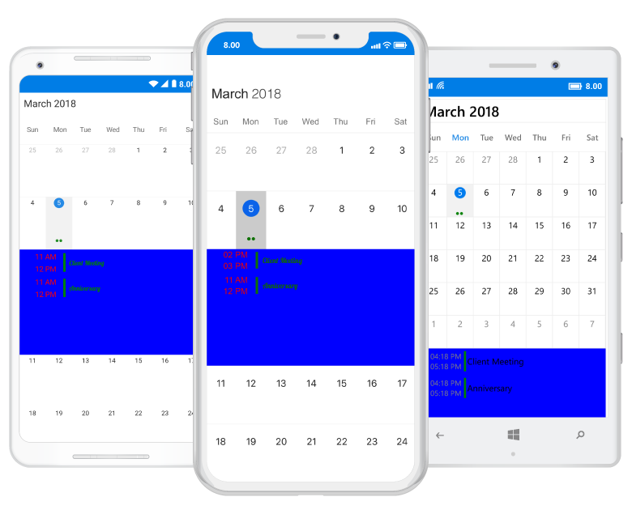

>**NOTE**
FontAttributes and FontFamily are native to the  platform. Custom font and the font which are not available in the specified platform will not be applied.

## InlineAppointment Appearance 
You can customize the Month inline view Appointment by using [OnMonthInlineAppointmentLoadedEvent](https://help.syncfusion.com/cr/cref_files/xamarin/sfschedule/Syncfusion.SfSchedule.XForms~Syncfusion.SfSchedule.XForms.SfSchedule~OnMonthInlineAppointmentLoadedEvent_EV.html) in `SfSchedule`, using [view](https://help.syncfusion.com/cr/cref_files/xamarin/sfschedule/Syncfusion.SfSchedule.XForms~Syncfusion.SfSchedule.XForms.MonthInlineAppointmentLoadedEventArgs~view.html) of [MonthInlineAppointmentLoadedEventArgs](https://help.syncfusion.com/cr/cref_files/xamarin/sfschedule/Syncfusion.SfSchedule.XForms~Syncfusion.SfSchedule.XForms.MonthInlineAppointmentLoadedEventArgs.html) argument. You can get the details of Appointment in the [appointment](https://help.syncfusion.com/cr/cref_files/xamarin/sfschedule/Syncfusion.SfSchedule.XForms~Syncfusion.SfSchedule.XForms.MonthInlineAppointmentLoadedEventArgs~appointment.html) argument.



schedule.OnMonthInlineAppointmentLoadedEvent += Schedule_OnMonthInlineAppointmentLoadedEvent;

...

private void Schedule_OnMonthInlineAppointmentLoadedEvent(object sender, MonthInlineAppointmentLoadedEventArgs args)
{
	var appointment = (args.appointment as ScheduleAppointment);
	Button button = new Button();
	button.Text = appointment.Subject;
	button.BackgroundColor = Color.Blue;
	button.TextColor = Color.White;
	args.view = button;
}



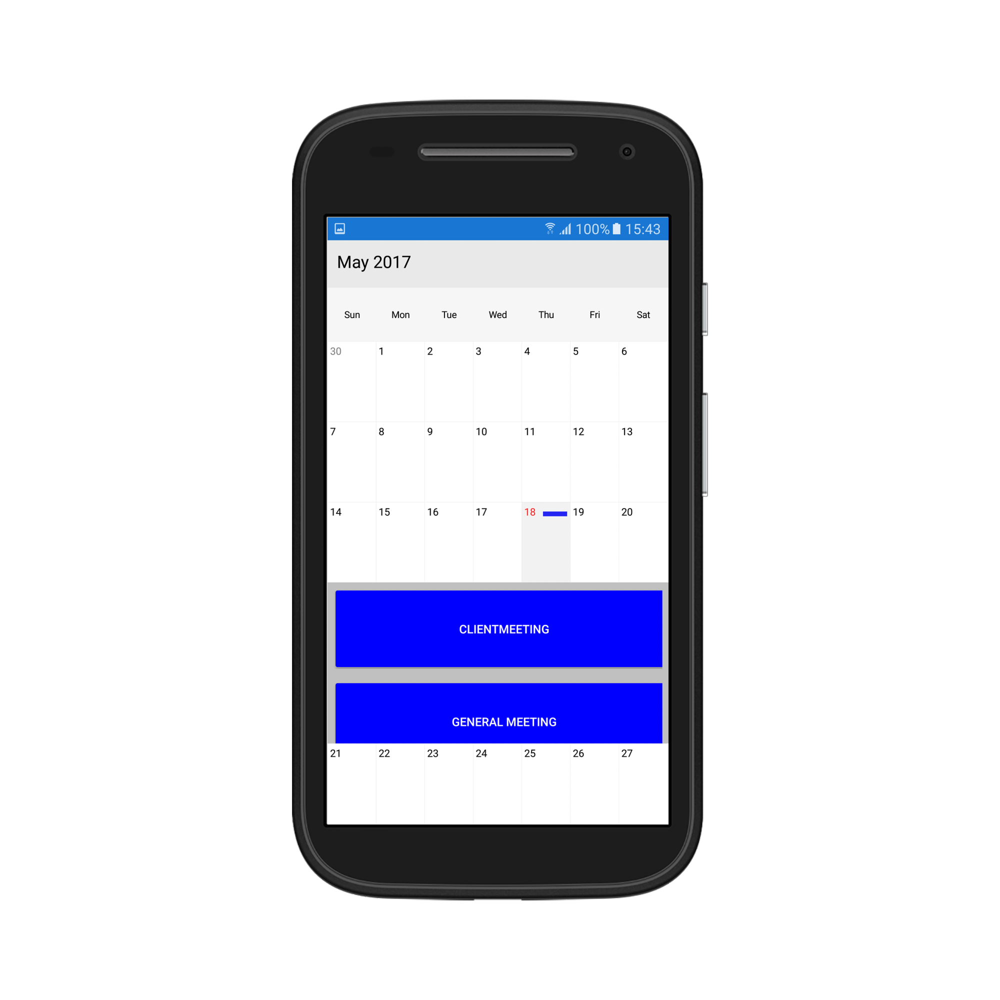

>**NOTE**
Inline view customization - There is no support for inline view appointments customization using custom view, TimeTextSize, TimeTextFormat and TimeTextColor properties in XForms UWP.

## Selection
You can customize the default appearance of selection UI in the month cells.

* [Selection customization using style](#selection-customization-using-style)
* [Selection customization using custom View](#selection-customization-using-custom-view)
* [Programmatic selection](#programmatic-selection)

### Selection customization using style
You can customize the month cell selection by using [SelectionStyle](https://help.syncfusion.com/cr/cref_files/xamarin/sfschedule/Syncfusion.SfSchedule.XForms~Syncfusion.SfSchedule.XForms.SfSchedule~SelectionStyle.html) property of `SfSchedule`.



<schedule:SfSchedule x:Name="schedule" ScheduleView="MonthView">
	<schedule:SfSchedule.SelectionStyle>
		<schedule:SelectionStyle
			BackgroundColor="Blue"
			BorderColor="Black"
			BorderThickness="5"
			BorderCornerRadius="5">
		</schedule:SelectionStyle>
	</schedule:SfSchedule.SelectionStyle>
</schedule:SfSchedule>


schedule.ScheduleView = ScheduleView.MonthView;
//Create new instance of SelectionStyle
SelectionStyle selectionStyle = new SelectionStyle();
selectionStyle.BackgroundColor = Color.Blue;
selectionStyle.BorderColor = Color.Black;
selectionStyle.BorderThickness = 5;
selectionStyle.BorderCornerRadius = 5;
schedule.SelectionStyle = selectionStyle;



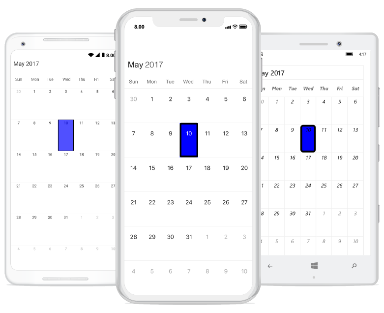

### Selection customization using custom View
You can replace the default selection UI with your custom view by setting [SelectionView](https://help.syncfusion.com/cr/cref_files/xamarin/sfschedule/Syncfusion.SfSchedule.XForms~Syncfusion.SfSchedule.XForms.SfSchedule~SelectionView.html) property of `SfSchedule`.



<schedule:SfSchedule x:Name="schedule" ScheduleView="MonthView">
	<schedule:SfSchedule.SelectionView>
		<Button
			BackgroundColor="#FF9800"
			Text="+NewEvent"
			TextColor="White"/>
	</schedule:SfSchedule.SelectionView>
</schedule:SfSchedule>


schedule.ScheduleView = ScheduleView.MonthView;
//Add the CustomView
Button customView = new Button();
customView.Text = "+NewEvent";
customView.BackgroundColor = Color.FromHex("#FF9800");
customView.TextColor = Color.White;
schedule.SelectionView = customView;



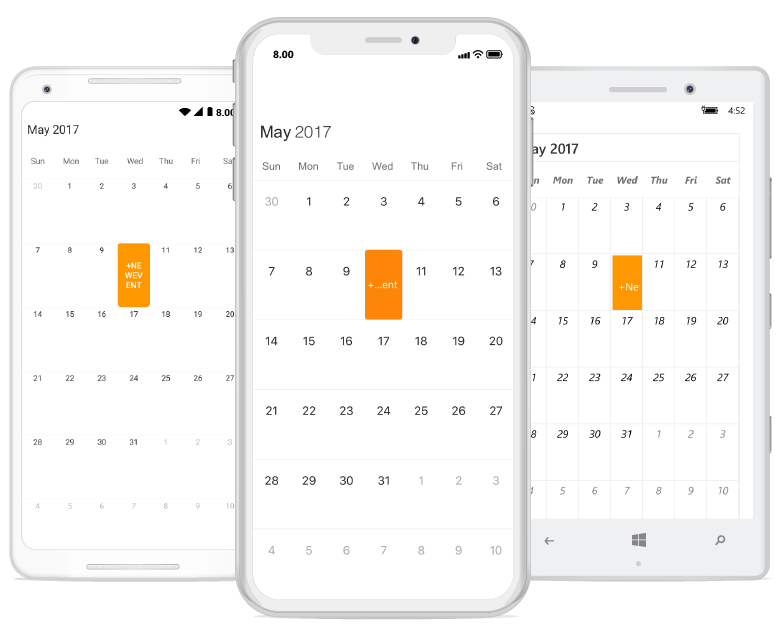

### Programmatic selection
You can programmatically select the specific cell by setting corresponding date to [SelectedDate](https://help.syncfusion.com/cr/cref_files/xamarin/sfschedule/Syncfusion.SfSchedule.XForms~Syncfusion.SfSchedule.XForms.SfSchedule~SelectedDate.html) property of `SfSchedule`. By default, it is null.



// Setting a date to select
schedule.SelectedDate = new DateTime(2017, 10, 04);



You can clear the selection by setting [SelectedDate](https://help.syncfusion.com/cr/cref_files/xamarin/sfschedule/Syncfusion.SfSchedule.XForms~Syncfusion.SfSchedule.XForms.SfSchedule~SelectedDate.html) as null.



// Setting null value to deselect
schedule.SelectedDate = null;



You can download the entire source code of this demo for Xamarin.Forms from here [Date_Selection](http://www.syncfusion.com/downloads/support/directtrac/general/ze/Date_Selection1072247797.zip)

>**NOTE**
* `SfSchedule` does not support multiple selection.
* `SfSchedule` supports two-way binding of `SelectedDate` property.

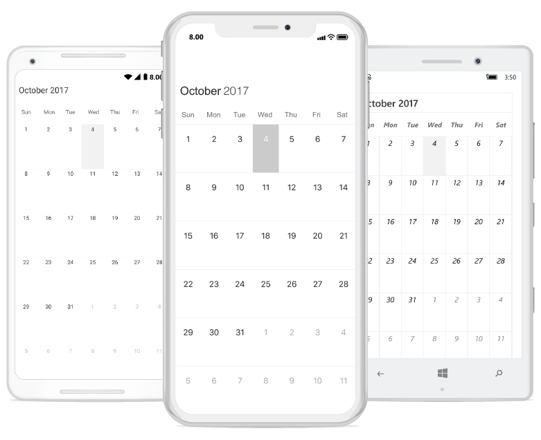

## Today Background Color
You can customize the current date background of  `SfSchedule`  by using [TodayBackground](http://help.syncfusion.com/cr/cref_files/xamarin/sfschedule/Syncfusion.SfSchedule.XForms~Syncfusion.SfSchedule.XForms.MonthViewSettings~TodayBackground.html) property of `MonthViewSettings`.



<schedule:SfSchedule ScheduleView=“MonthView”>
	</schedule:SfSchedule.MonthViewSettings>
		<schedule:MonthViewSettings TodayBackground="Red" />
	</schedule:SfSchedule.MonthViewSettings>
</schedule:SfSchedule>


schedule.ScheduleView = ScheduleView.MonthView;
//Creating new instance of MonthViewSettings
MonthViewSettings monthViewSettings = new MonthViewSettings();
//Customizing background color
monthViewSettings.TodayBackground = Color.Red;
schedule.MonthViewSettings = monthViewSettings;



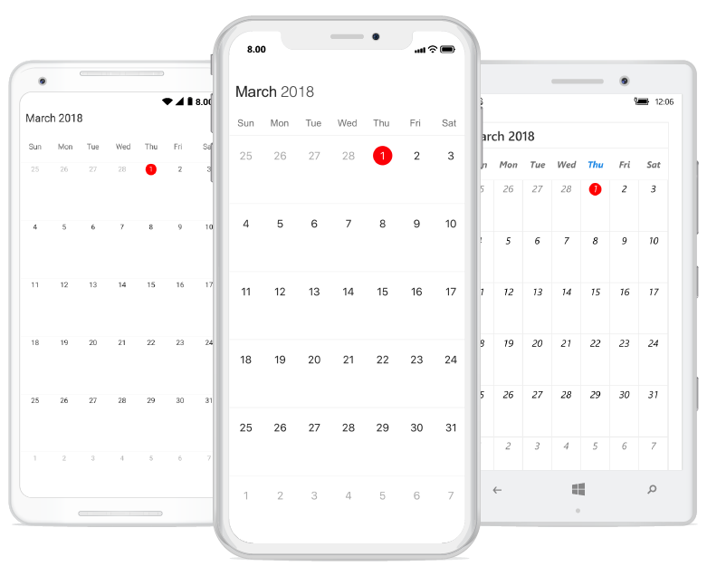

## Custom Font

You can change the appearance of Font by setting the FontFamily property to the following classes.

* [ViewHeaderStyle](https://help.syncfusion.com/xamarin/sfschedule/dayview#viewheader-appearance) - You can change the appearance of [ViewHeaderStyle](https://help.syncfusion.com/xamarin/sfschedule/dayview#viewheader-appearance) by setting the [DayFontFamily](http://help.syncfusion.com/cr/cref_files/xamarin/sfschedule/Syncfusion.SfSchedule.XForms~Syncfusion.SfSchedule.XForms.ViewHeaderStyle~DayFontFamilyProperty.html) and [DateFontFamily](http://help.syncfusion.com/cr/cref_files/xamarin/sfschedule/Syncfusion.SfSchedule.XForms~Syncfusion.SfSchedule.XForms.ViewHeaderStyle~DateFontFamilyProperty.html) properties of Schedule `ViewHeaderStyle`.
* [MonthCellStyle](https://help.syncfusion.com/xamarin/sfschedule/monthview#monthcell-appearance) - You can change the appearance of [MonthCellStyle](https://help.syncfusion.com/xamarin/sfschedule/monthview#monthcell-appearance) by setting the [FontFamily](https://help.syncfusion.com/cr/cref_files/xamarin/sfschedule/Syncfusion.SfSchedule.XForms~Syncfusion.SfSchedule.XForms.MonthViewCellStyle~FontFamily.html) property of Schedule `MonthCellStyle`.
* [MonthInlineViewStyle](https://help.syncfusion.com/xamarin/sfschedule/monthview#inlineview-appearance) - You can change the appearance of [MonthInlineViewStyle](https://help.syncfusion.com/xamarin/sfschedule/monthview#inlineview-appearance) by setting the [FontFamily](https://help.syncfusion.com/cr/cref_files/xamarin/sfschedule/Syncfusion.SfSchedule.XForms~Syncfusion.SfSchedule.XForms.MonthInlineViewStyle~FontFamily.html) property of Schedule `MonthInlineViewStyle`.
* [WeekNumberStyle](https://help.syncfusion.com/xamarin/sfschedule/monthview#week-number-appearance) - You can change the appearance of [WeekNumber](https://help.syncfusion.com/xamarin/sfschedule/monthview#week-number-appearance) by setting the [FontFamily](https://help.syncfusion.com/cr/cref_files/xamarin/sfschedule/Syncfusion.SfSchedule.XForms~Syncfusion.SfSchedule.XForms.WeekNumberStyle~FontFamily.html) property of Schedule `WeekNumberStyle`.



<schedule:ViewHeaderStyle.DayFontFamily>
	<OnPlatform x:TypeArguments="x:String" iOS="Lobster-Regular" Android="Lobster-Regular.ttf" WinPhone="Assets/Lobster-Regular.ttf#Lobster" />
</schedule:ViewHeaderStyle.DayFontFamily>


viewHeaderStyle.DayFontFamily = Device.OnPlatform("Lobster-Regular", "Lobster-Regular.ttf", "Assets/Lobster-Regular.ttf#Lobster");



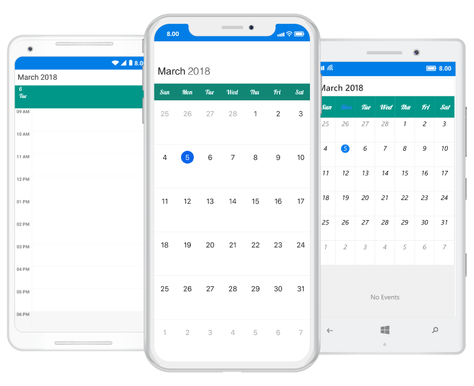



<schedule:MonthCellStyle.FontFamily>
	<OnPlatform x:TypeArguments="x:String" iOS="Lobster-Regular" Android="Lobster-Regular.ttf" WinPhone="Assets/Lobster-Regular.ttf#Lobster" />
</schedule:ViewHeaderStyle.FontFamily>


monthCellStyle.FontFamily = Device.OnPlatform("Lobster-Regular", "Lobster-Regular.ttf", "Assets/Lobster-Regular.ttf#Lobster");



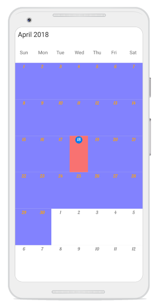



schedule.OnMonthInlineLoadedEvent += Schedule_OnMonthInlineLoadedEvent;

...

private void Schedule_OnMonthInlineLoadedEvent(object sender, MonthInlineLoadedEventArgs args)
{
	MonthInlineViewStyle monthInlineViewStyle = new MonthInlineViewStyle();
	monthInlineViewStyle.FontFamily = Device.OnPlatform("Lobster=Regular", "Lobster-Regular.ttf", "Assets/Lobster-Regular.ttf#Lobster");
	args.monthInlineViewStyle = monthInlineViewStyle;
}





weekNumberStyle.FontFamily = Device.OnPlatform("Lobster=Regular", "Lobster-Regular.ttf", "Assets/Lobster-Regular.ttf#Lobster");



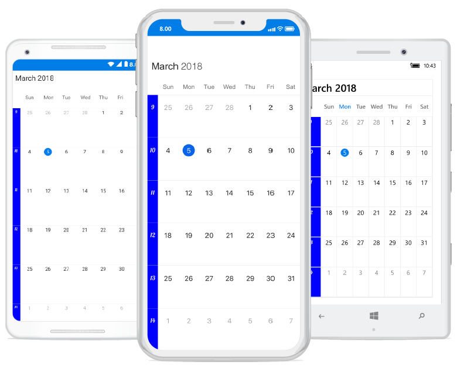

Following steps will explain how to configure the custom fonts.

### Custom Font Setting in Xamarin.Forms (Android)
* Add your custom Font (e.g. Lobster-Regular.ttf) to the Assets folder in the Assets folder of the Xamarin.Forms (Android) project.
* Then, use the Custom Font name as FontFamily.

### Custom Font Setting in Xamarin.Forms (ios)
* Add your custom Font (e.g. Lobster-Regular.ttf) to the Resources folder of the Xamarin.Forms (iOS) project.
* Edit info.plist and add a key Fonts provided by application (value type should be Array). In item0 of the array enter the name of the FontFamily you added in the Resource folder. (Such as Lobster-Regular.ttf).
* Then, use the Custom Font name as FontFamily.

>**NOTE**
 No need to mention .ttf when set the Custom Font in iOS.

### Custom Font Setting in Xamarin.Forms (UWP)
* Add your custom Font (e.g. Lobster-Regular.ttf) to the Assets folder of the Xamarin.Forms (UWP) project.
* Then, use the Custom Font name as FontFamily. When Setting custom font in UWP use the format (FontFamily = ” Assets/Lobster-Regular.ttf#Lobster”).
