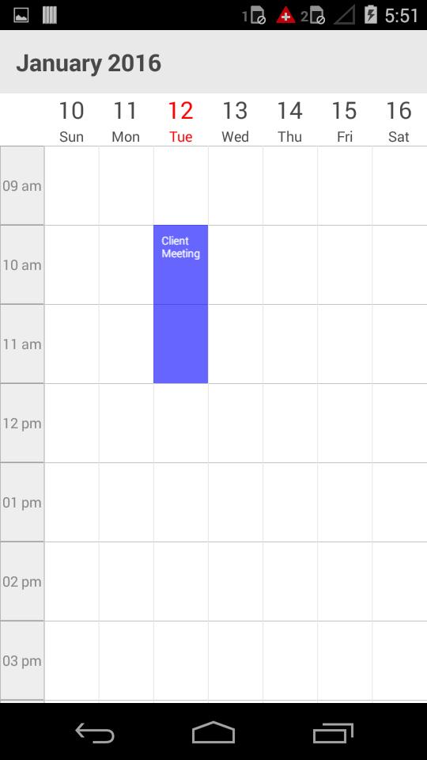

---

layout: post
title: Populating Appointments in Syncfusion SfSchedule control for Xamarin.Forms
description: Learn how to Populate Appointments in SfSchedule control
platform: Xamarin.Forms
control: SfSchedule
documentation: ug

---

# POPULATING APPOINTMENTS

Schedule control has an inbuilt capability to handle the appointment arrangement internally based on the ScheduleAppointment collections. ScheduleAppointment is a class, which holds the details about the appointment to be rendered in schedule. Schedule Appointments collection can be provided to schedule using the following method.

### Adding appointments using Collection

ScheduleAppointment has some basic properties such as StartTime, EndTime, Subject and some additional information about the appointment can be added using Color, Notes, Location, All Day, Recursive properties.

Create the collection of the ScheduleAppointments by setting required details using above mentioned properties for each appointment. And then assign the created collection to the “DataSource” property of SfSchedule as like in below code example.


    
    ScheduleAppointmentCollection appointmentCollection;
    
    //creating new instance for schedule
    SfSchedule sfschedule=new SfSchedule();
    sfschedule.ScheduleView = ScheduleView.WeekView;
    appointmentCollection = new ScheduleAppointmentCollection();
    
    //Creating new event
    ScheduleAppointment clientMeeting = new ScheduleAppointment()
    
    DateTime currentDate = DateTime.Now;
    DateTime startTime = new DateTime (currentDate.Year,currentDate.Month,currentDate.Day, 10, 0, 0); 
    DateTime endTime = new DateTime (currentDate.Year, currentDate.Month,currentDate.Day, 12, 0, 0);
    
    clientMeeting.StartTime = startTime;
    clientMeeting.EndTime = endTime;
    clientMeeting.Color = Color.Blue;
    clientMeeting.Subject = “ClientMeeting”;
    appointmentCollection.Add(clientMeeting);
    sfschedule.DataSource = appointmentCollection;
    this.Content= sfschedule;
    


<table>
<tr>
<td>
{{''| markdownify }}
</td><td>
{{''| markdownify }}
</td><td>
{{''| markdownify }}
</td></tr>
</table>