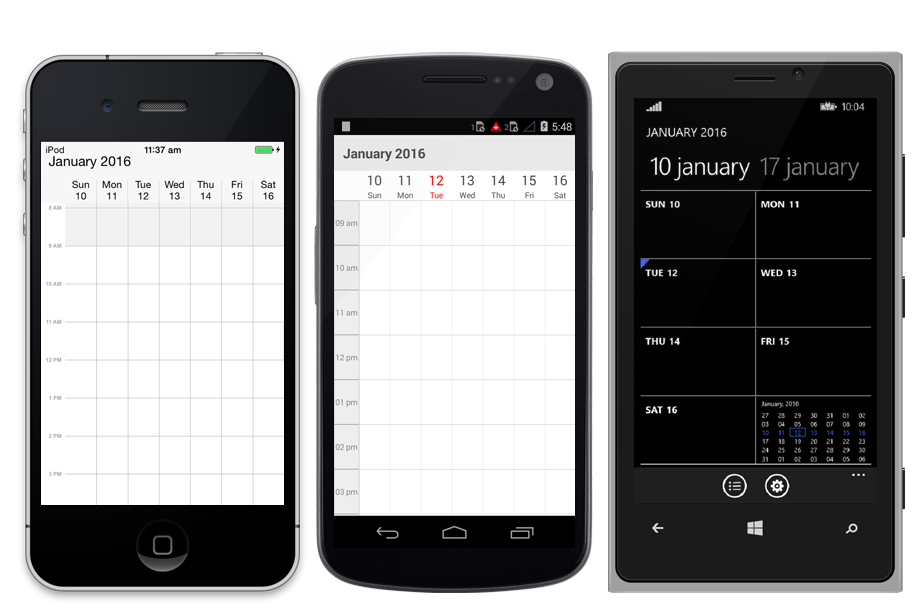
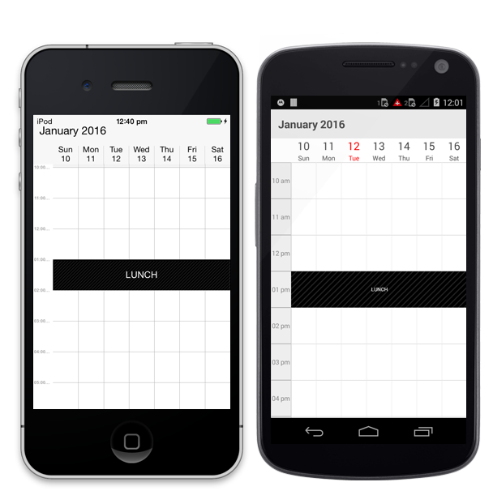
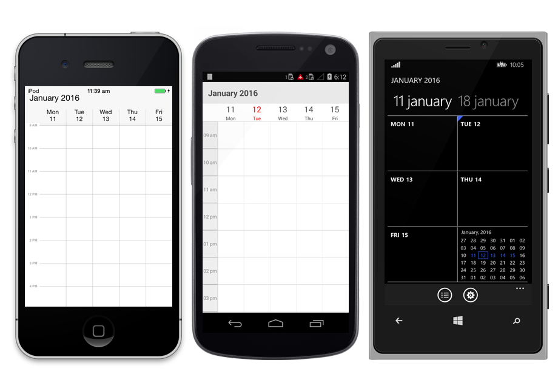
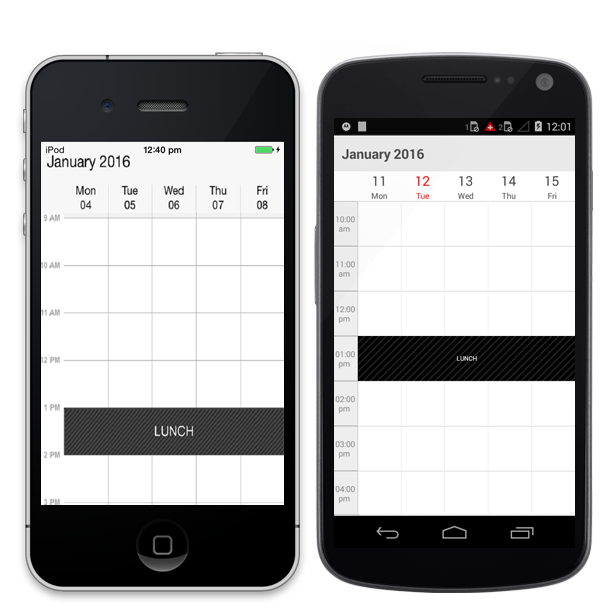
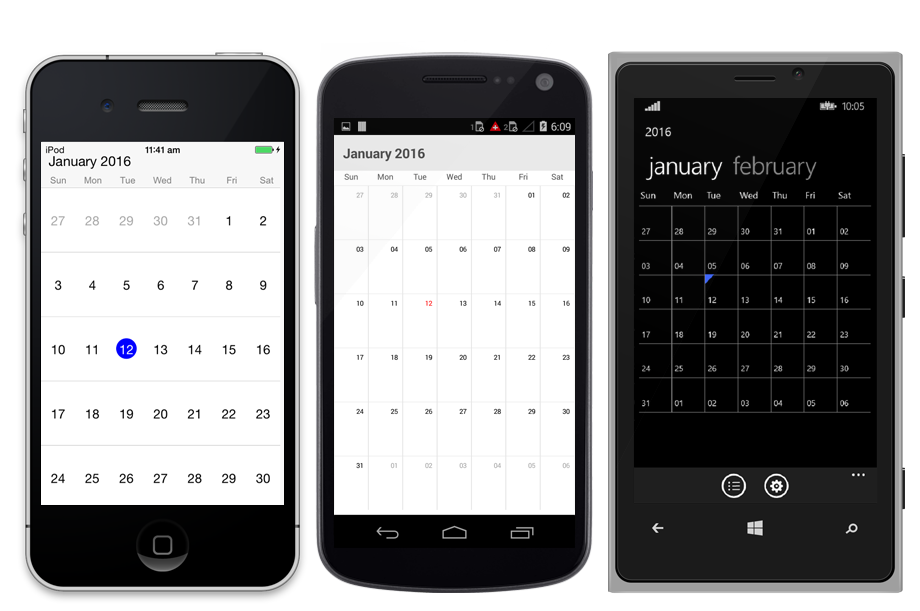
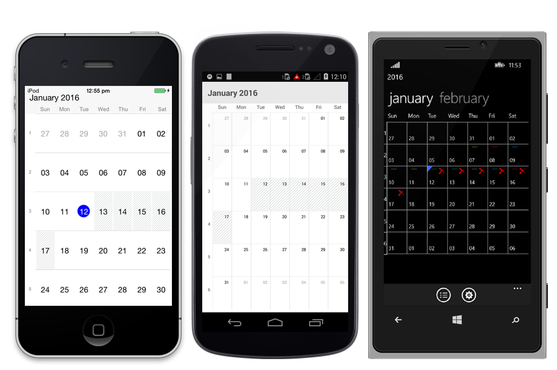

# VIEWS

Schedule control provides four different types of views to display dates. Day view, Week view, WorkWeek view and month view. It can be assigned to the schedule control by using `ScheduleView` property. Based on the user’s preference appointments can be viewed in any of the four type of view available. By default schedule control is assigned with day view.

## Day View

Day view is used to display a single day, current day will be visible by default. Appointments on a specific day will be arranged in respective timeslots based on its duration.



    //creating new instance for schedule
    SfSchedule sfschedule= new SfSchedule ();
    
    //setting schedule view
    sfschedule.ScheduleView = ScheduleView.DayView;
    
    this.Content= sfschedule;
    


### Settings

#### Date Time Formatting

You can format the time string in the schedule control using `DayLabelSettings` of DayViewSettings.

#### Non-Accessible Blocks

You can restrict/allocate certain timeslot as Non-accessible block using `NonAccessibleBlocks` of DayViewSettings, so that you can allocate those timeslots for predefined events/activities like Lunch hour.

#### Working Hours

You can differentiate working hours with non-working hour timeslots by its color using `WorkStartHour` and `WorkEndHour` properties of DayViewSettings.

#### All Day Appointments Panel

You can view AllDay appointments in separate panel and the panel’s visibility can be enabled by setting `ShowAllDay` property of DayViewSettings as true. 



    //setting day view settings properties 
    
    DayViewSettings dayViewSettings = new DayViewSettings ();
    dayViewSettings.WorkStartHour = 10;
    dayViewSettings.WorkEndHour = 18;
    dayViewSettings.ShowAllDay = true;
    
    //setting non-accessing blocks.
    
    NonAccessibleBlock nonAccessibleBlock = new NonAccessibleBlock ();
    NonAccessibleBlocksCollection nonAccessibleBlocksCollection = new NonAccessibleBlocksCollection ();
    nonAccessibleBlock.StartTime = 13;
    nonAccessibleBlock.EndTime = 14;
    nonAccessibleBlock.Text = “LUNCH”;
    nonAccessibleBlock.Color = Color.Black;
    nonAccessibleBlocksCollection.Add (nonAccessibleBlock);
    dayViewSettings.NonAccessibleBlocks = nonAccessibleBlocksCollection;
    sfschedule.DayViewSettings = dayViewSettings;
    
    //setting label size and formats
    
    DayLabelSettings dayLabelSettings =new DayLabelSettings();
    dayLabelSettings.TimeFormat =("hh*mm a");
    dayViewSettings.DayLabelSettings= (dayLabelSettings);
    sfschedule.DayViewSettings = (dayViewSettings);
    this.content = sfschedule;
    
  
 

## Week View

To view all the seven days of a particular week, by default if will be current week. Appointments arranged in timeslots based on its duration with respective day of the week.



    //creating new instance for schedule
    SfSchedule sfschedule= new SfSchedule ();
    
    //setting schedule view
    sfschedule.ScheduleView = ScheduleView.WeekView;
    
    this.Content= sfschedule;
    


### Settings

#### Date Time Formatting

You can format the time string in the schedule control using `WeekLabelSettings` of WeekViewSettings.

#### Non-Accessible Blocks

You can restrict/allocate certain timeslot as Non-accessible block using `NonAccessibleBlocks` of WeekViewSettings, so that you can allocate those timeslots for predefined events/activities like Lunch hour.

#### Working Hours

You can differentiate working hours with non-working hour timeslots by its color using `WorkStartHour` and `WorkEndHour` properties of WeekViewSettings.

#### All Day Appointments Panel

You can view Allday appointments in separate panel and the panel’s visibility can be enabled by setting `ShowAllDay` property of WeekViewSettings as true. 


    
    //setting week view settings properties
    WeekViewSettings weekViewSettings = new WeekViewSettings ();
    weekViewSettings.WorkStartHour = 10;
    weekViewSettings.WorkEndHour = 18;
    weekViewSettings.ShowAllDay = true;
    
    //setting non-accessing blocks
    NonAccessibleBlock nonAccessibleBlock = new NonAccessibleBlock ();
    NonAccessibleBlocksCollection nonAccessibleBlocksCollection = new NonAccessibleBlocksCollection ();
    nonAccessibleBlock.StartTime = 13;
    nonAccessibleBlock.EndTime = 14;
    nonAccessibleBlock.Text = "LUNCH”; 
    nonAccessibleBlock.Color = Color.Black;
    nonAccessibleBlocksCollection.Add (nonAccessibleBlock);
    weekViewSettings.NonAccessibleBlocks = nonAccessibleBlocksCollection;
    sfschedule.WeekViewSettings = weekViewSettings;
    
    //setting label size and formats
    WeekLabelSettings weekLabelSettings = new WeekLabelSettings (); 
    weekLabelSettings.TimeFormat =("hh:mm a ");
    weekViewSettings.WeekLabelSettings = (weekLabelSettings);
    sfschedule.WeekViewSettings = (weekViewSettings);
    this.Content= sfschedule;
    


>**NOTE**:
Non-Accessible Block is not applicable in Windows Phone.

## Work Week View

To view working days of a particular week, by default current work week will be displayed. Saturday and Sunday are the non-working days by default; it can be customized with any days in a week. Appointments arranged in timeslots based on its duration with respective day of the week.



    //creating new instance for schedule
    SfSchedule sfschedule= new SfSchedule ();
    
    //setting schedule view
    sfschedule.ScheduleView = ScheduleView.WorkWeekView;
    
    this.Content= sfschedule;
    


### Settings

#### Date Time Formatting

You can format the time string in the schedule control using `WorkWeekLabelSettings` of WorkWeekViewSettings.

#### Non-Accessible Blocks

You can restrict/allocate certain timeslot as Non-accessible block using `NonAccessibleBlocks` of WorkWeekViewSettings, so that you can allocate those timeslots for predefined events/activities like Lunch hour.

#### Working Hours

You can differentiate working hours with non-working hour timeslots by its colour using `WorkStartHour` and `WorkEndHour`  properties of WorkWeekViewSettings.

#### All Day Appointments Panel

You can view Allday appointments in separate panel and the panel’s visibility can be enabled by setting `ShowAllDay`  property of WorkWeekViewSettings as true. 



    //setting workweekviewsettings properties
    
    WorkWeekViewSettings workWeekViewSettings = new WorkWeekViewSettings ();
    workWeekViewSettings.WorkStartHour = 10;
    workWeekViewSettings.WorkEndHour = 18;
    workWeekViewSettings.ShowAllDay = true;
    
    //setting non-accessing blocks.
    
    NonAccessibleBlock nonAccessibleBlock = new NonAccessibleBlock ();
    NonAccessibleBlocksCollection nonAccessibleBlocksCollection = new NonAccessibleBlocksCollection ();
    nonAccessibleBlock.StartTime = 13;
    nonAccessibleBlock.EndTime = 14;
    nonAccessibleBlock.Text = "LUNCH”;
    nonAccessibleBlock.Color = Color.Black;
    nonAccessibleBlocksCollection.Add (nonAccessibleBlock);
    workWeekViewSettings.NonAccessibleBlocks = nonAccessibleBlocksCollection;
    sfschedule.WorkWeekViewSettings = workWeekViewSettings;
    
    //setting label size and formats
    WorkWeekLabelSettings workWeekLabelSettings = new WorkWeekLabelSettings();
    workWeekLabelSettings.TimeFormat = ("hh:mm a ");
    WorkWeekViewSettings.WorkWeekLabelSettings =(workWeekLabelSettings);
    sfschedule.WorkWeekViewSettings = (workWeekViewSettings);
    this.Content= sfschedule;
    


>**NOTE**:
Non-Accessible Block is not applicable in Windows Phone.

## Month View

To view entire dates of a particular month, by default current month will be displayed initially. Appointments arranged within the cell based on its duration. Current date is differentiated by some color and rest of the dates in a month will be in different color., Also the color differentiation for dates will be applicable for previous and next month dates.



    //creating new instance for schedule
    SfSchedule sfschedule= new SfSchedule ();
    
    //setting schedule view
    sfschedule.ScheduleView = ScheduleView.MonthView;
    
    this.Content= sfschedule;
    


### Settings

#### Date Time formatting

You can format the date and day string in the schedule control using 
[MonthLabelSettings](#_VIEWS "") of MonthViewSettings.

#### Blackout dates

You can restrict/allocate certain month cell as blackout days using `BlackoutDates` of MonthViewSettings, so that we can allocate those cells for predefined events/activities like Scheduled maintenance, planned leave etc.

#### Week number

You display the week number of the year in month view by setting `showWeekNumber` in property of MonthViewSettings are true. By default it is false.



    //setting month view settings properties
    
    MonthViewSettings monthViewSettings =  new MonthViewSettings();
    monthViewSettings.ShowWeekNumber = (true);
    monthViewSettings.ShowAppointmentsInline = (true);
    List<DateTime> black_out_days_collection = new List<DateTime>();
    DateTime date = DateTime.Now.Date;
    DateTime date1 = DateTime.Now.Date.AddDays(1);
    DateTime date2 = DateTime.Now.Date.AddDays(2);
    DateTime date3 = DateTime.Now.Date.AddDays(3);
    DateTime date4 = DateTime.Now.Date.AddDays(4);
    DateTime date5 = DateTime.Now.Date.AddDays(5);
  
    black_out_days_collection.Add(date);
    black_out_days_collection.Add(date1);
    black_out_days_collection.Add(date2);
    black_out_days_collection.Add(date3);
    black_out_days_collection.Add(date4);
    black_out_days_collection.Add(date5);
    monthViewSettings.BlackoutDates = black_out_days_collection;
    
    //setting label size and formats
    MonthLabelSettings monthLabelSettings  = new MonthLabelSettings();
    monthLabelSettings.DayFormat=("E");
    monthLabelSettings. DateFormat=("dd");
    monthViewSettings.MonthLabelSettings = (monthLabelSettings);
    schedule.MonthViewSettings = (monthViewSettings);
    this.Content = (sfschedule);



