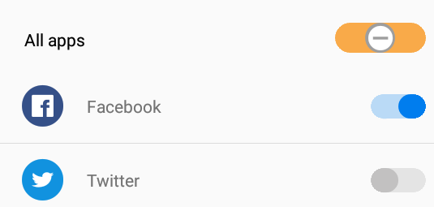

# Customize the appearance of segmented control as switch

The segmented control can be customized like a switch using the [`VisibleSegmentsCount`](https://help.syncfusion.com/cr/cref_files/xamarin/Syncfusion.Buttons.XForms~Syncfusion.XForms.Buttons.SfSegmentedControl~VisibleSegmentsCount.html), [`SelectionIndicatorSettings`](https://help.syncfusion.com/cr/cref_files/xamarin/Syncfusion.Buttons.XForms~Syncfusion.XForms.Buttons.SfSegmentedControl~SelectionIndicatorSettings.html) properties and the [`SelectionChanged`](https://help.syncfusion.com/cr/cref_files/xamarin/Syncfusion.Buttons.XForms~Syncfusion.XForms.Buttons.SfSegmentedControl~SelectionChanged_EV.html) event. By setting the value of [`VisibleSegmentsCount`](https://help.syncfusion.com/cr/cref_files/xamarin/Syncfusion.Buttons.XForms~Syncfusion.XForms.Buttons.SfSegmentedControl~VisibleSegmentsCount.html) to two, you can customize the appearance of SegmentedControl like a normal switch. For intermediate switch, set the value of [`VisibleSegmentsCount`](https://help.syncfusion.com/cr/cref_files/xamarin/Syncfusion.Buttons.XForms~Syncfusion.XForms.Buttons.SfSegmentedControl~VisibleSegmentsCount.html) to three.

You can use the SelectionIndicatorSettings and SelectionChanged events to customize the UI of switch when toggling the segmented control. The following code example demonstrates how to customize the appearance of SegmentedControl as switch.





<buttons:SfSegmentedControl x:Name="segmentedControl"
                            CornerRadius="13"
                            SegmentHeight="25"
                            BorderThickness="0"
                            WidthRequest="50"
                            VisibleSegmentsCount="2"
                            ItemsSource="{Binding DataCollection}"
                            SegmentPadding="0"
                            SegmentCornerRadius="13"
                            DisplayMode="Text"
                            SelectionChanged="SfSegmentedControl_SelectionChanged">
    <buttons:SfSegmentedControl.SelectionIndicatorSettings>
        <buttons:SelectionIndicatorSettings x:Name="indicatorSettings"
                                            StrokeThickness="5"
                                            CornerRadius="13"
                                            Position="Fill">
        </buttons:SelectionIndicatorSettings>
    </buttons:SfSegmentedControl.SelectionIndicatorSettings>
</buttons:SfSegmentedControl>





SfSegmentedControl segmentedControl = new SfSegmentedControl()
{
    CornerRadius = 13,
    SegmentHeight = 25,
    BorderThickness = 0,
    WidthRequest = 50,
    VisibleSegmentsCount = 2,
    ItemsSource = viewModel.DataCollection,
    SegmentPadding = 0,
    SegmentCornerRadius = 13,
    DisplayMode = SegmentDisplayMode.Text               
};

segmentedControl.SelectionChanged += SfSegmentedControl_SelectionChanged;

SelectionIndicatorSettings indicatorSettings = new SelectionIndicatorSettings()
{
    StrokeThickness = 3,
    CornerRadius = 13,
    Position = SelectionIndicatorPosition.Fill
};

segmentedControl.SelectionIndicatorSettings = indicatorSettings;

private void SfSegmentedControl_SelectionChanged(object sender, SelectionChangedEventArgs e)
{
    if (e.Index == 0)
    {
        segmentedControl.Color = Color.FromHex("#BADAF6");
        indicatorSettings.Color = Color.FromHex("#007DEE");
    }
    else
    {
        segmentedControl.Color = Color.FromHex("#E4E4E4");
        indicatorSettings.Color = Color.FromHex("#C2C1C1");
    }
}





N> Use the [`SegmentHeight`](https://help.syncfusion.com/cr/cref_files/xamarin/Syncfusion.Buttons.XForms~Syncfusion.XForms.Buttons.SfSegmentedControl~SegmentHeight.html), [`SegmentCornerRadius`](https://help.syncfusion.com/cr/cref_files/xamarin/Syncfusion.Buttons.XForms~Syncfusion.XForms.Buttons.SfSegmentedControl~SegmentCornerRadius.html), and [`CornerRadius`](https://help.syncfusion.com/cr/cref_files/xamarin/Syncfusion.Buttons.XForms~Syncfusion.XForms.Buttons.SfSegmentedControl~CornerRadius.html) properties to change the appearance of switch.

