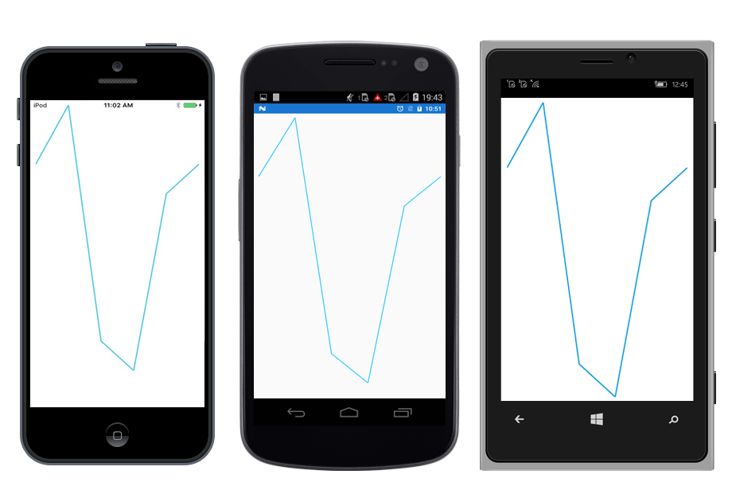

# Getting Started

This section explains you the steps required to populate the Sparkline with data. 

## Adding Sparkline Reference

Refer this [article](https://help.syncfusion.com/xamarin/introduction/download-and-installation) to know how to obtain and reference Essential Studio components in your solution; then refer [this](https://help.syncfusion.com/xamarin/introduction/control-dependencies#sfsparkline) link to know about the assemblies required for adding Sparkline to your project.

I> After adding the reference, currently, an additional step is required for iOS and UWP projects. We need to call Init method in the `SfSparklineRenderer` as shown in this [KB article.](https://www.syncfusion.com/kb/7713)

I> For UWP alone, one more additional step is required if the project is built in release mode with .NET Native tool chain enabled. You can refer the [KB article](https://www.syncfusion.com/kb/7167) for more details.

## Initialize view model

Now, let us define a simple data model that represents a data point in [`SfSparkline`](https://help.syncfusion.com/cr/cref_files/xamarin/Syncfusion.SfSparkline.XForms~Syncfusion.SfSparkline.XForms.SfLineSparkline.html).


public class Model   
{   
    public double Performance { get; set; }
}
 

Next, create a view model class and initialize a list of `Model` objects as shown below,


public class ViewModel  
{
      public List<Model> Data { get; set; }      

      public ViewModel()       
      {
            Data = new List<Model>()
            {
                new Model { Performance = 3000 },
                new Model { Performance = 5000 },
                new Model { Performance = -3000 },
                new Model { Performance = -4000 },
                new Model { Performance = 2000 },
                new Model { Performance = 3000 }
            }; 
       }
 }
 

Set the `ViewModel` instance as the `BindingContext` of your Page; this is done to bind properties of `ViewModel` to [`SfSparkline`.](https://help.syncfusion.com/cr/cref_files/xamarin/Syncfusion.SfSparkline.XForms~Syncfusion.SfSparkline.XForms.SfLineSparkline.html)
 
N> Add namespace of `ViewModel` class in your XAML page if you prefer to set `BindingContext` in XAML.

 

 
<ContentPage xmlns="http://xamarin.com/schemas/2014/forms"

             xmlns:x="http://schemas.microsoft.com/winfx/2009/xaml"

             x:Class=" SparklineDemo.MainPage"

             xmlns:sparkline="clr-namespace:Syncfusion.SfSparkline.XForms;assembly=Syncfusion.SfSparkline.XForms" 

             xmlns:local="clr-namespace:SparklineDemo">    

	<ContentPage.BindingContext>       

		<local:ViewModel></local:ViewModel>  

	</ContentPage.BindingContext>
 
</ContentPage>


 
this.BindingContext = new ViewModel();


 

## Populate Sparkline with data

Import the [`SfSparkline`](https://help.syncfusion.com/cr/cref_files/xamarin/Syncfusion.SfSparkline.XForms~Syncfusion.SfSparkline.XForms.SfLineSparkline.html) namespace as shown below in your respective page,

   


xmlns:sparkline="clr-namespace:Syncfusion.SfSparkline.XForms;assembly=Syncfusion.SfSparkline.XForms"



using Syncfusion.SfSparkline.XForms;


 

Bind the Data property of the above `ViewModel` to the [`SfSparkline.ItemsSource`](https://help.syncfusion.com/cr/cref_files/xamarin/Syncfusion.SfSparkline.XForms~Syncfusion.SfSparkline.XForms.SfSparklineBase~ItemsSource.html) property as shown below.

N> You need to set [`YBindingPath`](https://help.syncfusion.com/cr/cref_files/xamarin/Syncfusion.SfSparkline.XForms~Syncfusion.SfSparkline.XForms.SfSparklineBase~YBindingPath.html) property, so that [`SfSparkline`](https://help.syncfusion.com/cr/cref_files/xamarin/Syncfusion.SfSparkline.XForms~Syncfusion.SfSparkline.XForms.SfLineSparkline.html) would fetch values from the respective property in the data model to plot the Sparkline.

   


<sparkline:SfLineSparkline ItemsSource="{Binding Data}" YBindingPath="Performance"> 

</sparkline:SfLineSparkline >



SfLineSparkline lineSparkline = new SfLineSparkline(); 

lineSparkline.YBindingPath = "Performance";

lineSparkline.SetBinding(SfSparklineBase.ItemsSourceProperty, "Data");


 

You can find the complete getting started sample from this [link.](http://files2.syncfusion.com/Xamarin.Forms/Samples/Sparkline_GettingStarted.zip)
