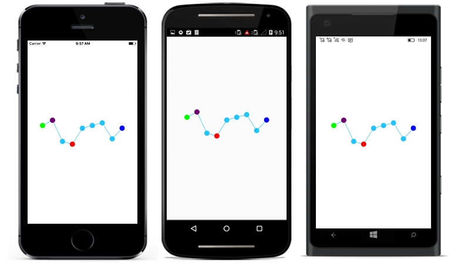
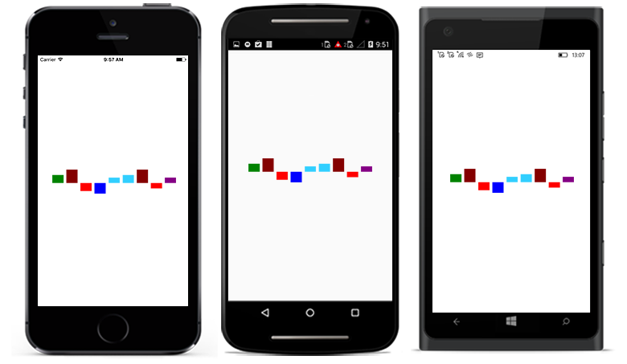

# Customize data points

Color of the first, last, high, low and negative data points can be customized using the following properties.

* [`FirstPointColor`](https://help.syncfusion.com/cr/cref_files/xamarin/Syncfusion.SfSparkline.XForms~Syncfusion.SfSparkline.XForms.SfColumnSparkline~FirstPointColor.html) - used to change the first point color of the sparkline.
* [`LastPointColor`](https://help.syncfusion.com/cr/cref_files/xamarin/Syncfusion.SfSparkline.XForms~Syncfusion.SfSparkline.XForms.SfColumnSparkline~LastPointColor.html) - used to change the last point color of the sparkline.
* [`HighPointColor`](https://help.syncfusion.com/cr/cref_files/xamarin/Syncfusion.SfSparkline.XForms~Syncfusion.SfSparkline.XForms.SfColumnSparkline~HighPointColor.html) - used to change the high point color of the sparkline.
* [`LowPointColor`](https://help.syncfusion.com/cr/cref_files/xamarin/Syncfusion.SfSparkline.XForms~Syncfusion.SfSparkline.XForms.SfColumnSparkline~LowPointColor.html) - used to change the low point color of the sparkline.
* [`NegativePointsColor`](https://help.syncfusion.com/cr/cref_files/xamarin/Syncfusion.SfSparkline.XForms~Syncfusion.SfSparkline.XForms.SfColumnSparkline~NegativePointsColor.html) - used to change the negative point color of the sparkline.

N> [`NegativePointsColor`](https://help.syncfusion.com/cr/cref_files/xamarin/Syncfusion.SfSparkline.XForms~Syncfusion.SfSparkline.XForms.SfColumnSparkline~NegativePointsColor.html) is applicable for [`SfColumnSparkline`](https://help.syncfusion.com/cr/cref_files/xamarin/Syncfusion.SfSparkline.XForms~Syncfusion.SfSparkline.XForms.SfColumnSparkline.html) and [`SfWinLossSparkline`](https://help.syncfusion.com/cr/cref_files/xamarin/Syncfusion.SfSparkline.XForms~Syncfusion.SfSparkline.XForms.SfWinLossSparkline.html) alone.

Code snippet to customize the markers

 



<sparkline:SfLineSparkline ItemsSource = "{Binding Data}" 
                            YBindingPath = "Performance"
                            FirstPointColor="Green"
                            LastPointColor="Blue"
                            HighPointColor="Purple"
                            LowPointColor="Red">  
    <sparkline:SfLineSparkline.Marker>
        <sparkline:MarkerBase IsVisible="True" 
                              Width= "15"
                              Height= "15"/>
    </sparkline:SfLineSparkline.Marker> 
</sparkline:SfLineSparkline>





SfLineSparkline lineSparkline = new SfLineSparkline()
{
    YBindingPath = "Performance",
    ItemsSource = viewModel.Data,
    Marker = new MarkerBase()
    {
        IsVisible = true,
        Width = 15,
        Height = 15
    },

    FirstPointColor = Color.Green,
    LastPointColor = Color.Blue,
    HighPointColor = Color.Purple,
    LowPointColor = Color.Red
};





Code snippet to customize the segments

 



 <sparkline:SfColumnSparkline ItemsSource="{Binding Data}" 
                              YBindingPath="Performance"
                              FirstPointColor="Green"
                              LastPointColor="Purple"
                              HighPointColor="Maroon"
                              LowPointColor="Blue"
                              NegativePointsColor="Red">    
  
</sparkline:SfColumnSparkline>





SfColumnSparkline columnSparkline = new SfColumnSparkline()
{
    YBindingPath = "Performance",
    ItemsSource = viewModel.Data,
    FirstPointColor = Color.Green,
    LastPointColor = Color.Purple,
    HighPointColor = Color.Maroon,
    LowPointColor = Color.Blue,
    NegativePointsColor = Color.Red
};





