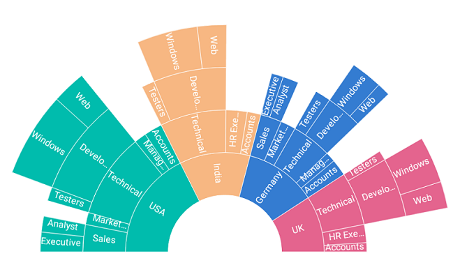
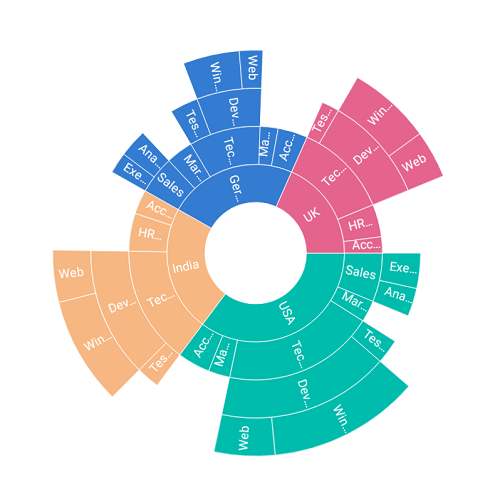
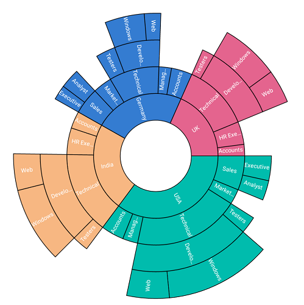

# Customization

The sunburst chart provides various customizing and styling options to enrich the application.

## Palettes

The sunburst chart provides options to apply different kinds of palettes using the [`ColorModel`](https://help.syncfusion.com/cr/cref_files/xamarin/sfsunburstchart/Syncfusion.SfSunburstChart.XForms~Syncfusion.SfSunburstChart.XForms.SfSunburstChart~ColorModel.html).

The following palettes are available in the sunburst chart:

* Metro
* Natural
* Pineapple
* TomatoSpectrum
* Custom

The following code shows applying the TomatoSpectrum [`Palette`](https://help.syncfusion.com/cr/cref_files/xamarin/sfsunburstchart/Syncfusion.SfSunburstChart.XForms~Syncfusion.SfSunburstChart.XForms.SunburstChartColorModel~Palette.html).

 



    <sunburst:SfSunburstChart x:Name="sunburstChart" ItemsSource="{Binding DataSource}" 
                                  ValueMemberPath="EmployeesCount" >

               <sunburst:SfSunburstChart.Levels>
                    <sunburst:SunburstHierarchicalLevel GroupMemberPath="Country"/>
                    <sunburst:SunburstHierarchicalLevel GroupMemberPath="JobDescription"/>
                    <sunburst:SunburstHierarchicalLevel GroupMemberPath="JobGroup"/>
                    <sunburst:SunburstHierarchicalLevel GroupMemberPath="JobRole"/>
                </sunburst:SfSunburstChart.Levels>

                 <sunburst:SfSunburstChart.ColorModel>
                    <sunburst:SunburstChartColorModel Palette="TomatoSpectrum"></sunburst:SunburstChartColorModel>
                </sunburst:SfSunburstChart.ColorModel>
               
    </sunburst:SfSunburstChart>



 

            SfSunburstChart sunburstChart = new SfSunburstChart();
            sunburstChart.SetBinding(SfSunburstChart.ItemsSourceProperty, "DataSource");
            sunburstChart.ValueMemberPath = "EmployeesCount";
            
            sunburstChart.Levels.Add(new SunburstHierarchicalLevel() { GroupMemberPath = "Country" });
            sunburstChart.Levels.Add(new SunburstHierarchicalLevel() { GroupMemberPath = "JobDescription" });
            sunburstChart.Levels.Add(new SunburstHierarchicalLevel() { GroupMemberPath = "JobGroup" });
            sunburstChart.Levels.Add(new SunburstHierarchicalLevel() { GroupMemberPath = "JobRole" });

            SunburstChartColorModel colorModel = new SunburstChartColorModel();
            colorModel.Palette = SunburstColorPalette.TomatoSpectrum;
            sunburstChart.ColorModel = colorModel;

            this.Content = sunburstChart;



 

## Angle

The start angle and end angle of the sunburst chart can be adjusted by using the [`StartAngle`](https://help.syncfusion.com/cr/cref_files/xamarin/sfsunburstchart/Syncfusion.SfSunburstChart.XForms~Syncfusion.SfSunburstChart.XForms.SfSunburstChart~StartAngle.html) and [`EndAngle`](https://help.syncfusion.com/cr/cref_files/xamarin/sfsunburstchart/Syncfusion.SfSunburstChart.XForms~Syncfusion.SfSunburstChart.XForms.SfSunburstChart~EndAngle.html) properties.

 



  <sunburst:SfSunburstChart x:Name="sunburstChart" ItemsSource="{Binding DataSource}" 
                                  ValueMemberPath="EmployeesCount" StartAngle="180" EndAngle="360">

                <sunburst:SfSunburstChart.Levels>
                    <sunburst:SunburstHierarchicalLevel GroupMemberPath="Country"/>
                    <sunburst:SunburstHierarchicalLevel GroupMemberPath="JobDescription"/>
                    <sunburst:SunburstHierarchicalLevel GroupMemberPath="JobGroup"/>
                    <sunburst:SunburstHierarchicalLevel GroupMemberPath="JobRole"/>
                </sunburst:SfSunburstChart.Levels>
  </sunburst:SfSunburstChart>



 

            SfSunburstChart sunburstChart = new SfSunburstChart();
            sunburstChart.SetBinding(SfSunburstChart.ItemsSourceProperty, "DataSource");
            sunburstChart.ValueMemberPath = "EmployeesCount";

            sunburstChart.StartAngle = 180;
            sunburstChart.EndAngle = 360;

            sunburstChart.Levels.Add(new SunburstHierarchicalLevel() { GroupMemberPath = "Country" });
            sunburstChart.Levels.Add(new SunburstHierarchicalLevel() { GroupMemberPath = "JobDescription" });
            sunburstChart.Levels.Add(new SunburstHierarchicalLevel() { GroupMemberPath = "JobGroup" });
            sunburstChart.Levels.Add(new SunburstHierarchicalLevel() { GroupMemberPath = "JobRole" });

            this.Content = sunburstChart;



 

## Radius

The sunburst chart allows you to customize the radius by using the [`Radius`](https://help.syncfusion.com/cr/cref_files/xamarin/sfsunburstchart/Syncfusion.SfSunburstChart.XForms~Syncfusion.SfSunburstChart.XForms.SfSunburstChart~Radius.html) property. The default value of this property is 0.9, and the value ranges from 0 to 1.

 



  <sunburst:SfSunburstChart x:Name="sunburstChart" ItemsSource="{Binding DataSource}" 
                                  ValueMemberPath="EmployeesCount"  Radius="0.6">

                <sunburst:SfSunburstChart.Levels>
                    <sunburst:SunburstHierarchicalLevel GroupMemberPath="Country"/>
                    <sunburst:SunburstHierarchicalLevel GroupMemberPath="JobDescription"/>
                    <sunburst:SunburstHierarchicalLevel GroupMemberPath="JobGroup"/>
                    <sunburst:SunburstHierarchicalLevel GroupMemberPath="JobRole"/>
                </sunburst:SfSunburstChart.Levels>
  </sunburst:SfSunburstChart>



 

            SfSunburstChart sunburstChart = new SfSunburstChart();
            sunburstChart.SetBinding(SfSunburstChart.ItemsSourceProperty, "DataSource");
            sunburstChart.ValueMemberPath = "EmployeesCount";

            sunburstChart.Radius = 0.6;
          
            sunburstChart.Levels.Add(new SunburstHierarchicalLevel() { GroupMemberPath = "Country" });
            sunburstChart.Levels.Add(new SunburstHierarchicalLevel() { GroupMemberPath = "JobDescription" });
            sunburstChart.Levels.Add(new SunburstHierarchicalLevel() { GroupMemberPath = "JobGroup" });
            sunburstChart.Levels.Add(new SunburstHierarchicalLevel() { GroupMemberPath = "JobRole" });

            this.Content = sunburstChart;



 

## Inner radius

The sunburst chart allows you to customize the inner radius using the [`InnerRadius`](https://help.syncfusion.com/cr/cref_files/xamarin/sfsunburstchart/Syncfusion.SfSunburstChart.XForms~Syncfusion.SfSunburstChart.XForms.SfSunburstChart~InnerRadius.html) property. The default value of this property is 0.2, and the value ranges from 0 to 1.

 



  <sunburst:SfSunburstChart x:Name="sunburstChart" ItemsSource="{Binding DataSource}" 
                                  ValueMemberPath="EmployeesCount"  InnerRadius="0.5">

                <sunburst:SfSunburstChart.Levels>
                    <sunburst:SunburstHierarchicalLevel GroupMemberPath="Country"/>
                    <sunburst:SunburstHierarchicalLevel GroupMemberPath="JobDescription"/>
                    <sunburst:SunburstHierarchicalLevel GroupMemberPath="JobGroup"/>
                    <sunburst:SunburstHierarchicalLevel GroupMemberPath="JobRole"/>
                </sunburst:SfSunburstChart.Levels>
  </sunburst:SfSunburstChart>



 

            SfSunburstChart sunburstChart = new SfSunburstChart();
            sunburstChart.SetBinding(SfSunburstChart.ItemsSourceProperty, "DataSource");
            sunburstChart.ValueMemberPath = "EmployeesCount";

            sunburstChart.InnerRadius = 0.5;
          
            sunburstChart.Levels.Add(new SunburstHierarchicalLevel() { GroupMemberPath = "Country" });
            sunburstChart.Levels.Add(new SunburstHierarchicalLevel() { GroupMemberPath = "JobDescription" });
            sunburstChart.Levels.Add(new SunburstHierarchicalLevel() { GroupMemberPath = "JobGroup" });
            sunburstChart.Levels.Add(new SunburstHierarchicalLevel() { GroupMemberPath = "JobRole" });

            this.Content = sunburstChart;



 

## Stroke customization

Stroke color and stroke width of the sunburst chart can be customized using [`StrokeColor`](https://help.syncfusion.com/cr/cref_files/xamarin/sfsunburstchart/Syncfusion.SfSunburstChart.XForms~Syncfusion.SfSunburstChart.XForms.SfSunburstChart~StrokeColor.html) and [`StrokeWidth`](https://help.syncfusion.com/cr/cref_files/xamarin/sfsunburstchart/Syncfusion.SfSunburstChart.XForms~Syncfusion.SfSunburstChart.XForms.SfSunburstChart~StrokeWidth.html) properties respectively.

 



  <sunburst:SfSunburstChart x:Name="sunburstChart" ItemsSource="{Binding DataSource}" 
                                  ValueMemberPath="EmployeesCount"  StrokeColor="Black" StrokeWidth="2">

                <sunburst:SfSunburstChart.Levels>
                    <sunburst:SunburstHierarchicalLevel GroupMemberPath="Country"/>
                    <sunburst:SunburstHierarchicalLevel GroupMemberPath="JobDescription"/>
                    <sunburst:SunburstHierarchicalLevel GroupMemberPath="JobGroup"/>
                    <sunburst:SunburstHierarchicalLevel GroupMemberPath="JobRole"/>
                </sunburst:SfSunburstChart.Levels>
  </sunburst:SfSunburstChart>



 

            SfSunburstChart sunburstChart = new SfSunburstChart();
            sunburstChart.SetBinding(SfSunburstChart.ItemsSourceProperty, "DataSource");
            sunburstChart.ValueMemberPath = "EmployeesCount";

            sunburstChart.StrokeColor = Color.Black;
            sunburstChart.StrokeWidth = 2;                       
          
            sunburstChart.Levels.Add(new SunburstHierarchicalLevel() { GroupMemberPath = "Country" });
            sunburstChart.Levels.Add(new SunburstHierarchicalLevel() { GroupMemberPath = "JobDescription" });
            sunburstChart.Levels.Add(new SunburstHierarchicalLevel() { GroupMemberPath = "JobGroup" });
            sunburstChart.Levels.Add(new SunburstHierarchicalLevel() { GroupMemberPath = "JobRole" });

            this.Content = sunburstChart;



 

