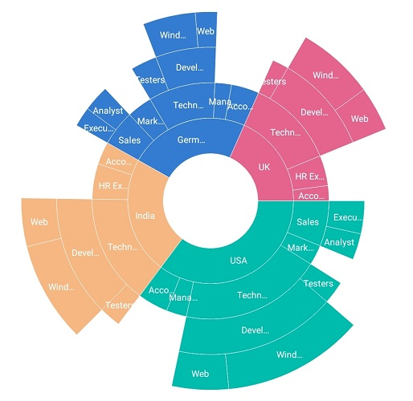
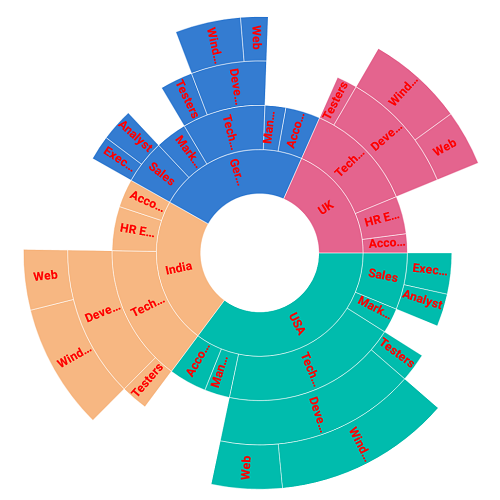
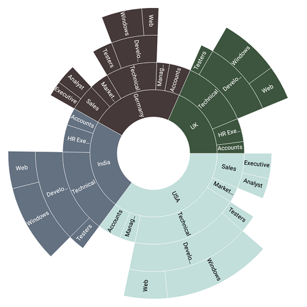

# Data label

Data labels are used to display information about segments. Data labels are enabled and disabled using the [`ShowLabel`](https://help.syncfusion.com/cr/cref_files/xamarin/Syncfusion.SfSunburstChart.XForms~Syncfusion.SfSunburstChart.XForms.SunburstChartDataLabel~ShowLabel.html) property. The default value of the ShowLabel property is true.

The following code explains how to initialize data labels.

 



  <sunburst:SfSunburstChart.DataLabel>
      <sunburst:SunburstChartDataLabel x:Name="dataLabel" ShowLabel="True"></sunburst:SunburstChartDataLabel>
  </sunburst:SfSunburstChart.DataLabel>





  SunburstChartDataLabel label = new SunburstChartDataLabel();
  label.ShowLabel = true;
  sunburstChart.DataLabel = label;



 

## Overflow Mode

When the data labels are large in size, they will overlap each other. To avoid overlapping, trim or hide the data labels using the [`OverflowMode`](https://help.syncfusion.com/cr/cref_files/xamarin/Syncfusion.SfSunburstChart.XForms~Syncfusion.SfSunburstChart.XForms.SunburstChartDataLabel~OverflowMode.html) property.

### Trim

The following code shows trimming the data labels.

 



  <sunburst:SfSunburstChart.DataLabel>
        <sunburst:SunburstChartDataLabel x:Name="dataLabel" OverflowMode="Trim"
                            ShowLabel="True"></sunburst:SunburstChartDataLabel>
  </sunburst:SfSunburstChart.DataLabel>





  SunburstChartDataLabel label = new SunburstChartDataLabel();
  label.ShowLabel = true;
  label.OverflowMode = SunburstLabelOverflowMode.Trim;
  sunburstChart.DataLabel = label;



 

### Hide

The following code shows hiding the data labels.

 



  <sunburst:SfSunburstChart.DataLabel>
      <sunburst:SunburstChartDataLabel x:Name="dataLabel"  ShowLabel="True" 
                             OverflowMode="Hide"></sunburst:SunburstChartDataLabel>
  </sunburst:SfSunburstChart.DataLabel>





  SunburstChartDataLabel label = new SunburstChartDataLabel();
  label.ShowLabel = true;
  label.OverflowMode = SunburstLabelOverflowMode.Hide;
  sunburstChart.DataLabel = label;



 

## Rotation Mode

The view of data labels can be customized using the [`RotationMode`](https://help.syncfusion.com/cr/cref_files/xamarin/Syncfusion.SfSunburstChart.XForms~Syncfusion.SfSunburstChart.XForms.SunburstChartDataLabel~RotationMode.html) property. Data labels can be rotated to a angle for better readability. By default, the rotation mode is angle.

### Angle

The following code shows rotating a data label to an angle.

 



  <sunburst:SfSunburstChart.DataLabel>
          <sunburst:SunburstChartDataLabel x:Name="dataLabel" RotationMode="Angle"
                       ShowLabel="True"></sunburst:SunburstChartDataLabel>
  </sunburst:SfSunburstChart.DataLabel>





  SunburstChartDataLabel label = new SunburstChartDataLabel();
  label.ShowLabel = true;
  label.RotationMode = SunburstLabelRotationMode.Angle;
  sunburstChart.DataLabel = label;



 

### Normal

The following code shows normal mode of data labels.

 



  <sunburst:SfSunburstChart.DataLabel>
        <sunburst:SunburstChartDataLabel x:Name="dataLabel" RotationMode="Normal"
               ShowLabel="True"></sunburst:SunburstChartDataLabel>
  </sunburst:SfSunburstChart.DataLabel>





  SunburstChartDataLabel label = new SunburstChartDataLabel();
  label.ShowLabel = true;
  label.RotationMode = SunburstLabelRotationMode.Normal;
  sunburstChart.DataLabel = label;



 

## Customization

Data labels can be customized using the following properties.

* [`TextColor`](https://help.syncfusion.com/cr/cref_files/xamarin/Syncfusion.SfSunburstChart.XForms~Syncfusion.SfSunburstChart.XForms.SunburstChartDataLabel~TextColor.html) : Text color of the label can be changed.
* [`FontSize`](https://help.syncfusion.com/cr/cref_files/xamarin/Syncfusion.SfSunburstChart.XForms~Syncfusion.SfSunburstChart.XForms.SunburstChartDataLabel~FontSize.html) : Data label font size can be modified.
* [`FontAttributes`](https://help.syncfusion.com/cr/cref_files/xamarin/Syncfusion.SfSunburstChart.XForms~Syncfusion.SfSunburstChart.XForms.SunburstChartDataLabel~FontAttributes.html) : Font attributes such as bold or italic can be used.
* [`FontFamily`](https://help.syncfusion.com/cr/cref_files/xamarin/Syncfusion.SfSunburstChart.XForms~Syncfusion.SfSunburstChart.XForms.SunburstChartDataLabel~FontFamily.html) : This modifies the font family of the labels.

 



  <sunburst:SfSunburstChart.DataLabel>
             <sunburst:SunburstChartDataLabel x:Name="dataLabel" ShowLabel="True" FontAttributes="Bold" 
                            FontSize="10" TextColor="Red" FontFamily="ArialMT">
             </sunburst:SunburstChartDataLabel>
  </sunburst:SfSunburstChart.DataLabel>





  SunburstChartDataLabel label = new SunburstChartDataLabel();
  label.ShowLabel = true;
  label.TextColor = Color.Red;
  label.FontSize = 10;
  label.FontAttributes = FontAttributes.Bold;
  label.FontFamily = "ArialMT";
  sunburstChart.DataLabel = label;          



 

## Label text color

Data label text color will change automatically based on the color of the segments. Whatever be the color of the segments, text color of the label will change accordingly for better readability.

In the following code `Pineapple` palette is applied, hence data label takes the color based on the color of the segments.

 



  <sunburst:SfSunburstChart.DataLabel>
     <sunburst:SunburstChartDataLabel x:Name="dataLabel" ShowLabel="True" >
                    </sunburst:SunburstChartDataLabel>
  </sunburst:SfSunburstChart.DataLabel>

   <sunburst:SfSunburstChart.ColorModel>
          <sunburst:SunburstChartColorModel Palette="Pineapple">
          </sunburst:SunburstChartColorModel> 
  </sunburst:SfSunburstChart.ColorModel>





  SunburstChartDataLabel label = new SunburstChartDataLabel();
  label.ShowLabel = true;           
  sunburstChart.DataLabel = label;

  SunburstChartColorModel colorModel = new SunburstChartColorModel();
  colorModel.Palette = SunburstColorPalette.Pineapple;
  sunburstChart.ColorModel = colorModel;



 

In the below image, first segment's data label is in black and others in white.

