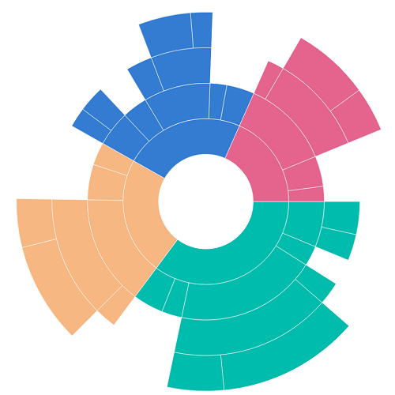
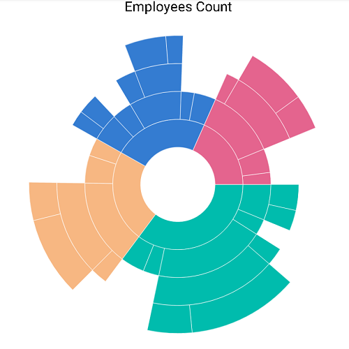
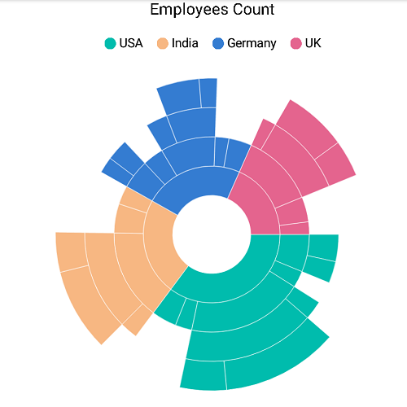
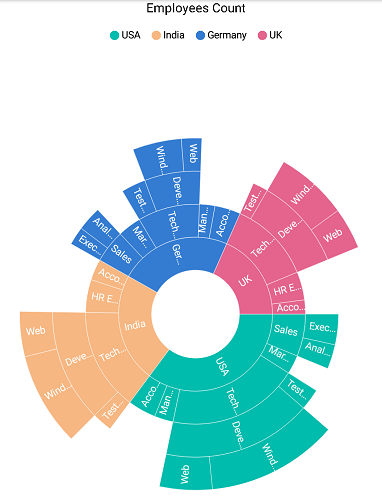
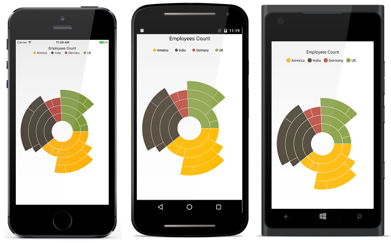

# Getting Started

This section explains the steps required to configure the [`SfSunburstChart`](https://help.syncfusion.com/cr/cref_files/xamarin/Syncfusion.SfSunburstChart.XForms~Syncfusion.SfSunburstChart.XForms.SfSunburstChart.html) and populate it with data, data labels, legends, and title. This section covers only the minimal features that needed to get started with the sunburst chart. 

## Add sunburst chart references

The Syncfusion components for Xamarin.Forms are available in [`nuget.org`](https://www.nuget.org/). To add SfSunburstChart to your project, open the NuGet package manager in Visual Studio, search for [`Syncfusion.Xamarin.SfSunburstChart`](https://www.nuget.org/packages/Syncfusion.Xamarin.SfSunburstChart), and then install it.

Refer to this [article](https://help.syncfusion.com/xamarin/introduction/download-and-installation) to know how to obtain and reference Essential Studio components in your solution; then refer to [this](https://help.syncfusion.com/xamarin/introduction/control-dependencies#sfsunburstchart) link to know about the assemblies required for adding SfSunburstChart to your project.

I> After adding the reference, an additional step is required for iOS and UWP projects. You should call Init method in the `SfSunburstChartRenderer` as shown in this [KB article](http://www.syncfusion.com/support/kb/7714).

I> For UWP alone, an additional step is required if the project is still in built-in release mode with .NET Native tool chain enabled. You can refer to the [KB article](http://www.syncfusion.com/support/kb/7715) for more details.

## Initialize sunburst chart

Import the [`SfSunburstChart`](https://help.syncfusion.com/cr/cref_files/xamarin/Syncfusion.SfSunburstChart.XForms~Syncfusion.SfSunburstChart.XForms.SfSunburstChart.html) namespace as shown as follows.

 

 

  xmlns:sunburst="clr-namespace:Syncfusion.SfSunburstChart.XForms;assembly=Syncfusion.SfSunburstChart.XForms"



 

  using Syncfusion.SfSunburstChart.XForms;



 

Then, initialize an empty sunburst chart as shown as follows.

 

 

  <sunburst:SfSunburstChart>
    
  </sunburst:SfSunburstChart>



 

  SfSunburstChart sunburst = new SfSunburstChart();

  this.Content = sunburst;
  


 

## Initialize view model

In this section, data in the following table is used for demonstration.

<table>
<tr>
<th>
Country
</th>
<th>
Job description
</th>
<th>
Job group
</th>
<th>
Job role
</th>
<th>
Employees count
</th>
</tr>
<tr>
<td>
United States
</td>
<td>
Sales
</td>
<td>
Executive
</td>
<td>
</td>
<td>
50
</td>
</tr>
<tr>
<td>
United States
</td>
<td>
Sales
</td>
<td>
Analyst
</td>
<td>
</td>
<td>
40
</td>
</tr>
<tr>
<td>
United States
</td>
<td>
Marketing
</td>
<td>
</td>
<td>
</td>
<td>
40
</td>
</tr>
<tr>
<td>
United States
</td>
<td>
Technical
</td>
<td>
Testers
</td>
<td>
</td>
<td>
35
</td>
</tr>
<tr>
<td>
United States
</td>
<td>
Technical
</td>
<td>
Developers
</td>
<td>
Windows
</td>
<td>
175
</td>
</tr>
<tr>
<td>
United States
</td>
<td>
Technical
</td>
<td>
Developers
</td>
<td>
Web
</td>
<td>
70
</td>
</tr>
<tr>
<td>
United States
</td>
<td>
Management
</td>
<td>
</td>
<td>
</td>
<td>
40
</td>
</tr>
<tr>
<td>
United States
</td>
<td>
Accounts
</td>
<td>
</td>
<td>
</td>
<td>
60
</td>
</tr>
<tr>
<td>
India
</td>
<td>
Technical
</td>
<td>
Testers
</td>
<td>
</td>
<td>
33
</td>
</tr>
<tr>
<td>
India
</td>
<td>
Technical
</td>
<td>
Developers
</td>
<td>
Windows
</td>
<td>
125
</td>
</tr>
<tr>
<td>
India
</td>
<td>
Technical
</td>
<td>
Developers
</td>
<td>
Web
</td>
<td>
60
</td>
</tr>
<tr>
<td>
India
</td>
<td>
HR Executives
</td>
<td>
</td>
<td>
</td>
<td>
70
</td>
</tr>
<tr>
<td>
India
</td>
<td>
Accounts
</td>
<td>
</td>
<td>
</td>
<td>
45
</td>
</tr>
<tr>
<td>
Germany
</td>
<td>
Sales
</td>
<td>
Executive
</td>
<td>
</td>
<td>
30
</td>
</tr>
<tr>
<td>
Germany
</td>
<td>
Sales
</td>
<td>
Analyst
</td>
<td>
</td>
<td>
40
</td>
</tr>
<tr>
<td>
Germany
</td>
<td>
Marketing
</td>
<td>
</td>
<td>
</td>
<td>
50
</td>
</tr>
<tr>
<td>
Germany
</td>
<td>
Technical
</td>
<td>
Testers
</td>
<td>
</td>
<td>
40
</td>
</tr>
<tr>
<td>
Germany
</td>
<td>
Technical
</td>
<td>
Developers
</td>
<td>
Windows
</td>
<td>
65
</td>
</tr>
<tr>
<td>
Germany
</td>
<td>
Technical
</td>
<td>
Developers
</td>
<td>
Web
</td>
<td>
27
</td>
</tr>
<tr>
<td>
Germany
</td>
<td>
Management
</td>
<td>
</td>
<td>
</td>
<td>
33
</td>
</tr>
<tr>
<td>
Germany
</td>
<td>
Accounts
</td>
<td>
</td>
<td>
</td>
<td>
55
</td>
</tr>
<tr>
<td>
UK
</td>
<td>
Technical
</td>
<td>
Testers
</td>
<td>
</td>
<td>
25
</td>
</tr>
<tr>
<td>
UK
</td>
<td>
Technical
</td>
<td>
Developers
</td>
<td>
Windows
</td>
<td>
96
</td>
</tr>
<tr>
<td>
UK
</td>
<td>
Technical
</td>
<td>
Developers
</td>
<td>
Web
</td>
<td>
55
</td>
</tr>
<tr>
<td>
UK
</td>
<td>
HR executives
</td>
<td>
</td>
<td>
</td>
<td>
60
</td>
</tr>
<tr>
<td>
UK
</td>
<td>
Accounts
</td>
<td>
</td>
<td>
</td>
<td>
30
</td>
</tr>
</table>

Define a data model that represents the above data in [`SfSunburstChart`](https://help.syncfusion.com/cr/cref_files/xamarin/Syncfusion.SfSunburstChart.XForms~Syncfusion.SfSunburstChart.XForms.SfSunburstChart.html).

 



 public class SunburstModel
 {
    public string JobDescription { get; set; }
    public string JobGroup { get; set; }
    public string JobRole { get; set; }
    public double EmployeesCount { get; set; }
    public string Country { get; set; }
 }
    
 

 

Then, create a view model class, and initialize a list of SunburstModel objects as follows.

 



 public class SunburstViewModel
 {
        public ObservableCollection<SunburstModel> DataSource { get; set; }
        public SunburstViewModel()
        {
            this.DataSource = new ObservableCollection<SunburstModel>
            {
                new SunburstModel { Country = "USA", JobDescription = "Sales", JobGroup="Executive", EmployeesCount = 50 },
                new SunburstModel { Country = "USA", JobDescription = "Sales", JobGroup = "Analyst", EmployeesCount = 40 },
                new SunburstModel { Country = "USA", JobDescription = "Marketing", EmployeesCount = 40 },
                new SunburstModel { Country = "USA", JobDescription = "Technical", JobGroup = "Testers", EmployeesCount = 35 },
                new SunburstModel { Country = "USA", JobDescription = "Technical", JobGroup = "Developers", JobRole = "Windows", EmployeesCount = 175 },
                new SunburstModel { Country = "USA", JobDescription = "Technical", JobGroup = "Developers", JobRole = "Web", EmployeesCount = 70 },
                new SunburstModel { Country = "USA", JobDescription = "Management", EmployeesCount = 40 },
                new SunburstModel { Country = "USA", JobDescription = "Accounts", EmployeesCount = 60 },

                new SunburstModel { Country = "India", JobDescription = "Technical", JobGroup = "Testers", EmployeesCount = 33 },
                new SunburstModel { Country = "India", JobDescription = "Technical", JobGroup = "Developers", JobRole = "Windows", EmployeesCount = 125 },
                new SunburstModel { Country = "India", JobDescription = "Technical", JobGroup = "Developers", JobRole = "Web", EmployeesCount = 60 },
                new SunburstModel { Country = "India", JobDescription = "HR Executives", EmployeesCount = 70 },
                new SunburstModel { Country = "India", JobDescription = "Accounts", EmployeesCount = 45 },

                new SunburstModel { Country = "Germany", JobDescription = "Sales", JobGroup = "Executive", EmployeesCount = 30 },
                new SunburstModel { Country = "Germany", JobDescription = "Sales", JobGroup = "Analyst", EmployeesCount = 40 },
                new SunburstModel { Country = "Germany", JobDescription = "Marketing", EmployeesCount = 50 },
                new SunburstModel { Country = "Germany", JobDescription = "Technical", JobGroup = "Testers", EmployeesCount = 40 },
                new SunburstModel { Country = "Germany", JobDescription = "Technical", JobGroup = "Developers", JobRole = "Windows", EmployeesCount = 65 },
                new SunburstModel { Country = "Germany", JobDescription = "Technical", JobGroup = "Developers", JobRole = "Web", EmployeesCount = 27 },
                new SunburstModel { Country = "Germany", JobDescription = "Management", EmployeesCount = 33 },
                new SunburstModel { Country = "Germany", JobDescription = "Accounts", EmployeesCount = 55 },

                new SunburstModel { Country = "UK", JobDescription = "Technical", JobGroup = "Testers", EmployeesCount = 25 },
                new SunburstModel { Country = "UK", JobDescription = "Technical", JobGroup = "Developers", JobRole = "Windows", EmployeesCount = 96 },
                new SunburstModel { Country = "UK", JobDescription = "Technical", JobGroup = "Developers", JobRole = "Web", EmployeesCount = 55 },
                new SunburstModel { Country = "UK", JobDescription = "HR Executives", EmployeesCount = 60 },
                new SunburstModel { Country = "UK", JobDescription = "Accounts", EmployeesCount = 30 }
            };
        }
 }

 

 

Set the `SunburstViewModel` instance as the `BindingContext` of your page to bind the properties of `SunburstViewModel` to [`SfSunburstChart`](https://help.syncfusion.com/cr/cref_files/xamarin/Syncfusion.SfSunburstChart.XForms~Syncfusion.SfSunburstChart.XForms.SfSunburstChart.html).
 
N> Add the namespace of `SunburstViewModel` class in your XAML page if you set the `BindingContext` in XAML.

 

 

  <ContentPage xmlns="http://xamarin.com/schemas/2014/forms"
             xmlns:x="http://schemas.microsoft.com/winfx/2009/xaml"
             xmlns:local="clr-namespace:SunburstDemo"
             xmlns:sunburst="clr-namespace:Syncfusion.SfSunburstChart.XForms;assembly=Syncfusion.SfSunburstChart.XForms"
             x:Class="SunburstDemo.MainPage">

	  <ContentPage.BindingContext>
          <local:SunburstViewModel></local:SunburstViewModel>
      </ContentPage.BindingContext>
 
  </ContentPage>


 

  this.BindingContext = new SunburstViewModel();



 

## Populate sunburst chart with data

Bind the DataSource property of the above SunburstViewModel to the [`ItemsSource`](https://help.syncfusion.com/cr/cref_files/xamarin/Syncfusion.SfSunburstChart.XForms~Syncfusion.SfSunburstChart.XForms.SfSunburstChart~ItemsSource.html) property. 
Then, add the [`SunburstHierarchicalLevel`](https://help.syncfusion.com/cr/cref_files/xamarin/Syncfusion.SfSunburstChart.XForms~Syncfusion.SfSunburstChart.XForms.SunburstHierarchicalLevel.html) to [`Levels`](https://help.syncfusion.com/cr/cref_files/xamarin/Syncfusion.SfSunburstChart.XForms~Syncfusion.SfSunburstChart.XForms.SfSunburstChart~Levels.html) collection. Each hierarchy level is formed based on the property specified in [`GroupMemberPath`](https://help.syncfusion.com/cr/cref_files/xamarin/Syncfusion.SfSunburstChart.XForms~Syncfusion.SfSunburstChart.XForms.SunburstHierarchicalLevel~GroupMemberPath.html) property, and each arc segment size is calculated using the [`ValueMemberPath`](https://help.syncfusion.com/cr/cref_files/xamarin/Syncfusion.SfSunburstChart.XForms~Syncfusion.SfSunburstChart.XForms.SfSunburstChart~ValueMemberPath.html) property.

   



  <sunburst:SfSunburstChart x:Name="sunburstChart" ItemsSource="{Binding DataSource}"
                                  ValueMemberPath="EmployeesCount">

     <sunburst:SfSunburstChart.Levels>
         <sunburst:SunburstHierarchicalLevel GroupMemberPath="Country"/>
         <sunburst:SunburstHierarchicalLevel GroupMemberPath="JobDescription"/>
         <sunburst:SunburstHierarchicalLevel GroupMemberPath="JobGroup"/>
         <sunburst:SunburstHierarchicalLevel GroupMemberPath="JobRole"/>
    </sunburst:SfSunburstChart.Levels>

  </sunburst:SfSunburstChart>





  SfSunburstChart sunburstChart = new SfSunburstChart();           
  sunburstChart.SetBinding(SfSunburstChart.ItemsSourceProperty, "DataSource");
  sunburstChart.ValueMemberPath = "EmployeesCount";
  sunburstChart.Levels.Add(new SunburstHierarchicalLevel() { GroupMemberPath = "Country" });
  sunburstChart.Levels.Add(new SunburstHierarchicalLevel() { GroupMemberPath = "JobDescription" });
  sunburstChart.Levels.Add(new SunburstHierarchicalLevel() { GroupMemberPath = "JobGroup" });
  sunburstChart.Levels.Add(new SunburstHierarchicalLevel() { GroupMemberPath = "JobRole" });
  this.Content = sunburstChart;





## Add title

You can add title to the sunburst chart to provide information to users about the data being plotted in the chart. You can set title using the [`SfSunburstChart.Title`](https://help.syncfusion.com/cr/cref_files/xamarin/Syncfusion.SfSunburstChart.XForms~Syncfusion.SfSunburstChart.XForms.SfSunburstChart~Title.html) property.

 



  <sunburst:SfSunburstChart>    

      <sunburst:SfSunburstChart.Title>
         <sunburst:SunburstChartTitle x:Name="title" Text="Employees Count"></sunburst:SunburstChartTitle>
      </sunburst:SfSunburstChart.Title> 

  </sunburst:SfSunburstChart>





  SfSunburstChart sunburstChart = new SfSunburstChart();
  sunburstChart.Title = new SunburstChartTitle();
  sunburstChart.Title.Text = "Employees Count";
  this.Content = sunburstChart;  





## Add legend

You can enable legend using the [`SfSunburstChart.Legend`](https://help.syncfusion.com/cr/cref_files/xamarin/Syncfusion.SfSunburstChart.XForms~Syncfusion.SfSunburstChart.XForms.SfSunburstChart~Legend.html) property.

 



  <sunburst:SfSunburstChart>

      <sunburst:SfSunburstChart.Legend>
            <sunburst:SunburstChartLegend x:Name="legend" IsVisible="True" >                      
            </sunburst:SunburstChartLegend>
      </sunburst:SfSunburstChart.Legend>

  </sunburst:SfSunburstChart>




  SfSunburstChart sunburstChart = new SfSunburstChart();
  sunburstChart.Legend = new SunburstChartLegend();
  sunburstChart.Legend.IsVisible = true;
  this.Content = sunburstChart;



 

## Add data labels

You can add data labels to improve the readability of the sunburst chart. Data labels can be added using the [`SfSunburstChart.DataLabel`](https://help.syncfusion.com/cr/cref_files/xamarin/Syncfusion.SfSunburstChart.XForms~Syncfusion.SfSunburstChart.XForms.SfSunburstChart~DataLabel.html) property.

 


      
  <sunburst:SfSunburstChart>

       <sunburst:SfSunburstChart.DataLabel>
           <sunburst:SunburstChartDataLabel x:Name="dataLabel" ShowLabel="True">
           </sunburst:SunburstChartDataLabel>
       </sunburst:SfSunburstChart.DataLabel>

  </sunburst:SfSunburstChart>





  SfSunburstChart sunburstChart = new SfSunburstChart();  
  sunburstChart.DataLabel = new SunburstChartDataLabel();
  sunburstChart.DataLabel.ShowLabel = true;
  this.Content = sunburstChart;



 

Below snippet is the complete code for generating the final output.

 


      
  <sunburst:SfSunburstChart x:Name="sunburstChart" ItemsSource="{Binding DataSource}"
            ValueMemberPath="EmployeesCount">

      <sunburst:SfSunburstChart.Levels>
          <sunburst:SunburstHierarchicalLevel GroupMemberPath="Country"/>
          <sunburst:SunburstHierarchicalLevel GroupMemberPath="JobDescription"/>
          <sunburst:SunburstHierarchicalLevel GroupMemberPath="JobGroup"/>
          <sunburst:SunburstHierarchicalLevel GroupMemberPath="JobRole"/>
      </sunburst:SfSunburstChart.Levels>

      <sunburst:SfSunburstChart.Title>
          <sunburst:SunburstChartTitle x:Name="title" Text="Employees Count" ></sunburst:SunburstChartTitle>
      </sunburst:SfSunburstChart.Title>

      <sunburst:SfSunburstChart.Legend>
          <sunburst:SunburstChartLegend x:Name="legend" IsVisible="True" >
          </sunburst:SunburstChartLegend>
      </sunburst:SfSunburstChart.Legend>

      <sunburst:SfSunburstChart.DataLabel>
          <sunburst:SunburstChartDataLabel x:Name="dataLabel" ShowLabel="True"></sunburst:SunburstChartDataLabel>
      </sunburst:SfSunburstChart.DataLabel>

  </sunburst:SfSunburstChart>





  this.BindingContext = new SunburstViewModel();

  SfSunburstChart sunburstChart = new SfSunburstChart();

  sunburstChart.SetBinding(SfSunburstChart.ItemsSourceProperty, "DataSource");
  sunburstChart.ValueMemberPath = "EmployeesCount";
  sunburstChart.Levels.Add(new SunburstHierarchicalLevel() { GroupMemberPath = "Country" });
  sunburstChart.Levels.Add(new SunburstHierarchicalLevel() { GroupMemberPath = "JobDescription" });
  sunburstChart.Levels.Add(new SunburstHierarchicalLevel() { GroupMemberPath = "JobGroup" });
  sunburstChart.Levels.Add(new SunburstHierarchicalLevel() { GroupMemberPath = "JobRole" });
                       
  sunburstChart.Title = new SunburstChartTitle();
  sunburstChart.Title.Text = "Employees Count";

  sunburstChart.Legend = new SunburstChartLegend();
  sunburstChart.Legend.IsVisible = true;

  sunburstChart.DataLabel = new SunburstChartDataLabel();
  sunburstChart.DataLabel.ShowLabel = true;

  this.Content = sunburstChart;



 

The following screenshot depicts the final output.

You can find the complete getting started sample from this [`link`](http://www.syncfusion.com/downloads/support/directtrac/general/ze/Sunburst_Sample-1965856985).

