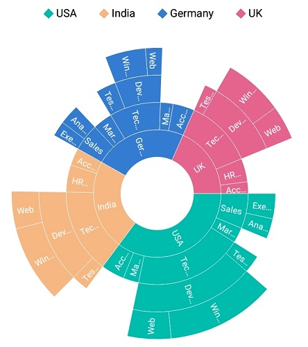
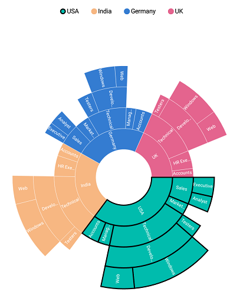

# Legend

Legends are used to represent the first level (i.e root level) of categories in the sunburst chart.

The following code explains how to initialize the legends.

 



  <sunburst:SfSunburstChart.Legend>
      <sunburst:SunburstChartLegend>
      </sunburst:SunburstChartLegend>
  </sunburst:SfSunburstChart.Legend>





  SunburstChartLegend legend = new SunburstChartLegend();
  sunburstChart.Legend = legend;



 

## Visibility

The visibility of legends can be controlled using the [`IsVisible`](https://help.syncfusion.com/cr/cref_files/xamarin/Syncfusion.SfSunburstChart.XForms~Syncfusion.SfSunburstChart.XForms.SunburstChartLegend~IsVisible.html) property.

The following code shows how to control the visibility of legend.

 



  <sunburst:SfSunburstChart.Legend>
       <sunburst:SunburstChartLegend IsVisible="True" >
       </sunburst:SunburstChartLegend>
  </sunburst:SfSunburstChart.Legend>





  SunburstChartLegend legend = new SunburstChartLegend();
  legend.IsVisible = true;
  sunburstChart.Legend = legend;



 

## Position

Legends can be docked at the top, right, left, or bottom position using the [`LegendPosition`](https://help.syncfusion.com/cr/cref_files/xamarin/Syncfusion.SfSunburstChart.XForms~Syncfusion.SfSunburstChart.XForms.SunburstChartLegend~LegendPosition.html) property.

The following code shows customizing the legend position.

 



  <sunburst:SfSunburstChart.Legend>
       <sunburst:SunburstChartLegend x:Name="legend" IsVisible="True"  
                      LegendPosition="Left" >
       </sunburst:SunburstChartLegend>
  </sunburst:SfSunburstChart.Legend>





  SunburstChartLegend legend = new SunburstChartLegend();
  legend.IsVisible = true;
  legend.LegendPosition = SunburstDockPosition.Left;
  sunburstChart.Legend = legend;



 

## Legend icon types

Legend icon shapes can be customized using the [`IconType`](https://help.syncfusion.com/cr/cref_files/xamarin/Syncfusion.SfSunburstChart.XForms~Syncfusion.SfSunburstChart.XForms.SunburstChartLegend~IconType.html) property. The IconType property provides several predefined shapes. The default legend icon type is circle.

The following predefined shapes are available in the IconType property:

* Circle
* Cross
* Diamond
* Pentagon
* Rectangle
* Triangle.

 



  <sunburst:SfSunburstChart.Legend>
    <sunburst:SunburstChartLegend x:Name="legend" IsVisible="True"  
                         IconType="Diamond" >
    </sunburst:SunburstChartLegend>
  </sunburst:SfSunburstChart.Legend>





  SunburstChartLegend legend = new SunburstChartLegend();
  legend.IsVisible = true;
  legend.IconType = SunburstLegendIcon.Diamond;
  sunburstChart.Legend = legend;



 

## Icon size customization

The size of the legend icon can be customized using the [`IconHeight`](https://help.syncfusion.com/cr/cref_files/xamarin/Syncfusion.SfSunburstChart.XForms~Syncfusion.SfSunburstChart.XForms.SunburstChartLegend~IconHeight.html) and [`IconWidth`](https://help.syncfusion.com/cr/cref_files/xamarin/Syncfusion.SfSunburstChart.XForms~Syncfusion.SfSunburstChart.XForms.SunburstChartLegend~IconWidth.html) properties.

 



  <sunburst:SfSunburstChart.Legend>
     <sunburst:SunburstChartLegend x:Name="legend" IsVisible="True" IconHeight="15" 
                   IconWidth="15" IconType="Diamond">
     </sunburst:SunburstChartLegend>
  </sunburst:SfSunburstChart.Legend>





  SunburstChartLegend legend = new SunburstChartLegend();
  legend.IsVisible = true;
  legend.IconType = SunburstLegendIcon.Diamond;
  legend.IconHeight = 15;
  legend.IconWidth = 15;
  sunburstChart.Legend = legend;



 

## Label style

Legend label can be customized using the following properties available in [`LabelStyle`](https://help.syncfusion.com/cr/cref_files/xamarin/Syncfusion.SfSunburstChart.XForms~Syncfusion.SfSunburstChart.XForms.SunburstChartLegend~LabelStyle.html):

* [`TextColor`](https://help.syncfusion.com/cr/cref_files/xamarin/Syncfusion.SfSunburstChart.XForms~Syncfusion.SfSunburstChart.XForms.SunburstLegendLabelStyle~TextColor.html): Customizes the text color of the label.
* [`FontSize`](https://help.syncfusion.com/cr/cref_files/xamarin/Syncfusion.SfSunburstChart.XForms~Syncfusion.SfSunburstChart.XForms.SunburstLegendLabelStyle~FontSize.html): Customizes the font size of the label.
* [`FontAttributes`](https://help.syncfusion.com/cr/cref_files/xamarin/Syncfusion.SfSunburstChart.XForms~Syncfusion.SfSunburstChart.XForms.SunburstLegendLabelStyle~FontAttributes.html): Customizes the font attributes such as Bold or Italic.
* [`Margin`](https://help.syncfusion.com/cr/cref_files/xamarin/Syncfusion.SfSunburstChart.XForms~Syncfusion.SfSunburstChart.XForms.SunburstLegendLabelStyle~Margin.html): Sets the specified margin for legend labels.
* [`FontFamily`](https://help.syncfusion.com/cr/cref_files/xamarin/Syncfusion.SfSunburstChart.XForms~Syncfusion.SfSunburstChart.XForms.SunburstLegendLabelStyle~FontFamily.html): Sets the specified font family for labels.

 



  <sunburst:SfSunburstChart.Legend>
     <sunburst:SunburstChartLegend x:Name="legend" IsVisible="True" > 
                                                  
       <sunburst:SunburstChartLegend.LabelStyle>
            <sunburst:SunburstLegendLabelStyle x:Name="legendStyle" 
                         FontAttributes="Italic" FontSize="14" Margin="5"
                         TextColor="Red" ></sunburst:SunburstLegendLabelStyle>
       </sunburst:SunburstChartLegend.LabelStyle>

   </sunburst:SunburstChartLegend>
  </sunburst:SfSunburstChart.Legend>





  sunburstChart.Legend = new SunburstChartLegend();
  sunburstChart.Legend.IsVisible = true;

  SunburstLegendLabelStyle labelStyle = new SunburstLegendLabelStyle();
  labelStyle.FontAttributes = FontAttributes.Italic;
  labelStyle.FontSize = 14;
  labelStyle.TextColor = Color.Red;
  labelStyle.Margin = new Thickness(5);

  sunburstChart.Legend.LabelStyle = labelStyle;



 

## Item margin

Margin can be set to individual legend items using the [`ItemMargin`](https://help.syncfusion.com/cr/cref_files/xamarin/Syncfusion.SfSunburstChart.XForms~Syncfusion.SfSunburstChart.XForms.SunburstChartLegend~ItemMargin.html) property.

 



  <sunburst:SfSunburstChart.Legend>
         <sunburst:SunburstChartLegend x:Name="legend" IsVisible="True" ItemMargin="3" >                    
         </sunburst:SunburstChartLegend>
  </sunburst:SfSunburstChart.Legend>





  SunburstChartLegend legend = new SunburstChartLegend();
  legend.IsVisible = true;
  legend.ItemMargin = new Thickness(3, 3, 3, 3);                    
  sunburstChart.Legend = legend;



 

## Toggle selection

Sunburst segments can also be selected via legends.

 



  <sunburst:SfSunburstChart.Legend>
       <sunburst:SunburstChartLegend x:Name="legend" IsVisible="True"  >                    
       </sunburst:SunburstChartLegend>
  </sunburst:SfSunburstChart.Legend>

  <sunburst:SfSunburstChart.SelectionSettings>
       <sunburst:SelectionSettings   EnableSelection="True" SelectionDisplayMode="HighlightByStrokeColor">
       </sunburst:SelectionSettings>
  </sunburst:SfSunburstChart.SelectionSettings>





  SunburstChartLegend legend = new SunburstChartLegend();
  legend.IsVisible = true;                           
  sunburstChart.Legend = legend;

  SelectionSettings selection = new SelectionSettings();
  selection.EnableSelection = true;
  selection.SelectionDisplayMode = SelectionDisplayMode.HighlightByStrokeColor;           
  sunburstChart.SelectionSettings = selection;



 

