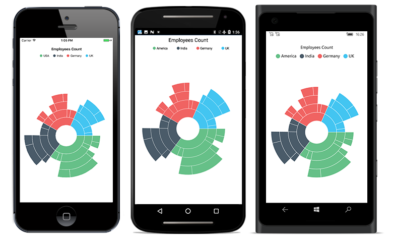

# Overview

The sunburst chart is used for visualizing hierarchical data. The circle at the center represents the root level of hierarchy, and the outer circles represent the higher levels of hierarchy.

## Key features

* Visualizes hierarchical data.
* Supports data labels for better readability.
* Supports legends with toggle selection.
* Supports palette.
* Supports drill-down feature that allows you to explore each level of hierarchy in detail.
* Provides interactive selection support that allows you to select or highlight the segments in the hierarchy with the following selection modes, such as Child, Group, Parent and Single.
* Supports animation.
* Supports tooltip to provide more information about the segments.
