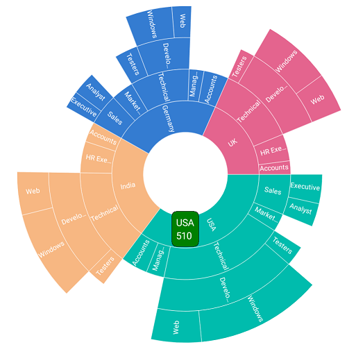
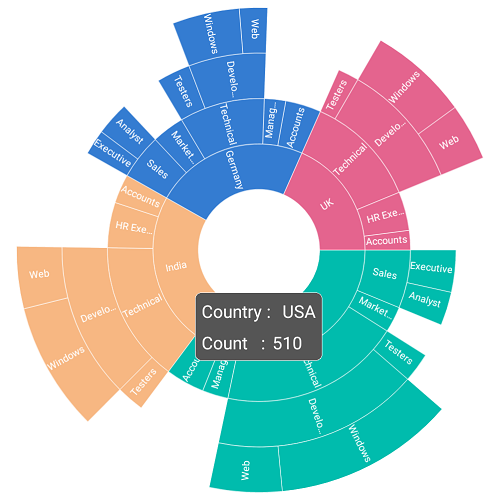

# Tooltip

Tooltip provides additional information about the segments in the sunburst chart. Tooltip is displayed by tapping the segment. By default, tooltip displays the corresponding segment’s category and value. To enable the tooltip, set the [`ShowTooltip`](https://help.syncfusion.com/cr/cref_files/xamarin/Syncfusion.SfSunburstChart.XForms~Syncfusion.SfSunburstChart.XForms.SunburstTooltipSettings~ShowTooltip.html) property to true.

The following code shows enabling the tooltip.

 



  <sunburst:SfSunburstChart.TooltipSettings>
         <sunburst:SunburstTooltipSettings ShowTooltip="True"></sunburst:SunburstTooltipSettings>
  </sunburst:SfSunburstChart.TooltipSettings>





  SunburstTooltipSettings tooltipSettings = new SunburstTooltipSettings();
  tooltipSettings.ShowTooltip = true;
  sunburstChart.TooltipSettings = tooltipSettings;



 

## Customization

The appearance of the tooltip can be customized using the following properties:

* [`TextColor`](https://help.syncfusion.com/cr/cref_files/xamarin/Syncfusion.SfSunburstChart.XForms~Syncfusion.SfSunburstChart.XForms.SunburstTooltipSettings~TextColor.html): Customizes the text color of the tooltip.
* [`BackgroundColor`](https://help.syncfusion.com/cr/cref_files/xamarin/Syncfusion.SfSunburstChart.XForms~Syncfusion.SfSunburstChart.XForms.SunburstTooltipSettings~BackgroundColor.html): Customizes the background color of the tooltip.
* [`BorderColor`](https://help.syncfusion.com/cr/cref_files/xamarin/Syncfusion.SfSunburstChart.XForms~Syncfusion.SfSunburstChart.XForms.SunburstTooltipSettings~BorderColor.html): Customizes the border color of the tooltip.
* [`BorderWidth`](https://help.syncfusion.com/cr/cref_files/xamarin/Syncfusion.SfSunburstChart.XForms~Syncfusion.SfSunburstChart.XForms.SunburstTooltipSettings~BorderWidth.html): Customizes the border width of the tooltip.
* [`Duration`](https://help.syncfusion.com/cr/cref_files/xamarin/Syncfusion.SfSunburstChart.XForms~Syncfusion.SfSunburstChart.XForms.SunburstTooltipSettings~Duration.html): Specifies the duration of the tooltip to be displayed.

The following code shows all the above customizations.

 



  <sunburst:SfSunburstChart.TooltipSettings>
        <sunburst:SunburstTooltipSettings ShowTooltip="True" TextColor="White"
         BackgroundColor="Green"  BorderColor="Black" BorderWidth="1" 
         Duration="2000" ></sunburst:SunburstTooltipSettings>
  </sunburst:SfSunburstChart.TooltipSettings>





  SunburstTooltipSettings tooltipSettings = new SunburstTooltipSettings();
  tooltipSettings.ShowTooltip = true;
  tooltipSettings.TextColor = Color.White;
  tooltipSettings.BackgroundColor = Color.Green;
  tooltipSettings.BorderColor = Color.Black;
  tooltipSettings.BorderWidth = 1;
  tooltipSettings.Duration = 2000;
  sunburstChart.TooltipSettings = tooltipSettings;



 

## Font customization

The font can be customized using the [`FontSize`](https://help.syncfusion.com/cr/cref_files/xamarin/Syncfusion.SfSunburstChart.XForms~Syncfusion.SfSunburstChart.XForms.SunburstTooltipSettings~FontSize.html), [`FontAttributes`](https://help.syncfusion.com/cr/cref_files/xamarin/Syncfusion.SfSunburstChart.XForms~Syncfusion.SfSunburstChart.XForms.SunburstTooltipSettings~FontAttributes.html), and [`FontFamily`](https://help.syncfusion.com/cr/cref_files/xamarin/Syncfusion.SfSunburstChart.XForms~Syncfusion.SfSunburstChart.XForms.SunburstTooltipSettings~FontFamily.html) properties of tooltip.

 



  <sunburst:SfSunburstChart.TooltipSettings>
        <sunburst:SunburstTooltipSettings ShowTooltip="True" TextColor="White"
         BackgroundColor="Green"  BorderColor="Black" BorderWidth="1" 
         Duration="2000" ></sunburst:SunburstTooltipSettings>
  </sunburst:SfSunburstChart.TooltipSettings>





  SunburstTooltipSettings tooltipSettings = new SunburstTooltipSettings();
  tooltipSettings.ShowTooltip = true;
  tooltipSettings.TextColor = Color.White;
  tooltipSettings.BackgroundColor = Color.Green;
  tooltipSettings.BorderColor = Color.Black;
  tooltipSettings.BorderWidth = 1;
  tooltipSettings.Duration = 2000;
  sunburstChart.TooltipSettings = tooltipSettings;



 

## Custom template

The sunburst chart provides options to design your own template for tooltip using the [`TooltipTemplate`](https://help.syncfusion.com/cr/cref_files/xamarin/Syncfusion.SfSunburstChart.XForms~Syncfusion.SfSunburstChart.XForms.SunburstTooltipSettings~TooltipTemplate.html) property.

 



  <sunburst:SfSunburstChart.TooltipSettings>
    <sunburst:SunburstTooltipSettings ShowTooltip="True">
         <sunburst:SunburstTooltipSettings.TooltipTemplate>
              <DataTemplate>
                    <StackLayout Orientation="Vertical">
                        <StackLayout Orientation="Horizontal">
                            <Label Text="Country : " TextColor="White"/>
                            <Label Text="{Binding Category}" TextColor="White"/>
                        </StackLayout>
                         <StackLayout Orientation="Horizontal">
                            <Label Text="Count   :"  TextColor="White"/>
                            <Label Text="{Binding Value}" TextColor="White"/>
                         </StackLayout>                               
                    </StackLayout>
              </DataTemplate>
         </sunburst:SunburstTooltipSettings.TooltipTemplate>
    </sunburst:SunburstTooltipSettings>
  </sunburst:SfSunburstChart.TooltipSettings>





  SunburstTooltipSettings tooltipSettings = new SunburstTooltipSettings();
  tooltipSettings.ShowTooltip = true;

  DataTemplate template = new DataTemplate(() =>
  {
     StackLayout stack = new StackLayout() { Orientation = StackOrientation.Vertical };

     StackLayout categoryLayout = new StackLayout() { Orientation = StackOrientation.Horizontal };
     Label label = new Label() { Text = "Country :" };
     label.TextColor = Color.White;
     Label category = new Label();
     category.TextColor = Color.White;
     category.SetBinding(Label.TextProperty, "Category");
     categoryLayout.Children.Add(label);
     categoryLayout.Children.Add(category);

     StackLayout valueLayout = new StackLayout() { Orientation = StackOrientation.Horizontal };
     Label label1 = new Label() { Text = "Count :" };
     label1.TextColor = Color.White;
     Label value = new Label();
     value.TextColor = Color.White;
     value.SetBinding(Label.TextProperty, "Value");
     valueLayout.Children.Add(label1);
     valueLayout.Children.Add(value);

     stack.Children.Add(categoryLayout);
     stack.Children.Add(valueLayout);
     return stack;
     });

     tooltipSettings.TooltipTemplate = template;
     sunburstChart.TooltipSettings = tooltipSettings;



 

