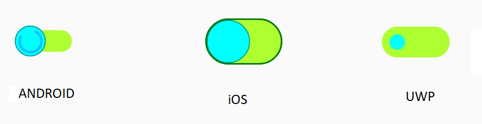
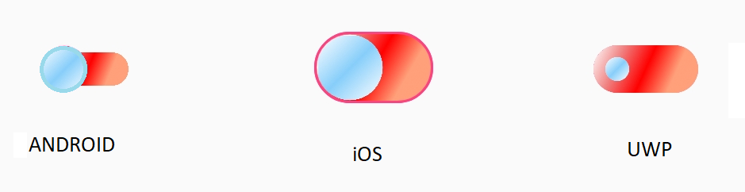
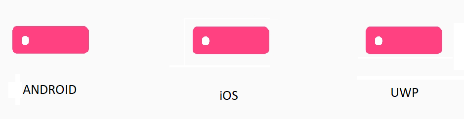
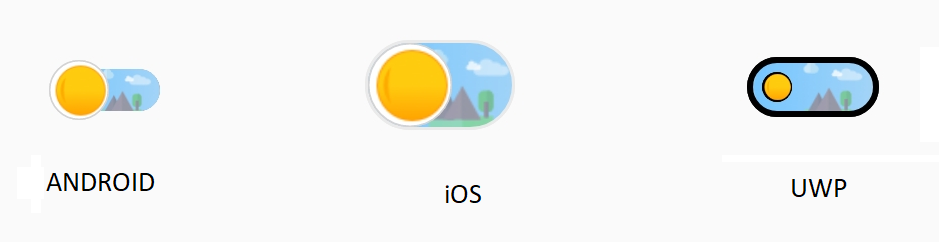

# Customization with visual states

The switch control provides options to customize the color based on states. The following code example demonstrates how to customize the switch control.

## Solid colors

The following properties are used to apply solid colors to the thumb, track, border, and busy indicator, respectively:

* ThumbColor: Represents the color for the thumb.
* ThumbBorderColor: Represents the border color for the thumb.
* TrackBorderColor: Represents the color for the border of the track.
* TrackColor: Represents the color for the track.





    <syncfusion:SfSwitch VisualType="Custom">
        <VisualStateManager.VisualStateGroups>
            <VisualStateGroup  x:Name="CommonStates">

                <VisualState x:Name="On">
                    <VisualState.Setters>
                        <Setter Property="SwitchSettings">
                            <Setter.Value>
                                <syncfusion:DefaultSwitchSettings x:TypeArguments="syncfusion:OnState" 
                                 ThumbBorderColor="DarkCyan" ThumbColor="Aqua" 
                                 TrackBorderColor="Green" TrackColor="GreenYellow" 
                                 BusyIndicatorColor="Coral" />
                            </Setter.Value>
                        </Setter>
                    </VisualState.Setters>
                </VisualState>

                <VisualState x:Name="Off">
                    <VisualState.Setters>
                        <Setter Property="SwitchSettings">
                            <Setter.Value>
                                <syncfusion:DefaultSwitchSettings x:TypeArguments="syncfusion:OffState" 
                                ThumbBorderColor="DarkCyan" ThumbColor="Aqua" 
                                TrackBorderColor="Green" TrackColor="GreenYellow"/>
                            </Setter.Value>
                        </Setter>
                    </VisualState.Setters>
                </VisualState>

                <VisualState x:Name="Indeterminate">
                    <VisualState.Setters>
                        <Setter Property="SwitchSettings">
                            <Setter.Value>
                                <syncfusion:DefaultSwitchSettings x:TypeArguments="syncfusion:IndeterminateState" 
                                ThumbBorderColor="DarkCyan" TrackBorderColor="Green" 
                                ThumbColor="Aqua" TrackColor="GreenYellow"/>
                            </Setter.Value>
                        </Setter>
                    </VisualState.Setters>
                </VisualState>

            </VisualStateGroup>
        </VisualStateManager.VisualStateGroups>
    </syncfusion:SfSwitch>





SfSwitch sfSwitch = new SfSwitch();
sfSwitch.VisualType = VisualType.Custom;

DefaultSwitchSettings<OnState> defaultSwitch = new DefaultSwitchSettings<OnState>();
defaultSwitch.ThumbBorderColor = Color.DarkCyan;
defaultSwitch.ThumbColor = Color.Aqua;
defaultSwitch.TrackBorderColor = Color.Green;
defaultSwitch.TrackColor = Color.GreenYellow;
defaultSwitch.BusyIndicatorColor = Color.Coral;

DefaultSwitchSettings<OffState> defaultSwitch1 = new DefaultSwitchSettings<OffState>();
defaultSwitch1.ThumbBorderColor = Color.DarkCyan;
defaultSwitch1.ThumbColor = Color.Aqua;
defaultSwitch1.TrackBorderColor = Color.Green;
defaultSwitch1.TrackColor = Color.GreenYellow;

DefaultSwitchSettings<IndeterminateState> defaultSwitch2 = new DefaultSwitchSettings<IndeterminateState>();
defaultSwitch2.ThumbBorderColor = Color.DarkCyan;
defaultSwitch2.ThumbColor = Color.Aqua;
defaultSwitch2.TrackBorderColor = Color.Green;
defaultSwitch2.TrackColor = Color.GreenYellow;

VisualStateGroupList visualStateGroupList = new VisualStateGroupList();

VisualStateGroup commonStateGroup = new VisualStateGroup();
VisualState onState = new VisualState
{
Name = "On"
};
onState.Setters.Add(new Setter { Property = SfSwitch.SwitchSettingsProperty, Value= defaultSwitch});

VisualState offState = new VisualState
{
Name = "Off"
};
offState.Setters.Add(new Setter { Property = SfSwitch.SwitchSettingsProperty, Value = defaultSwitch1 });

VisualState indeterminate = new VisualState
{
Name = "Indeterminate"
};
indeterminate.Setters.Add(new Setter { Property = SfSwitch.SwitchSettingsProperty, Value = defaultSwitch2 });

commonStateGroup.States.Add(onState);
commonStateGroup.States.Add(offState);
commonStateGroup.States.Add(indeterminate);
visualStateGroupList.Add(commonStateGroup);

VisualStateManager.SetVisualStateGroups(sfSwitch, visualStateGroupList);

this.Content = sfSwitch;





## Gradients

You can also specify a range of colors in thumb and track using ThumbGradient and TrackGradient as demonstrates in the following code example.





    <syncfusion:SfSwitch VisualType="Custom"  >
        <VisualStateManager.VisualStateGroups>
            <VisualStateGroup x:Name="CommonStates">
                <VisualState x:Name="On">
                    <VisualState.Setters>
                        <Setter Property="SwitchSettings">
                            <Setter.Value>
                                <syncfusion:DefaultSwitchSettings x:TypeArguments="syncfusion:OnState">

                                    <syncfusion:DefaultSwitchSettings.ThumbGradient>
                                        <graphics:SfLinearGradientBrush>
                                            <graphics:SfLinearGradientBrush.GradientStops>
                                                <graphics:GradientStopCollection>
                                                    <graphics:SfGradientStop Color="White" Offset="0"></graphics:SfGradientStop>
                                                    <graphics:SfGradientStop Color="LightSkyBlue" Offset="0.5"></graphics:SfGradientStop>
                                                    <graphics:SfGradientStop Color="White" Offset="1"></graphics:SfGradientStop>
                                                </graphics:GradientStopCollection>
                                            </graphics:SfLinearGradientBrush.GradientStops>
                                        </graphics:SfLinearGradientBrush>
                                 </syncfusion:DefaultSwitchSettings.ThumbGradient>

                                    <syncfusion:DefaultSwitchSettings.TrackGradient>
                                        <graphics:SfLinearGradientBrush>
                                            <graphics:SfLinearGradientBrush.GradientStops>
                                                <graphics:GradientStopCollection>
                                                    <graphics:SfGradientStop Color="White" Offset="0"></graphics:SfGradientStop>
                                                    <graphics:SfGradientStop Color="LightCoral" Offset="0.25"></graphics:SfGradientStop>
                                                    <graphics:SfGradientStop Color="Red" Offset="0.5"></graphics:SfGradientStop>
                                                    <graphics:SfGradientStop Color="LightSalmon" Offset="0.75"></graphics:SfGradientStop>
                                                </graphics:GradientStopCollection>
                                            </graphics:SfLinearGradientBrush.GradientStops>
                                        </graphics:SfLinearGradientBrush>
                                    </syncfusion:DefaultSwitchSettings.TrackGradient>

                                </syncfusion:DefaultSwitchSettings>
                            </Setter.Value>
                        </Setter>
                    </VisualState.Setters>
                </VisualState>
            </VisualStateGroup>
        </VisualStateManager.VisualStateGroups>
    </syncfusion:SfSwitch>





SfSwitch sfSwitch = new SfSwitch();
sfSwitch.VisualType = VisualType.Custom;

DefaultSwitchSettings<OnState> defaultSwitch = new DefaultSwitchSettings<OnState>();
SfLinearGradientBrush sfLinearGradientBrush = new SfLinearGradientBrush();

GradientStopCollection sfGradientStops = new GradientStopCollection();

SfGradientStop sfGradientStop = new SfGradientStop();
sfGradientStop.Color = Color.White;
sfGradientStop.Offset = 0;
sfGradientStops.Add(sfGradientStop);

SfGradientStop sfGradientStop1 = new SfGradientStop();
sfGradientStop1.Color = Color.LightSkyBlue;
sfGradientStop1.Offset = 0.5;
sfGradientStops.Add(sfGradientStop1);

SfGradientStop sfGradientStop2 = new SfGradientStop();
sfGradientStop2.Color = Color.White;
sfGradientStop2.Offset = 1;
sfGradientStops.Add(sfGradientStop2);

sfLinearGradientBrush.GradientStops = sfGradientStops;

defaultSwitch.ThumbGradient = sfLinearGradientBrush;

SfLinearGradientBrush sfLinearGradientBrush1 = new SfLinearGradientBrush();

GradientStopCollection sfGradientStops1 = new GradientStopCollection();

SfGradientStop sfGradientStop3 = new SfGradientStop();
sfGradientStop3.Color = Color.White;
sfGradientStop3.Offset = 0;
sfGradientStops1.Add(sfGradientStop3);

SfGradientStop sfGradientStop4 = new SfGradientStop();
sfGradientStop4.Color = Color.LightCoral;
sfGradientStop4.Offset = 0.25;
sfGradientStops1.Add(sfGradientStop4);

SfGradientStop sfGradientStop5 = new SfGradientStop();
sfGradientStop5.Color = Color.Red;
sfGradientStop5.Offset = 0.5;
sfGradientStops1.Add(sfGradientStop5);

SfGradientStop sfGradientStop6 = new SfGradientStop();
sfGradientStop6.Color = Color.LightSalmon;
sfGradientStop6.Offset = 0.75;
sfGradientStops1.Add(sfGradientStop6);

sfLinearGradientBrush1.GradientStops = sfGradientStops1;

defaultSwitch.TrackGradient = sfLinearGradientBrush1;

VisualStateGroupList visualStateGroupList = new VisualStateGroupList();

VisualStateGroup commonStateGroup = new VisualStateGroup();
VisualState onState = new VisualState
{
Name = "On"
};
onState.Setters.Add(new Setter { Property = SfSwitch.SwitchSettingsProperty, Value = defaultSwitch });

commonStateGroup.States.Add(onState);

visualStateGroupList.Add(commonStateGroup);

VisualStateManager.SetVisualStateGroups(sfSwitch, visualStateGroupList);

this.Content = sfSwitch;





N> Here ThumbGradient and TrackGradient are type of `SfLinearGradientBrush`, So You can apply  `SfLinearGradientBrush` or `SfRadialGradientBrush` on it.  This `SfLinearGradientBrush` is available in  [`Syncfusion.Xamarin.Core`](https://www.nuget.org/packages/Syncfusion.Xamarin.Core) from [`nuget.org`](https://www.nuget.org/). To know more about gradient view refer this [`link`](https://help.syncfusion.com/xamarin/sfgradientview/getting-started).

## Sizing

In the switch control, sizing of the thumb and the track can be controlled using the following properties:

* TrackCornerRadius: Represents a double value to create curved corner.
* TrackBorderWidth: Represents a double value for defining the track border width.
* TrackWidthRequest: Represents a double value for defining the track width.
* TrackHeightRequest: Represents double value for defining the track height.
* ThumbBorderWidth: Represents a double value for defining the thumb border width.
* ThumbCornerRadius: Represents a double value to create curved corner.
* ThumbHeightRequest: Represents double value for defining the thumb height.
* ThumbWidthRequest: Represents double value for defining the thumb width.

The following code example demonstrates how to customize the size of the track and thumb.





    <syncfusion:SfSwitch  VisualType="Custom" >

        <VisualStateManager.VisualStateGroups>
            <VisualStateGroup  x:Name="CommonStates">
                <VisualState x:Name="On">
                    <VisualState.Setters>
                        <Setter Property="SwitchSettings">
                            <Setter.Value>
                                <syncfusion:DefaultSwitchSettings  x:TypeArguments="syncfusion:OnState" 
                                 ThumbBorderWidth="2" TrackBorderWidth="2"  
                                 TrackHeightRequest="25" TrackWidthRequest="75" TrackCornerRadius="4"
                                 ThumbCornerRadius="4" ThumbHeightRequest="10" ThumbWidthRequest="10">
                                </syncfusion:DefaultSwitchSettings>
                            </Setter.Value>
                        </Setter>
                    </VisualState.Setters>
                </VisualState>

                <VisualState x:Name="Off">
                    <VisualState.Setters>
                        <Setter Property="SwitchSettings">
                            <Setter.Value>
                                <syncfusion:DefaultSwitchSettings x:TypeArguments="syncfusion:OffState" 
                                 ThumbBorderWidth="2" TrackBorderWidth="2"  
                                 TrackHeightRequest="25" TrackWidthRequest="75" TrackCornerRadius="4"
                                 ThumbCornerRadius="4" ThumbHeightRequest="10" ThumbWidthRequest="10"/>
                            </Setter.Value>
                        </Setter>
                    </VisualState.Setters>
                </VisualState>
            </VisualStateGroup>

        </VisualStateManager.VisualStateGroups>
    </syncfusion:SfSwitch>





SfSwitch sfSwitch = new SfSwitch();
sfSwitch.VisualType = VisualType.Custom;

DefaultSwitchSettings<OnState> defaultSwitch = new DefaultSwitchSettings<OnState>();
defaultSwitch.ThumbBorderWidth = 2;
defaultSwitch.TrackBorderWidth = 2;
defaultSwitch.TrackHeightRequest = 25;
defaultSwitch.TrackWidthRequest = 75;
defaultSwitch.TrackCornerRadius = 4;
defaultSwitch.ThumbCornerRadius = 4;
defaultSwitch.ThumbHeightRequest = 10;
defaultSwitch.ThumbWidthRequest = 10;

DefaultSwitchSettings<OffState> defaultSwitch1 = new DefaultSwitchSettings<OffState>();
defaultSwitch1.ThumbBorderWidth = 2;
defaultSwitch1.TrackBorderWidth = 2;
defaultSwitch1.TrackHeightRequest = 25;
defaultSwitch1.TrackWidthRequest = 75;
defaultSwitch1.TrackCornerRadius = 4;
defaultSwitch1.ThumbCornerRadius = 4;
defaultSwitch1.ThumbHeightRequest = 10;
defaultSwitch1.ThumbWidthRequest = 10;

VisualStateGroupList visualStateGroupList = new VisualStateGroupList();

VisualStateGroup commonStateGroup = new VisualStateGroup();
VisualState onState = new VisualState
{
Name = "On"
};
onState.Setters.Add(new Setter { Property = SfSwitch.SwitchSettingsProperty, Value = defaultSwitch });

VisualState offState = new VisualState
{
Name = "Off"
};

offState.Setters.Add(new Setter { Property = SfSwitch.SwitchSettingsProperty, Value = defaultSwitch1 });

commonStateGroup.States.Add(onState);

visualStateGroupList.Add(commonStateGroup);

VisualStateManager.SetVisualStateGroups(sfSwitch, visualStateGroupList);

this.Content = sfSwitch;





## Images

Images can also be added to enhance the visual appearance. The following properties are used to add the images:

* TrackImageSource: Represents the image source for the track.
* ThumbImageSource: Represents the image source for thumb.

The following code example demonstrates how to customize the image.





    <syncfusion:SfSwitch IsOn="False" HorizontalOptions="Center" VisualType="Custom">
        <VisualStateManager.VisualStateGroups>
            <VisualStateGroup x:Name="CommonStates">
                <VisualState x:Name="On">
                    <VisualState.Setters>
                        <Setter Property="SwitchSettings">
                            <Setter.Value>
                                <syncfusion:DefaultSwitchSettings x:TypeArguments="syncfusion:OnState"
                                 TrackImageSource="switchbg2.png"
                                 ThumbImageSource="switchmoon.png"/>
                            </Setter.Value>
                        </Setter>
                    </VisualState.Setters>
                </VisualState>
                <VisualState x:Name="Off">
                    <VisualState.Setters>
                        <Setter Property="SwitchSettings">
                            <Setter.Value>
                                <syncfusion:DefaultSwitchSettings x:TypeArguments="syncfusion:OffState"
                                  TrackImageSource="switchbg.png"
                                  ThumbImageSource="switchsun.png"/>
                            </Setter.Value>
                        </Setter>
                    </VisualState.Setters>
                </VisualState>
            </VisualStateGroup>
        </VisualStateManager.VisualStateGroups>
    </syncfusion:SfSwitch>





SfSwitch sfSwitch = new SfSwitch();
sfSwitch.IsOn = false;

sfSwitch.VisualType = VisualType.Custom;

DefaultSwitchSettings<OnState> defaultSwitch = new DefaultSwitchSettings<OnState>();
defaultSwitch.TrackImageSource = "switchbg2.png";
defaultSwitch.ThumbImageSource = "switchmoon.png";

DefaultSwitchSettings<OffState> defaultSwitch1 = new DefaultSwitchSettings<OffState>();
defaultSwitch1.TrackImageSource = "switchbg.png";
defaultSwitch1.ThumbImageSource = "switchsun.png";

VisualStateGroupList visualStateGroupList = new VisualStateGroupList();

VisualStateGroup commonStateGroup = new VisualStateGroup();
VisualState onState = new VisualState
{
Name = "On"
};
onState.Setters.Add(new Setter { Property = SfSwitch.SwitchSettingsProperty, Value = defaultSwitch });

VisualState offState = new VisualState
{
Name = "Off"
};

offState.Setters.Add(new Setter { Property = SfSwitch.SwitchSettingsProperty, Value = defaultSwitch1 });

commonStateGroup.States.Add(onState);
commonStateGroup.States.Add(offState);
visualStateGroupList.Add(commonStateGroup);

VisualStateManager.SetVisualStateGroups(sfSwitch, visualStateGroupList);

this.Content = sfSwitch;





## Limitation

Since the Visual State Manger (internally) is handled in our control, applying  Visual State Manger thorough style (as dynamic resource) does not work.

