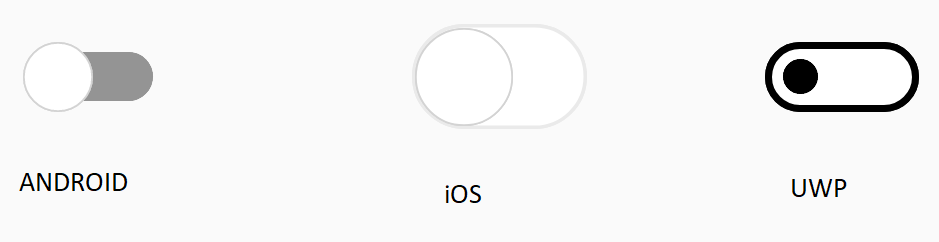

# Getting Started

This section explains you the steps to add the SfSwitch control with basic functionalities in Xamarin.Forms.

## Adding SfSwitch reference

You can add SfSwitch reference using one of the below methods.

**Method 1: Adding SfSwitch reference from nuget.org**

Syncfusion Xamarin components are available in [nuget.org](https://www.nuget.org/#). To add SfSwitch to your project, open the NuGet package manager in Visual Studio, search for [Syncfusion.Xamarin.Core](https://www.nuget.org/packages/Syncfusion.Xamarin.Core), and then install it.

**Method 2: Adding SfSwitch reference from toolbox**

Syncfusion provides Xamarin Toolbox. Using this toolbox, you can drag the SfSwitch control to the XAML page. It will automatically install the required NuGet packages and add the namespace to the page. To install Syncfusion Xamarin Toolbox, refer to [`Toolbox`](https://help.syncfusion.com/xamarin/utility#toolbox).

**Method 3: Adding SfSwitch assemblies manually from the installed location**

If you prefer to manually reference the assemblies instead referencing from NuGet, add the following assemblies in respective projects.

Location: {Installed location}/{version}/Xamarin/lib

<table>
<tr>
<td>
PCL  </td><td>
Syncfusion.Buttons.XForms.dll Syncfusion.Core.XForms.dll Syncfusion.Licensing.dll  </td></tr>
<tr>
<td>
Android  </td><td>
Syncfusion.Buttons.XForms.dll Syncfusion.Buttons.XForms.Android.dll Syncfusion.Core.XForms.dll Syncfusion.Core.XForms.Android.dll Syncfusion.Licensing.dll  </td></tr>
<tr>
<td>
iOS  </td><td>
Syncfusion.Buttons.XForms.dll Syncfusion.Buttons.XForms.iOS.dll Syncfusion.Core.XForms.dll Syncfusion.Core.XForms.iOS.dll Syncfusion.Licensing.dll  </td></tr>
<tr>
<td>
UWP  </td><td>
Syncfusion.Buttons.XForms.dll Syncfusion.Buttons.XForms.UWP.dll Syncfusion.Core.XForms.dll Syncfusion.Core.XForms.UWP.dll Syncfusion.Licensing.dll  </td></tr>
</table>

N> To know more about obtaining our components, refer to these links for [Mac](https://help.syncfusion.com/xamarin/introduction/download-and-installation/mac/) and [Windows](https://help.syncfusion.com/xamarin/introduction/download-and-installation/windows/).

I> Starting with v16.2.0.x, if you reference Syncfusion assemblies from the trial setup or from the NuGet feed, you also have to include a license key in your projects. Please refer to [Syncfusion license key](https://help.syncfusion.com/common/essential-studio/licensing/license-key/) to know about registering Syncfusion license key in your Xamarin application to use our components.

## Launching an application on each platform with SfSwitch

To use the SfSwitch inside an application, each platform application requires some additional configurations. The configurations vary from platform to platform and is discussed in the following sections:

N> If you are adding the references from toolbox, below steps are not needed.   

**iOS**

To launch the switch in iOS, call the SfSwitchRenderer.Init() method in the FinishedLaunching overridden method of the AppDelegate class after the Xamarin.Forms framework initialization and before the LoadApplication method is called as demonstrated in the following code sample:





public override bool FinishedLaunching(UIApplication app, NSDictionary options)

{

global::Xamarin.Forms.Forms.Init();

Syncfusion.XForms.iOS.Buttons.SfSwitchRenderer.Init();

LoadApplication(new App());

return base.FinishedLaunching(app, options);

}





N> If you are adding the references from toolbox, this step is not needed.

**Universal** **Windows** **Platform** **(****UWP****)**

To deploy the switch in Release mode, you need to initialize the button assemblies in App.xaml.cs in UWP project as shown in the below code snippets.





protected override void OnLaunched(LaunchActivatedEventArgs e) 

{ 

..... 

rootFrame.NavigationFailed += OnNavigationFailed; 

// Add using System.Reflection;

List<Assembly> assembliesToInclude = new List<Assembly>(); 
//Now, add all the assemblies that your app uses.
assembliesToInclude.Add(typeof(SfBorderRenderer).GetTypeInfo().Assembly); 
// replaces Xamarin.Forms.Forms.Init(e); 

Xamarin.Forms.Forms.Init(e, assembliesToInclude);

..... 

}





**Android**

The Android platform does not require any additional configuration to render the chart.

## Initializing SfSwitch

Import the Button namespace as shown below in your respective Page,





xmlns:syncfusion="clr-namespace:Syncfusion.XForms.Buttons;assembly=Syncfusion.Buttons.XForms"





using Syncfusion.XForms.Buttons;





Then initialize the switch control as shown below using the code example.





    <syncfusion:SfSwitch /> 





SfSwitch sfSwitch = new SfSwitch();





## Performing an action based on state

You can switch between the states. When the state is changed the StateChanging and StateChanged event will be triggered where you can perform an action based on the current state.The StateChanging event allows you to cancel moving to a new state.

The following code example displays a message box when switched to off state when work is completed.





    <syncfusion:SfSwitch StateChanged="SfSwitch_StateChanged" />





sfSwitch.StateChanged += SfSwitch_StateChanged;









 private void SfSwitch_StateChanged(object sender, SwitchStateChangedEventArgs e)
{
     DisplayAlert("Message", "SUCCESS", "OK");
}





You can find the complete getting started sample from this [link](https://www.syncfusion.com/downloads/support/directtrac/general/ze/GettingStartedSample1199686003).
