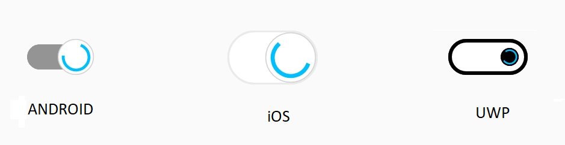
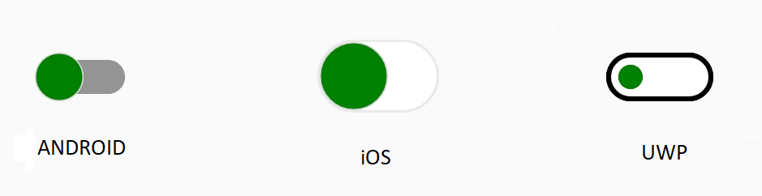
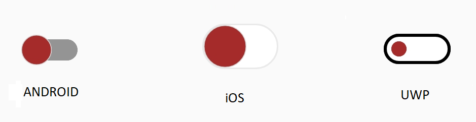
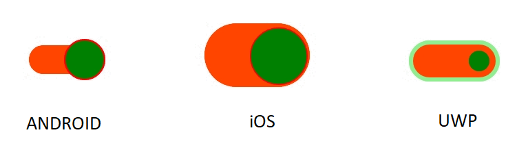
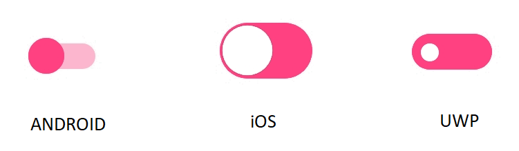

# How to

## Show busy indicator to perform async action

The busy indicator indicates users that something is on progress in the background. For instance, some data is being fetched from the back end. Here, when users about to switch the state, the StateChanging event occurs, and users can set the `IsBusy` property to true to show busy indicator and perform fetching the data from the server. After fetching the data, the `IsOn` property will be set to true or false based on validation. After validation, the `IsBusy` property is set to false.





    <syncfusion:SfSwitch x:Name="sfSwitch" StateChanging="State_StateChanging"/>
        




 SfSwitch sfSwitch = new SfSwitch();

 sfSwitch.StateChanged += State_StateChanging;







    private async void State_StateChanging(object sender, SwitchStateChangingEventArgs e)
        {
            this.sfSwitch.IsBusy = true;
            await Task.Delay(2500);
            this.sfSwitch.IsOn = ValidateInternetConnection();
            this.sfSwitch.IsBusy = false;
        }

        private bool ValidateInternetConnection()
        {
            Random randomValue = new Random();
            if (randomValue.Next() % 2 == 0)
            {
                return false;
            }
            return true;
        }
        


## Change thumb color alone based on its state and devices

You can customize the thumb color using the `ThumbColor` property based on its visual state and devices.





    <syncfusion:SfSwitch  VisualType="Custom">

        <VisualStateManager.VisualStateGroups>

            <VisualStateGroup x:Name="CommonStates">

                <VisualState x:Name="On">

                    <VisualState.Setters>

                        <Setter Property="SwitchSettings">

                            <Setter.Value>

                                <syncfusion:FluentSwitchSettings x:TypeArguments="syncfusion:OnState"

                                 ThumbColor="Green"/>

                            </Setter.Value>

                        </Setter>

                    </VisualState.Setters>

                </VisualState>

                <VisualState x:Name="Off">

                    <VisualState.Setters>

                        <Setter Property="SwitchSettings">

                            <Setter.Value>

                                <syncfusion:FluentSwitchSettings x:TypeArguments="syncfusion:OffState"

                                 ThumbColor="Green"/>

                            </Setter.Value>

                        </Setter>

                    </VisualState.Setters>

                </VisualState>

            </VisualStateGroup>

        </VisualStateManager.VisualStateGroups>

    </syncfusion:SfSwitch>





            SfSwitch sfSwitch = new SfSwitch();
            sfSwitch.VisualType = VisualType.Custom;

            DefaultSwitchSettings<OnState> defaultSwitch = new DefaultSwitchSettings<OnState>();
            defaultSwitch.ThumbColor = Color.Green;
           
            DefaultSwitchSettings<OffState> defaultSwitch1 = new DefaultSwitchSettings<OffState>();
            defaultSwitch1.ThumbColor = Color.Green;

            VisualStateGroupList visualStateGroupList = new VisualStateGroupList();

            VisualStateGroup commonStateGroup = new VisualStateGroup();
            VisualState onState = new VisualState
            {
                Name = "On"
            };
            onState.Setters.Add(new Setter { Property = SfSwitch.SwitchSettingsProperty, Value = defaultSwitch });

            VisualState offState = new VisualState
            {
                Name = "Off"
            };

            offState.Setters.Add(new Setter { Property = SfSwitch.SwitchSettingsProperty, Value = defaultSwitch1 });

            commonStateGroup.States.Add(onState);
            commonStateGroup.States.Add(offState);
            visualStateGroupList.Add(commonStateGroup);

            VisualStateManager.SetVisualStateGroups(sfSwitch, visualStateGroupList);

            this.Content = sfSwitch;





## Change thumb color alone based on its state with Material theme for all devices

By using the `MaterialSwitchSettings`, `CupertinoSwitchSettings`, and `FluentSwitchSettings` properties, you can change the thumb color based on its state for all devices.





    <syncfusion:SfSwitch  VisualType="Custom">

        <VisualStateManager.VisualStateGroups>

            <VisualStateGroup x:Name="CommonStates">

                <VisualState x:Name="On">

                    <VisualState.Setters>

                        <Setter Property="SwitchSettings">

                            <Setter.Value>

                                <syncfusion:MaterialSwitchSettings x:TypeArguments="syncfusion:OnState"

                                 ThumbColor="Brown"/>

                            </Setter.Value>

                        </Setter>

                    </VisualState.Setters>

                </VisualState>

                <VisualState x:Name="Off">

                    <VisualState.Setters>

                        <Setter Property="SwitchSettings">

                            <Setter.Value>

                                <syncfusion:MaterialSwitchSettings x:TypeArguments="syncfusion:OffState"

                                 ThumbColor="Brown"/>

                            </Setter.Value>

                        </Setter>

                    </VisualState.Setters>

                </VisualState>

            </VisualStateGroup>

        </VisualStateManager.VisualStateGroups>

    </syncfusion:SfSwitch>





            SfSwitch sfSwitch = new SfSwitch();
            sfSwitch.VisualType = VisualType.Custom;

            MaterialSwitchSettings<OnState> defaultSwitch = new MaterialSwitchSettings<OnState>();
            defaultSwitch.ThumbColor = Color.Brown;

            MaterialSwitchSettings<OffState> defaultSwitch1 = new MaterialSwitchSettings<OffState>();
            defaultSwitch1.ThumbColor = Color.Brown;

            VisualStateGroupList visualStateGroupList = new VisualStateGroupList();

            VisualStateGroup commonStateGroup = new VisualStateGroup();
            VisualState onState = new VisualState
            {
                Name = "On"
            };
            onState.Setters.Add(new Setter { Property = SfSwitch.SwitchSettingsProperty, Value = defaultSwitch });

            VisualState offState = new VisualState
            {
                Name = "Off"
            };

            offState.Setters.Add(new Setter { Property = SfSwitch.SwitchSettingsProperty, Value = defaultSwitch1 });

            commonStateGroup.States.Add(onState);
            commonStateGroup.States.Add(offState);
            visualStateGroupList.Add(commonStateGroup);

            VisualStateManager.SetVisualStateGroups(sfSwitch, visualStateGroupList);

            this.Content = sfSwitch;





## Set color for disabled state

The Switch control provides options to customize the color based on the disabled states. The below code example illustrates this customization.





     <syncfusion:SfSwitch  VisualType="Custom" IsEnabled="False"  IsOn="True">

        <VisualStateManager.VisualStateGroups>
            <VisualStateGroup  x:Name="CommonStates">
                <VisualState x:Name="DisabledOn">
                    <VisualState.Setters>
                        <Setter Property="SwitchSettings">
                            <Setter.Value>
                                <syncfusion:DefaultSwitchSettings  x:TypeArguments="syncfusion:DisabledOnState" 
                                ThumbBorderColor="Red" ThumbColor="Green" 
                                 TrackBorderColor="LightGreen" TrackColor="OrangeRed" 
                                 BusyIndicatorColor="Pink">
                                </syncfusion:DefaultSwitchSettings>
                            </Setter.Value>
                        </Setter>
                    </VisualState.Setters>
                </VisualState>

                <VisualState x:Name="DisabledOff">
                    <VisualState.Setters>
                        <Setter Property="SwitchSettings">
                            <Setter.Value>
                                <syncfusion:DefaultSwitchSettings x:TypeArguments="syncfusion:DisabledOffState" 
                                   ThumbBorderColor="Red" ThumbColor="Green" 
                                 TrackBorderColor="LightGreen" TrackColor="OrangeRed" 
                                 />
                            </Setter.Value>
                        </Setter>
                    </VisualState.Setters>
                </VisualState>
            </VisualStateGroup>

        </VisualStateManager.VisualStateGroups>
    </syncfusion:SfSwitch>





SfSwitch sfSwitch = new SfSwitch();
sfSwitch.VisualType = VisualType.Custom;
sfSwitch.IsOn = true;
sfSwitch.IsEnabled = false;

DefaultSwitchSettings<DisabledOnState> defaultSwitch = new DefaultSwitchSettings<DisabledOnState>();
defaultSwitch.ThumbBorderColor = Color.Red;
defaultSwitch.ThumbColor = Color.Green;
defaultSwitch.TrackBorderColor = Color.LightGreen;
defaultSwitch.TrackColor = Color.OrangeRed;
defaultSwitch.BusyIndicatorColor = Color.Pink;

DefaultSwitchSettings<DisabledOffState> defaultSwitch1 = new DefaultSwitchSettings<DisabledOffState>();
defaultSwitch1.ThumbBorderColor = Color.Red;
defaultSwitch1.ThumbColor = Color.Green;
defaultSwitch1.TrackBorderColor = Color.LightGreen;
defaultSwitch1.TrackColor = Color.OrangeRed;

VisualStateGroupList visualStateGroupList = new VisualStateGroupList();

VisualStateGroup commonStateGroup = new VisualStateGroup();
VisualState onState = new VisualState
{
Name = "DisabledOn"
};
onState.Setters.Add(new Setter { Property = SfSwitch.SwitchSettingsProperty, Value = defaultSwitch });

VisualState offState = new VisualState
{
Name = "DisabledOff"
};

offState.Setters.Add(new Setter { Property = SfSwitch.SwitchSettingsProperty, Value = defaultSwitch1 });

commonStateGroup.States.Add(onState);

commonStateGroup.States.Add(offState);

visualStateGroupList.Add(commonStateGroup);

VisualStateManager.SetVisualStateGroups(sfSwitch, visualStateGroupList);

this.Content = sfSwitch;





## Change busy indicator color

You can customize the busy indicator color using the `BusyIndicatorColor` property based on its visual state and devices.





    <syncfusion:SfSwitch  VisualType="Custom"  IsBusy="True">

        <VisualStateManager.VisualStateGroups>

            <VisualStateGroup  x:Name="CommonStates">

                <VisualState x:Name="On">

                    <VisualState.Setters>

                        <Setter Property="SwitchSettings">

                            <Setter.Value>

                                <syncfusion:DefaultSwitchSettings  x:TypeArguments="syncfusion:OnState"  BusyIndicatorColor="Red" >

                                </syncfusion:DefaultSwitchSettings>

                            </Setter.Value>

                        </Setter>

                    </VisualState.Setters>

                </VisualState>

                <VisualState x:Name="Off">

                    <VisualState.Setters>

                        <Setter Property="SwitchSettings">

                            <Setter.Value>

                                <syncfusion:DefaultSwitchSettings x:TypeArguments="syncfusion:OffState" BusyIndicatorColor="Red" />

                            </Setter.Value>

                        </Setter>

                    </VisualState.Setters>

                </VisualState>

            </VisualStateGroup>

        </VisualStateManager.VisualStateGroups>

    </syncfusion:SfSwitch>





SfSwitch sfSwitch = new SfSwitch();
sfSwitch.VisualType = VisualType.Custom;
sfSwitch.IsBusy = true;
DefaultSwitchSettings<OnState> defaultSwitch = new DefaultSwitchSettings<OnState>();
defaultSwitch.BusyIndicatorColor = Color.Red;
DefaultSwitchSettings<OffState> defaultSwitch1 = new DefaultSwitchSettings<OffState>();
defaultSwitch1.BusyIndicatorColor = Color.Red;

VisualStateGroupList visualStateGroupList = new VisualStateGroupList();

VisualStateGroup commonStateGroup = new VisualStateGroup();
VisualState onState = new VisualState
{
Name = "On"
};
onState.Setters.Add(new Setter { Property = SfSwitch.SwitchSettingsProperty, Value = defaultSwitch });

VisualState offState = new VisualState
{
Name = "Off"
};

offState.Setters.Add(new Setter { Property = SfSwitch.SwitchSettingsProperty, Value = defaultSwitch1 });

commonStateGroup.States.Add(onState);
commonStateGroup.States.Add(offState);
visualStateGroupList.Add(commonStateGroup);

VisualStateManager.SetVisualStateGroups(sfSwitch, visualStateGroupList);

this.Content = sfSwitch;





## Set all state in same look

All state can be customized in same look by setting the same state for all switch settings.





    <syncfusion:SfSwitch  VisualType="Custom" >

        <VisualStateManager.VisualStateGroups>

            <VisualStateGroup  x:Name="CommonStates">

                <VisualState x:Name="On">

                    <VisualState.Setters>

                        <Setter Property="SwitchSettings">

                            <Setter.Value>

                                <syncfusion:DefaultSwitchSettings  x:TypeArguments="syncfusion:OnState" />

                            </Setter.Value>

                        </Setter>

                    </VisualState.Setters>

                </VisualState>

                <VisualState x:Name="Off">

                    <VisualState.Setters>

                        <Setter Property="SwitchSettings">

                            <Setter.Value>

                                <syncfusion:DefaultSwitchSettings x:TypeArguments="syncfusion:OnState" />

                            </Setter.Value>

                        </Setter>

                    </VisualState.Setters>

                </VisualState>

            </VisualStateGroup>

        </VisualStateManager.VisualStateGroups>

    </syncfusion:SfSwitch>





SfSwitch sfSwitch = new SfSwitch();
sfSwitch.VisualType = VisualType.Custom;

DefaultSwitchSettings<OnState> defaultSwitch = new DefaultSwitchSettings<OnState>();

DefaultSwitchSettings<OnState> defaultSwitch1 = new DefaultSwitchSettings<OnState>();

VisualStateGroupList visualStateGroupList = new VisualStateGroupList();

VisualStateGroup commonStateGroup = new VisualStateGroup();
VisualState onState = new VisualState
{
Name = "On"
};
onState.Setters.Add(new Setter { Property = SfSwitch.SwitchSettingsProperty, Value = defaultSwitch });

VisualState offState = new VisualState
{
Name = "Off"
};

offState.Setters.Add(new Setter { Property = SfSwitch.SwitchSettingsProperty, Value = defaultSwitch1 });

commonStateGroup.States.Add(onState);

commonStateGroup.States.Add(offState);

visualStateGroupList.Add(commonStateGroup);

VisualStateManager.SetVisualStateGroups(sfSwitch, visualStateGroupList);

this.Content = sfSwitch;





## Set RTL to switch control

Switch supports to change the layout direction of the control in the right-to-left direction by setting the `FlowDirection` to `RightToLeft`.
The device direction takes when we set the `FlowDirection` as `MatchParent`.

### Setting right to left





    <syncfusion:SfSwitch  FlowDirection="RightToLeft" >
    </syncfusion:SfSwitch>





SfSwitch sfSwitch = new SfSwitch();
sfSwitch.FlowDirection = FlowDirection.RightToLeft;
this.Content = sfSwitch;





### Setting match parent





     <Grid FlowDirection="RightToLeft">
        <syncfusion:SfSwitch FlowDirection="MatchParent" />
    </Grid>





Grid grid = new Grid();
grid.FlowDirection = FlowDirection.RightToLeft;
SfSwitch sfSwitch = new SfSwitch();
sfSwitch.FlowDirection = FlowDirection.MatchParent;
grid.Children.Add(sfSwitch);
this.Content = grid;





## Get default color of the switches in all three state.

The following table illustrate the default color of the switches in all three state.

### Material

<table>
    <tr>
        <th>Elements 
             </th>        
        <th>
          State
             
             
        </th>
        <th>
            Colors
             
             
        </th>
    </tr>
 	<tr>
		<td>
            Thumb Color     
             
             
        </td>
        <td>
            On
             
             
        </td>
        <td>
            Accent
             
             
        </td>
    </tr>
    <tr>
		<td>
            Thumb Color     
             
             
        </td>
        <td>
            Off
             
             
        </td>
        <td>
            #FFFFFFFF
             
             
        </td>
    </tr>
      <tr>
		<td>
            Thumb Color     
             
             
        </td>
        <td>
            Indeterminate
             
             
        </td>
        <td>
            Accent
             
             
        </td>
    </tr>
    <tr>
		<td>
            Thumb Color     
             
             
        </td>
        <td>
            Disabled On
             
             
        </td>
        <td>
            Accent with 0.4 opacity
             
             
        </td>
    </tr>
    <tr>
		<td>
            Thumb Color     
             
             
        </td>
        <td>
            Disabled Off
             
             
        </td>
        <td>
            #FFFFFFFF
             
             
        </td>
    </tr>
     <tr>
		<td>
            Thumb Color     
             
             
        </td>
        <td>
            Disabled Indeterminate
             
             
        </td>
        <td>
            Accent with 0.4 opacity
             
             
        </td>
    </tr>
    <tr>
		<td>
            Thumb Border Color     
             
             
        </td>
        <td>
            On
             
             
        </td>
        <td>
            Accent
             
             
        </td>
    </tr>
     <tr>
		<td>
            Thumb Border Color     
             
             
        </td>
        <td>
            Off
             
             
        </td>
        <td>
            LightGray
             
             
        </td>
    </tr>
     <tr>
		<td>
            Thumb Border Color     
             
             
        </td>
        <td>
            Indeterminate
             
             
        </td>
        <td>
            Accent
             
             
        </td>
    </tr>
      <tr>
		<td>
            Thumb Border Color     
             
             
        </td>
        <td>
            Disabled On
             
             
        </td>
        <td>
            Accent with 0.4 opacity
             
             
        </td>
    </tr>
     <tr>
		<td>
            Thumb Border Color     
             
             
        </td>
        <td>
            Disabled Off
             
             
        </td>
        <td>
            #DADADA
             
             
        </td>
    </tr>
     <tr>
		<td>
            Thumb Border Color     
             
             
        </td>
        <td>
            Disabled Indeterminate
             
             
        </td>
        <td>
            Accent with 0.4 opacity
             
             
        </td>
    </tr>
    <tr>
		<td>
            Track Color     
             
             
        </td>
        <td>
            On
             
             
        </td>
        <td>
            Accent with 0.2 opacity
             
             
        </td>
    </tr>
    <tr>
		<td>
            Track Color     
             
             
        </td>
        <td>
            Off
             
             
        </td>
        <td>
            #949494
             
             
        </td>
    </tr>
      <tr>
		<td>
            Track Color       
             
             
        </td>
        <td>
            Indeterminate
             
             
        </td>
        <td>
            #CACACA
             
             
        </td>
    </tr>
    <tr>
		<td>
            Track Color       
             
             
        </td>
        <td>
            Disabled On
             
             
        </td>
        <td>
            Accent with 0.2 opacity
             
             
        </td>
    </tr>
    <tr>
		<td>
            Track Color       
             
             
        </td>
        <td>
            Disabled Off
             
             
        </td>
        <td>
            #E0E0E0
             
             
        </td>
    </tr>
     <tr>
		<td>
            Track Color       
             
             
        </td>
        <td>
            Disabled Indeterminate
             
             
        </td>
        <td>
            #E0E0E0
             
             
        </td>
    </tr>
     <tr>
		<td>
            Track Border Color     
             
             
        </td>
        <td>
            On
             
             
        </td>
        <td>
            Transparent
             
             
        </td>
    </tr>
    <tr>
		<td>
            Track Border Color     
             
             
        </td>
        <td>
            Off
             
             
        </td>
        <td>
            Transparent
             
             
        </td>
    </tr>
      <tr>
		<td>
            Track Border Color       
             
             
        </td>
        <td>
            Indeterminate
             
             
        </td>
        <td>
            Transparent
             
             
        </td>
    </tr>
    <tr>
		<td>
            Track Border Color       
             
             
        </td>
        <td>
            Disabled On
             
             
        </td>
        <td>
            Transparent
             
             
        </td>
    </tr>
    <tr>
		<td>
            Track Border Color       
             
             
        </td>
        <td>
            Disabled Off
             
             
        </td>
        <td>
            Transparent
             
             
        </td>
    </tr>
     <tr>
		<td>
            Track Border Color       
             
             
        </td>
        <td>
            Disabled Indeterminate
             
             
        </td>
        <td>
            Transparent
             
             
        </td>
    </tr>
      <tr>
		<td>
            Busy Indicator Color    
             
             
        </td>
        <td>
            On
             
             
        </td>
        <td>
            #00BFFF
             
             
        </td>
    </tr>
    <tr>
		<td>
            Busy Indicator Color     
             
             
        </td>
        <td>
            Off
             
             
        </td>
        <td>
            #00BFFF
             
             
        </td>
    </tr>
      <tr>
		<td>
            Busy Indicator Color       
             
             
        </td>
        <td>
            Indeterminate
             
             
        </td>
        <td>
            #00BFFF
             
             
        </td>
    </tr>
    <tr>
		<td>
            Busy Indicator Color       
             
             
        </td>
        <td>
            Disabled On
             
             
        </td>
        <td>
            #00BFFF
             
             
        </td>
    </tr>
    <tr>
		<td>
            Busy Indicator Color       
             
             
        </td>
        <td>
            Disabled Off
             
             
        </td>
        <td>
            #00BFFF
             
             
        </td>
    </tr>
     <tr>
		<td>
            Busy Indicator Color      
             
             
        </td>
        <td>
            Disabled Indeterminate
             
             
        </td>
        <td>
            #00BFFF
             
             
        </td>
    </tr>
    </table>

### Cupertino 

<table>
    <tr>
        <th>Elements 
             </th>        
        <th>
          State
             
             
        </th>
        <th>
            Colors
             
             
        </th>
    </tr>
 	<tr>
		<td>
            Thumb Color     
             
             
        </td>
        <td>
            On
             
             
        </td>
        <td>
            #FFFFFF
             
             
        </td>
    </tr>
    <tr>
		<td>
            Thumb Color     
             
             
        </td>
        <td>
            Off
             
             
        </td>
        <td>
            #FFFFFF
             
             
        </td>
    </tr>
      <tr>
		<td>
            Thumb Color     
             
             
        </td>
        <td>
            Indeterminate
             
             
        </td>
        <td>
            Accent
             
             
        </td>
    </tr>
    <tr>
		<td>
            Thumb Color     
             
             
        </td>
        <td>
            Disabled On
             
             
        </td>
        <td>
            #FFFFFFFF
             
             
        </td>
    </tr>
    <tr>
		<td>
            Thumb Color     
             
             
        </td>
        <td>
            Disabled Off
             
             
        </td>
        <td>
            #FFFFFFFF
             
             
        </td>
    </tr>
     <tr>
		<td>
            Thumb Color     
             
             
        </td>
        <td>
            Disabled Indeterminate
             
             
        </td>
        <td>
            Accent with 0.5 opacity
             
             
        </td>
    </tr>
    <tr>
		<td>
            Thumb Border Color     
             
             
        </td>
        <td>
            On
             
             
        </td>
        <td>
            0.1 Opacity
             
             
        </td>
    </tr>
     <tr>
		<td>
            Thumb Border Color     
             
             
        </td>
        <td>
            Off
             
             
        </td>
        <td>
            0.3 Opacity
             
             
        </td>
    </tr>
     <tr>
		<td>
            Thumb Border Color     
             
             
        </td>
        <td>
            Indeterminate
             
             
        </td>
        <td>
            0.1 Opacity
             
             
        </td>
    </tr>
      <tr>
		<td>
            Thumb Border Color     
             
             
        </td>
        <td>
            Disabled On
             
             
        </td>
        <td>
            0.5 Opacity
             
             
        </td>
    </tr>
     <tr>
		<td>
            Thumb Border Color     
             
             
        </td>
        <td>
            Disabled Off
             
             
        </td>
        <td>
            0.3 Opacity
             
             
        </td>
    </tr>
     <tr>
		<td>
            Thumb Border Color     
             
             
        </td>
        <td>
            Disabled Indeterminate
             
             
        </td>
        <td>
            0.5 Opacity
             
             
        </td>
    </tr>
    <tr>
		<td>
            Track Color     
             
             
        </td>
        <td>
            On
             
             
        </td>
        <td>
            Accent
             
             
        </td>
    </tr>
    <tr>
		<td>
            Track Color     
             
             
        </td>
        <td>
            Off
             
             
        </td>
        <td>
            Transparent
             
             
        </td>
    </tr>
      <tr>
		<td>
            Track Color       
             
             
        </td>
        <td>
            Indeterminate
             
             
        </td>
        <td>
            Transparent
             
             
        </td>
    </tr>
    <tr>
		<td>
            Track Color       
             
             
        </td>
        <td>
            Disabled On
             
             
        </td>
        <td>
            Accent with 0.5 opacity
             
             
        </td>
    </tr>
    <tr>
		<td>
            Track Color       
             
             
        </td>
        <td>
            Disabled Off
             
             
        </td>
        <td>
            Transparent
             
             
        </td>
    </tr>
     <tr>
		<td>
            Track Color       
             
             
        </td>
        <td>
            Disabled Indeterminate
             
             
        </td>
        <td>
            Transparent
             
             
        </td>
    </tr>
     <tr>
		<td>
            Track Border Color     
             
             
        </td>
        <td>
            On
             
             
        </td>
        <td>
            Transparent
             
             
        </td>
    </tr>
    <tr>
		<td>
            Track Border Color     
             
             
        </td>
        <td>
            Off
             
             
        </td>
        <td>
            #E5E5E5
             
             
        </td>
    </tr>
      <tr>
		<td>
            Track Border Color       
             
             
        </td>
        <td>
            Indeterminate
             
             
        </td>
        <td>
            Accent
             
             
        </td>
    </tr>
    <tr>
		<td>
            Track Border Color       
             
             
        </td>
        <td>
            Disabled On
             
             
        </td>
        <td>
            Accent with 0.5 opacity
             
             
        </td>
    </tr>
    <tr>
		<td>
            Track Border Color       
             
             
        </td>
        <td>
            Disabled Off
             
             
        </td>
        <td>
            #F2F2F2
             
             
        </td>
    </tr>
     <tr>
		<td>
            Track Border Color       
             
             
        </td>
        <td>
            Disabled Indeterminate
             
             
        </td>
        <td>
            Accent with 0.5 opacity
             
             
        </td>
    </tr>
      <tr>
		<td>
            Busy Indicator Color    
             
             
        </td>
        <td>
            On
             
             
        </td>
        <td>
            #00BFFF
             
             
        </td>
    </tr>
    <tr>
		<td>
            Busy Indicator Color     
             
             
        </td>
        <td>
            Off
             
             
        </td>
        <td>
            #00BFFF
             
             
        </td>
    </tr>
      <tr>
		<td>
            Busy Indicator Color       
             
             
        </td>
        <td>
            Indeterminate
             
             
        </td>
        <td>
           #00BFFF  
             
             
        </td>
    </tr>
    <tr>
		<td>
            Busy Indicator Color       
             
             
        </td>
        <td>
            Disabled On
             
             
        </td>
        <td>
            #00BFFF
             
             
        </td>
    </tr>
    <tr>
		<td>
            Busy Indicator Color       
             
             
        </td>
        <td>
            Disabled Off
             
             
        </td>
        <td>
            #00BFFF
             
             
        </td>
    </tr>
     <tr>
		<td>
            Busy Indicator Color      
             
             
        </td>
        <td>
            Disabled Indeterminate
             
             
        </td>
        <td>
            #00BFFF
             
             
        </td>
    </tr>
</table>

### Fluent

<table>
    <tr>
        <th>Elements 
             </th>        
        <th>
          State
             
             
        </th>
        <th>
            Colors
             
             
        </th>
    </tr>
 	<tr>
		<td>
            Thumb Color     
             
             
        </td>
        <td>
            On
             
             
        </td>
        <td>
            #FFFFFFFF
             
             
        </td>
    </tr>
    <tr>
		<td>
            Thumb Color     
             
             
        </td>
        <td>
            Off
             
             
        </td>
        <td>
            #000000
             
             
        </td>
    </tr>
      <tr>
		<td>
            Thumb Color     
             
             
        </td>
        <td>
            Indeterminate
             
             
        </td>
        <td>
            Accent
             
             
        </td>
    </tr>
    <tr>
		<td>
            Thumb Color     
             
             
        </td>
        <td>
            Disabled On
             
             
        </td>
        <td>
            0.2 Opacity
             
             
        </td>
    </tr>
    <tr>
		<td>
            Thumb Color     
             
             
        </td>
        <td>
            Disabled Off
             
             
        </td>
        <td>
             0.2 Opacity
             
             
        </td>
    </tr>
     <tr>
		<td>
            Thumb Color     
             
             
        </td>
        <td>
            Disabled Indeterminate
             
             
        </td>
        <td>
             0.2 Opacity
             
             
        </td>
    </tr>
    <tr>
		<td>
            Thumb Border Color     
             
             
        </td>
        <td>
            On
             
             
        </td>
        <td>
            Transparent
             
             
        </td>
    </tr>
     <tr>
		<td>
            Thumb Border Color     
             
             
        </td>
        <td>
            Off
             
             
        </td>
        <td>
            Transparent
             
             
        </td>
    </tr>
     <tr>
		<td>
            Thumb Border Color     
             
             
        </td>
        <td>
            Indeterminate
             
             
        </td>
        <td>
            Transparent
             
             
        </td>
    </tr>
      <tr>
		<td>
            Thumb Border Color     
             
             
        </td>
        <td>
            Disabled On
             
             
        </td>
        <td>
            Transparent
             
             
        </td>
    </tr>
     <tr>
		<td>
            Thumb Border Color     
             
             
        </td>
        <td>
            Disabled Off
             
             
        </td>
        <td>
            Transparent
             
             
        </td>
    </tr>
     <tr>
		<td>
            Thumb Border Color     
             
             
        </td>
        <td>
            Disabled Indeterminate
             
             
        </td>
        <td>
            Transparent
             
             
        </td>
    </tr>
    <tr>
		<td>
            Track Color     
             
             
        </td>
        <td>
            On
             
             
        </td>
        <td>
            Accent
             
             
        </td>
    </tr>
    <tr>
		<td>
            Track Color     
             
             
        </td>
        <td>
            Off
             
             
        </td>
        <td>
            Transparent
             
             
        </td>
    </tr>
      <tr>
		<td>
            Track Color       
             
             
        </td>
        <td>
            Indeterminate
             
             
        </td>
        <td>
            Transparent
             
             
        </td>
    </tr>
    <tr>
		<td>
            Track Color       
             
             
        </td>
        <td>
            Disabled On
             
             
        </td>
        <td>
            0.2 opacity
             
             
        </td>
    </tr>
    <tr>
		<td>
            Track Color       
             
             
        </td>
        <td>
            Disabled Off
             
             
        </td>
        <td>
            0.2 opacity
             
             
        </td>
    </tr>
     <tr>
		<td>
            Track Color       
             
             
        </td>
        <td>
            Disabled Indeterminate
             
             
        </td>
        <td>
            0.2 opacity
             
             
        </td>
    </tr>
     <tr>
		<td>
            Track Border Color     
             
             
        </td>
        <td>
            On
             
             
        </td>
        <td>
            Accent
             
             
        </td>
    </tr>
    <tr>
		<td>
            Track Border Color     
             
             
        </td>
        <td>
            Off
             
             
        </td>
        <td>
            #000000
             
             
        </td>
    </tr>
      <tr>
		<td>
            Track Border Color       
             
             
        </td>
        <td>
            Indeterminate
             
             
        </td>
        <td>
            Accent
             
             
        </td>
    </tr>
    <tr>
		<td>
            Track Border Color       
             
             
        </td>
        <td>
            Disabled On
             
             
        </td>
        <td>
            0.2 Opacity
             
             
        </td>
    </tr>
    <tr>
		<td>
            Track Border Color       
             
             
        </td>
        <td>
            Disabled Off
             
             
        </td>
        <td>
            0.2 Opacity
             
             
        </td>
    </tr>
     <tr>
		<td>
            Track Border Color       
             
             
        </td>
        <td>
            Disabled Indeterminate
             
             
        </td>
        <td>
            0.2 Opacity
             
             
        </td>
    </tr>
      <tr>
		<td>
            Busy Indicator Color    
             
             
        </td>
        <td>
            On
             
             
        </td>
        <td>
            #00BFFF
             
             
        </td>
    </tr>
    <tr>
		<td>
            Busy Indicator Color     
             
             
        </td>
        <td>
            Off
             
             
        </td>
        <td>
            #00BFFF
             
             
        </td>
    </tr>
      <tr>
		<td>
            Busy Indicator Color       
             
             
        </td>
        <td>
            Indeterminate
             
             
        </td>
        <td>
           #00BFFF  
             
             
        </td>
    </tr>
    <tr>
		<td>
            Busy Indicator Color       
             
             
        </td>
        <td>
            DisabledOn
             
             
        </td>
        <td>
            #00BFFF
             
             
        </td>
    </tr>
    <tr>
		<td>
            Busy Indicator Color       
             
             
        </td>
        <td>
            DisabledOff
             
             
        </td>
        <td>
            #00BFFF
             
             
        </td>
    </tr>
     <tr>
		<td>
            Busy Indicator Color      
             
             
        </td>
        <td>
            DisabledIndeterminate
             
             
        </td>
        <td>
            #00BFFF
             
             
        </td>
    </tr>
</table>