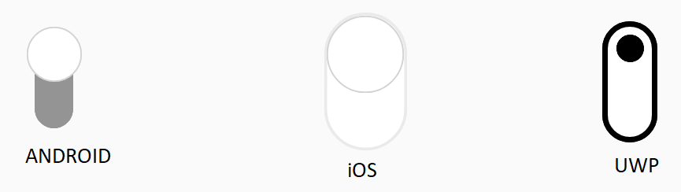

## Orientation

Switch control provides option for you to change the default alignment. 

### Horizontal 

By default, it is displayed horizontally. You can also define the Orientation as shown in the below code example.




<syncfusion:SfSwitch Orientation="Horizontal" />





SfSwitch sfSwitch = new SfSwitch();

sfSwitch.Orientation = SwitchOrientation.Horizontal;





### Vertical

To view the switch button in vertical direction, you can define the Vertical Orientation as shown in the below code example.




<syncfusion:SfSwitch Orientation="Vertical" />





SfSwitch sfSwitch = new SfSwitch();

sfSwitch.Orientation = SwitchOrientation.Vertical;





