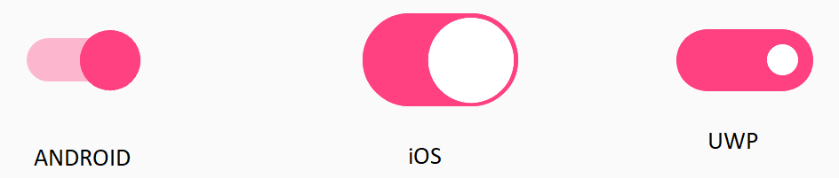

## States

Switch allows you to configure the states as explained in the below sections.

### On

You can switch to on state by tapping the switch button or by setting the value as shown in the below code example.





<syncfusion:SfSwitch IsOn="True" />





SfSwitch sfSwitch=new SfSwitch();

sfSwitch.IsOn=true;





### Off

This is the default state. You can switch to off state by tapping the switch button or by defining as shown in the below code example.





<syncfusion:SfSwitch IsOn="False" />





SfSwitch sfSwitch = new SfSwitch();

sfSwitch.IsOn = false;





### Indeterminate

The indeterminate state can be enabled when you need to display the work progress .The below code example demonstrates loading the switch in indeterminate state by setting IsOn property value as null.





<syncfusion:SfSwitch AllowIndeterminateState="True" IsOn="{x:Null}" />        





SfSwitch sfSwitch = new SfSwitch();

sfSwitch.IsOn = null;

sfSwitch.AllowIndeterminateState = true;





N> By default there will be only two states, on and off.

### Disabled On

You can switch to on state by tapping the switch button or by setting the value as shown in the below code example.





<syncfusion:SfSwitch IsOn="True" IsEnabled="{False"}/>





SfSwitch sfSwitch=new SfSwitch();

sfSwitch.IsOn=true;





### Disbaled Off

You can switch to off state by tapping the switch button or by defining as shown in the below code example.





<syncfusion:SfSwitch IsOn="False" IsEnabled="{False"//>





SfSwitch sfSwitch = new SfSwitch();

sfSwitch.IsOn = false;





### Disabled Indeterminate

The indeterminate state can be enabled when you need to display the work progress .The below code example demonstrates loading the switch in indeterminate state by setting IsOn property value as null.





<syncfusion:SfSwitch AllowIndeterminateState="True" IsOn="{x:Null}"   IsEnabled="{False"/>        





SfSwitch sfSwitch = new SfSwitch();

sfSwitch.IsOn = null;

sfSwitch.AllowIndeterminateState = true;





