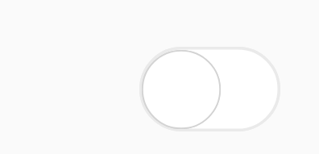

# Visual Types

SfSwitch supports customization using built-in visual types. The visual types based on device platform are listed as follows.

* Android – Material 
* iOS – Cupertino
* Windows – Fluent

## Default

This is the default value set for visual type.

N> If you set default, the visual type will be internally changed based on the device platform.

## Material

Material visual type brings the appearance based on material guidelines. The following code example demonstrates how to define material visual type.





    <syncfusion:SfSwitch VisualType="Material" />





SfSwitch sfSwitch=new SfSwitch();

sfSwitch.VisualType = VisualType.Material;





## Cupertino

Cupertino visual type brings the appearance based on Cupertino guidelines. The following code example demonstrates how to define Cupertino visual type.





    <syncfusion:SfSwitch VisualType="Cupertino" />





SfSwitch sfSwitch=new SfSwitch();

sfSwitch.VisualType = VisualType.Cupertino;





## Fluent

Fluent visual type brings the appearance based on Fluent guidelines. The following code example demonstrates how to define Fluent visual type.





    <syncfusion:SfSwitch VisualType="Fluent" />





SfSwitch sfSwitch=new SfSwitch();

sfSwitch.VisualType = VisualType.Fluent;





## Custom

Custom type will allow you to customize the control, where you can handle the size, colors, images etc. of the control. Refer to this [`documentation`](https://help.syncfusion.com/xamarin/sfswitch/customization).

