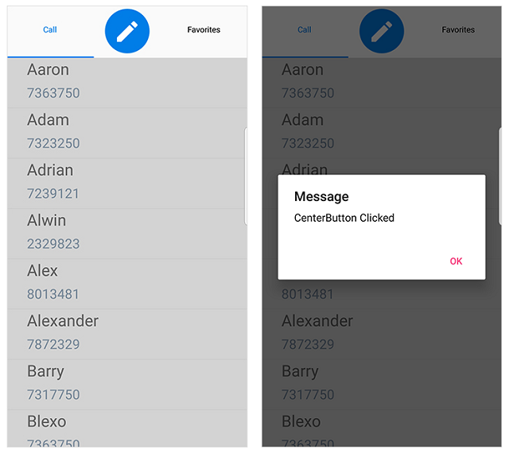

# CenterButtonSettings

This section explains on how to create and customize The Xamarin.Forms SfTabView CenterButton. To enbable CenterButton we need to set the `OverFlowMode` of Xamarin.Forms SfTabView as `CenterButton`.





<tabView:SfTabView OverflowMode="CenterButton"
                   x:Name="tabView">
</tabView:SfTabView>





public MainPage()
{
    InitializeComponent();
    SfTabView tabView = new SfTabView();
    tabView.OverflowMode = OverflowMode.CenterButton;
    this.Content = tabView;
}





## Customize CenterButtonSettings

We can customize the CenterButton by using the properties of `CenterButtonSetting`. Following are the some properties that are used to customize the view of CenterButton `BackgroundColor`, `BorderColor`, `BorderThickness`, `Height`, `Title`, `TitleFontAttributes`, `TitleFontColor`, `TitleFontSize`, `Width`.





<tabView:SfTabView.CenterButtonSettings>
    <tabView:CenterButtonSettings Height="80" Width="100"
                                  Title="CenterButton" TitleFontColor="Green"
                                  TitleFontAttributes="Bold">
    </tabView:CenterButtonSettings>
</tabView:SfTabView.CenterButtonSettings>





public MainPage()
{
    InitializeComponent();
    var centerButton = tabView.CenterButtonSettings;
    centerButton.Height = 80;
    centerButton.Width = 100;
    centerButton.Title = "Center Button";
    centerButton.TitleFontAttributes = FontAttributes.Bold;
    centerButton.TitleFontColor = Color.Green;
}





## CenterButtonTapped Event

When we tapp the `CenterButton` an event `CenterButtonTapped` will be raised. Using this event we can able to set alert message.





<tabView:SfTabView CenterButtonTapped="TabView_CenterButtonTapped">
</tabView:SfTabView>





public MainPage()
{
    InitializeComponent();
    tabView.CenterButtonTapped += TabView_CenterButtonTapped;
}

private void TabView_CenterButtonTapped(object sender, EventArgs e)
{
    DisplayAlert("Message", "CenterButton Clicked", "Ok");
}





## Custom CenterButton

When built-in view is not needed, It can be overriden by adding custom views to the CenterButtonView. The CenterButton view can be customized by adding Image, Label, Button inside the CenterButtonView. Please refer the following code snippet to customize the CentetButton view.





<tabView:SfTabView.CenterButtonView>
    <Grid>
        <Image Source="Compose.png"
               Aspect="AspectFill"
               VerticalOptions="CenterAndExpand"
               HorizontalOptions="CenterAndExpand">
            <Image.GestureRecognizers>
                <TapGestureRecognizer Tapped="TapGestureRecognizer_Tapped" />
            </Image.GestureRecognizers>
        </Image>
    </Grid>
</tabView:SfTabView.CenterButtonView>





public MainPage()
{
    InitializeComponent();
                -----
                -----
    Grid customCenterButtonGrid = new Grid();
    Image image = new Image();
    TapGestureRecognizer tapGestureRecognizer = new TapGestureRecognizer();
    image.Source = ImageSource.FromFile("Compose.png");
    image.Aspect = Aspect.AspectFill;
    image.VerticalOptions = LayoutOptions.CenterAndExpand;
    image.HorizontalOptions = LayoutOptions.CenterAndExpand;
    tapGestureRecognizer.Tapped += TapGestureRecognizer_Tapped; ;
    image.GestureRecognizers.Add(tapGestureRecognizer);
    customCenterButtonGrid.Children.Add(image);
    tabView.CenterButtonView = customCenterButtonGrid;
                -----
                -----
}

private void TapGestureRecognizer_Tapped(object sender, EventArgs e)
{
    DisplayAlert("Message", "CenterButton Clicked", "Ok");
}





Youd can Find the sample from this [link](http://www.syncfusion.com/downloads/support/directtrac/general/ze/TabView_CenterButton1561492158.zip).