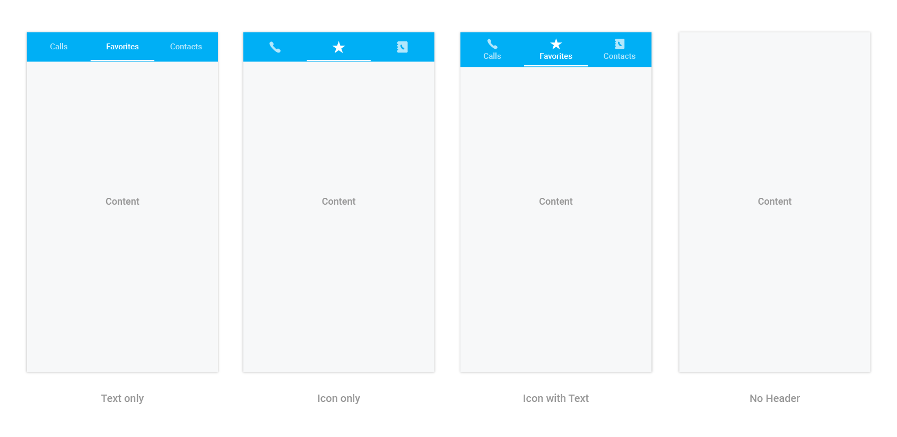

# Display Type

Tab view will display the title of each tab item by default. It can be changed to any of the below type.

* Text only.
* Image only.
* Image with text.
* No header.

It can be changed by settings the `DisplayMode` property of `SfTabView`.





<tabView:SfTabView VisibleHeaderCount="3" DisplayMode="ImageWithText" >





tabView.DisplayMode = TabDisplayMode.ImageWithText;





`No header` can be used when header is not needed for the tab view control, so content space will be occupied in the entire available height.

N> Image appearance in the header can be achieved through font icons.

## How to change the selection color for text and font icons?

Selected index can be differentiated by setting `SelectionColor` property of `SfTabItem`.





<tabView:SfTabItem 
			Title="Calls"
			SelectionColor="Green">
			




var tabViewItem = new SfTabItem()
			{
				Title = "Calls",
				TitleFontColor = Color.Green,
			}
			




Further customizations of header are discussed in the below sections.

* How to customize text appearance of the header title?
* How to set and customize font icons appearance in the header?
* Setting font file for font icons.

## How to customize text appearance of the header title?





tabView:SfTabItem 
			Title="Calls"
			TitleFontAttributes="Bold"
			TitleFontColor="Red"
			TitleFontSize="22">

			




var tabViewItem = new SfTabItem()
			{
				Title = "Calls",
				Content = allContactsGrid,
				TitleFontAttributes = FontAttributes.Bold,
				TitleFontColor = Color.Red,
				TitleFontSize = 22
			}
			




## How to set and customize font icons appearance in the header?

Add the font file into your application by following the below steps for each platform.

**Adding font file for iOS**

* Add the font file with Build Action: `BundleResource`, and
* Update the `Info.plist` file (Fonts provided by application, or UIAppFonts, key).

**Adding font file for Android**

* Add the font file to the `Assets` folder in the application project and set Build Action: `AndroidAsset`.

**Setting font file for font icons**





<ResourceDictionary>
	<OnPlatform x:TypeArguments="x:String" x:Key="fontfamily" iOS="TabIcons" Android="TabIcons.ttf" />
</ResourceDictionary>

	// . . . //

<tabview:SfTabItem Title="Calls"
	IconFont="a"
	FontIconFontColor="LightBlue"
	FontIconFontSize="20"
	FontIconFontFamily="{StaticResource fontfamily}">
			




var tabViewItem = new SfTabItem
		{
			Title = "Calls",
			Content = allContactsGrid,
			IconFont = "a", // setting value for font icons as mentioned in *.ttf.
			FontIconFontFamily = Device.RuntimePlatform == "iOS" ? "TabIcons" : "TabIcons.ttf",
			FontIconFontColor = Color.LightBlue,
			FontIconFontSize =  20
		};

			



