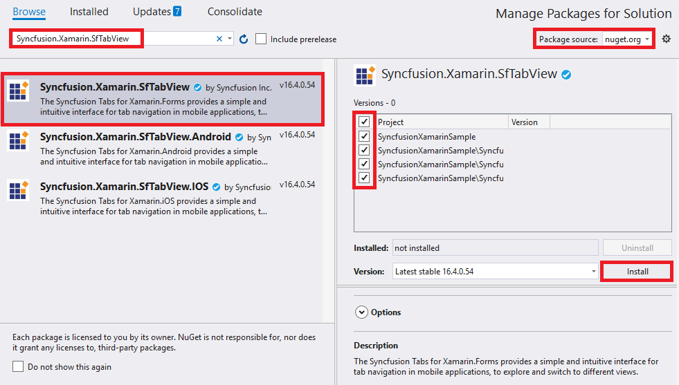
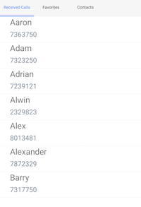

# Getting Started

This section provides an overview for working with the tab view control for Xamarin.Forms. Walk through the entire process of creating a real-world application with the tab view.

## Assembly deployment

After installing the Essential Studio for Xamarin, find all the required assemblies in installation folders, {Syncfusion Essential Studio Installed location}\Essential Studio\16.1.0.24\Xamarin\lib}.

E.g., C:\Program Files (x86)\Syncfusion\Essential Studio\16.1.0.24\Xamarin\lib

N> In Mac, assemblies can be found in unzipped package location.

## Adding SfTabView reference

You can add SfTabView reference using one of the following methods:

**Method 1: Adding SfTabView reference from nuget.org**

Syncfusion Xamarin components are available in [nuget.org](https://www.nuget.org/). To add SfTabView to your project, open the NuGet package manager in Visual Studio, search for [Syncfusion.Xamarin.SfTabView](https://www.nuget.org/packages/Syncfusion.Xamarin.SfTabView), and then install it.

N> Install the same version of SfTabView NuGet in all the projects.

**Method 2: Adding SfTabView reference from toolbox**

Syncfusion also provides Xamarin Toolbox. Using this toolbox, you can drag the SfTabView control to the XAML page. It will automatically install the required NuGet packages and add the namespace to the page. To install Syncfusion Xamarin Toolbox, refer to [Toolbox](https://help.syncfusion.com/xamarin/utility#toolbox).

**Method 3: Adding SfTabView assemblies manually from the installed location**

If you prefer to manually reference the assemblies instead referencing from NuGet, add the following assemblies in respective projects.

Location: {Installed location}/{version}/Xamarin/lib

<table>
<tr>
<td>PCL</td>
<td>Syncfusion.SfTabView.XForms.dll Syncfusion.Core.XForms.dll Syncfusion.Licensing.dll </td>
</tr>
<tr>
<td>Android</td>
<td>Syncfusion.SfTabView.XForms.dll Syncfusion.SfTabView.XForms.Android.dll Syncfusion.Core.XForms.dll Syncfusion.Core.XForms.Android.dll Syncfusion.Licensing.dll </td>
</tr>
<tr>
<td>iOS</td>
<td>Syncfusion.SfTabView.XForms.dll Syncfusion.SfTabView.XForms.iOS.dll Syncfusion.Core.XForms.dll Syncfusion.Core.XForms.iOS.dll Syncfusion.Licensing.dll </td>
</tr>
<tr>
<td>UWP</td>
<td>Syncfusion.SfTabView.XForms.dll Syncfusion.SfTabView.XForms.UWP.dll Syncfusion.Core.XForms.dll Syncfusion.Core.XForms.UWP.dll Syncfusion.Licensing.dll </td>
</tr>
</table>

N> To know more about obtaining our components, refer to these links for [Mac](https://help.syncfusion.com/xamarin/introduction/download-and-installation/mac/) and [Windows](https://help.syncfusion.com/xamarin/introduction/download-and-installation/windows/).

I> Starting with v16.2.0.x, if you reference Syncfusion assemblies from the trial setup or from the NuGet feed, you also have to include a license key in your projects. Please refer to [Syncfusion license key](https://help.syncfusion.com/common/essential-studio/licensing/license-key/) to know about registering Syncfusion license key in your Xamarin application to use our components.

## Launching the tab view on each platform

To use the tab view inside an application, each platform application must initialize the tab view renderer. This initialization steps vary from platform to platform, and it is discussed in the following sections:

### Android and UWP

Android launches the tab view without any initialization, and it is enough to only initialize the Xamarin.Forms Framework to launch the application.

N> If you are adding the references from toolbox, this step is not needed.

### iOS

To launch the tab view in iOS, call the SfTabViewRenderer.Init() in the `FinishedLaunching` overridden method of the `AppDelegate` class after the Xamarin.Forms Framework has been initialized and before the `LoadApplication` is called, as demonstrated in the following code example.



public override bool FinishedLaunching(UIApplication app, NSDictionary options)
 {
      …            
      global::Xamarin.Forms.Forms.Init ();   
      Syncfusion.XForms.iOS.TabView.SfTabViewRenderer.Init();  
      LoadApplication (new App ());   
      …   
 }
	



### ReleaseMode issue in UWP platform

There is a known Framework issue in UWP platform. The custom controls will not render when deployed the application in `Release Mode`.

The above problem can be resolved by initializing the SfTabView assemblies in `App.xaml.cs` in UWP project as like in below code snippet.



// In App.xaml.cs

protected override void OnLaunched(LaunchActivatedEventArgs e)
{
…

	rootFrame.NavigationFailed += OnNavigationFailed;
		
	// you'll need to add `using System.Reflection;`
	List<Assembly> assembliesToInclude = new List<Assembly>();

	//Now, add all the assemblies your app uses
	assembliesToInclude.Add(typeof(Syncfusion.XForms.UWP.TabView.SfTabViewRenderer).GetTypeInfo().Assembly);

	// replaces Xamarin.Forms.Forms.Init(e);        
	Xamarin.Forms.Forms.Init(e, assembliesToInclude);
		
…     
}


## Create a simple tab view

This section explains how to create a tab view and configure it. The control can be configured entirely in C# code or by using XAML markup. The following screenshot illustrates the output of tab view on iOS, Android and UWP devices.

### Creating the project

Create a new BlankApp (Xamarin.Forms.Portable) application in Xamarin Studio or Visual Studio for Xamarin.Forms.

### Adding SfTabView in Xamarin.Forms

Add the required assembly references to the PCL and renderer projects as discussed in the Assembly deployment section.

Import the control namespace as shown in the following code.





xmlns:tabView="clr-namespace:Syncfusion.XForms.TabView;assembly=Syncfusion.SfTabView.XForms"
	




using Syncfusion.XForms.TabView;





Set the control to content in `ContentPage`.





<?xml version="1.0" encoding="utf-8" ?>
<ContentPage xmlns="http://xamarin.com/schemas/2014/forms"
             xmlns:x="http://schemas.microsoft.com/winfx/2009/xaml"
             xmlns:tabView="clr-namespace:Syncfusion.XForms.TabView;assembly=Syncfusion.SfTabView.XForms"
             x:Class="TabViewAutomationSample.TabViewAutomationSample">
    <ContentPage.Content> 
        <tabView:SfTabView/> 
    </ContentPage.Content>  
</ContentPage>





using Syncfusion.XForms.TabView;
using Xamarin.Forms;

namespace GettingStarted  
{  
    public partial class MainPage : ContentPage                  
    {   
        private SfTabView tabView;   
        public MainPage()   
        {   
            InitializeComponent();       
            tabView = new SfTabView();   
            this.Content = tabView;  
        }  
    }  
}  





## Populating tab items

Tab items can be configured in tab view through the `Items` property of `SfTabView`, which holds the collection of `SfTabItem` through `TabItemsCollection`.





<ContentPage xmlns="http://xamarin.com/schemas/2014/forms"
             xmlns:x="http://schemas.microsoft.com/winfx/2009/xaml"
             xmlns:tabView="clr-namespace:Syncfusion.XForms.TabView;assembly=Syncfusion.SfTabView.XForms"
             x:Class="TabViewAutomationSample.TabViewAutomationSample">
    <ContentPage.Content>
        <tabView:SfTabView BackgroundColor="Aqua">
                    <tabView:SfTabItem Title="Call">
                        <tabView:SfTabItem.Content>
                            <Grid BackgroundColor="Red" x:Name="AllContactsGrid" />
                        </tabView:SfTabItem.Content>
                    </tabView:SfTabItem>
                    <tabView:SfTabItem Title="Favorites">
                        <tabView:SfTabItem.Content>
                            <Grid BackgroundColor="Green" x:Name="FavoritesGrid" />
                        </tabView:SfTabItem.Content>
                    </tabView:SfTabItem>
                    <tabView:SfTabItem Title="Contacts">
                        <tabView:SfTabItem.Content>
                            <Grid BackgroundColor="Blue" x:Name="ContactsGrid" />
                        </tabView:SfTabItem.Content>
                    </tabView:SfTabItem>
        </tabView:SfTabView>
    </ContentPage.Content>
</ContentPage>





using Syncfusion.XForms.TabView;
using Xamarin.Forms;
using Xamarin.Forms.Xaml;

namespace TabViewAutomationSample
{
    [XamlCompilation(XamlCompilationOptions.Compile)]
	public partial class TabView : ContentPage
	{
        SfTabView tabView;
		public TabView ()
		{
			InitializeComponent ();
            var tabView = new SfTabView();
            Grid allContactsGrid = new Grid {BackgroundColor = Color.Red};
            Grid favoritesGrid = new Grid {BackgroundColor = Color.Green};
            Grid contactsGrid = new Grid {BackgroundColor = Color.Blue};
            var tabItems = new TabItemCollection
            {
                new SfTabItem()
                {
                    Title = "Calls",
                    Content = allContactsGrid
                },
                new SfTabItem()
                {
                    Title = "Favorites",
                    Content = favoritesGrid
                },
                new SfTabItem()
                {
                    Title = "Contacts",
                    Content = contactsGrid
                }
            };
            tabView.Items = tabItems;
            this.Content = tabView;
		}
	}
}





## Adding ListView in tab view

## UseCase Sample with Contacts Information stored as a ListView in TabView Control

Create a view model class with the `ContactsInfo` collection property, which is initialized with required number of data objects.



public class ContactInfo
{
	public string Name { get; set; }
	public long Number { get; set; }
}

public class ContactsViewModel : INotifyPropertyChanged
{
	private ObservableCollection<ContactInfo> contactList;
	public event PropertyChangedEventHandler PropertyChanged;

	public ObservableCollection<ContactInfo> ContactList
	{
		get { return contactList; }
		set { contactList = value; }
	}
	public ContactsViewModel()
	{
	ContactList = new ObservableCollection<ContactInfo>();
	ContactList.Add(new ContactInfo{Name = "Aaron",Number = 7363750});
	ContactList.Add(new ContactInfo { Name = "Adam", Number = 7323250 });
	ContactList.Add(new ContactInfo { Name = "Adrian", Number = 7239121 });
	ContactList.Add(new ContactInfo { Name = "Alwin", Number = 2329823 });
	ContactList.Add(new ContactInfo { Name = "Alex", Number = 8013481 });
	ContactList.Add(new ContactInfo { Name = "Alexander", Number = 7872329 });
	ContactList.Add(new ContactInfo { Name = "Barry", Number = 7317750 });
	}
}



## Binding data to list view

Bind the items source of the `ListView`, and set the required appearance in its `ItemTemplate` property in which the list view can be hosted within the content region of tab item. 



<ContentPage xmlns="http://xamarin.com/schemas/2014/forms" 
             xmlns:x="http://schemas.microsoft.com/winfx/2009/xaml"
             xmlns:local="clr-namespace:TabViewAutomationSample"
             xmlns:tabView="clr-namespace:Syncfusion.XForms.TabView;assembly=Syncfusion.SfTabView.XForms"
             x:Class="TabViewAutomationSample.XAMARIN_22272">
   <ContentPage.Content>
        <tabView:SfTabView BackgroundColor="#f6f6f6" x:Name="tabView">
            <tabView:SfTabItem Title="{Binding Title1}">
                <tabView:SfTabItem.Content>
                    <Grid BackgroundColor="White" x:Name="AllContactsGrid" >
                        <ListView x:Name="ContactListView" 
                                  ItemsSource="{Binding ContactList}"
                                  RowHeight="75">
                            <ListView.BindingContext>
                                <local:ContactsViewModel />
                            </ListView.BindingContext>
                            <ListView.ItemTemplate>
                                <DataTemplate>
                                    <ViewCell>
                                        <StackLayout Orientation="Vertical" Margin="30,0,0,0">
                                            <Label 
                                                Text="{Binding Name}"
                                                FontSize="24"  />
                                            <Label 
                                                Text="{Binding Number}" 
                                                FontSize="20" 
                                                TextColor="LightSlateGray" />
                                        </StackLayout>
                                    </ViewCell>
                                </DataTemplate>
                            </ListView.ItemTemplate>
                        </ListView>
                    </Grid>
                </tabView:SfTabItem.Content>
            </tabView:SfTabItem>
            <tabView:SfTabItem Title="Favorites">
                <tabView:SfTabItem.Content>
                    <Grid BackgroundColor="Green" x:Name="FavouritesGrid" />
                </tabView:SfTabItem.Content>
            </tabView:SfTabItem>
            <tabView:SfTabItem Title="Contacts">
                <tabView:SfTabItem.Content>
                    <Grid BackgroundColor="Blue" x:Name="ContactsGrid" />
                </tabView:SfTabItem.Content>
            </tabView:SfTabItem>
        </tabView:SfTabView>
    </ContentPage.Content>
</ContentPage>
	


Similarly, content region for other tabs also can be configured.

## Swiping

By default, both the vertical swiping for list view and horizontal swiping for tab view will work. If it is not required, it can be customized by using the `EnableSwiping` property of `SfTabView`.

Note: Getting started sample can be downloaded from [this link](http://www.syncfusion.com/downloads/support/directtrac/general/ze/GettingStarted1726376415.zip).