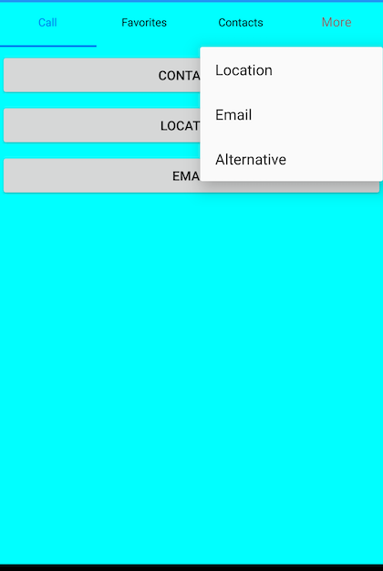
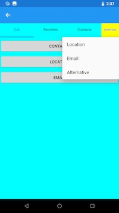

# Handling overflow tabs

When you have large number of tabs, by default, the scroller will be enabled to view the overflow of headers, if needed. It can be selected from the pop-up by setting the `OverflowMode` property of `SfTabView` to `DropDown`.





<ContentPage xmlns="http://xamarin.com/schemas/2014/forms"
             xmlns:x="http://schemas.microsoft.com/winfx/2009/xaml"
             xmlns:tabView="clr-namespace:Syncfusion.XForms.TabView;assembly=Syncfusion.SfTabView.XForms"
             x:Class="TabView.TabView">
    <ContentPage.Content>
        <tabView:SfTabView OverflowMode="DropDown" VisibleHeaderCount="3" BackgroundColor="Aqua">
            <tabView:SfTabItem Title="Call">
                <tabView:SfTabItem.Content>
                    <StackLayout>
                        <Grid BackgroundColor="Green" />
                        <Button Text="Contacts" WidthRequest="300" />
                        <Button Text="Location" WidthRequest="300" />
                        <Button Text="Email" WidthRequest="300" />
                    </StackLayout>
                </tabView:SfTabItem.Content>
            </tabView:SfTabItem>
            <tabView:SfTabItem Title="Favorites">
                <tabView:SfTabItem.Content>
                    <Grid BackgroundColor="Green" x:Name="FavoritesGrid"/>
                </tabView:SfTabItem.Content>
            </tabView:SfTabItem>
            <tabView:SfTabItem Title="Contacts">
                <tabView:SfTabItem.Content>
                    <Grid BackgroundColor="Blue" x:Name="ContactsGrid" />
                </tabView:SfTabItem.Content>
            </tabView:SfTabItem>
            <tabView:SfTabItem Title="Location">
                <tabView:SfTabItem.Content>
                    <Grid BackgroundColor="Pink" x:Name="LocationGrid" />
                </tabView:SfTabItem.Content>
            </tabView:SfTabItem>
            <tabView:SfTabItem Title="Email">
                <tabView:SfTabItem.Content>
                    <Grid BackgroundColor="Navy" x:Name="EmailGrid" />
                </tabView:SfTabItem.Content>
            </tabView:SfTabItem>
            <tabView:SfTabItem Title="Alternative">
                <tabView:SfTabItem.Content>
                    <Grid BackgroundColor="Blue" x:Name="AlternativeGrid" />
                </tabView:SfTabItem.Content>
            </tabView:SfTabItem>
        </tabView:SfTabView>
    </ContentPage.Content>
</ContentPage>





using System;
using System.Collections.Generic;
using System.Linq;
using System.Text;
using System.Threading.Tasks;
using Syncfusion.XForms.TabView;
using Xamarin.Forms;
using Xamarin.Forms.Xaml;

namespace TabView
{
	[XamlCompilation(XamlCompilationOptions.Compile)]
	public partial class TabView : ContentPage
	{
        SfTabView tabView;
		public TabView ()
		{
			InitializeComponent ();
            tabView = new SfTabView();
            var allContactsGrid = new Grid { BackgroundColor = Color.Red };
            var favoritesGrid = new Grid { BackgroundColor = Color.Green };
            var contactsGrid = new Grid { BackgroundColor = Color.Blue };
            var tabItems = new TabItemCollection
            {
                new SfTabItem()
                {
                    Title = "Calls",
                    Content = allContactsGrid
                },
                new SfTabItem()
                {
                    Title = "Favorites",
                    Content = favoritesGrid
                },
                new SfTabItem()
                {
                    Title = "Contacts",
                    Content = contactsGrid
                },
                new SfTabItem()
                {
                    Title = "Location",
                    Content = contactsGrid
                },
                new SfTabItem()
                {
                    Title = "Email",
                    Content = contactsGrid
                },
                new SfTabItem()
                {
                    Title = "Alternative",
                    Content = contactsGrid
                }
            };
            tabView.Items = tabItems;
            tabView.BackgroundColor = Color.Aqua;
            tabView.OverflowMode = OverflowMode.DropDown;
            this.Content = tabView;
		}
	}
}			




By selecting the drop-down option for tab view control, The `“Overflow button”` (or `“More button”`) will be added to the header. When you click this button, a pop-up will be displayed to navigate the other indices.

N> The pop-up will display the text value and title value of the respective tab item.

## How to customize the more button?

Appearance of the text can be customized through the APIs that are available on the `OverflowButtonSettings` property of `SfTabView`. This property has APIs to customize the both text and font icons available in the more button. 





<ContentPage xmlns="http://xamarin.com/schemas/2014/forms"
             xmlns:x="http://schemas.microsoft.com/winfx/2009/xaml"
             xmlns:tabView="clr-namespace:Syncfusion.XForms.TabView;assembly=Syncfusion.SfTabView.XForms"
             x:Class="TabView.TabView">
    <ContentPage.Content>
        <tabView:SfTabView OverflowMode="DropDown" VisibleHeaderCount="3" BackgroundColor="Aqua">
            <tabView:SfTabView.OverflowButtonSettings>
                <tabView:OverflowButtonSettings 
                    BackgroundColor="Yellow" 
                    DisplayMode="Text"
                    Title="OverFlow"
                    TitleFontSize="10"
                    TitleFontColor="Blue"/>
            </tabView:SfTabView.OverflowButtonSettings>
            <tabView:SfTabItem Title="Call">
                <tabView:SfTabItem.Content>
                    <StackLayout>
                        <Grid BackgroundColor="Green" x:Name="CotactsGrid" />
                        <Button Text="Contacts" WidthRequest="300" />
                        <Button Text="Location" WidthRequest="300" />
                        <Button Text="Email" WidthRequest="300" />
                    </StackLayout>
                </tabView:SfTabItem.Content>
            </tabView:SfTabItem>
            <tabView:SfTabItem Title="Favorites">
                <tabView:SfTabItem.Content>
                    <Grid BackgroundColor="Green" x:Name="FavoritesGrid"/>
                </tabView:SfTabItem.Content>
            </tabView:SfTabItem>
            <tabView:SfTabItem Title="Contacts">
                <tabView:SfTabItem.Content>
                    <Grid BackgroundColor="Blue" x:Name="ContactsGrid" />
                </tabView:SfTabItem.Content>
            </tabView:SfTabItem>
            <tabView:SfTabItem Title="Location">
                <tabView:SfTabItem.Content>
                    <Grid BackgroundColor="Pink" x:Name="ConttsGrid" />
                </tabView:SfTabItem.Content>
            </tabView:SfTabItem>
            <tabView:SfTabItem Title="Email">
                <tabView:SfTabItem.Content>
                    <Grid BackgroundColor="Navy" x:Name="Contactrid" />
                </tabView:SfTabItem.Content>
            </tabView:SfTabItem>
            <tabView:SfTabItem Title="Alternative">
                <tabView:SfTabItem.Content>
                    <Grid BackgroundColor="Blue" x:Name="ContGrid" />
                </tabView:SfTabItem.Content>
            </tabView:SfTabItem>
        </tabView:SfTabView>
    </ContentPage.Content>
</ContentPage>





using Syncfusion.XForms.TabView;
using Xamarin.Forms;
using Xamarin.Forms.Xaml;

namespace TabView
{
    [XamlCompilation(XamlCompilationOptions.Compile)]
	public partial class TabView : ContentPage
	{
        SfTabView tabView;
		public TabView ()
		{
			InitializeComponent ();
            tabView = new SfTabView();
            var allContactsGrid = new Grid { BackgroundColor = Color.Red };
            var favoritesGrid = new Grid { BackgroundColor = Color.Green };
            var contactsGrid = new Grid { BackgroundColor = Color.Blue };
            var overflowButtonSettings = new OverflowButtonSettings();
            overflowButtonSettings.BackgroundColor = Color.Yellow;
            overflowButtonSettings.DisplayMode = OverflowButtonDisplayMode.Text;
            overflowButtonSettings.Title = "OverFlow";
            overflowButtonSettings.TitleFontSize = 10;
            overflowButtonSettings.TitleFontColor = Color.Blue;
            tabView.OverflowButtonSettings = overflowButtonSettings;
            var tabItems = new TabItemCollection
            {
                new SfTabItem()
                {
                    Title = "Calls",
                    Content = allContactsGrid
                },
                new SfTabItem()
                {
                    Title = "Favorites",
                    Content = favoritesGrid
                },
                new SfTabItem()
                {
                    Title = "Contacts",
                    Content = contactsGrid
                },
                new SfTabItem()
                {
                    Title = "Location",
                    Content = contactsGrid
                },
                new SfTabItem()
                {
                    Title = "Email",
                    Content = contactsGrid
                },
                new SfTabItem()
                {
                    Title = "Alternative",
                    Content = contactsGrid
                }
            };
            tabView.Items = tabItems;
            tabView.BackgroundColor = Color.Aqua;
            tabView.OverflowMode = OverflowMode.DropDown;
            this.Content = tabView;
		}
	}
}
			




