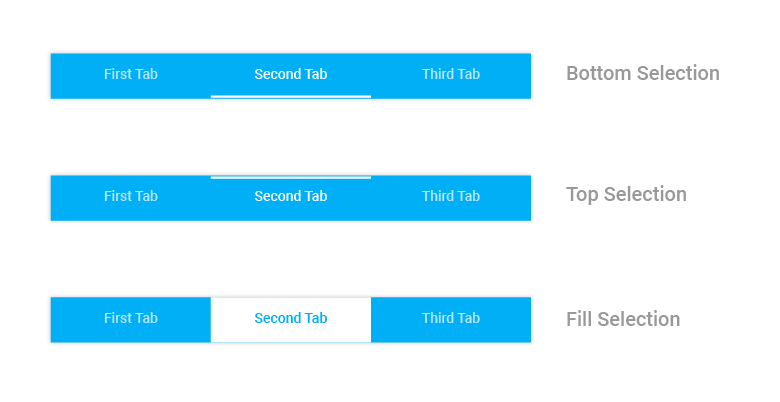
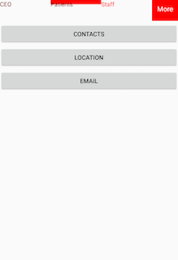

# Selection Indicator Strip

The selection indicator strip can be used to indicate the selected index of the tab view control. It can be customized with the built-in APIs that are available in the `SelectionIndicatorSettings` property of `SfTabView`.

The selection indicator can be positioned below the title or above the title, or else it can be filled in the entire selected header space.





<ContentPage xmlns="http://xamarin.com/schemas/2014/forms"
             xmlns:x="http://schemas.microsoft.com/winfx/2009/xaml"
             xmlns:tabView="clr-namespace:Syncfusion.XForms.TabView;assembly=Syncfusion.SfTabView.XForms"
             x:Class="RangeSlider.TabView">
    <ContentPage.Content>
        <tabView:SfTabView VisibleHeaderCount="3"
                           TabHeaderPosition="Bottom"  
                           OverflowMode="DropDown">
			<tabView:SfTabView.SelectionIndicatorSettings>
                <tabView:SelectionIndicatorSettings
                    Color="Red" 
                    Position="Top" 
                    StrokeThickness="10"/>
            </tabView:SfTabView.SelectionIndicatorSettings>
            <tabView:SfTabItem Title="CEO">
                <tabView:SfTabItem.Content>
                    <StackLayout>
                        <Grid BackgroundColor="Green"/>
                        <Button Text="Contacts" WidthRequest="300" />
                        <Button Text="Location" WidthRequest="300" />
                        <Button Text="Email" WidthRequest="300" />
                    </StackLayout>
                </tabView:SfTabItem.Content>
            </tabView:SfTabItem>
            <tabView:SfTabItem Title="Patients">
                <tabView:SfTabItem.Content>
                    <Grid BackgroundColor="Blue" x:Name="FavoritesGrid"/>
                </tabView:SfTabItem.Content>
            </tabView:SfTabItem>
            <tabView:SfTabItem Title="Staff">
                <tabView:SfTabItem.Content>
                    <Grid BackgroundColor="Green" x:Name="ContactsGrid" />
                </tabView:SfTabItem.Content>
            </tabView:SfTabItem>
            <tabView:SfTabItem Title="Alternative">
                <tabView:SfTabItem.Content>
                    <Grid BackgroundColor="Olive" x:Name="AlternativeGrid" />
                </tabView:SfTabItem.Content>
            </tabView:SfTabItem>
        </tabView:SfTabView>
    </ContentPage.Content>
</ContentPage>
			




using Syncfusion.XForms.TabView;
using Xamarin.Forms;
using Xamarin.Forms.Xaml;

namespace RangeSlider
{
    [XamlCompilation(XamlCompilationOptions.Compile)]
	public partial class TabView : ContentPage
	{
        SfTabView tabView;
		public TabView ()
		{
			InitializeComponent ();
            tabView = new SfTabView();
            var allContactsGrid = new Grid { BackgroundColor = Color.Red };
            var favoritesGrid = new Grid { BackgroundColor = Color.Blue };
            var contactsGrid = new Grid { BackgroundColor = Color.Green };
            var alternativeGrid = new Grid { BackgroundColor = Color.Olive };
			var selectionIndicatorSettings = new SelectionIndicatorSettings();
            selectionIndicatorSettings.Color = Color.Red;
            selectionIndicatorSettings.Position = SelectionIndicatorPosition.Top;
            selectionIndicatorSettings.StrokeThickness = 10;
            tabView.SelectionIndicatorSettings = selectionIndicatorSettings;
            tabView.TabHeaderPosition = TabHeaderPosition.Bottom;
            tabView.OverflowMode = OverflowMode.DropDown;
            var tabItems = new TabItemCollection
            {
                new SfTabItem()
                {
                    Title = "CEO",
                    Content = allContactsGrid
                },
                new SfTabItem()
                {
                    Title = "Patients",
                    Content = favoritesGrid
                },
                new SfTabItem()
                {
                    Title = "Staff",
                    Content = contactsGrid
                }
                new SfTabItem()
                {
                    Title = "Alternative",
                    Content = alternativeGrid
                }
            };
            tabView.Items = tabItems;
            this.Content = tabView;
		}
	}
}





N> Stroke thickness will not be applicable when the selection indicator’s position is set to "Fill".

