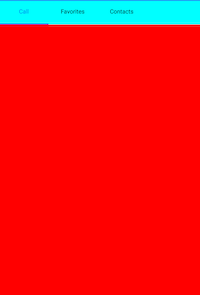
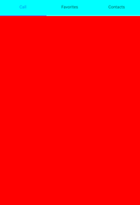

# Tab items

Tab items can be configured in tab view through the `Items` property of `SfTabView`, which holds the collection of `SfTabItem` through `TabItemsCollection`.





<ContentPage xmlns="http://xamarin.com/schemas/2014/forms"
             xmlns:x="http://schemas.microsoft.com/winfx/2009/xaml"
             xmlns:tabView="clr-namespace:Syncfusion.XForms.TabView;assembly=Syncfusion.SfTabView.XForms"
             x:Class="TabViewAutomationSample.TabViewAutomationSample">
    <ContentPage.Content>
        <tabView:SfTabView BackgroundColor="Aqua">
                    <tabView:SfTabItem Title="Call">
                        <tabView:SfTabItem.Content>
                            <Grid BackgroundColor="Red" x:Name="AllContactsGrid" />
                        </tabView:SfTabItem.Content>
                    </tabView:SfTabItem>
                    <tabView:SfTabItem Title="Favorites">
                        <tabView:SfTabItem.Content>
                            <Grid BackgroundColor="Green" x:Name="FavoritesGrid" />
                        </tabView:SfTabItem.Content>
                    </tabView:SfTabItem>
                    <tabView:SfTabItem Title="Contacts">
                        <tabView:SfTabItem.Content>
                            <Grid BackgroundColor="Blue" x:Name="ContactsGrid" />
                        </tabView:SfTabItem.Content>
                    </tabView:SfTabItem>
        </tabView:SfTabView>
    </ContentPage.Content>
</ContentPage>





using Syncfusion.XForms.TabView;
using Xamarin.Forms;
using Xamarin.Forms.Xaml;

namespace TabViewAutomationSample
{
    [XamlCompilation(XamlCompilationOptions.Compile)]
	public partial class TabView : ContentPage
	{
        SfTabView tabView;
		public TabView ()
		{
			InitializeComponent ();
            var tabView = new SfTabView();
            var allContactsGrid = new Grid {BackgroundColor = Color.Red};
            var favoritesGrid = new Grid {BackgroundColor = Color.Green};
            var contactsGrid = new Grid {BackgroundColor = Color.Blue};
            var tabItems = new TabItemCollection
            {
                new SfTabItem()
                {
                    Title = "Calls",
                    Content = allContactsGrid
                },
                new SfTabItem()
                {
                    Title = "Favorites",
                    Content = favoritesGrid
                },
                new SfTabItem()
                {
                    Title = "Contacts",
                    Content = contactsGrid
                }
            };
            tabView.Items = tabItems;
            this.Content = tabView;
		}
	}
}





## Share the header space equally

To share the header space to the tabs equally, set the number of tabs that can be distributed in the available space though the `VisibleHeaderCount` of SfTabView.





<ContentPage xmlns="http://xamarin.com/schemas/2014/forms"
             xmlns:x="http://schemas.microsoft.com/winfx/2009/xaml"
             xmlns:tabView="clr-namespace:Syncfusion.XForms.TabView;assembly=Syncfusion.SfTabView.XForms"
             x:Class="TabViewAutomationSample.TabViewAutomationSample">
    <ContentPage.Content>
        <tabView:SfTabView BackgroundColor="Aqua" VisibleHeaderCount="3">
            <tabView:SfTabItem Title="Call">
                <tabView:SfTabItem.Content>
                    <Grid BackgroundColor="Red" x:Name="AllContactsGrid" />
                </tabView:SfTabItem.Content>
            </tabView:SfTabItem>
            <tabView:SfTabItem Title="Favorites">
                <tabView:SfTabItem.Content>
                    <Grid BackgroundColor="Green" x:Name="FavoritesGrid" />
                </tabView:SfTabItem.Content>
            </tabView:SfTabItem>
            <tabView:SfTabItem Title="Contacts">
                <tabView:SfTabItem.Content>
                    <Grid BackgroundColor="Blue" x:Name="ContactsGrid" />
                </tabView:SfTabItem.Content>
            </tabView:SfTabItem>
            <tabView:SfTabItem Title="Email">
                <tabView:SfTabItem.Content>
                    <Grid BackgroundColor="Olive" x:Name="EmailGrid" />
                </tabView:SfTabItem.Content>
            </tabView:SfTabItem>
        </tabView:SfTabView>
    </ContentPage.Content>
</ContentPage>
	




using Syncfusion.XForms.TabView;
using Xamarin.Forms;
using Xamarin.Forms.Xaml;

namespace TabViewAutomationSample
{
    [XamlCompilation(XamlCompilationOptions.Compile)]
	public partial class TabView : ContentPage
	{
        SfTabView tabView;
		public TabView ()
		{
			InitializeComponent ();
            var tabView = new SfTabView();
            var allContactsGrid = new Grid {BackgroundColor = Color.Red};
            var favoritesGrid = new Grid {BackgroundColor = Color.Green};
            var contactsGrid = new Grid {BackgroundColor = Color.Blue};
            var emailGrid = new Grid {BackgroundColor = Color.Olive};
            tabView.VisibleHeaderCount = 3;
            var tabItems = new TabItemCollection
            {
                new SfTabItem()
                {
                    Title = "Calls",
                    Content = allContactsGrid
                },
                new SfTabItem()
                {
                    Title = "Favorites",
                    Content = favoritesGrid
                },
                new SfTabItem()
                {
                    Title = "Contacts",
                    Content = contactsGrid
                },
                new SfTabItem()
                {
                    Title = "Email",
                    Content = emailGrid
                }
            };
            tabView.Items = tabItems;
            this.Content = tabView;
		}
	}
}





