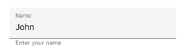
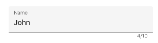

# Adding assistive labels

Assistive labels provide additional information about text entered into the input view controls.

## Helper text

Helper text conveys additional guidance about the input field such as how it will be used. It can be set using the `HelperText` property.

 

 

<inputLayout:SfTextInputLayout
  Hint="Name"
  HelperText="Enter your name">
  <Entry Text="John" />
</inputLayout:SfTextInputLayout>   



 

var inputLayout = new SfTextInputLayout();
inputLayout.Hint = "Name";
inputLayout.HelperText = "Enter your name";
inputLayout.InputView = new Entry() { Text = "John" }; 





The visibility of the helper text can be disabled by setting the `ShowHelperText` property to false. By default, it is set to true.

## Error message

When the text input is not accepted, an error message will display instructions to fix it. Error messages will be displayed below the input line till entering the correct text. It can be set using the 
`ErrorText` property, but it will be displayed only when the `HasError` property is set to `true`.

 

 

<inputLayout:SfTextInputLayout
    Hint="Name" 
    HelperText="Enter your name"
    ErrorText="Should not contains special characters"
    HasError="true">
    <Entry />
</inputLayout:SfTextInputLayout>  
 



 

var inputLayout = new SfTextInputLayout();
inputLayout.Hint = "Name";
inputLayout.HelperText = "Enter your name";
inputLayout.ErrorText = "Should not contains special characters";
inputLayout.HasError = true; 
inputLayout.InputView = new Entry(); 





N> Error validations should be done in the application level.

## Character counter

Character counter is used when you need to limit the characters. Character limit can be set using the `CharMaxLength` property. The character counter can be enabled by setting the `ShowCharCount` property to true.

 

 

<inputLayout:SfTextInputLayout
    Hint="Name" 
    ShowCharCount="true"
    CharMaxLength="10">
    <Entry Text="John" />
</inputLayout:SfTextInputLayout> 
  



 

var inputLayout = new SfTextInputLayout();
inputLayout.Hint = "Name";
inputLayout.CharMaxLength = 10;
inputLayout.ShowCharCount = true;
inputLayout.InputView = new Entry(){Text="John"}; 





N> When character count reaches beyond the maximum character length then error color will be applied to hint, border and counter label.

