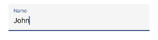
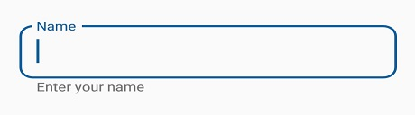
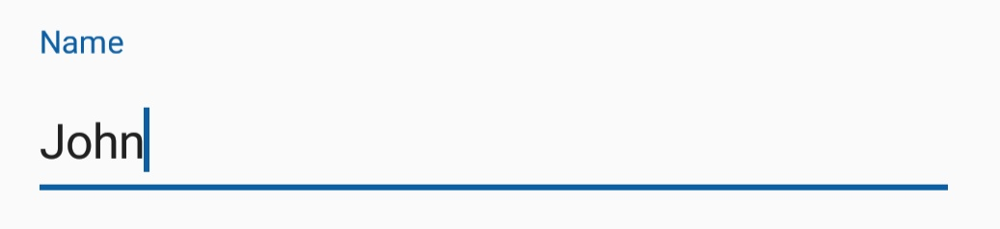

# Container type

Containers improve the discoverability of input view by creating a contrast between the input view and assistive elements.

## Filled

The background of the input view will be filled with container color, and its stroke (at the bottom edge) color and thickness will be changed based on its states. It can be enabled by setting the [ContainerType](https://help.syncfusion.com/cr/cref_files/xamarin/Syncfusion.Core.XForms~Syncfusion.XForms.TextInputLayout.SfTextInputLayout~ContainerType.html) property to [Filled](https://help.syncfusion.com/cr/cref_files/xamarin/Syncfusion.Core.XForms~Syncfusion.XForms.TextInputLayout.ContainerType.html).

 

 

<inputLayout:SfTextInputLayout
    Hint="Name" 
    ContainerType="Filled">
    <Entry Text="John" />
</inputLayout:SfTextInputLayout>  



 

var inputLayout = new SfTextInputLayout();
inputLayout.Hint = "Name";
inputLayout.ContainerType = ContainerType.Filled;
inputLayout.InputView = new Entry() { Text = "John" }; 





## Outlined

When setting the [ContainerType](https://help.syncfusion.com/cr/cref_files/xamarin/Syncfusion.Core.XForms~Syncfusion.XForms.TextInputLayout.SfTextInputLayout~ContainerType.html) property to [Outlined](https://help.syncfusion.com/cr/cref_files/xamarin/Syncfusion.Core.XForms~Syncfusion.XForms.TextInputLayout.ContainerType.html), the background of the container will be transparent, and the container will be covered with a rounded-corner border.

 

 

<inputLayout:SfTextInputLayout
    Hint="Name" 
    ContainerType="Outlined">
    <Entry Text="John" />
</inputLayout:SfTextInputLayout>  
 



 

var inputLayout = new SfTextInputLayout();
inputLayout.Hint = "Name";
inputLayout.ContainerType = ContainerType.Outlined;
inputLayout.InputView = new Entry() { Text = "John" }; 





### Customize the corner radius of the outline border 

When setting the [OutlineCornerRadius](https://help.syncfusion.com/cr/cref_files/xamarin/Syncfusion.Core.XForms~Syncfusion.XForms.TextInputLayout.SfTextInputLayout~OutlineCornerRadiusProperty.html) property to double value, the corner radius of the container will be changed.





<inputLayout:SfTextInputLayout
    Hint="Name" 
    ContainerType="Outlined"
	OutlineCornerRadius="8">
    <Entry />
</inputLayout:SfTextInputLayout>  
			




var inputLayout = new SfTextInputLayout();
inputLayout.Hint = "Name";
inputLayout.ContainerType = ContainerType.Outlined;
inputLayout.OutlineCornerRadius = 8;
inputLayout.InputView = new Entry(); 





>**NOTE**
It is applicable for the outline border when setting the container type to outlined.

## None

When setting the [ContainerType](https://help.syncfusion.com/cr/cref_files/xamarin/Syncfusion.Core.XForms~Syncfusion.XForms.TextInputLayout.SfTextInputLayout~ContainerType.html) property to [None](https://help.syncfusion.com/cr/cref_files/xamarin/Syncfusion.Core.XForms~Syncfusion.XForms.TextInputLayout.ContainerType.html), the container will have empty background and enough spacing.

 

 

<inputLayout:SfTextInputLayout
    Hint="Name" 
    ContainerType="None">
    <Entry Text="John" />
</inputLayout:SfTextInputLayout>  
 



 

var inputLayout = new SfTextInputLayout();
inputLayout.Hint = "Name";
inputLayout.ContainerType = ContainerType.None;
inputLayout.InputView = new Entry() { Text = "John" }; 





