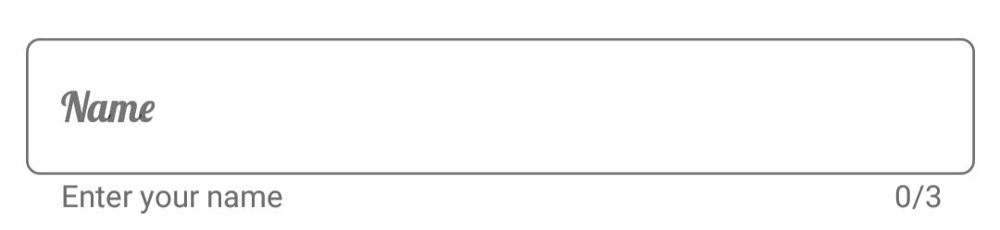
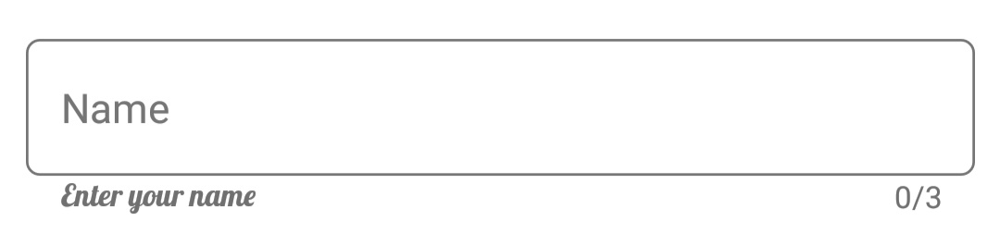
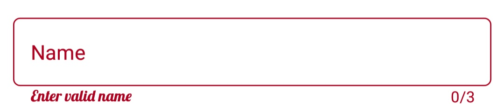
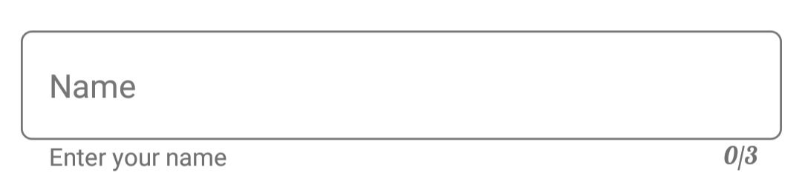

# Font Customization

You can customize the appearance (size, attributes and family) of Font by setting the FontFamily, FontSize and FontAttributes property of LabelStyle property.

## Font Styles

* [`Font`] – used to change the label font size, family, and weight. (This is deprecated API. Use FontSize, FontFamily, and FontAttributes properties instead of this.)
* [`FontFamily`] - used to change the font family for the tooltip text.
* [`FontAttributes`] - used to change the font style for the tooltip text.
* [`FontSize`] - used to change the font size for the tooltip text.

Refer [this](https://help.syncfusion.com/xamarin/sfschedule/monthview#custom-font-setting-in-xamarinforms-android) to configure the custom fonts in Xamarin.Forms.

### Hint

You can customize the font of [hint](https://help.syncfusion.com/cr/xamarin/Syncfusion.Core.XForms~Syncfusion.XForms.TextInputLayout.SfTextInputLayout~HintProperty.html) label  by setting the FontFamily, FontSize and FontAttributes property of LabelStyle property of HintLabelStyle in SfTextInputLayout.

 



<inputLayout:SfTextInputLayout
    Hint="Name"
    ContainerType="Outlined"
    CharMaxLength="3"
    ShowCharCount="True"
    HelperText="Enter your name">
    <Entry />
    <inputLayout:SfTextInputLayout.HintLabelStyle>
                <inputLayout:LabelStyle FontSize="16">
                    <inputLayout:LabelStyle.FontFamily>
                        <OnPlatform x:TypeArguments="x:String" iOS="Lobster-Regular" Android="Lobster-Regular.ttf#Lobster-Regular" WinPhone="Assets/Fonts/Lobster-Regular.ttf#Lobster" />
                    </inputLayout:LabelStyle.FontFamily>
                </inputLayout:LabelStyle>
    </inputLayout:SfTextInputLayout.HintLabelStyle>
</inputLayout:SfTextInputLayout> 



 

var inputLayout = new SfTextInputLayout();
inputLayout.Hint = "Name";
inputLayout.ContainerType = ContainerType.Outlined;
inputLayout.HelperText = "Enter your name";
inputLayout.CharMaxLength = 3;
inputLayout.ShowCharCount = true;
inputLayout.HintLabelStyle = new LabelStyle() { FontFamily = Device.OnPlatform("Lobster-Regular", "Lobster-Regular.ttf#Lobster-Regular", "Assets/Lobster-Regular.ttf#Lobster"), FontSize = 16};
inputLayout.InputView = new Entry(); 





### Helper Text

You can customize the font of [helper text](https://help.syncfusion.com/cr/xamarin/Syncfusion.Core.XForms~Syncfusion.XForms.TextInputLayout.SfTextInputLayout~HelperTextProperty.html) label  by setting the FontFamily, FontSize and FontAttributes property of LabelStyle property of HelperLabelStyle in SfTextInputLayout.

 



<inputLayout:SfTextInputLayout
    Hint="Name"
    ContainerType="Outlined"
CharMaxLength="3"
ShowCharCount="True"
    HelperText="Enter your name">
    <Entry />
    <inputLayout:SfTextInputLayout.HelperLabelStyle>
                <inputLayout:LabelStyle FontSize="16">
                    <inputLayout:LabelStyle.FontFamily>
                        <OnPlatform x:TypeArguments="x:String" iOS="Lobster-Regular" Android="Lobster-Regular.ttf#Lobster-Regular" WinPhone="Assets/Fonts/Lobster-Regular.ttf#Lobster" />
                    </inputLayout:LabelStyle.FontFamily>
                </inputLayout:LabelStyle>
    </inputLayout:SfTextInputLayout.HelperLabelStyle>
</inputLayout:SfTextInputLayout> 



 

var inputLayout = new SfTextInputLayout();
inputLayout.Hint = "Name";
inputLayout.ContainerType = ContainerType.Outlined;
inputLayout.HelperText = "Enter your name";
inputLayout.CharMaxLength = 3;
inputLayout.ShowCharCount = true;
inputLayout.HelperLabelStyle = new LabelStyle() { FontFamily = Device.OnPlatform("Lobster-Regular", "Lobster-Regular.ttf#Lobster-Regular", "Assets/Lobster-Regular.ttf#Lobster"), FontSize = 16};
inputLayout.InputView = new Entry(); 





### Error Text

You can customize the font of [error text](https://help.syncfusion.com/cr/xamarin/Syncfusion.Core.XForms~Syncfusion.XForms.TextInputLayout.SfTextInputLayout~ErrorTextProperty.html) label by setting the FontFamily, FontSize and FontAttributes property of LabelStyle property of ErrorLabelStyle in SfTextInputLayout.

 



<inputLayout:SfTextInputLayout
    Hint="Name"
    ContainerType="Outlined"
CharMaxLength="3"
ShowCharCount="True"
    HelperText="Enter your name"
HasError="True"
ErrorText="Enter valid name">
    <Entry />
    <inputLayout:SfTextInputLayout.ErrorLabelStyle>
                <inputLayout:LabelStyle FontSize="16">
                    <inputLayout:LabelStyle.FontFamily>
                        <OnPlatform x:TypeArguments="x:String" iOS="Lobster-Regular" Android="Lobster-Regular.ttf#Lobster-Regular" WinPhone="Assets/Fonts/Lobster-Regular.ttf#Lobster" />
                    </inputLayout:LabelStyle.FontFamily>
                </inputLayout:LabelStyle>
    </inputLayout:SfTextInputLayout.ErrorLabelStyle>
</inputLayout:SfTextInputLayout> 



 

var inputLayout = new SfTextInputLayout();
inputLayout.Hint = "Name";
inputLayout.ContainerType = ContainerType.Outlined;
inputLayout.HelperText = "Enter your name";
inputLayout.CharMaxLength = 3;
inputLayout.ShowCharCount = true;
inputLayout.HasError = true;
inputLayout.ErrorText = "Enter valid name";
inputLayout.ErrorLabelStyle = new LabelStyle() { FontFamily = Device.OnPlatform("Lobster-Regular", "Lobster-Regular.ttf#Lobster-Regular", "Assets/Lobster-Regular.ttf#Lobster"), FontSize = 16};
inputLayout.InputView = new Entry(); 





### Counter Label

You can customize the font of [counter label](https://help.syncfusion.com/cr/xamarin/Syncfusion.Core.XForms~Syncfusion.XForms.TextInputLayout.SfTextInputLayout~CharMaxLengthProperty.html) by setting the FontFamily, FontSize and FontAttributes property of LabelStyle property of CounterLabelStyle in SfTextInputLayout.

 



<inputLayout:SfTextInputLayout
    Hint="Name"
    ContainerType="Outlined"
    CharMaxLength="3"
    ShowCharCount="True"
    HelperText="Enter your name">
    <Entry />
    <inputLayout:SfTextInputLayout.CounterLabelStyle>
                <inputLayout:LabelStyle FontSize="16">
                    <inputLayout:LabelStyle.FontFamily>
                        <OnPlatform x:TypeArguments="x:String" iOS="Lobster-Regular" Android="Lobster-Regular.ttf#Lobster-Regular" WinPhone="Assets/Fonts/Lobster-Regular.ttf#Lobster" />
                    </inputLayout:LabelStyle.FontFamily>
                </inputLayout:LabelStyle>
    </inputLayout:SfTextInputLayout.CounterLabelStyle>
</inputLayout:SfTextInputLayout> 



 

var inputLayout = new SfTextInputLayout();
inputLayout.Hint = "Name";
inputLayout.ContainerType = ContainerType.Outlined;
inputLayout.HelperText = "Enter your name";
inputLayout.CharMaxLength = 3;
inputLayout.ShowCharCount = true;
inputLayout.CounterLabelStyle = new LabelStyle() { FontFamily = Device.OnPlatform("Lobster-Regular", "Lobster-Regular.ttf#Lobster-Regular", "Assets/Lobster-Regular.ttf#Lobster"), FontSize = 16};
inputLayout.InputView = new Entry(); 





 

