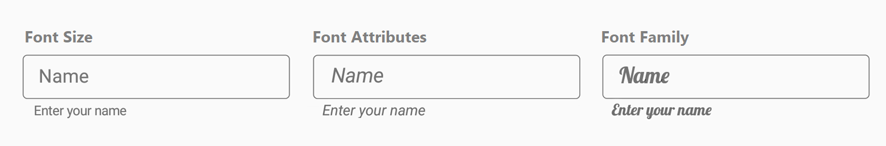

# Font Customization

Font styles for [hint](https://help.syncfusion.com/cr/xamarin/Syncfusion.Core.XForms~Syncfusion.XForms.TextInputLayout.SfTextInputLayout~HintProperty.html), [error text](https://help.syncfusion.com/cr/xamarin/Syncfusion.Core.XForms~Syncfusion.XForms.TextInputLayout.SfTextInputLayout~ErrorTextProperty.html), [helper text](https://help.syncfusion.com/cr/xamarin/Syncfusion.Core.XForms~Syncfusion.XForms.TextInputLayout.SfTextInputLayout~HelperTextProperty.html) and [counter label](https://help.syncfusion.com/cr/xamarin/Syncfusion.Core.XForms~Syncfusion.XForms.TextInputLayout.SfTextInputLayout~CharMaxLengthProperty.html) can be customized by creating the LabelStyle object in specific style classes like HintLabelStyle, HelperLabelStyle, ErrorLabelStyle and CounterLabelStyle.

 

 

<inputLayout:SfTextInputLayout
    Hint="Name"
    ContainerType="Outlined"
    HelperText="Enter your name">
    <Entry />
    <inputLayout:SfTextInputLayout.HintLabelStyle>
        <inputLayout:LabelStyle FontFamily="Times New Roman" FontSize="16"/>
    </inputLayout:SfTextInputLayout.HintLabelStyle>
    <inputLayout:SfTextInputLayout.HelperLabelStyle>
        <inputLayout:LabelStyle FontFamily="Times New Roman" FontSize="12"/>
    </inputLayout:SfTextInputLayout.HelperLabelStyle>
</inputLayout:SfTextInputLayout> 



 

var inputLayout = new SfTextInputLayout();
inputLayout.Hint = "Name";
inputLayout.ContainerType = ContainerType.Outlined;
inputLayout.HelperText = "Enter your name";
inputLayout.HintLabelStyle = new LabelStyle() {FontFamily= "Times New Roman", FontSize=16};
inputLayout.HelperLabelStyle = new LabelStyle() { FontFamily = "Times New Roman", FontSize = 12 };
inputLayout.InputView = new Entry(); 





