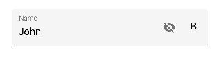

# Adding custom icons

Any custom icons can be added to the text input layout control at the leading edge or the trailing edge of input view. The events and commands related to the custom icons should be handled at the application level.

Unicode or font icons for labels can be displayed as icons.

I> Refer the below links to know more about font icons,
* [How to create font icons using our metro studio and export as ttf? ](https://help.syncfusion.com/metro-studio/export-icon-font)
* [How to set font family for the custom font in Label? ] (https://docs.microsoft.com/en-us/xamarin/xamarin-forms/user-interface/text/fonts#using-a-custom-font)

## Leading view

A label can be added as a leading icon for the input view by setting [LeadingView](https://help.syncfusion.com/cr/cref_files/xamarin/Syncfusion.Core.XForms~Syncfusion.XForms.TextInputLayout.SfTextInputLayout~LeadingView.html) property and it can be positioned either inside or outside of the container by setting the [LeadingViewPosition](https://help.syncfusion.com/cr/cref_files/xamarin/Syncfusion.Core.XForms~Syncfusion.XForms.TextInputLayout.SfTextInputLayout~LeadingViewPosition.html) property. By default, it will be positioned [Outside](https://help.syncfusion.com/cr/cref_files/xamarin/Syncfusion.Core.XForms~Syncfusion.XForms.TextInputLayout.ViewPosition.html).

 

 

<inputLayout:SfTextInputLayout
    Hint="Birth date"
    LeadingViewPosition="Inside" >
    <Entry />
    <inputLayout:SfTextInputLayout.LeadingView>
       <Label
           Text="&#x1F5D3;">     
       </Label>
    </inputLayout:SfTextInputLayout.LeadingView>
 </inputLayout:SfTextInputLayout> 



 

var inputLayout = new SfTextInputLayout();
inputLayout.Hint = "Birth date";
inputLayout.LeadingViewPosition = ViewPosition.Inside;
inputLayout.LeadingView = new Label() { Text = "\U0001F5D3" };
inputLayout.InputView = new Entry(); 





## Trailing  view

A label can be added as a trailing icon for the input view by setting [TrailingView](https://help.syncfusion.com/cr/cref_files/xamarin/Syncfusion.Core.XForms~Syncfusion.XForms.TextInputLayout.SfTextInputLayout~TrailingView.html) property and it can be positioned either inside or outside of the container of input view by setting the [TrailingViewPosition](https://help.syncfusion.com/cr/cref_files/xamarin/Syncfusion.Core.XForms~Syncfusion.XForms.TextInputLayout.SfTextInputLayout~TrailingViewPosition.html) property. By default, it will be positioned [Inside](https://help.syncfusion.com/cr/cref_files/xamarin/Syncfusion.Core.XForms~Syncfusion.XForms.TextInputLayout.ViewPosition.html).

% tabs %} 

 

<inputLayout:SfTextInputLayout
    Hint="Birth date"
    TrailingViewPosition="Outside">
    <Entry  />
    <inputLayout:SfTextInputLayout.TrailingView>
      <Label
         Text="&#x1F5D3;">     
      </Label>
    </inputLayout:SfTextInputLayout.TrailingView>
 </inputLayout:SfTextInputLayout> 



 

var inputLayout = new SfTextInputLayout();
inputLayout.Hint = "Birth date";
inputLayout.TrailingViewPosition = ViewPosition.Outside; 
inputLayout. TrailingView = new Label() { Text = "\U0001F5D3" };
inputLayout.InputView = new Entry(); 





