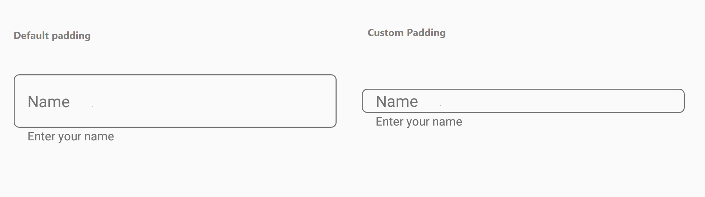

# Padding Customization

Spaces around the input view can be customized by setting the InputViewPadding property to [thickness](https://docs.microsoft.com/en-us/dotnet/api/xamarin.forms.thickness?view=xamarin-forms) value.

 

 

<inputLayout:SfTextInputLayout
    Hint="Name"
    InputViewPadding="5,5" 
    ContainerType="Outlined"
    HelperText="Enter your name">
    <Entry />
 </inputLayout:SfTextInputLayout> 



 

var inputLayout = new SfTextInputLayout();
inputLayout.Hint = "Name";
inputLayout.InputViewPadding = new Thickness(5, 5);
inputLayout.ContainerType = ContainerType.Outlined;
inputLayout.HelperText = "Enter your name";
inputLayout.InputView = new Entry(); 





