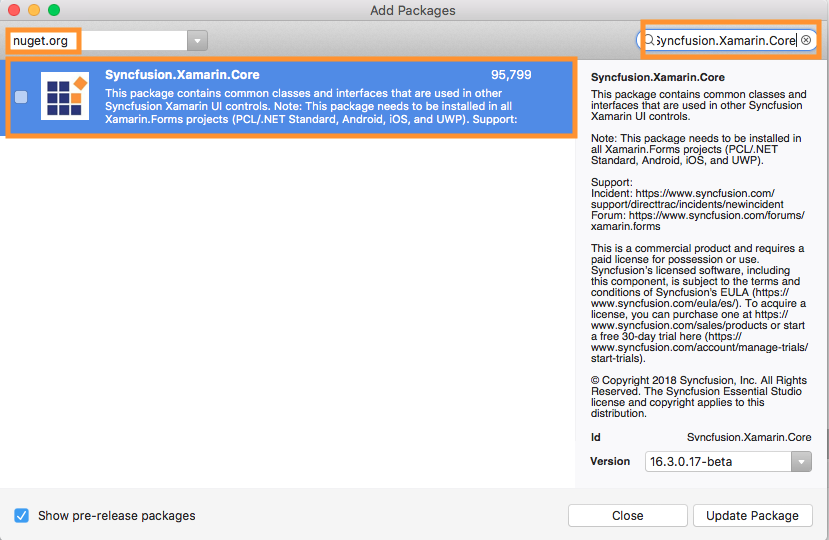
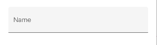
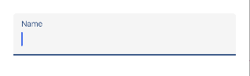
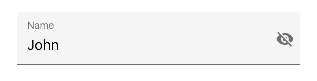
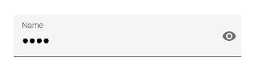
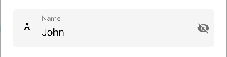
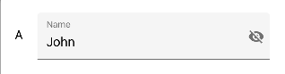
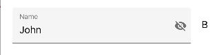
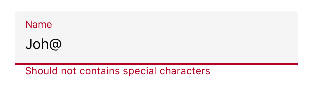
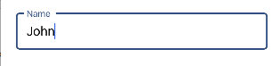

# Getting Started

This section explains you the steps required to configure the text input layout control with floating label, icons, password toggle and assistive labels. This section covers only the minimal features that you need to know to get started with text input layout control.

## Adding Text input layout Reference

Syncfusion Xamarin components are available in [nuget.org](https://www.nuget.org). To add text input layout control to your project, open the NuGet package manager in Visual Studio, and search for [Syncfusion.Xamarin.Core]((https://www.nuget.org/packages/Syncfusion.Xamarin.Core), and then install it.

To know more about obtaining our components, refer to these links: [Mac](https://help.syncfusion.com/xamarin/introduction/download-and-installation/mac) and [Windows](https://help.syncfusion.com/xamarin/introduction/download-and-installation/windows).

N> Install the same version of the core NuGet in all the projects. Also, the text input layout control will be available in core NuGet from v16.3.0.x onwards.

I> Starting with v16.2.0.x, if you reference Syncfusion assemblies from trial setup or from the NuGet feed, you also have to include a license key in your projects. Please refer to this [`link`](https://help.syncfusion.com/common/essential-studio/licensing/license-key) to know about registering Syncfusion license key in your Xamarin application to use our components.

## Launching the application on each platform with text input layout

To use the text input layout inside an application, each platform application requires some additional configurations. The configurations vary from platform to platform and is discussed in the following sections:

### iOS

To launch the text input layout in iOS, call the `SfTextInputLayoutRenderer.Init()`
method in the FinishedLaunching overridden method of the AppDelegate class after the Xamarin.Forms framework initialization and before the `LoadApplication` method is called as demonstrated in the following code sample:

 

public override bool FinishedLaunching(UIApplication app, NSDictionary options)
{
    global::Xamarin.Forms.Forms.Init();
    SfTextInputLayoutRenderer.Init();
    LoadApplication(new App());
    return base.FinishedLaunching(app, options);
} 



### Universal Windows Platform (UWP)

To deploy the text input layout in `Release` mode, you need to initialize the core assemblies in App.xaml.cs in UWP project as shown in the below code snippets.

 

// In App.xaml.cs 
protected override void OnLaunched(LaunchActivatedEventArgs e)
{ 
   … 
   if (rootFrame == null) 
   { 
      List<Assembly> assembliesToInclude = new List<Assembly>();
      assembliesToInclude.Add(typeof(SfTextInputLayoutRenderer).GetTypeInfo().Assembly);
      Xamarin.Forms.Forms.Init(e, assembliesToInclude);
   } 
   … 
}



### Android

Android platform does not require any additional configuration to render the text input layout control.

## Initialize Text input layout

Import the SfTextInputLayout namespace as shown below in your respective page,

 

 

xmlns:inputLayout="clr-namespace:Syncfusion.XForms.TextInputLayout;assembly=Syncfusion.Core.XForms"  



 

using Syncfusion.XForms.TextInputLayout; 





Add any input view controls like `Entry`, `Editor`, `SfNumericTextBox` or `SfMaskedEdit` and add hint label (floating label).

 

 

<inputLayout:SfTextInputLayout
   Hint="Name">
   <Entry />
</inputLayout:SfTextInputLayout>  



 

var inputLayout = new SfTextInputLayout();
inputLayout.Hint = "Name"; 
inputLayout.InputView = new Entry(); 





Run the project and check if you get following output to make sure you have configured your project properly to add text input layout.

## Enable password visibility toggle.

Password visibility toggle is used to show or hide the visibility of characters in the text view added to the control. You can enable this toggle by setting `EnablePasswordVisibilityToggle` property to true.

 

 

<inputLayout:SfTextInputLayout
    Hint="Name"
    EnablePasswordVisibilityToggle="true">
    <Entry Text="John" />
</inputLayout:SfTextInputLayout>  
 


 

var inputLayout = new SfTextInputLayout();
inputLayout.Hint = "Name";
inputLayout.EnablePasswordVisibilityToggle = true;
inputLayout.InputView = new Entry() { Text = "John" }; 





## Adding custom icons

Any custom icons can be added in text input layout, either at the leading edge or at the trailing edge of input view. Events / commands related to the custom icons should be handled at the application level.

Unicode or font icons for labels can be displayed as icons.

### Leading view

Label is added as a leading icon for the input view and it can be positioned either inside or outside of the container of input view by setting `LeadingViewPosition` property, by default it will be positioned outside.

 

 

<inputLayout:SfTextInputLayout
    Hint="Name"
    EnablePasswordVisibilityToggle="true"
    LeadingViewPosition="Inside" >
    <Entry Text="John" />
    <inputLayout:SfTextInputLayout.LeadingView>
       <Label
           Text="A">     
       </Label>
    </inputLayout:SfTextInputLayout.LeadingView>
 </inputLayout:SfTextInputLayout> 



 

var inputLayout = new SfTextInputLayout();
inputLayout.Hint = "Name";
inputLayout.EnablePasswordVisibilityToggle = true;
inputLayout.LeadingViewPosition = ViewPosition.Inside;
inputLayout.LeadingView = new Label() { Text = "A" };
inputLayout.InputView = new Entry() { Text = "John" }; 





### Trailing  view

Label is added as a trailing icon for the input view and it can be positioned either inside or outside of the container of input view by setting `TrailingViewPosition` property, by default it will be positioned inside.

% tabs %} 

 

<inputLayout:SfTextInputLayout
    Hint="Name"
    EnablePasswordVisibilityToggle="true"
    TrailingViewPosition="Outside">
    <Entry Text="John" />
    <inputLayout:SfTextInputLayout.TrailingView>
      <Label
         Text="B">     
      </Label>
    </inputLayout:SfTextInputLayout.TrailingView>
 </inputLayout:SfTextInputLayout> 



 

var inputLayout = new SfTextInputLayout();
inputLayout.Hint = "Name";
inputLayout.EnablePasswordVisibilityToggle = true;
inputLayout.TrailingViewPosition = ViewPosition.Outside; 
inputLayout. TrailingView = new Label() { Text = "B" };
inputLayout.InputView = new Entry() { Text = "John" }; 





## Adding assistive labels

Assistive labels provide additional detail about text entered into input view controls.

### Helper text

Helper text conveys additional guidance about the input field, such as how it will be used. It can be set by `HelperText` property.

 

 

<inputLayout:SfTextInputLayout
  Hint="Name"
  HelperText="Enter your name">
  <Entry Text="John" />
</inputLayout:SfTextInputLayout>   



 

var inputLayout = new SfTextInputLayout();
inputLayout.Hint = "Name";
inputLayout.HelperText = "Enter your name";
inputLayout.InputView = new Entry() { Text = "John" }; 





Helper text visibility can be disabled by setting `ShowHelperText` property as false, by default it is enabled.

### Error message

When text input isn’t accepted, an error message can display instructions on how to fix it. Error messages are displayed below the input line, replacing helper text until fixed. It can be set by 
`ErrorText` property, but it will be displayed only when set the `HasError` property as `true`.

 

 

<inputLayout:SfTextInputLayout
    Hint="Name" 
    HelperText="Enter your name"
    ErrorText="Should not contains special characters"
    HasError="true">
    <Entry />
</inputLayout:SfTextInputLayout>  
 



 

var inputLayout = new SfTextInputLayout();
inputLayout.Hint = "Name";
inputLayout.HelperText = "Enter your name";
inputLayout.ErrorText = "Should not contains special characters";
inputLayout.HasError = true; 
inputLayout.InputView = new Entry(); 





N> Error validations has to be done in application level.

### Character counter

Character counters should be used if there is a character limit.  Character limit can be set by `CharMaxLength` property and character counter can be enabled by setting `ShowCharCount` property as true.

 

 

<inputLayout:SfTextInputLayout
    Hint="Name" 
    ShowCharCount="true"
    CharMaxLength="10">
    <Entry Text="John" />
</inputLayout:SfTextInputLayout> 
  



 

var inputLayout = new SfTextInputLayout();
inputLayout.Hint = "Name";
inputLayout.CharMaxLength = 10;
inputLayout.ShowCharCount = true;
inputLayout.InputView = new Entry(){Text="John"}; 





## Container type

Containers improve the discoverability of input view by creating contrast between the input view and assistive elements.

### Filled

Background of the input view will be filled with container Color and its stroke (at the bottom edge) color and thickness will be changed based on its states. It can be enabled by setting `ContainerType` property as `Filled`.

 

 

<inputLayout:SfTextInputLayout
    Hint="Name" 
    ContainerType="Filled">
    <Entry Text="John" />
</inputLayout:SfTextInputLayout>  



 

var inputLayout = new SfTextInputLayout();
inputLayout.Hint = "Name";
inputLayout.ContainerType = ContainerType.Filled;
inputLayout.InputView = new Entry() { Text = "John" }; 





### Outlined

When setting `ContainerType` property is set as `Outlined`, background of the container will be transparent, and the container will be covered with a rounded corner border.

 

 

<inputLayout:SfTextInputLayout
    Hint="Name" 
    ContainerType="Outlined">
    <Entry Text="John" />
</inputLayout:SfTextInputLayout>  
 



 

var inputLayout = new SfTextInputLayout();
inputLayout.Hint = "Name";
inputLayout.ContainerType = ContainerType.Outlined;
inputLayout.InputView = new Entry() { Text = "John" }; 





## Customizing the colors

Assistive elements colors can be customized by setting the following properties `FocusedColor`, `UnfocusedColor`, `ErrorColor` and `ContainerBackgroundColor`. 

 

 

<inputLayout:SfTextInputLayout
    Hint="Name" 
    FocusedColor="Teal"
    UnfocusedColor="Purple"
    ErrorColor="Fuchsia"
    ContainerBackgroundColor="FloralWhite"
    ErrorText="Invalid text"
    HasError="true">
    <Entry Text="John" />
</inputLayout:SfTextInputLayout>  
 


 

inputLayout.Hint = "Name";
inputLayout.FocusedColor = Color.Teal;
inputLayout.UnfocusedColor = Color.Purple;
inputLayout.ErrorColor = Color.Fuchsia;
inputLayout.ContainerBackgroundColor = Color.FloralWhite;
inputLayout.ErrorText = "Invalid text";
inputLayout.HasError = true;
inputLayout.InputView = new Entry() { Text = "John" }; 





