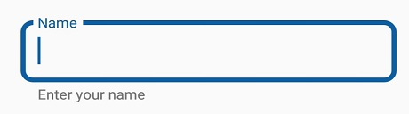
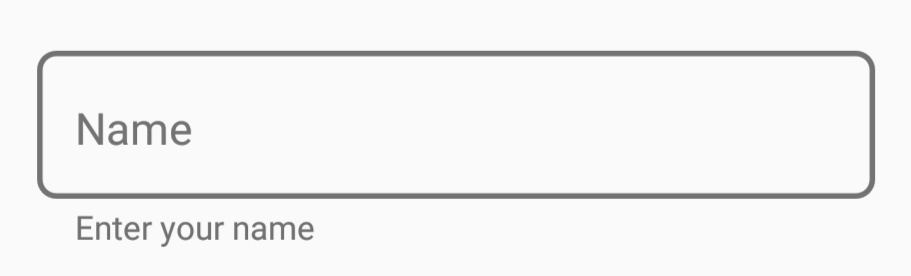

---
layout: post
title: How to | SfTextInputLayout |Xamarin | Syncfusion
description: Explains the text input layout customization
platform: Xamarin
control: SfTextInputLayout
documentation: ug
--- 
# How to 

## Customize the thickness of the stroke 

The border stroke width (for [Outlined](https://help.syncfusion.com/cr/cref_files/xamarin/Syncfusion.Core.XForms~Syncfusion.XForms.TextInputLayout.ContainerType.html)) and line thickness (for [Filled](https://help.syncfusion.com/cr/cref_files/xamarin/Syncfusion.Core.XForms~Syncfusion.XForms.TextInputLayout.ContainerType.html), and [None](https://help.syncfusion.com/cr/cref_files/xamarin/Syncfusion.Core.XForms~Syncfusion.XForms.TextInputLayout.ContainerType.html)) can be customized based on the focus state of the input view by setting the [FocusedStrokeWidth](https://help.syncfusion.com/cr/cref_files/xamarin/Syncfusion.Core.XForms~Syncfusion.XForms.TextInputLayout.SfTextInputLayout~FocusedStrokeWidthProperty.html) and [UnfocusedStrokeWidth](https://help.syncfusion.com/cr/cref_files/xamarin/Syncfusion.Core.XForms~Syncfusion.XForms.TextInputLayout.SfTextInputLayout~UnfocusedStrokeWidthProperty.html) properties.





<inputLayout:SfTextInputLayout
        Hint="Name" 
        ContainerType="Outlined"
	    FocusedStrokeWidth="4"
	    UnfocusedStrokeWidth="2">
        <Entry Text="John" />
</inputLayout:SfTextInputLayout> 
		




var inputLayout = new SfTextInputLayout();
inputLayout.Hint = "Name";
inputLayout.ContainerType = ContainerType.Outlined;
inputLayout.FocusedStrokeWidth = 4;
inputLayout.UnfocusedStrokeWidth = 2;
inputLayout.InputView = new Entry() { Text = "John" }; 





>**NOTE**
It is applicable for the bottom line and outline border when setting the container type to filled and outlined, respectively.

## Customize the corner radius of the outline border 

When setting the [OutlineCornerRadius](https://help.syncfusion.com/cr/cref_files/xamarin/Syncfusion.Core.XForms~Syncfusion.XForms.TextInputLayout.SfTextInputLayout~OutlineCornerRadiusProperty.html) property to double value, the corner radius of the container will be changed.





<inputLayout:SfTextInputLayout
        Hint="Name" 
        ContainerType="Outlined"
	    OutlineCornerRadius="8"/> 
			




var inputLayout = new SfTextInputLayout();
inputLayout.Hint = "Name";
inputLayout.ContainerType = ContainerType.Outlined;
inputLayout.OutlineCornerRadius = 8;





>**NOTE**
It is applicable for the outline border when setting the container type to outlined.

## Reserve spaces for assistive labels

The reserved spaces for assistive labels can be removed by setting the [ReserveSpaceForAssistiveLabels](https://help.syncfusion.com/cr/cref_files/xamarin/Syncfusion.Core.XForms~Syncfusion.XForms.TextInputLayout.SfTextInputLayout~ReserveSpaceForAssistiveLabelsProperty.html) property to false.





<inputLayout:SfTextInputLayout 
            ContainerType="Outlined" 
            Hint="Name" 
            ReserveSpaceForAssistiveLabels="False">
            <Entry />
</inputLayout:SfTextInputLayout>





var inputLayout = new SfTextInputLayout();
inputLayout.Hint = "Name";
inputLayout.ContainerType = ContainerType.Outlined;
inputLayout.ReserveSpaceForAssistiveLabels = false;





