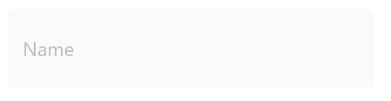

# States and Colors

Based on the states, the colors will be applied to the hint labels and borders. So, when the input view is in focused state, the focused color will be applied; it is similar to other states also. The current hint color or active color can be obtained from the [CurrentActiveColor](https://help.syncfusion.com/cr/cref_files/xamarin/Syncfusion.Core.XForms~Syncfusion.XForms.TextInputLayout.SfTextInputLayout~CurrentActiveColor.html) property.

N> Since error is not a state, the error color will not be set to [CurrentActiveColor](https://help.syncfusion.com/cr/cref_files/xamarin/Syncfusion.Core.XForms~Syncfusion.XForms.TextInputLayout.SfTextInputLayout~CurrentActiveColor.html) when [HasError](https://help.syncfusion.com/cr/cref_files/xamarin/Syncfusion.Core.XForms~Syncfusion.XForms.TextInputLayout.SfTextInputLayout~HasError.html) property is set to `true`.

## Focused color
When the input view is focused, the [FocusedColor](https://help.syncfusion.com/cr/cref_files/xamarin/Syncfusion.Core.XForms~Syncfusion.XForms.TextInputLayout.SfTextInputLayout~FocusedColor.html) property value will be applied to the hint label and border. 

I> Cursor color of the input view will be same as the `Accent` color of the application in each platform.

 

 

<inputLayout:SfTextInputLayout
    Hint="User name" 
    FocusedColor="#00AFA0"
    HelperText="Enter your name"
    <Entry Text="John" />
</inputLayout:SfTextInputLayout>  
 


 

inputLayout.Hint = "User name";
inputLayout.FocusedColor = Color.FromHex("#00AFA0");
inputLayout.ErrorText = "User name available";
inputLayout.InputView = new Entry() { Text = "John" }; 





## Unfocused color
When the input view is unfocused, the [UnfocusedColor](https://help.syncfusion.com/cr/cref_files/xamarin/Syncfusion.Core.XForms~Syncfusion.XForms.TextInputLayout.SfTextInputLayout~UnfocusedColor.html) property value will be applied to the hint label and border. 

N> Thickness of the border will also vary between the focused and unfocused states.

 

 

<inputLayout:SfTextInputLayout
    Hint="User name" 
    UnfocusedColor="Silver"
    HelperText="User name available">
    <Entry Text="John" />
</inputLayout:SfTextInputLayout>  
 


 

inputLayout.Hint = "User name";
inputLayout.UnfocusedColor = Color.Silver;
inputLayout.ErrorText = "User name available";
inputLayout.InputView = new Entry() { Text = "John" }; 





## Error color
The error color can also be customized by setting the [ErrorColor](https://help.syncfusion.com/cr/cref_files/xamarin/Syncfusion.Core.XForms~Syncfusion.XForms.TextInputLayout.SfTextInputLayout~ErrorColor.html) property.

 

 

<inputLayout:SfTextInputLayout
    Hint="Name" 
    ErrorColor="#B00020"
    ErrorText="Should not contain special characters"
    HasError="true">
    <Entry Text="John/" />
</inputLayout:SfTextInputLayout>  
 


 

inputLayout.Hint = "Name";
inputLayout.ErrorColor = Color.FromHex("#B00020");
inputLayout.ErrorText = "Should not contain special characters";
inputLayout.HasError = true;
inputLayout.InputView = new Entry() { Text = "John/" }; 





## Container color
The color of the container can be customized by setting the [ContainerBackgroundColor](https://help.syncfusion.com/cr/cref_files/xamarin/Syncfusion.Core.XForms~Syncfusion.XForms.TextInputLayout.SfTextInputLayout~ContainerBackgroundColor.html) property. It is applicable only When [ContainerType](https://help.syncfusion.com/cr/cref_files/xamarin/Syncfusion.Core.XForms~Syncfusion.XForms.TextInputLayout.SfTextInputLayout~ContainerType.html) property is set to [Filled](https://help.syncfusion.com/cr/cref_files/xamarin/Syncfusion.Core.XForms~Syncfusion.XForms.TextInputLayout.ContainerType.html).

 

 

<inputLayout:SfTextInputLayout
    Hint="Name" 
    FocusedColor="#0450C2"
    ContainerBackgroundColor="#E6EEF9">
    <Entry Text="John" />
</inputLayout:SfTextInputLayout>  
 


 

inputLayout.Hint = "Name";
inputLayout.FocusedColor = Color.FromHex("#0450C2");
inputLayout.ContainerBackgroundColor = Color.FromHex("#E6EEF9");
inputLayout.InputView = new Entry() { Text = "John" }; 





N> Since the background of the container is transparent, the color of the container will not be set when [ContainerType](https://help.syncfusion.com/cr/cref_files/xamarin/Syncfusion.Core.XForms~Syncfusion.XForms.TextInputLayout.ContainerType.html) enumeration value is set to outlined.

## Disabled state

The text input layout is disabled by setting the [IsEnabled](https://help.syncfusion.com/cr/cref_files/xamarin/Syncfusion.Core.XForms~Syncfusion.XForms.TextInputLayout.SfTextInputLayout~IsEnabled.html) property to `false`. The color of the container and other UI elements will also be changed to the disabled state, but its color cannot be customized.

 

 

<inputLayout:SfTextInputLayout
    Hint="Name" 
    IsEnabled="false">
    <Entry />
</inputLayout:SfTextInputLayout>  
 


 

inputLayout.Hint = "Name";
inputLayout.IsEnabled = false;
inputLayout.InputView = new Entry(); 





