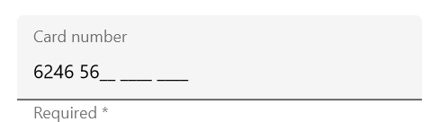

# Supported input views

Input views can be added to the text input layout control by setting the [InputView](https://help.syncfusion.com/cr/cref_files/xamarin/Syncfusion.Core.XForms~Syncfusion.XForms.TextInputLayout.SfTextInputLayout~InputView.html) property. To reduce the XAML syntax, [InputView](https://help.syncfusion.com/cr/cref_files/xamarin/Syncfusion.Core.XForms~Syncfusion.XForms.TextInputLayout.SfTextInputLayout~InputView.html) property is applied with [ContentPropertyAttribute](https://docs.microsoft.com/en-us/dotnet/api/xamarin.forms.contentpropertyattribute?view=xamarin-forms).

## Entry

To enter a single line text input, add [Entry](https://docs.microsoft.com/en-us/xamarin/xamarin-forms/user-interface/text/entry).

 

 

<inputLayout:SfTextInputLayout
   Hint="Name"
   HelperText="Enter your name">
   <Entry />
</inputLayout:SfTextInputLayout>  



 

var inputLayout = new SfTextInputLayout();
inputLayout.Hint = "Name"; 
inputLayout.HelperText = "Enter your name"
inputLayout.InputView = new Entry(); 





## Editor

To enter multi-line text input, add [Editor](https://docs.microsoft.com/en-us/xamarin/xamarin-forms/user-interface/text/editor), and then set the `AutoSize` property to `TextChanges`.

 

 

<inputLayout:SfTextInputLayout
   Hint="Notes">
   <Editor AutoSize="TextChanges" />
</inputLayout:SfTextInputLayout>  



 

var inputLayout = new SfTextInputLayout();
inputLayout.Hint = "Notes"; 
inputLayout.InputView = new Editor(); 





## Masked edit

To initialize the masked edit control and launch it in each platform, refer to the [getting started with masked edit](https://help.syncfusion.com/xamarin/sfmaskededit/getting-started) documentation.

 

 

<inputLayout:SfTextInputLayout
   Hint="Card number"
   HelperText="Required *">
   <maskededit:SfMaskedEdit
        Keyboard="Numeric"
        Mask="0000 0000 0000 0000" />
</inputLayout:SfTextInputLayout>  



 

var inputLayout = new SfTextInputLayout();
inputLayout.Hint = "Card number"; 
inputLayout.HelperText = "Required *"
inputLayout.InputView = new SfMaskedEdit() { Keyboard = Keyboard.Numeric, Mask = "0000 0000 0000 0000" }; 





## Numeric text box

To initialize the numeric text box control and launch it in each platform, refer to the [getting started with numeric text box](https://help.syncfusion.com/xamarin/sfnumerictextbox/getting-started) documentation.

 

 

<inputLayout:SfTextInputLayout
   Hint="Amount"
   HelperText="Required *">
   <numericBox:SfNumericTextBox 
      Value="123.45"
      FormatString="c" />
</inputLayout:SfTextInputLayout>  



 

var inputLayout = new SfTextInputLayout();
inputLayout.Hint = "Amount"; 
inputLayout.HelperText = "Required *"
inputLayout.InputView = new SfNumericTextBox() { Value = 123.45, FormatString="c" }; 





## Autocomplete

To initialize the Autocomplete control and launch it in each platform, refer to the [getting started with auto complete](https://help.syncfusion.com/xamarin/sfautocomplete/getting-started) documentation.

 

 

<inputLayout:SfTextInputLayout Hint="Country">
   <autocomplete:SfAutoComplete  AutoCompleteMode="SuggestAppend">
      <autocomplete:SfAutoComplete.AutoCompleteSource>
         <ListCollection:List x:TypeArguments="x:String">
         	<x:String> United Kingdom </x:String>
            <x:String> United States </x:String>
            <x:String> United Republic of Tanzania </x:String>
         </ListCollection:List>
      </autocomplete:SfAutoComplete.AutoCompleteSource>
   </autocomplete:SfAutoComplete>
</inputLayout:SfTextInputLayout>



 

var autoComplete = new SfAutoComplete();
var inputLayout = new SfTextInputLayout();
inputLayout.Hint = "Country"; 
List<String> countryNames = new List<String>();
countryNames.Add("United Kingdom");
countryNames.Add("United States");
countryNames.Add("United Republic of Tanzania");
autoComplete.AutoCompleteMode = AutoCompleteMode.SuggestAppend;
autoComplete.DataSource = countryNames;
inputLayout.InputView = autoComplete; 





## Combo box

To initialize the ComboBox control and launch it in each platform, refer to the [getting started with combo box](https://help.syncfusion.com/xamarin/sfcombobox/getting-started) documentation.

 

 

<inputLayout:SfTextInputLayout Hint="Country">
   <combobox:SfComboBox>
      <combobox:SfComboBox.ComboBoxSource>
         <ListCollection:List x:TypeArguments="x:String">
         	<x:String> Afghanistan </x:String>
            <x:String> Akrotiri </x:String>
            <x:String> Albania </x:String>
         </ListCollection:List>
      </combobox:SfComboBox.ComboBoxSource>
   </combobox:SfComboBox>
</inputLayout:SfTextInputLayout> 



 

var combobox = new SfComboBox();
var inputLayout = new SfTextInputLayout();
inputLayout.Hint = "Country"; 
List<String> countryNames = new List<String>();
countryNames.Add("Afghanistan");
countryNames.Add("Akrotiri");
countryNames.Add("Albania");
combobox.DataSource = countryNames;
inputLayout.InputView = combobox; 





N> Entry and Editor are the only input views supported by [`SfTextInputLayout`](https://help.syncfusion.com/cr/xamarin/Syncfusion.Core.XForms~Syncfusion.XForms.TextInputLayout.SfTextInputLayout.html) in WPF platform.