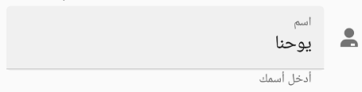

# Right to left(RTL)

TextInputLayout supports to change the flow of text to the right-to-left direction by setting the [FlowDirection](https://docs.microsoft.com/en-us/dotnet/api/xamarin.forms.visualelement.flowdirection?view=xamarin-forms#Xamarin_Forms_VisualElement_FlowDirection) to `RightToLeft`. 

N> Specific platform setup is required to enable right-to-left localization. For platform settings you can refer [here](https://docs.microsoft.com/en-us/xamarin/xamarin-forms/app-fundamentals/localization/right-to-left#platform-setup).




<ContentPage xmlns="http://xamarin.com/schemas/2014/forms"
             xmlns:x="http://schemas.microsoft.com/winfx/2009/xaml"
             xmlns:inputLayout="clr-namespace:Syncfusion.XForms.TextInputLayout;assembly=Syncfusion.Core.XForms"
             x:Class="TextInputLayout.MainPage">

    <StackLayout>
        <inputLayout:SfTextInputLayout
            x:Name="textinputlayout" 
            FlowDirection="RightToLeft" />
    </StackLayout>

</ContentPage>




textinputlayout.FlowDirection = FlowDirection.RightToLeft;




